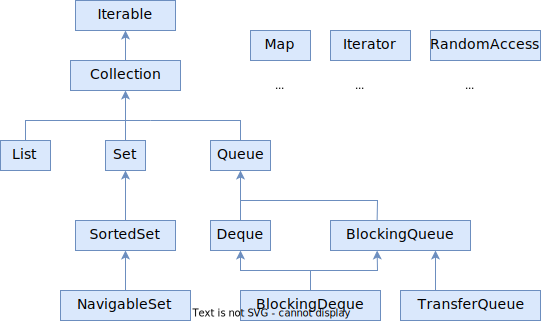

# Iterable

> Зачем это? Целью было не просто скопировать все методы из доки, а только характерные для каждого интерфейса, чтобы наглядно было видно, чем каждый потомок расширяет родителя и т.о. сформировать общее представление, зачем каждый интерфейс нужен и => для каких случаев подходят конкретные коллекции.
>
> P.S. Голубой - интерфейсы, Красный - абстрактные классы, Зеленый - конкретные классы.

TODO: вернуться сюда, когда освоюсь с простыми сценариями, и дописать наблюдения.

Схема интерфейсов коллекций:



```java
public interface Iterable<T> {
    .iterator();
    .forEach();
}
```

## Collection

```java
public interface Collection<E> 
    extends Iterable<E> {
        +.add();          +.size();         +.isEmpty();
        +.remove();       +.clear();        +.stream();
        +.removeAll();    +.contains();     +.spliterator()
        +.removeIf();     +.retainAll();    +.toArray();
}
```

## List

```java
public interface List<E> 
    extends Collection<E> {
    	+.sort();
    	+.get();
    	+.set();
    	+.indexOf();
    	+.lastIndexOf();
    	+.replaceAll();
}
```

## Set < SortedSet < NavigableSet

```java
public interface Set<E>
	extends Collection<E> {
		// Ничего нового к методам Collection не добавляет
}
```

```java
public interface SortedSet<E>
	extends Set<E> {
    	+.comparator();
    	+.first();
    	+.last();
    	+.headSet();
    	+.tailSet();
    	+.subSet();
}
```

```java
public interface NavigableSet<E>
	extends SortedSet<E> {
    	+.ceiling();
    	+.floor();
    	+.higher();
    	+.lower();
    	+.pollFirst();
    	+.pollLast();
    	+.descendingIterator();
    	+.descendingSet();
}
```

## Queue < Deque

```java
public interface Queue<E>
	extends Collection<E> {
    	+.element();
    	+.offer();
    	+.peek();
    	+.poll();
}
```

```java
public interface Deque<E>
	extends Queue<E> {
    	+.pop();
    	+.push();
    	+.addFirst();
    	+.addLast();
    	+.removeFirst();
    	+.removeLast();
    	+.removeFirstOccurence();
    	+.removeLastOccurence()
    	+.descendingIterator();
    	+.getFirst();
    	+.getLast();
    	+.offerFirst();
    	+.offerLast();
    	+.peekFirst();
    	+.peekLast();
    	+.pollFirst();
    	+.pollLast();
}
```


# List

