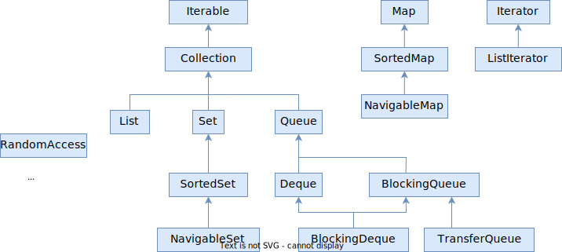
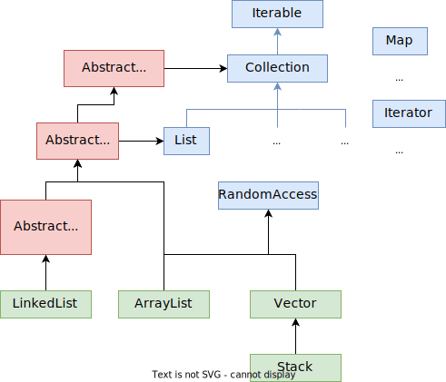

# Резюме

* Интерфейсы Iterable, Iterator, Enumeration, разница между ними (forEach, forEachRemaining)
* Интерфейс Collection
* Абстрактный класс AbstractCollection
* LinkedList, ArrayList, Vector < Stack и их связь с интерфейсом RandomAccess
* Fail-fast и не fail-fast итераторы

# Структуры данных

Тут может быть ложь, пиздеж и провокация. Целью было просто понять самую суть структур, минимум для представления, без деталей, если они не нужны для понимания практического применения.

## Список

Здесь понятно

## Деревья

*Дерево* - это структура данных, в которой у каждого элемента мб 0..n подэлементов. Да, именно несколько, а не обязательно только 2. У такого "обычного" дерева только одно требование - у каждого элемента мб только один родитель.

*Двоичное (бинарное) дерево* - это дерево, у которого:

* У каждого элемента не более двух детей
* "Левые" дети всегда меньше родителя, а "правые" дети - всегда больше родителя

*Сбалансированное дерево (B-дерево)* - это дерево, у которого высота левого и правого поддеревьев отличается не более чем на 1.

*Красно-черное дерево* - это подвид сбалансированного дерева. Там высота может быть считается как-то по-другому, судя по картинкам не всегда разница между ветками в высоту равняется 1, но суть в том, что оно все-таки сбалансированное, т.е. поиск в нем происходит быстрее, чем если оно было несбалансированным. Ну а все остальные принципы у него как у двоичного дерева, т.е. левые - меньше, правые - больше, и только по два ребенка у родителя.

## Хэш-таблица

Хэш-таблица - используется, когда требуются быстрые вставка\удаление\поиск. Ее особенностью является отсутствие определенного порядка хранения элемента. Позиция элемента вычисляется путем пропускания элемента через хэш-функцию, которая и возвращает позицию для элемента (например, индекс массива или где она там непосредственно хранится). 

Для разных элементов хэш-функция может вернуть одинаковые хэш-коды, это называется коллизией. Хорошие ХФ минимизируют количество коллизий, но тем не менее это факт. Ввиду однозначного соответствия элемента и его позиции (в большинстве случаев), скорость добавления, удаления и поиска элементов равна O(1), т.е. мгновенная. В худшем случае O(n).

С хэш-таблицей связаны несколько терминов:

* Bucket - это собственно "место, где хранится элемент". Например, индекс массива. Видел объяснение как "fast-access location". Можно также обозвать bucket словом "слот". В одном слоте может храниться и несколько элементов.
* Capacity - это текущее количество бакетов, "слотов" в хэш-таблице.
* Initial capacity - это количество слотов на момент создания хэш-таблицы.
* Load factor - это число, которое показывает, насколько допустимо заполнить таблицу до проведения перехэширования. Выражается отношением `m/n`, где m - текущая заполненность, а n - общее количество слотов ("размер таблицы"). Дефолтное значение load factor примерно 0.75. Пример: пусть всего у нас будет 15 слотов. 11/15=0.73, а 12/15=0.8 Это значит, что когда в таблице окажется двенадцать элементов, будет проведено перехэширование. Т.е. выделится массив в два раза больше текущего, для каждого элемента повторно вычислится хэш-функция и элементы займут свои места в новом массиве.

## Выводы

Выводы личные, так что за точность пока не ручаюсь. Характеристики относительно друг друга. Т.е. "медленные" не значит, что они прямо медленные-медленные, а просто медленнее, чем в других структурах.

|             | Вставка\удаление                                             | Поиск                                                        | Доп. характеристики |
| ----------- | ------------------------------------------------------------ | ------------------------------------------------------------ | ------------------- |
| Список      | Быстрые, потому что не надо никаких хэш-функций считать или искать место для вставки. Приделал элемент в хвост и готово. | Медленный, т.к. надо посмотреть все элементы от начала до конца, ибо 0 логики при вставке. |                     |
| Хэш-таблица | Средние, потому что нужно считать хэш-функцию, чтобы найти позицию для элемента. | Быстрый. Хотя и нужно посчитать хэш-функцию, но это вероятно быстрее, чем например обойти дерево. |                     |
| Дерево      | Медленные, потому что раз элементы упорядочены, то надо этот порядок постоянно поддерживать. | Средний, потому что все-таки нужно обходить дерево. Конечно обходить надо меньше элементов, чем в списке, но все же вычислить хэш-функцию вероятно будет побыстрее. Поэтому средний. |                     |


# Схема интерфейсов



Это основная схема. У некоторых интерфейсов могут быть и другие потомки, например, у Map еще есть ConcurrentMap, Bindings, LogicalMessageContext, но к базе это не относится. Для деталей - гугл с запросом "javadoc map" в помощь.

А еще здесь не написано про конкретные реализации этих интерфейсов, потому что этих реализаций очень много и есть смысл почитать о них отдельно и выбрать только актуальные для своих задач.

# Iterable

```java
public interface Iterable<T> {
    Iterator<T> iterator();
    void forEach(Consumer<? super T> action)
}
```

```java
public interface Iterator<E> {
    boolean hasNext();
    E next();
    ---
    remove, forEachRemaining
}
```

Iterable подразумевает возможность обхода. Обходить коллекции можно циклом for:

```java
for (var item: MyData) {
    System.out.println(item);
}

// Компилятор развернет его в что-то вроде:
Iterator<SomeType> rator = MyData.iterator();
while (rator.hasNext()) {
    SomeType item = rator.next();
    System.out.println(item);
}
```

> Важно: порядок вывода элементов может не совпадать с порядком добавления. Это зависит от того, что под капотом коллекции. Если например это массив, то вывод будет совпадать с очередностью добавления. А если хэш-таблица, то может не совпадать.

## forEach и forEachRemaing

Принципиальная разница в том, что *forEach* - это метод Iterable, т.е. по сути метод коллекции. А *forEachRemaining* - это метод итератора Iterator. Т.е. у коллекции нет forEachRemaining, а у итератора нет forEach:

```java
ArrayList<String> arr = new ArrayList<>(
    Arrays.asList("Tom", "Huck", "Becky", "Sid", "Joe")
);
arr.forEach(name -> System.out.println(name));
// Tom, Huck, Becky, Sid, Joe  // Подразумевает вывод всегда полностью, от начала до конца

Iterator<String> rator = arr.iterator();
if (rator.hasNext())
    rator.next();
rator.forEachRemaining(name -> System.out.println(name));
// Huck, Becky, Sid, Joe  // Вывод от текущей позиции итератора до конца
```

Без словоблудия сложно. Это вообще объяснять не надо, об этом надо подумать и прочувствовать. Используй силу, Люк!

*Итератор движется только вперед*, поэтому у него нет понятия "для каждого", у него есть только понятие "для каждого оставшегося". Для коллекции же есть только понятие набора ее элементов в целом, поэтому у нее нет концепции "оставшихся".

## remove

Это опять про Iterator и принцип его работы. При удалении производится удаление прочитанного элемента. Не какого-то произвольного по индексу или значению, а именно прочитанного, т.е. того, на который спозиционировались после вызова *.next()*. То есть перед вызовом .remove() обязательно вызывать .next():

```java
ArrayList<String> arr = new ArrayList<>(
    Arrays.asList("Tom", "Huck", "Becky", "Sid", "Joe")
);

Iterator<String> rator = arr.iterator();
rator.next();
rator.remove();  // Удаляем Tom
// rator.remove();  // Ошибка! IllegalStateException, не вызвали сперва .next()
rator.next();
rator.remove();  // Удаляем Huck
```

## Iterator и Enumeration

Суть у них одинаковая - обходить коллекцию. Но:

* Интерфейс Enumeration считается устаревшим
* Имеет всего два метода: hasMoreElements и nextElement
* У него нет метода remove, т.е. это read-only итератор
* Он не *fail-fast*. Это означает, что если во время обхода коллекции в нее добавляются или удаляются элементы, то итератор никак на это не реагирует, потому что работает с копией коллекции, а не с оригиналом. *Fail-fast* итераторы, коим является Iterator, выбрасывают *ConcurrentModificationException*

TODO: вернуться потом подробнее

# Collection

```java
public interface Collection<E> 
    extends Iterable<E> {
        +.add();          +.size();         +.isEmpty();
        +.remove();       +.clear();        +.stream();
        +.removeAll();    +.contains();     +.spliterator()
        +.removeIf();     +.retainAll();    +.toArray();
}
```

* retainAll - `col1.retainAll(col2)` - в col1 оставит только те элементы, которые есть в col2. Остальные удалит.

Коллекция по сути умеет:

* Добавлять\удалять
* Определять, есть ли в ней указанный элемент
* Возвращать свой размер

# List

Для этого вида коллекций характерно следующее:

* Соблюдается порядок элементов. Т.е. в каком порядке добавили, в таком и прочитали.
* Произвольный доступ, т.е. можно получить элемент по индексу (актуальность под вопросом, т.к. производительность может быть очень плохой в зависимости от реализации. LinkedList поддерживает доступ по индексу, но пользоваться этой возможностью лучше не надо)



Замечание: LinkedList еще реализует еще и другие интерфейсы, например, Queue. Оно и логично, ведь это список. Но для упрощения схемы это не показано тут. Поэтому конкретные реализации лучше разбирать отдельно и писать про них отдельно, т.к. они иногда плохо влазят в общую схему.

```java
public interface List<E> 
    extends Collection<E> {
        +.sort();       +.indexOf();
        +.get();        +.lastIndexOf();
        +.set();        +.replaceAll();
        +.subList();    +.removeRange();
}
```

Список умеет все то же, что и коллекция, плюс:

* Сортировать свои элементы
* Получать\устанавливать элемент по индексу
* Все, что может быть связано с индексацией: удалять промежуток, возвращать промежуток

Зачем AbstractCollection и AbstractList, если есть интерфейсы Collection и List? Если концептуально, то в абстрактных классах находится дефолтная реализация некоторых методов. Но почему бы ее не поместить тогда в интерфейсы, в дефолтную реализацию? Как минимум потому, что такая возможность появилась только в Java 8. 

## RandomAccess

Это абсолютно пустой интерфейс, нужный по сути для пометки, что коллекция поддерживает доступ по индексу. Этим интерфейсом помечены классы ArrayList и Vector < Stack.

## Представители

### LinkedList

### ArrayList

# Set < SortedSet < NavigableSet

## В двух словах

Set - это "множество из математики", а множетсво не может содержать два одинаковых элемента. Следовательно, используй Set, если:

* Нужен набор *без повторяющихся элементов*. Если попробовать добавить повторяющийся элемент, он просто не добавится, исключений не возникнет.

При этом:

* Хочешь, чтобы элементы шли в том порядке, в котором добавляешь? Используй LinkedHashSet.
* Порядок элементов не важен? Используй HashSet.
* Хочешь, чтобы элементы были отсортированы и можно было делать всякое вроде "найти элементы больше такого-то"? Используй TreeSet.
* В HashSet и LinkedHashSet можно добавить null, в TreeSet - нельзя, будет исключение.

## Интерфейс Set

* Нужно с осторожностью добавлять в Set изменяемые объекты. Т.к. на момент добавления элемент может быть уникальным, но если его изменить, он может перестать быть уникальным и тогда поведение Set может быть непредсказуемым.

```java
public interface Set<E>
	extends Collection<E> {
		// Ничего нового к методам Collection не добавляет
}
```

## Интерфейс SortedSet

* Поддерживает порядок элементов *по возрастанию*. Добавляемый элемент должен реализовать интерфейс Comparable, чтобы можно было сравнить его с другими и найти ему место.

```java
public interface SortedSet<E>
	extends Set<E> {
        +.comparator();    +.headSet();
        +.first();         +.tailSet();
        +.last();          +.subSet();
}
```

В этом интерфейсе появляются новые методы именно за счет наличия порядка среди элементов:

* first\last - первый\последний элемент

* headSet\tailSet - вернуть подмножество, элементы в котором младше\старше указанного. Например:

  ```java
  [1, 2, 3, 4, 5, 6, 7, 8]
  headSet(4) = [1, 2, 3]  // Сам элемент не входит
  tailSet(4) = [4, 5, 6, 7, 8]  // Здесь, включая сам элемент
  ```

  P.S. У конкретной реализации, например, TreeSet, в headSet есть второй параметр - включать или нет сам элемент. Но в общем интерфейсе такого параметра нет. Поэтому в таких случаях стоит помнить, что конкретные реализации могут иметь что-то собственное.

* subSet - вернуть подмножество между двумя элементами. Например:

  ```java
  [1, 2, 3, 4, 5, 6, 7, 8]
  subSet(4, 6) = [4, 5]
  ```

  Аналогичная ситуация и здесь. У TreeSet есть настройки включения\исключения элементов.

## Интерфейс NavigableSet

Это множество с более продвинутыми операциями поиска.

```java
public interface NavigableSet<E>
	extends SortedSet<E> {
        +.ceiling();    +.pollFirst();
        +.floor();      +.pollLast();
        +.higher();     +.descendingIterator();
        +.lower();      +.descendingSet();
}
```

Методы похожи на SortedSet, только более гибкие:

* ceiling\floor - вернуть *один* элемент, который больше\меньше (или равен) заданного. Если такого нет, возвращает null:

  ```java
  [10, 20, 32, 45, 56, 74]
  ceiling(6) = 10  // Т.к. первое число, больше 6, это 10
  floor(6) = null  // Т.к. меньше 6 нет элементов
  floor(15) = 10
  ```

* higher\lower - вернуть один элемент, который *строго* больше\меньше заданного. Если такого нет, возвращает null.

* descendingSet - возвращает то же множество, только элементы расположены по убыванию.

* pollFirst\pollLast - возвращает и удаляет младший\старший элемент.

В NavigableSet уже появляется возможность выставлять включение\исключение элемента при выборе подмножества.

## Представители

Из представляющих интерес, с виду, это: (выводы пока оставлю при себе, выпишу только перевод из документации)

??? Для сетов, похоже, важна емкость и коэффициент загрузки. Интересно, как они связаны? Допустим, емкость 100, что это значит? Что может быть добавлено только 100 элементов? И что такое коэффициент загрузки?

### HashSet

Реализует интерфейс Set. Фактически базируется на HashMap. Порядок итерации не подчиняется никаким правилам и со временем может измениться. Разрешается вставлять null. Обеспечивает постоянное время к операциями добавления, удаления, поиска и определения размера.

??? Если производительность обхода важна, нельзя задавать слишком большую изначальную емкость и также нужно чтобы заполненность не была слишком низкой. Прикол в том, что здесь, похоже, "размер" структуры как минимум равен емкости. Т.е. если емкость 100 элементов, а фактически добавлено 15, то обход этих 15 будет занимать времени как обход всей 100.

Реализация не потокобезопасна. Итераторы являются fail-fast.

### LinkedHashSet

Реализует интерфейс Set. Допускает null. Поддерживает порядок итерации - как добавили, так и обошли. Дает постоянное время для вставки, удаления, поиска. Обход занимает ровно столько времени, сколько фактически содержится элементов, за счет того, что это все-таки список.

### TreeSet

Базируется на TreeMap. Реализует интерфейс NavigableSet. Обеспечивает добавление, удаление, поиск за log(n). Порядок элементов - так называемый natural ordering (т.е. похоже должна быть реализация метода, позволяющего сравнивать элементы) или определяемая через переданный компаратор.

# Queue < Deque

```java
public interface Queue<E>
	extends Collection<E> {
        +.element();    +.peek();
        +.offer();      +.poll();
}
```

```java
public interface Deque<E>
	extends Queue<E> {
        +.pop();                     +.getFirst();
        +.push();                    +.getLast();
        +.addFirst();                +.offerFirst();
        +.addLast();                 +.offerLast();
        +.removeFirst();             +.peekFirst();
        +.removeLast();              +.peekLast();
        +.removeFirstOccurence();    +.pollFirst();
        +.removeLastOccurence()      +.pollLast();
        +.descendingIterator();
}
```


# Map

Map - это структура, хранящая пары "ключ - значение". Одному ключу может соответствовать строго одно значение.


## Представители

### Hashtable

### HashMap

Разрешен null в ключах и значениях. Не гарантирует определенный порядок элементов и сохранение этого порядка с течением времени. Добавление\удаление за константное время, итерация - за вре

### TreeMap

