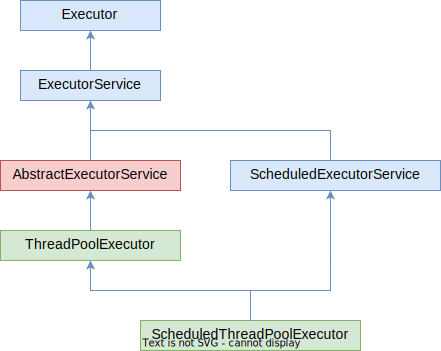

# Вопросы

- [ ] В чем основная идея пула потоков? Зачем он нужен, какие преимущества и недостатки имеет?
  - [ ] Что происходит с потоком после отработки, если он был создан напрямую через Thread? А если был взят из пула?
- [ ] Какие отношения между интерфейсами Executor, ExecutorService, ScheduledExecutorService?
  - [ ] Распределите эти возможности по интерфейсам:
    - [ ] Умеет запускать Runnable
    - [ ] Умеет запускать Runnable, Callable
    - [ ] Умеет отправлять пачку задач в виде коллекции за исполнение
    - [ ] Умеет закрывать пул
  - [ ] Чем отличается метод .execute от метода .submit? Какой метод принадлежит какому интерфейсу?
- [ ] Зачем нужно явно закрывать тред пул?
  - [ ] Какие отличия между методами .shutdown и .shutdownNow интерфейса ExecutorService? Как они обрабатывают следующие виды задач: выполняющиеся, стоящие в очереди на выполнение, вновь поступившие?
- [ ] В чем отличия и что общего у таких реализаций пула как FixedThreadPool, SingleThreadPool, CachedThreadPool?
  - [ ] Как они связаны с классом ThreadPoolExecutor?
  - [ ] Расскажите о принципе работы каждого из этих видов пула, ответив на вопросы:
    - [ ] Сколько потоков в пуле? В какой момент они создаются и уничтожаются?
    - [ ] Сколько времени живет поток в пуле?
    - [ ] Что происходит, когда поступает задача, а свободных потоков в пуле нет?
  - [ ] Если параллельных задач много и каждый раз мы создаем поток через Thread, к чему это может привести? Как это связано с переключением ОС между потоками? Как эту проблему решает каждый из этих пулов?
- [ ] Можно ли как-то настраивать потоки, которые создаются в пуле? Например, сделать их daemon-потоками? Как это связано с фабрикой потоков?
  - [ ] Как связать фабрику с пулом?

# Идея пула потоков

Созданный вручную поток уничтожается после того как отработает. Это не проблема, если мы редко выполняем что-то параллельно. Но если мы выполняем параллельные задачи постоянно, то такое создание-уничтожение становится затратным. К тому же, если параллельных задач много, и каждый раз мы создаем новый поток, то их может накопиться очень много. А поскольку ОС переключается между ними не бесплатно, то много времени может уходить на это переключение, и мало - на собственно работу.

Поэтому и существуют *разные виды* тред пулов. Они позволяют удерживать в памяти некоторое количество готовых к работе потоков, так что у нас не уходит дополнительное время на создание нового потока, а мы просто берем из пула свободный поток и используем его. После использования он возвращается обратно в пул. Кроме того, мы можем заранее обозначить количество потоков в пуле, и если вдруг выяснится, что в данный момент все потоки уже используются, то задача просто подождет, пока не освободится какой-нибудь поток, и уже тогда начнет выполнение. Таким образом мы решаем проблему с порождением слишком большого количества потоков - просто подбираем оптимальное количество.

# Схема фреймворка

Здесь не вся схема, а только небольшой фрагмент. По мере расширения знаний можно добавить и новые. Пока - только самые простые для понимания.



В двух словах о каждом:

* Executor

  Все, что умеет - запускать Runnable через свой единственный метод *execute*. Смысла использовать этот интерфейс как будто бы и нет.

* ExecutorService

  * Умеет выполнять не только Runnable, но и Callable (задачи, возвращающие результат)
  * Запускать пачку задач, переданную в виде коллекции
  * Закрывать пул потоков

* ScheduledExecutorService

  * Работать с Runnable и Callable
  * Запускать задачу после указанного ожидания
  * Запускать задачу после указанного ожидания и выполнять ее раз за разом через указанный интервал времени

Для каждого интерфейса есть несколько конкретных реализаций пулов.

# Конкретные виды пулов

Сначала будет про конкретные пулы и как их создать, а потом уже про интерфейсы. Т.е. сначала смотрим как создать пул, а потом уже - что с его помощью можно сделать. Поскольку из пулов возвращается Future-объект, который имеет несколько разновидностей, то о получении результатов из него будет в отдельном конспекте. В этом же - только как создать пул и отправить в него задачу.

Все пулы можно создать с помощью соответствующих статических методов класса `Executors`

## Класс ThreadPoolExecutor

Лежит в основе *всех* конкретных пулов, реализующих как интерфейс *ExecutorService*, так и интерфейс *ScheduledExecutorService*:

```java
public class ThreadPoolExecutor extends AbstractExecutorService {
    ...
    public ThreadPoolExecutor(
        int corePoolSize,
        int maximumPoolSize,
        long keepAliveTime,
        TimeUnit unit,
        BlockingQueue<Runnable> workQueue
        // ThreadFactory threadFactory, есть несколько конструкторов, один вот с фабрикой
        // RejectedExecutionHandler handler, разные комбинации этих параметров )
    {
        this(corePoolSize, maximumPoolSize, keepAliveTime, unit, workQueue,
             Executors.defaultThreadFactory(), defaultHandler);
    }
...
}
...
public abstract class AbstractExecutorService implements ExecutorService {
```

Конфигурируется разными параметрами, среди которых:

* corePoolSize - стартовое количество потоков, с которым создается пул
* maximumPoolSize - максимальное количество потоков в пуле
* keepAliveTime - время, по истечению которого простаивающий поток будет уничтожен
* unit - размерность времени для предыдущего параметра (например, миллисекунды)
* workQueue - конкретная реализация очереди, которая будет использоваться в пуле
* threadFactory - необязательно, но можно передать свою реализацию фабрики создания потоков. Соответственно, для любой реализации тоже можно передать фабрику через конструктор.
* RejectedExecutionHandler - пока не знаю зачем нужно, просто включил до кучи

### Fixed thread pool

```java
ExecutorService executor = Executors.newFixedThreadPool(7, // ThreadFactory);
...
public static ExecutorService newFixedThreadPool(int nThreads) {
    return new ThreadPoolExecutor(nThreads, nThreads,
                                  0L, TimeUnit.MILLISECONDS,
                                  new LinkedBlockingQueue<Runnable>());
}
```

Пул с фиксированным количеством потоков:

* Сколько тредов указали при создании пула, столько тредов и будет в нем находиться все время его работы
* Если все треды работают, новой задаче придется подождать.
* Если задач мало и часть тредов простаивает, то они не удаляются (третий параметр = 0)

### Single thread pool

```java
ExecutorService executor = Executors.newSingleThreadExecutor(// ThreadFactory);
...
public static ExecutorService newSingleThreadExecutor() {
    return new FinalizableDelegatedExecutorService
        (new ThreadPoolExecutor(1, 1,
                                0L, TimeUnit.MILLISECONDS,
                                new LinkedBlockingQueue<Runnable>()));
}
```

Пул размером в один поток:

* В основе своей использует Fixed thread pool, так что все остальные характеристики аналогичные
* Хорошая альтернатива ручному созданию и запуску треда: вместо `new Thread(...).start()` используем сингл-пул

### Cached thread pool

```java
ExecutorService executor = Executors.newCachedThreadPool(// ThreadFactory);
...
public static ExecutorService newCachedThreadPool() {
    return new ThreadPoolExecutor(0, Integer.MAX_VALUE,
                                  60L, TimeUnit.SECONDS,
                                  new SynchronousQueue<Runnable>());
}
```

Пул с динамическим размером:

* При создании не содержит потоков (первый параметр 0)
* Максимальное количество потоков - на сколько хватит ресурсов, искусственного ограничения по сути нет
* Если поступает задача, а свободных потоков нет, то создается новый поток и добавляется в пул
* Если поток простаивает 60 секунд, то он уничтожается (третий параметр 60)

## Класс ScheduledThreadPoolExecutor

Лежит в основе всех конкретных пулов, реализующих интерфейс *ScheduledExecutorService*:

```java
public class ScheduledThreadPoolExecutor
        extends ThreadPoolExecutor
        implements ScheduledExecutorService {
    
    public ScheduledThreadPoolExecutor(
        int corePoolSize
        // ThreadFactory threadFactory
        // RejectedExecutionHandler handler) 
    {
        super(corePoolSize, Integer.MAX_VALUE,  // Вызов конструктора ThreadPoolExecutor
              DEFAULT_KEEPALIVE_MILLIS, MILLISECONDS,   // <-- DEFAULT_KEEPALIVE_MILLIS = 10L
              new DelayedWorkQueue()
              // threadFactory
              // handler
             );
    }
...
}
// Напоминание конструктора ThreadPoolExecutor, чтобы не листать туда-сюда
public ThreadPoolExecutor(
    int corePoolSize,
    int maximumPoolSize,
    long keepAliveTime,
    TimeUnit unit,
    BlockingQueue<Runnable> workQueue
    // ThreadFactory threadFactory, есть несколько конструкторов, один вот с фабрикой
    // RejectedExecutionHandler handler, разные комбинации этих параметров
)
```

Несмотря на то, что здесь указано время DEFAULT_KEEPALIVE_MILLIS, судя по описанию класса, потоки держатся в пуле, даже если простаивают. Рекомендуется устанавливать corePoolSize > 0, и тогда все будет в порядке.

> The default keep-alive time for pool threads. Normally, this value is unused because all pool threads will be core threads, but if a user creates a pool with a corePoolSize of zero (against our advice), we keep a thread alive as long as there are queued tasks.

### Scheduled thread pool

Пул с указанным количеством потоков.

```java
ScheduledExecutorService exec = Executors.newScheduledThreadPool(5);
...
public static ScheduledExecutorService newScheduledThreadPool(int corePoolSize, // ThreadFactory) {
    return new ScheduledThreadPoolExecutor(corePoolSize);
}
```

Scheduled-пул использует только фиксированное количество потоков. Cached-версии не имеет. Точный ответ "почему" - дать сложно. По своей природе scheduled-пул предназначен в основном для выполнения задач "по расписанию". Выполнили задачу, подождали некоторое время, выполнили повторно и т.д. Стало быть количество этих задач заранее известно, а значит нет смысла делать версию такого пула с динамическим размером.

### Single sheduled thread pool

Пул с единственным потоком. С виду будто бы используется в основном именно он, а не версия с возможностью указать количество потоков.

```java
ScheduledExecutorService exec = Executors.newSingleThreadScheduledExecutor();
...
public static ScheduledExecutorService newSingleThreadScheduledExecutor(// ThreadFactory) {
    return new DelegatedScheduledExecutorService
        (new ScheduledThreadPoolExecutor(1));
}
```

# Интерфейсы пулов

## Executor

[Документация](https://docs.oracle.com/javase/7/docs/api/java/util/concurrent/Executor.html)

Базовый интерфейс, основа для более мощных интерфейсов. Все, что умеет - запускать Runnable через свой единственный метод `execute`:

```java
void execute(Runnable command)
```

При этом у нас нет никаких средств для управления запущенной задачей. Мы не можем ее отменить или проверить, выполнилась она или нет.

```java
import java.util.concurrent.Executor;
import java.util.concurrent.Executors;

public class SimpleTaskDemo implements Runnable {
    @Override
    public void run() {
        System.out.println("Это самая простая задача");
    }
}
...
Runnable task = new SimpleTaskDemo();
Executor executor = Executors.newSingleThreadExecutor();  // <-- Реализация пула по вкусу
executor.execute(task);  // <-- Просто и бесхитростно
```

## ExecutorService

[Документация](https://docs.oracle.com/javase/7/docs/api/java/util/concurrent/ExecutorService.html)

Наследник Executor'а, более продвинутая его версия, позволяет:

* Выполнять не только Runnable, но и Callable (задачи, возвращающие результат)
* Запускать пачку задач, переданную в виде коллекции
* Закрывать пул потоков

### Отправка методом submit

Предназначен для отправки *одной* задачи на выполнение *без ожидания* результата. Просто отправляет ее выполняться и идет дальше. Метод возвращает Future, с помощью которого мы можем узнавать статус задачи, получать результат или появившееся исключение. О получении результатов - в отдельном конспекте.

Существует три сигнатуры, одна для отправки Callable и две для отправки Runnable:

```java
<T> Future<T> submit(Callable<T> task)
Future<?>     submit(Runnable task)
<T> Future<T> submit(Runnable task, T result)
```

* Callable - это обычно задачи, возвращающие результат (хотя если хочется использовать Callable для задач без результата, можно типизировать `Callable<Void>`). Тип этого результата заранее известен, ну а его значение возвращается нам по окончанию выполнения задачи:

  ```java
  ExecutorService exec = Executors.newSingleThreadExecutor();
  Future<String> task = exec.submit(someCallable);
  try {
      String result = task.get();
      System.out.println("Результат выполнения Callable: " + result);
  } catch (InterruptedException iex) {
      ...
  } catch (ExecutionException eex) {
      ...
  }
  ```

* Runnable по своей концепции результат не возвращает, однако метод submit подразумевает возврат Future, который является дженериком. Поэтому возможно два варианта:

  1. В случае сигнатуры `Future<?> submit(Runnable task)` признаком успешного выполнения задачи является null в качестве результата:

     ```java
     ExecutorService exec = Executors.newSingleThreadExecutor();
     Future task = exec.submit(someRunnable);  // <-- Future никак не типизируем
     try {
         if (task.get() == null) {
             System.out.println("Задача выполнилась успешно");
         }
     } catch (InterruptedException iex) {
         ...
     } catch (ExecutionException eex) {
         ...
     }
     ```

  2. В случае сигнатуры `<T> Future<T> submit(Runnable task, T result)` мы заранее объявляем некоторый "результат" и передаем его в метод submit. Если задача выполнилась успешно, то он нам просто возвращает этот результат, который в данном случае не результат работы задачи, а по сути просто флажок, например:

     ```java
     ExecutorService exec = Executors.newSingleThreadExecutor();
     Boolean result = true;
     Future<Boolean> task = exec.submit(simpleRunnable, result);
     try {
         if (task.get() == true) {
             System.out.println("Задача выполнилась успешно");
         }
     } catch (InterruptedException iex) {
         ...
     } catch (ExecutionException eex) {
         ...
     }
     ```

TODO: Разобраться и вписать в нужное место как обрабатывать InterruptedException и ExecutionException. Вероятно это тема для конспекта по получению результата.

### Отправка методом invoke...

Предназначен для отправки *нескольких* задач на выполнение, *с ожиданием* результата. Т.е. пока результат не появится, поток дальше не идет.

```java
<T> List<Future<T>> invokeAll(Collection<? extends Callable<T>> tasks)
<T> List<Future<T>> invokeAll(Collection<? extends Callable<T>> tasks, long timeout, TimeUnit unit)
<T> T invokeAny(Collection<? extends Callable<T>> tasks)
<T> T invokeAny(Collection<? extends Callable<T>> tasks, long timeout, TimeUnit unit)
```

* invokeAny возвращает результат выполнения *одной* из переданных задач. Это та задача, которая успела выполниться быстрее других. Остальные отменяются. Если в задаче возникает исключение, остальные тоже отменяются и результата, по сути, не будет.

  ```java
  ExecutorService execFixed = Executors.newFixedThreadPool(5);
  try {
      String result = execFixed.invokeAny(Set.of(callable1, callable2, callable3), 1, TimeUnit.NANOSECONDS);
      System.out.println(result);
  } catch (InterruptedException iex) {
      ...
  } catch (ExecutionException eex) {
      System.out.println(eex.getCause().getMessage());
  }
  catch (TimeoutException tex) {
      System.out.println("Ни одна задача не успела выполниться");
  }
  ```

* invokeAll возвращает Future'ы для всех задач. Через их обход мы можем получить результат, либо узнать, что в какой-то задаче произошло исключение.

  ```java
  ExecutorService execFixed = Executors.newFixedThreadPool(5);
  try {
      List<Future<String>> result = execFixed.invokeAll(Set.of(callable1, callable2, callable3));
      for (Future<String> future : result) {
          try {
              System.out.println(future.get());
          } catch (InterruptedException iex) {
              ...  // Сюда, вероятно ???, мы не попадем, по причине, указанной в каменте ниже
          } catch (ExecutionException eex) {
              System.out.println(eex.getCause().getMessage());
          }
      }
  } catch (InterruptedException iex) {
      System.out.println("Выпало InterruptedException");
      // Этот InterruptedException связан именно с invokeAll. Сюда мы попадаем, если хотя бы одна задача
      // из списка была отменена. Это может произойти, например, при закрытии пула или еще как-то, не
      // важно. Поскольку invokeAll концептуально дожидается выполнения всех задач, то стало быть при
      // отмене хотя бы одной мы не получаем ничего и попадаем сюда.
  }
  ```

## ScheduledExecutorService

[Документация](https://docs.oracle.com/javase/7/docs/api/java/util/concurrent/ScheduledExecutorService.html)

Наследник интерфейса ExecutorService, умеет:

* Работать с Runnable и Callable
* Запускать задачу после указанного ожидания
* Запускать задачу после указанного ожидания и выполнять ее раз за разом через указанный интервал времени

```java
Все методы от ExecutorService +
<V> ScheduledFuture<V> schedule(Callable<V> callable, long delay, TimeUnit unit)
ScheduledFuture<?> schedule(Runnable command, long delay, TimeUnit unit)
ScheduledFuture<?> scheduleAtFixedRate(Runnable command, long initialDelay, long period, TimeUnit unit)
ScheduledFuture<?> scheduleWithFixedDelay(Runnable command, long initialDelay, long delay, TimeUnit unit)
```

На примере единственной задачи:

* schedule - "подожди 5 секунд и запусти один раз"

  Запускает переданную задачу после указанной задержки

* scheduleAtFixedRate - "запускай каждые 5 секунд или, если не получается, то сразу как только сможешь"

  Выполняет задачу повторно раз за разом через *period* интервал. *initialDelay* это задержка перед первым выполнением. Например в этом случае мы сначала подождем 1 сек, а потом каждые три секунды будем запускать задачу, показывающую сообщение:

  ```java
  int interval = 3000;
  Runnable task = () -> System.out.println(String.format("Эта задача выполняется каждые %d мс", interval));
  ScheduledExecutorService exec = Executors.newSingleThreadScheduledExecutor();
  
  exec.scheduleAtFixedRate(task, 1000, interval, TimeUnit.MILLISECONDS);
  ```

  Эта задача выполняется моментально. Но если вдруг выполнение задачи заняло больше, чем интервал запусков, то новый запуск будет только после завершения предыдущей работы. При этом не важно, сколько потоков в пуле, один или несколько, задача все равно будет запускаться в единственном экземпляре:

  ```java
  int interval = 3000;
  Runnable task = () -> {
      System.out.println(String.format("Эта задача выполняется каждые %d мс", interval));
      try { Thread.sleep(10_000); } catch (InterruptedException iex) { }  // Долгая задача
  };
  ScheduledExecutorService exec = Executors.newScheduledThreadPool(5);
  
  exec.scheduleAtFixedRate(task, 1000, interval, TimeUnit.MILLISECONDS);
  ```

  Хотя здесь у нас 5 потоков, все равно задача будет запускаться примерно каждые 10 секунд, потому что интервал запуска 3, но сама задача занимает 10. Через 3 секунды положен новый запуск, но задача еще "работает" (спит в данном случае) 7 секунд. А после этого *сразу* новый запуск.

* scheduleWithFixedDelay - "запускай, а когда выполнится, жди 5 секунд и запускай снова"

  Выполняет задачу раз за разом, соблюдая указанный интервал между повторными запусками. Т.е. если взять предыдущий пример и заменить метод, то мы получим выполнение задачи каждые 13 секунд, потому что 10 секунд занимает сама задача и еще 3 секунды на ожидание перед новым запуском:

  ```java
  exec.scheduleWithFixedDelay(task, 1000, interval, TimeUnit.MILLISECONDS);
  ```

Когда задач несколько, тогда количество потоков имеет значение. Если поток один, а задач две, они будут работать последовательно. Если же потоков столько же, сколько задач, тогда они смогут работать параллельно.

# Закрытие пула

Пулы можно закрывать. Например, в простой программе функция main никогда не завершится, если у нас есть пул с user-потоками, потому что пул держит их в "живом" состоянии, а JVM работает, пока есть живые user-потоки.

Закрыть пул можно двумя методами:

```java
void shutdown();
List<Runnable> shutdownNow();
```

## .shutdown()

* Выполняющиеся задачи будут выполнены
* Поставленные в очередь будут выполнены
* Новые приниматься не будут

```java
public class ShutdownDemo implements Runnable {
    private String name;
    private static Random rand = new Random();

    public ShutdownDemo(String taskName) {
        this.name = taskName;
    }

    @Override
    public void run() {
        int duration = rand.nextInt(4_000) + 1_000;
        System.out.println("Начинаем выполнять " + name + " (" + duration + ") " + LocalDateTime.now());
        try {
            Thread.sleep(duration);  // <-- Имитируем долгое вычисление
        } catch (Exception ex) {
            System.out.println("Ошибка при выполнении " + name + ": " + ex.getMessage());
            return;
        }
        System.out.println(name + " выполнена " + LocalDateTime.now());
    }
}
```

Проверяем:

```java
ArrayList<Runnable> tasks = new ArrayList<>(
    Arrays.asList(
        new ShutdownDemo("Task 0"),
        new ShutdownDemo("Task 1"),
        new ShutdownDemo("Task 2"),
        new ShutdownDemo("Task 3"))
);

// <-- За счет "single"-пула у нас гарантированно будет очередь
ExecutorService exec = Executors.newFixedThreadPool(1);

for (int i = 0; i < 4; i++) {
    ShutdownDemo task = (ShutdownDemo) tasks.get(i);
    try {
        exec.submit(task);
        System.out.println("main: Задача " + task.name + " отправлена на выполнение " + LocalDateTime.now());
    } catch (Exception ex) {
        System.out.println("main: Не удалось отправить задачу " + task.name + " на выполнение: " + ex.getMessage());
    }
    if (i == 2) {  // <-- Имитируем ситуацию, когда последняя задача (третья в данном случае)
        exec.shutdown();  // не успеет попасть в очередь до закрытия пула
        System.out.println("main: Пул теперь закрыт");
    }
}

System.out.println("main() выполнилась");
```

Результат:

```java
// Получилась очередь из задач
main: Задача Task 0 отправлена на выполнение 2022-11-14T11:35:21.822706300
main: Задача Task 1 отправлена на выполнение 2022-11-14T11:35:21.858701900
main: Задача Task 2 отправлена на выполнение 2022-11-14T11:35:21.858701900
main: Пул теперь закрыт
// Пул закрыт, задача 3 не успела попасть в очередь
main: Не удалось отправить задачу Task 3 на выполнение: Task java.util.concurrent.FutureTask@366e2eef[Not completed, task = java.util.concurrent.Executors$RunnableAdapter@67b6d4ae[Wrapped task = johny.dotsville.shutdown.ShutdownDemo@34b7bfc0]] rejected from java.util.concurrent.ThreadPoolExecutor@6df97b55[Shutting down, pool size = 1, active threads = 1, queued tasks = 2, completed tasks = 0]  // Видим, что 1 задача сейчас выполняется (Task 0), и 2 стоят в очереди (1 и 2),
    // а завершенных на данный момент еще нет
main() выполнилась
// Все, кто уже был в очереди, честно выполнились после закрытия пула
Начинаем выполнять Task 0 (2347) 2022-11-14T11:35:21.822706300
Task 0 выполнена 2022-11-14T11:35:24.220750
Начинаем выполнять Task 1 (1035) 2022-11-14T11:35:24.243780800
Task 1 выполнена 2022-11-14T11:35:25.279088100
Начинаем выполнять Task 2 (2608) 2022-11-14T11:35:25.279088100
Task 2 выполнена 2022-11-14T11:35:27.887182600
```

## .shutdownNow()

* Выполняющиеся задачи будут прерваны и возвращены в виде списка
* Поставленные в очередь даже не будут запущены
* Новые приниматься не будут

Демку для shutdownNow() целиком вставлять не буду, отличие в паре мест:

```java
ExecutorService exec = Executors.newFixedThreadPool(2);  // Чтобы нагляднее видеть прерванные задачи
...
List<Runnable> cancelledTasks = new ArrayList<Runnable>();
...
if (i == 2) {
    System.out.println("main: поспим 2 сек перед закрытием пула");
    try { 
        Thread.sleep(2_000); 
    } catch (Exception ex) { }
    cancelledTasks = exec.shutdownNow();
    System.out.println("main: Пул теперь закрыт");
}
...
int cancelledCount = cancelledTasks.size();
System.out.println("Количество отмененных задач: " + cancelledCount);
```

Результат:

```java
// Три задачи успели попасть в очередь
main: Задача Task 0 отправлена на выполнение 2022-11-14T11:59:47.629481100
main: Задача Task 1 отправлена на выполнение 2022-11-14T11:59:47.670483
main: Задача Task 2 отправлена на выполнение 2022-11-14T11:59:47.671485
main: поспим 2 сек перед закрытием пула  // Чтобы хоть кто-то успел выполниться
// И также все эти три задачи успели начать выполняться
Начинаем выполнять Task 1 (2035) 2022-11-14T11:59:47.671485  // Не успеет, т.к. "выполняться" будет > 2 сек
Начинаем выполнять Task 0 (1384) 2022-11-14T11:59:47.630479900  // Может успеть, если повезет
Task 0 выполнена 2022-11-14T11:59:49.072959500  // И правда успела
Начинаем выполнять Task 2 (976) 2022-11-14T11:59:49.096965800  // Может не успеть, т.к. хоть время выполнения
    // всего 976 мс, но с момента запроса на закрытие пула уже прошло прилично времени
main: Пул теперь закрыт
Ошибка при выполнении Task 2: sleep interrupted  // Все-таки не успела
Ошибка при выполнении Task 1: sleep interrupted  // Ожидаемо не успела
main: Не удалось отправить задачу Task 3 на выполнение: Task java.util.concurrent.FutureTask@6ea12c19[Not completed, task = java.util.concurrent.Executors$RunnableAdapter@458ad742[Wrapped task = johny.dotsville.shutdown.ShutdownNowDemo@5afa04c]] rejected from java.util.concurrent.ThreadPoolExecutor@6a024a67[Shutting down, pool size = 2, active threads = 2, queued tasks = 0, completed tasks = 1]  // Третью не приняли, т.к. пул уже закрыт
    // 1 выполненная - это Task 0
    // 2 "активных" - это прерванные посреди выполнения Task 1 и 2
Количество отмененных задач: 0  // Здесь были бы задачи, которые успели в очередь, но не начали выполняться
    // У нас таких в этом примере не оказалось
```

# Фабрика потоков

## Пулы и демоны

По умолчанию в пулах создаются user-потоки. Если вдруг нам необходимо сделать так, чтобы это были daemon-потоки, то мы можем при создании пула явно передать ему фабрику, создающую потоки, и в ней настроить их как нам нужно:

```java
ExecutorService exec = Executors.newFixedThreadPool(4,
        new ThreadFactory() {
            public Thread newThread(Runnable r) {
                Thread t = Executors.defaultThreadFactory().newThread(r);
                t.setDaemon(true);
                return t;
            }
        });

exec.execute(YourTaskNowWillBeDaemon);
```
