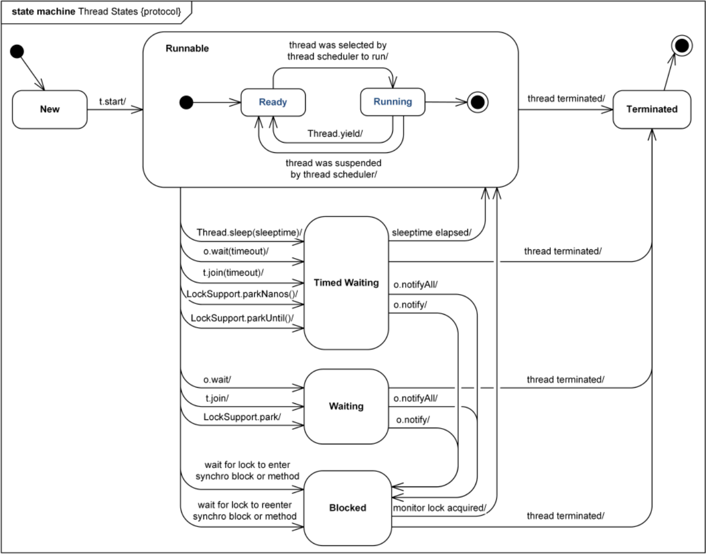

# Вопросы

- [x] В каких состояниях может находиться поток и какова диаграмма перехода между состояниями?
- [x] Как организовать ожидание\уведомление между, допустим, тремя потоками?
  - [x] На каком объекте нужно вызывать методы wait-notify и почему их можно вызвать только из синхронизированного блока?
  - [x] Почему проверку условия выхода из wait() нужно делать в цикле while(), а не в блоке if()? Объяснить на примере поставщика-потребителя
- [x] Что происходит с локом при вызове wait(), notify(), notifyAll()?
- [x] Чем отличаются методы notify() и notifyAll()? Являются ли они взаимозаменяемыми и в каких ситуациях какой лучше использовать?
  - [x] Каким образом вызов notify() может привести к дедлоку?
- [x] Обязательно ли располагать методы Thread.sleep и yield внутри синхронизированного блока? Почему?
  - [x] Что происходит с локом при вызове этих методов?
  - [x] Какое вообще назначение у этих методов? Что они делают и в какое состояние переходит поток при их вызове
- [x] Как можно остановить задачу? Для случаев, когда она запущена непосредственно в потоке и через пул потоков
  - [x] Что происходит, когда ожидающий\спящий\работающий поток получает сигнал прерывания?
  - [x] Как можно проверить, был ли сигнал на остановку потока? Какая особенность связана с такой проверкой?


# Состояния потоков

[Документация](https://docs.oracle.com/javase/7/docs/api/java/lang/Thread.State.html)

Переключением потоков занимается Thread Scheduler, который является частью JVM и опирается на механизмы ОС. Ситуации, при которых поток переходит из одного состояния в другое, показаны на диаграмме:

> Важно понимать, что потоки не переходят *сразу* в состояние Running. Когда они готовы, то становятся условными ready-to-run\ready\runnable (все называют как хотят, т.к. формально есть только статус Running), и непосредственно на выполнение уходят, только когда их выбирает планировщик



Характеристики состояний:

* New - когда тред создали, но еще не запустили
* Running (+ready-to-run) - когда тред работает, он runnging. Когда он отработал (или сам отдал через Thread.yield()) свой квант времени, при этом не заблокировался и никого не ждет, он становится ready-to-run. Для этого нет отдельного состояния, поэтому будет тоже running
* Blocked - когда тред попытался взять лок, который уже занят
* Waiting - тред ожидает какого-того логического условия для продолжения задачи и время ожидания не определено
* TimedWaiting - тред ожидает какого-того логического условия для продолжения задачи и время ожидания задано
* Terminated - тред выполнил всю задачу или завершился аварийно

# Object.wait(), notify(), notifyAll()

Сходу разберем пример: у нас будет объект под хранение данных (хранилище), объект поставщика данных (продюсер) и объект потребителя данных (консюмер), которые будут иметь в себе ссылку на хранилище. Когда хранилище полностью заполнено, продюсер должен подождать, пока не освободится место. А если хранилище пустое, тогда консюмер должен подождать появление хотя бы одного элемента.

```java
// Хранилище
import java.util.ArrayDeque;
import java.util.Deque;

public class Storage {
    private Deque<Integer> storage;
    private final int maxSize;

    public Storage(int storageSize) {
        storage = new ArrayDeque<>(storageSize);
        maxSize = storageSize;
    }

    public void store(int data) {
        if (isFull())
            throw new RuntimeException("Unable to save data: storage is full");
        storage.addLast(data);
    }

    public int receive() {
        if (isEmpty())
            throw new RuntimeException("Unable to receive data: storage is empty");
        return storage.pollFirst();
    }

    public boolean isFull() {
        return storage.size() == maxSize;
    }

    public boolean isEmpty() {
        return storage.isEmpty();
    }
}
```

```java
// Продюсер
public class Producer implements Runnable {
    private Storage storage;
    private Random rand = new Random();

    public Producer(Storage storage) {
        this.storage = storage;
    }

    @Override
    public void run() {
        while (true) {
            produce();
        }
    }

    private void produce() {
        int data = generateData();
        synchronized (storage) {
            while (storage.isFull()) {  // <-- Важно использовать while, а не if
                System.out.println("Storage if full. Going to wait");
                try {
                    storage.wait();  // <-- Ожидание вызываем на ОБЩЕМ объекте
                } catch (InterruptedException ex) {
                    System.out.println("Thread has been interrupted. Return");
                    return;
                }
            }
            storage.store(data);
            System.out.println("Saved to storage: " + data);
            storage.notify();  // <-- И на ОБЩЕМ также и уведомляем
        }
    }

    private int generateData() {
        return rand.nextInt(100);
    }
}
```

```java
// Консюмер
public class Consumer implements Runnable {
    private Storage storage;
    private Random rand = new Random();

    public Consumer(Storage storage) {
        this.storage = storage;
    }

    @Override
    public void run() {
        while (true) {
            consume();
        }
    }

    private void consume() {
        synchronized (storage) {
            while (storage.isEmpty()) {  // <-- Важно использовать while, а не if
                System.out.println("Storage if empty. Going to wait");
                try {
                    storage.wait();  // <-- Ожидание вызываем на ОБЩЕМ объекте
                } catch (InterruptedException ex) {
                    System.out.println("Thread has been interrupted. Return");
                    return;
                }
            }
            int data = storage.receive();
            System.out.println("Received from storage: " + data);
            storage.notify();  // <-- И на ОБЩЕМ также и уведомляем
        }
    }
}
```

```java
// Связующее звено
import java.util.concurrent.ExecutorService;
import java.util.concurrent.Executors;

public class WaitNotifyDemo {
    public static void main(String[] args) {
        Storage storage = new Storage(5);
        Runnable producer = new Producer(storage);
        Runnable consumer = new Consumer(storage);

        ExecutorService exec = Executors.newFixedThreadPool(3);
        exec.submit(producer);
        exec.submit(consumer);
    }
}
```

```java
// Вывод
Saved to storage: 51
Saved to storage: 56
Saved to storage: 71
Saved to storage: 3
Saved to storage: 14
Storage if full. Going to wait
Received from storage: 51
Received from storage: 56
Received from storage: 71
Received from storage: 3
Received from storage: 14
Storage if empty. Going to wait
Saved to storage: 11
Saved to storage: 44
Received from storage: 11
Received from storage: 44
Storage if empty. Going to wait
```

Есть несколько критичных вещей:

* Ожидание и уведомление:

  1. Вызывается на *общем* для потоков объекте
  2. Осуществляется *обязательно* внутри синхронизированного блока
  3. Этот синхронизированный блок создается с использованием того же общего объекта

* Проверку условия ожидания нужно делать в цикле while(), а не в if()

  Потому что если поток вдруг каким-то образом проснется случайно, то при использовании if() он просто пойдет дальше с непонятными последствиями, а при использовании while() он повторно проверит условие и если оно все еще не позволяет ему работать, то снова будет ожидать.
  
  Кроме того, если вдруг пробуждается несколько потоков, то работа одного из них может изменить состояние так, что другой поток не должен был бы продолжать работу, а должен был бы снова подождать. Поэтому повторная проверка за счет использования while() такую проблему решает. Например, у нас два консюмера и один продюсер. Продюсер уведомляет обоих консюмеров и получается так, что один из них успел опустошить очередь данных за время своей работы. Тогда второй при возобновлении работы должен снова ждать, т.к. работы для него не осталось.

Когда мы указываем какой-то объект А для создания синхронизированного блока В, то мы как бы логически группируем потоки, которые во время работы залипнут на этом блоке В. Поэтому и wait(), и notify() тоже вызываются на общем объекте А - таким образом JVM понимает, к какой ожидающей группе отнести поток и из какой группы поток пробудить.

При входе в синхронизированный блок поток забирает себе лок, а при вызове wait() - отпускает лок. При вызове notify() и возобновлении работы он снова забирает лок.

## notify() vs notifyAll()

Отличие у них в том, что notify() уведомляет *один случайный* поток из группы, а notifyAll() уведомляет *все* потоки из группы (при этом они будут конкурировать за приобретение лока).

notifyAll() более дорогая операция. Есть смысл использовать ее, когда уведомление потенциально позволит нескольким потокам начать работу. Например, если у них разные условия возобновления работы. Если же условие возобновления у всех одно, то работать начнет только один, а остальные снова перейдут в ожидание.

В случае с notify() возможно вечное ожидание всех потоков: если вдруг получивший уведомление поток по какой-то причине не возобновит работу, то цепочка нарушится и рано или поздно все встанет. Например, продюсер уведомит, а консюмер продолжит ждать. Тогда продюсер заполнит всю очередь и тоже начнет ждать и некому будет его разбудить.

:warning: UPD. Об этих темах стоит подробнее почитать в Concurrency on practice и Effective Java. Но пока хватит и такой инфы.


# Thread.sleep(n), yield()

```java
Thread.sleep(1000);  // <-- Всегда указывается время "сна"
```

Для "усыпления" характерно:

* Переводит поток в состояние Time_waiting

* Команда напрямую не связана с синхронизацией и поэтому мб вызвана в любом месте

* Всегда указывается *длительность* сна

* Если поток контролирует лок, то он его не отпускает на время сна, так что другие потоки не могут забрать его

* Поток возобновляет работу только когда истекает время сна (например, notify'и его не разбудят ввиду их механики)

  Под "возобновляет работу" имеется ввиду становится в очередь готовых к работе, а дальше как планировщик распорядится

```java
Thread.yield();  // <-- "Уступить"
```

Для "уступки" характерно:

* Сообщает планировщику, что текущий поток готов уступить свой квант, а снимет его планировщик или нет - наверняка не известно. Если снимет, то поток остается в состоянии Running (условный ready-to-run статус), так что у него хорошие шансы вскоре возобновить выполнение
* Команда напрямую не связана с синхронизацией и поэтому мб вызвана в любом месте
* Длительность указать нельзя
* Если поток контролирует лок, то он его не отпускает
* В настоящее время использование yield() считается моветоном

В общем и целом, ни sleep(), ни yield() не относятся к синхронизации, поэтому писать их можно где угодно, да только смысла в них как будто бы и нет вовсе.

# interrupt

"Прерывание" потока как правило заключается только в установке флага прерывания, который внутри потока нужно проанализировать и решить, что делать. При этом есть разница, то ли поток выполнялся в момент получения флага, то ли ждал:

* Если он ждал (в результате вызова sleep или wait - неважно), то метод ожидания выбрасывает исключение `InterruptedException` и *сбрасывает флаг прерывания*
* Если работал, то мы сами должны решить, в каких точках организовать проверку флага

Поскольку мы можем выполнять задачи, используя треды напрямую, и используя пулы, то они нам дают такие возможности:

* Тип Thread:
  * Имеет метод `interrupt()` для отправки команды прерваться. Вызывается на *объекте треда*, в котором крутится задача
  * Имеет static-метод `Thread.interrupted()`, который возвращает флаг прерывания и заодно *сбрасывает его*. Вызывается *внутри кода задачи*, чтобы понять, был ли сигнал прерваться
  * Имеет метод `isInterrupted()`, который вызывается на *объекте треда* и возвращает флаг прерывания, *не* сбрасывая его. Используется в "менеджер"-коде, чтобы понять каким задачам послана команда прерваться, но которые еще *не успели* прерваться. После прерывания флаг будет всегда false
* Пул потоков (ExecutorService):
  * Метод submit() возвращает интерфейс Future, у которого есть метод `cancel()` для установки флага прерывания
  * Проверка этого флага тоже делается через static-метод `Thread.interrupted()`
  * Future также имеет метод `isCancelled()` для понимания, какая задача была отменена. Но в отличие от своего собрата isInterrupted(), после прерывания выдает true

В обоих случаях проверка, был ли сигнал прерваться, выполняется *внутри кода задачи* и выглядит одинаково: класс Thread имеет static-метод `interrupted()`, который возвращает флаг прерывания и заодно *сбрасывает его*.

> :question: TODO неплохо бы вернуться сюда потом и поэкспериментировать с этими isInterrupted и isCancelled. Смущает то, что после прерывания первый возвращает false, так что как бы и нельзя понять, задача завершилась сама по себе или ее прервали намеренно. В то время как второй возвращает true. Мб это и не принципиально, но в данный момент разбираться нет сил

```java
import java.util.Random;
import java.util.concurrent.ExecutorService;
import java.util.concurrent.Executors;
import java.util.concurrent.Future;

public class InterruptionDemo {
    private static void interruptDuringWaiting() {
        while (true) {
            System.out.println("Now I'm gonna wait (via sleep, but it doesn't matter) for 1 sec");
            try {
                Thread.sleep(1_000);  // <-- wait() тоже выбросил бы исключение при получении команды прерваться
            } catch (InterruptedException ex) {
                System.out.println("They interrupted me while I was waiting. Return");
                return;
            }
        }
    }

    private static void interruptDuringWorking() {
        Random rand = new Random();
        while (true) {
            int number = rand.nextInt(10_000);
            int even = 0;
            int odd = 0;
            for (int i = 0; i < number; i++) {
                if (i % 2 == 0)
                    even++;
                else
                    odd++;
            }
            if (Thread.interrupted()) {  // <-- Когда поток не спит, исключений нет. Сами анализируем флаг
                System.out.println("You interrupted me so I will not tell you calculation result");
                return;
            }
            System.out.println(String.format("Number %d contains %d evens and %d odds", number, even, odd));
        }
    }

    private static void runTaskInPureThreads(Runnable task) throws Exception {
        Thread thread = new Thread(task);  // <-- Используем треды напрямую для запуска задачи
        thread.start();

        Thread.sleep(2_000);

        thread.interrupt();
        System.out.println("It is Interruption demo, task was running directly in thread");
    }

    private static void runTaskInThreadPool(Runnable task) throws Exception {
        ExecutorService exec = Executors.newSingleThreadExecutor();
        Future futureTask = exec.submit(task);  // <-- Используем пул потоков для запуска задачи

        Thread.sleep(2_000);

        futureTask.cancel(true);
        System.out.println("It is Interruption demo, task was running in thread pool");

    }

    public static void main(String[] args) throws Exception {
        runTaskInThreadPool(InterruptionDemo::interruptDuringWaiting);
        System.out.println("main() complete");
    }
}
```

# join

`join` - метод объекта потока:

* Имеет две версии - без времени ожидания и с ним
* Если время ожидания истекло, ожидающий поток просто идет дальше. Исключений не возникает и вообще нет никаких явных признаков того, выполнилась задача или нет
* Дает happens-before эффект: действия в потоке А *происходят до* того, как ожидающий его поток В получит *успешный* возврат от join (All actions in a thread happen-before any other thread successfully returns from a join() on that thread)

```java
public class JoinDemo {
    private static void infiniteWork() {
        System.out.println("You're gonna wait forever (unless one tell me to stop)");
        while (true) {
            if (Thread.interrupted()) {
                System.out.println("All right, all right! I quit this infinite loop");
                return;
            }
        }
    }

    private static void joinNoTimeout(Runnable task) {
        Thread thread = new Thread(task);
        thread.start();
        try {
            thread.join();  // <-- Просто ждем, возможно бесконечно
        } catch (InterruptedException ex) {
            System.out.println("Task has been interrupted by someone");
            return;
        }
        System.out.println("Hello, world!");
    }

    private static void joinTimeout(Runnable task, int timeoutMs) {
        Thread thread = new Thread(task);
        thread.start();
        try {
            thread.join(timeoutMs);  // <-- Ждем определенное время
            thread.interrupt();  // <-- Если задача не успела выполниться, прерываем. Если успела, эффекта не будет
        } catch (InterruptedException ex) {
            System.out.println("Task has been interrupted by someone");
        }
        System.out.println("Hello, world!");
    }

    public static void main(String[] args) {
        joinTimeout(JoinDemo::infiniteWork, 3000);
        System.out.println("main() complete");
    }
}
```

:question: TODO: Вероятно вызов .interrupt() после join не очень хорошая практика. Хотя вроде бы если поток успел завершиться, эта команда не будет иметь никакого эффекта, но выглядит грязновато. На подходящем витке посмотреть, как нужно обрабатывать ситуации, когда поток не успел выполниться за ожидаемое время


