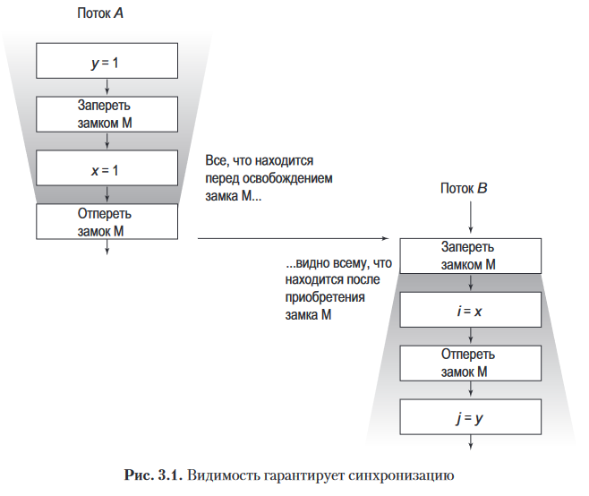

# 3.1 Видимость

Если в однопоточной программе вы пишете в переменную, а потом читаете, то вы надеетесь увидеть то же самое значение. Но в многопоточной программе, когда запись проводит один поток, а чтение - другой, то без синхронизации нет гарантий, что читающий поток увидит актуальное значение. Пример:

```java
public class NoVisibility {
    
    private static boolean ready;
    private static int number;

    private static class ReaderThread extends Thread {
        public void run() {
            while (!ready)
                Thread.yield();
            System.out.println(number);
        }
    }
    
    public static void main(String[] args) {
        new ReaderThread().start();
        number = 42;
        ready = true;
    }
    
}
```

Главный поток запускает читающий, а потом устанавливает данные и флажок готовности. При множественных запусках выясняется, что мы не всегда увидим 42. Возможные ситуации:

* Бесконечный цикл - если читающий поток не увидит значение true
* 0 - если читающий поток увидит true до реальной записи 42 в number
* 42 - если звезды сошлись и все сработало как надо

Причины - дальше.

## 3.1.1 Устаревшие данные

Устаревшие данные (stale data) это эффект, который может получиться, если не использовать синхронизацию при каждом обращении к общим данным.

```java
@NotThreadSafe
public class MutableInteger {
    private int value;
    public int get() { return value; }
    public void set(int value) { this.value = value; }
}
```

```java
@ThreadSafe
public class SynchronizedInteger {
    @GuardedBy("this") private int value;
    public synchronized int get() { return value; }
    public synchronized void set(int value) { this.value = value; }
}
```

В книге ничего не было сказано про пробитие кэша и прочие технические вещи. Просто написано как факт:

> Класс MutableInteger в листинге 3.2 не является потокобезопасным, поскольку доступ к полю value осуществляется как из get, так и из set без синхронизации. Причем он подвержен устаревшим значениям: если один поток вызывает set, то другие потоки, вызывающие get, могут не увидеть обновления.
>
> Чтобы сделать MutableInteger потокобезопасным, необходимо синхронизировать методы доступа get и set, как показано в SynchronizedInteger в листинге 3.3. Синхронизации только метода set будет недостаточно: потоки, вызывающие get, все равно будут видеть устаревшие значения.

TODO: Т.е. просто "все равно будут видеть устаревшие значения.", а почему - не сказано. Возможно в будущем из-за этого могут быть проблемы с пониманием, если они причины не будут указывать.

## 3.1.2 Неатомарные 64-разрядные операции

"Безопасность из ниоткуда" (out-of-thin-air safety) - термин, означающий, что хотя читающий поток может получить устаревшее значение переменной, но по крайней мере это не случайное значение, а настоящее, которое кто-то туда записал.

"БИН" применима ко всем типам переменных кроме long и double. Потому что они 64х разрядные и операции чтения\записи применимо к ним могут дробиться на две 32х разрядные операции. Соответственно, читая long или double без синхронизации, мы рискуем получить две половины (32 + 32 бита) двух разных числе.

Поэтому когда работаем с long и double, всегда нужно использовать синхронизацию, волатильность, или атомики.

## 3.1.3 Блокировка и видимость

Блокировка и видимость связаны следующим образом: значения общих переменных, записанных перед освобождением замка, видны другому потоку при приобретении замка.



## 3.1.4 Волатильные переменные

Значения полей, объявленных через слово volatile, всегда берутся из оперативки и таким образом все потоки гарантированно получают актуальное значение. При этом работа с волатильным полем сама по себе не блокирует поток, поэтому волатильные поля являются легковесным механизмом синхронизации.

TODO: Кроме того, запись в волатильное поле оказывает эффект выхода из синхронизированного блока, а ее чтение - эффект входа в синхронизированный блок в том плане, что значения всех переменных, записанных перед записью в волатильку в потоке А, будут видны перед чтением волатильки в потоке В.

Однако не стоит злоупотреблять этой особенностью, потому что это делает код хрупким и думать о видимости становится сложнее.

> Волатильные переменные должны обеспечивать видимость их собственного состояния, состояния объекта, на который они ссылаются, или важного события жизненного цикла (например, инициализации или выключения).

Сегодня волатильные чтения ненамного дороже неволатильных, поэтому можно пользоваться активно.

Волатильки используются обычно как флажки готовности, прерывания и статуса:

```java
volatile boolean asleep;
...
while (!asleep)
    countSomeSheep();
```

TODO:

> в серверном приложении всегда указывайте переключатель командной строки JVM-server во время вызова JVM даже для разработки и тестирования. Серверная JVM выполняет больше оптимизационных задач, чем клиентская JVM, например извлекает из цикла переменные, которые в нем не модифицируются.

Волатильки нельзя использовать для операций вроде count++, потому что они обеспечивают только видимость, а атомарность не дают.

Волатильки актуальны в случаях:

* записи в переменную не зависят от ее текущего значения, либо есть гарантия, что значения переменной обновляются только одним потоком
* переменная не участвует в инвариантах с другими переменными состояния
* при обращении к переменной заранее не требуется блокировка

# 3.2 Публикация и ускользание

Вот по этой ссылке https://wiki.sei.cmu.edu/confluence/display/java/TSM01-J.+Do+not+let+the+this+reference+escape+during+object+construction можно ориентироваться в итоге после всей это темы с публикацией

Публикация объекта означает сделать его доступным за пределами его изначальной области доступности.

> Publishing an object means making it available to code outside of its current scope, such as by storing a reference to it where other code can find it, returning it from a nonprivate method, or passing it to a method in another class

Формулировка мутнованая, но суть насколько я понял в том, что если мы в каком-то методе класса создали некий объект, то его естественная область видимости - этот метод. А как только мы кладем ссылку например в поле класса (тем более если оно public), то мы по сути "публикуем" объект, т.е. делаем его потенциально доступным кому хочешь. Кроме того, другой объект может ускользнуть (escaped), если он вложен в такой публикуемый объект, например:

```java
public static Set<Secret> knownSecrets;

public void initialize() {
    knownSecrets = new HashSet<Secret>();
}
```

```java
class UnsafeStates {
    private String[] states = new String[] {
        "AK", "AL" ...
    };
    public String[] getStates() { return states; }
}
```

Если положить объекты Secret в такой hashset, то они тоже станут доступны извне, потому что ссылка на сам hashset публичная.

`Alien-метод` - для класса С метод является alien, если его поведение не полностью определено классом С (еще одна формулировка: это метод, чье поведение не полностью определено вызывающим классом). Это вызов методов других классов, а также не финальные и не приватные методы самого класса С. Передача объекта в такой метод расценивается как публикация объекта.

> From the perspective of a class C, an alien method is one whose behavior is not fully specified by C. This includes methods in other classes as well as overrideable methods (neither private nor final) in C itself

TODO: не понимаю этот пример

> Еще одним механизмом публикации объекта или его внутреннего состояния является публикация экземпляра внутреннего класса, как показано в листинге 3.7. Когда класс ThisEscape публикует слушателя EventListener, он неявно публикует и окаймляющий его экземпляр ThisEscape, потому что экземпляры внутреннего класса содержат скрытую ссылку на него.

```java
public class ThisEscape {
    public ThisEscape(EventSource source) {
        source.registerListener(
        new EventListener() {
            public void onEvent(Event e) {
                doSomething(e);
            }
        });
    }
}
```

Он какой-то куцый и окружение вообще не понятно. Может быть проблема в том, что в методе onEvent доступен this, но это не точно.

Но сама идея похоже в целом такая: *нельзя, чтобы ссылка на объект ускользнула до того как его конструктор полностью выполнится (произойдет return из конструктора).* Потому что иначе через эту ссылку какой-нибудь поток может начать пользоваться объектом до того, как конструктор завершится, а значит объект может быть на момент использования не до конца инициализирован. Вызов из конструктора переопределяемых (override) методов тоже приводит к ускользанию ссылки this.

## 3.2.1 Приемы безопасного конструирования

Типичная ситуация, когда this ускользает из конструктора - это когда мы создаем новый поток в конструкторе и тут же его запускаем. Т.е. насколько я понял, у нас есть класс А, реализующий например Runnable и мы при создании объекта А тут же хотим запустить его в новом потоке и создаем поток и запускаем в конструкторе А. В итоге this ускользает в поток до того как конструктор А фактически завершился. И от этого могут быть какие-то проблемы.

Решить это можно закрытием конструктора и введением фабричного метода, где мы могли бы сначала создать объект А, а потом уже создать тред и передать в него этот объект. На примере модификации примера с подпиской на события выше, вот так было бы правильнее:

```java
public class SafeListener {

    private final EventListener listener;

    private SafeListener() {
        listener = new EventListener() {
            public void onEvent(Event e) {
                doSomething(e);
            }
        };
    }

    public static SafeListener newInstance(EventSource source) {
        SafeListener safe = new SafeListener();
        source.registerListener(safe.listener);
        return safe;
    }
    
}
```

# 3.3 Ограничение одним потоком

TODO: Ограничение одним потоком (thread confinement) это техника, при которой программа пишется так, что объект используется только одним потоком, а значит синхронизация не требуется. Примеры: Swing, где визуальные потокоНЕбезопасные компоненты используются только событийным потоком. JDBC, ее пул соединений с БД.

Этот подход - проектная фишка, в языке нет каких-то явных механизмов, которые это делают.

TODO: упоминается класс ThreadLocal, но без примера.

## 3.3.1 Узкоспециальное ограничение одним потоком

TODO: Ad-hoc thread confinement - это когда техника ограничения одним потоком целиком ложится на реализацию, а в языке нет средств, которые явно ее обеспечивают. Это делает технику хрупкой, поэтому рекомендуется использовать более жесткие техники, например ограничение стеком и ThreadLocal.

Хз, без примера вообще не понятно, что это за чухня.

## 3.3.2 Ограничение стеком

Хуйня какая-то, чесслово...

TODO: Вот пример:

```java
public int loadTheArk(Collection<Animal> candidates) {
    SortedSet<Animal> animals;
    int numPairs = 0;
    Animal candidate = null;
    // не дайте animals ускользнуть!
    animals = new TreeSet<Animal>(new SpeciesGenderComparator());
    animals.addAll(candidates);
    for (Animal a : animals) {
        if (candidate == null || !candidate.isPotentialMate(a))
            candidate = a;
        else {
            ark.load(new AnimalPair(candidate, a));
            ++numPairs;
            candidate = null;
        }
    }
    return numPairs;
}
```

Идея в том, что поскольку TreeSet помещен в локальную переменную и больше никуда, то ссылка на него не ускользает и это хорошо. Бред какой-то. Зачем ее вообще куда-то еще записывать, вроде поля, если это реально просто локальная переменная для локальных нужд? Плюс сказано:

> However, if we were to publish a reference to the Set (or any of its internals), the confinement would be violated and the animals would escape.

or any of its internals - в данном случае насколько я понимаю, это применимо к элементам сета. Поскольку addAll добавляет ссылки, а не делает клоны объектов, то получается, что ссылки на данные находятся вне метода loadTheArk (ведь поступают к нам через параметры извне), а значит по указанной цитате как будто и сет ускользнул. В общем, это хуета какая-то, надо либо гуглить в чем тут суть, либо просто автор - идущий к реке.

## 3.3.3 ThreadLocal

Это специальный класс с методами get и set, которые "привязывают" значение к текущему потоку. Как это работает, пример:

```java
class SomeClass { // Наверное все это дб помещено в какой-то класс
    
    private static ThreadLocal<Connection> connectionHolder = new ThreadLocal<Connection>() {
        public Connection initialValue() {
            return DriverManager.getConnection(DB_URL);
        }
    };

    public static Connection getConnection() {
        return connectionHolder.get();
    }
    
}
```

Когда поток А вызывает метод getConnection в первый раз, то получает новый объект Connection. Когда он вызывает этот метод повторно, то получает тот же самый объект Connection. При первом вызове connectionHolder.get() срабатывает метод initialValue(), а при повторном вызове get() возвращается уже имеющееся значение. set это значение перезаписывает.

Когда поток В делает то же самое, то для него получается свой объект Connection. В итоге, сколько потоков будут запрашивать соединения, столько разных соединений и получится, а ThreadLocal позаботится о том, чтобы возвращать каждому потоку именно его соединение.

# 3.4 Иммутабельность

Иммутабельные объекты всегда потокобезопасны. Их можно публиковать и повторно использовать без защитных копий.

Объект иммутабельный, если:

* Его невозможно изменить после создания
* Все его поля являются final
* В конструкторе не ускользает this

TODO: Чем все-таки опасно это ускользание this? Не понимаю. Оно же ускользает, т.е. как-то неявно куда-то уходит и там его вроде бы невозможно использовать? Или это какая-то чисто внутренняя техническая проблема JVM, что оно там где-то осядет. Или может быть это какие-то супертонкие материи вроде читерских извлечений этих ускользнувших ссылок.

Объект может быть иммутабельным, хотя содержит мутабельные объекты внутри себя. Главное, чтобы они не просочились вовне. Пример:

```java
@Immutable
public final class ThreeStooges {
 
    private final Set<String> stooges = new HashSet<String>();
    
    public ThreeStooges() {
        stooges.add("Moe");
        stooges.add("Larry");
        stooges.add("Curly");
    }
    
    public boolean isStooge(String name) {
        return stooges.contains(name);
    }
    
}
```

Сет мутируемый, но изменить его снаружи невозможно, и внутри класса он тоже не меняется.

Если состояние представлено иммутабельным объектом, это не означает, что состояние невозможно изменить. Потому что можно заменить иммутабельный объект другим иммутабельным объектом, который будет представлять новое состояние. Big brain.

## 3.4.1 Финальные поля

Значение самого финального поля не может быть изменено, но можно изменить сам объект, который в нем лежит.

Поля, которые не предполагается изменять, рекомендуется объявлять как final. Это упрощает размышления о возможных проблемах многопоточности, потому что сокращается количество изменчивых полей, которые потенциально могут требовать синхронизации.

## 3.4.2. Пример: использование volatile для публикации немутируемых объектов

Когда у нас есть несколько элементов состояния, связанных логически, то можно объединить их в одном иммутабельном объекте и избежать необходимости синхронизации их изменений. Ранее был пример с кэшированным вычислением факториала:

```java
// Оригинальный пример
@NotThreadSafe
public class UnsafeCachingFactorizer implements Servlet {
    
    private final AtomicReference<BigInteger> lastNumber = new AtomicReference<BigInteger>();
    private final AtomicReference<BigInteger[]> lastFactors = new AtomicReference<BigInteger[]>();

    public void service(ServletRequest req, ServletResponse resp) {
        BigInteger i = extractFromRequest(req);
        if (i.equals(lastNumber.get()))
            encodeIntoResponse(resp, lastFactors.get());
        else {
            BigInteger[] factors = factor(i);
            lastNumber.set(i);
            lastFactors.set(factors);
            encodeIntoResponse(resp, factors);
        }
    }
    
}
```

Решение через синхронизацию:

```java
@ThreadSafe
public class CachedFactorizer implements Servlet {

    @GuardedBy("this") private BigInteger lastNumber;
    @GuardedBy("this") private BigInteger[] lastFactors;
    @GuardedBy("this") private long hits;
    @GuardedBy("this") private long cacheHits;

    public synchronized long getHits() { return hits; }
    public synchronized double getCacheHitRatio() {
        return (double) cacheHits / (double) hits;
    }

    public void service(ServletRequest req, ServletResponse resp) {
        BigInteger i = extractFromRequest(req);
        BigInteger[] factors = null;
        synchronized (this) {
            ++hits;
            if (i.equals(lastNumber)) {
                ++cacheHits;
                factors = lastFactors.clone();
            }
        }
        if (factors == null) {
            factors = factor(i);
            synchronized (this) {
                lastNumber = i;
                lastFactors = factors.clone();
            }
        }
        encodeIntoResponse(resp, factors);
    }
    
}
```

А вот решение через иммутабельный объект:

```java
// Объект-хранитель числа и его факториала
@Immutable
class OneValueCache {

    private final BigInteger lastNumber;
    private final BigInteger[] lastFactors;

    public OneValueCache(BigInteger i, BigInteger[] factors) {
        lastNumber = i;
        lastFactors = Arrays.copyOf(factors, factors.length);
    }
    
    public BigInteger[] getFactors(BigInteger i) {
        if (lastNumber == null || !lastNumber.equals(i))
            return null;
        else
            return Arrays.copyOf(lastFactors, lastFactors.length);
    }
    
}

// Потокобезопасный сервлет, даже без синхронизации
@ThreadSafe
public class VolatileCachedFactorizer implements Servlet {

    private volatile OneValueCache cache = new OneValueCache(null, null);
    
    public void service(ServletRequest req, ServletResponse resp) {
        BigInteger i = extractFromRequest(req);
        BigInteger[] factors = cache.getFactors(i);
        if (factors == null) {
            factors = factor(i);
            cache = new OneValueCache(i, factors);
        }
        encodeIntoResponse(resp, factors);
    }
    
}
```

Проблема решается за счет того, что кэш теперь представлен единственным объектом и если он не успеет попасть в поле cache, то очередной поток просто воспользуется старым объектом. При таком решении "половинчатость" обновления кэша просто невозможна.

# 3.5. Безопасная публикация

Пример небезопасной публикации:

```java
// Небезопасная публикация
public Holder holder;

public void initialize() {
    holder = new Holder(42);
}
```

Сам объект Holder:

```java
public class Holder {

    private int n;

    public Holder(int n) { 
        this.n = n; 
    }

    public void assertSanity() {
        if (n != n)
            throw new AssertionError("Эта инструкция является ложной.");
    }
    
}
```

TODO: Все возможные ошибки исходят из оптимизаций, вроде кэширования (наверное). Возможные косяки:

* Поток увидит в holder null
* Поток увидит в holder старое значение
* Поток увидит в holder нужное значение, но при этом беда может случиться с полем n. До выполнения написанного нами конструктора выполнится конструктор Object, который заполнит поля значениями по умолчанию и n будет = 0. И только потом выполнится конструктор класса Holder и n будет = 42. И где-то в этот момент вызов assertSanity может выбросить исключение, т.к. (наверное) получится условие 0 != 42. Представить как это работает мне довольно трудно, т.к. я не понимаю, во-первых, каким образом в holder может попасть объект, "нормальный" конструктор которого еще не выполнился, а, во-вторых, как n в условии n!=n может иметь разные значения.

Без более полного примера представить проблему трудно, но в целом согласен, что простое присвоение объекта в публичное поле это рискованно как минимум из-за кэширования.

## 3.5.1. Ненадлежащая публикация: хорошие объекты становятся плохими

Этот раздел по сути объединился с предыдущим.

## 3.5.2. Иммутабельные объекты и безопасность при инициализации

К немутируемым объектам можно безопасно обращаться, даже когда синхронизация не используется для публикации объектной ссылки, только если соблюдены три условия: состояние немутируемое, все поля финальные и конструирование надлежащее.

Немутируемые объекты могут безопасно использоваться потоками без дополнительной синхронизации, даже когда синхронизация для их публикации не используется.

Однако если финальные поля ссылаются на мутируемые объекты, то синхронизация по-прежнему необходима для доступа к состоянию этих объектов.

## 3.5.3. Приемы безопасной публикации

Примеров мало (нет), болтовни много

Объекты, которые не являются немутируемыми, должны быть безопасно опубликованы, что обычно влечет за собой синхронизацию, осуществляемую как публикующим, так и потребляющим потоками.

Безопасную публикацию объекта, при которой ссылка на него и его состояние видна всем потокам в одно и то же время, можно провести с помощью:

* инициализации объектной ссылки из статического инициализатора

  Имеется ввиду положить объект в static поле:

  ```java
  public static Holder holder = new Holder(42);
  ```

  Статические инициализаторы выполняются JVM-машиной во время инициализации класса, гарантируя дальнейшую безопасную публикацию инициализированных объектов

* сохранения ссылки на него в волатильном поле либо в AtomicReference;

* сохранения ссылки на него в финальном поле надлежаще сконструированного объекта;

* сохранения ссылки на него в поле, которое надлежаще защищается замком.

В целом как будто понятно, но примеры, примеры, Карл!

## 3.5.4. Фактически неизменяемые объекты

Это объекты, которые по своей природе изменяемые, но просто в программе они не будут изменяться. 

## 3.5.5. Изменяемые объекты

Это объекты, которые могут быть изменены после конструирования.

Требования к публикации объекта зависят от его изменяемости:

* Неизменяемые объекты могут быть опубликованы любым механизмом;
* фактически немутируемые объекты должны быть безопасно опубликованы;
* мутируемые объекты должны быть безопасно опубликованы и быть либо потокобезопасными, либо защищенными замком.

## 3.5.6. Безопасное совместное использование объектов

Всякий раз, когда вы приобретаете ссылку на объект, вы должны знать, что именно вам разрешено с ним делать. Когда вы публикуете объект, следует задокументировать то, как к нему можно обращаться. Наиболее полезные политики для применения и совместного использования объектов в конкурентной программе:

* Ограничение одним потоком. Объект, ограниченный одним потоком, принадлежит эксклюзивно владеющему потоку, который может его изменять.
* Совместный доступ только для чтения. Потоки могут обращаться к объекту, предназначенному только для чтения, конкурентно, без дополнительной синхронизации и возможности его изменять. Совместные объекты только для чтения включают немутируемые и фактически немутируемые объекты.
* Совместная потокобезопасность. Потокобезопасный объект выполняет синхронизацию внутренне, поэтому потоки могут свободно обращаться к нему через его публичный интерфейс без дополнительной синхронизации.
* Защищенность. С удержанием конкретного замка можно обращаться к объекту, инкапсулированному в другие потокобезопасные объекты, а также к опубликованному объекту, защищенному замком


