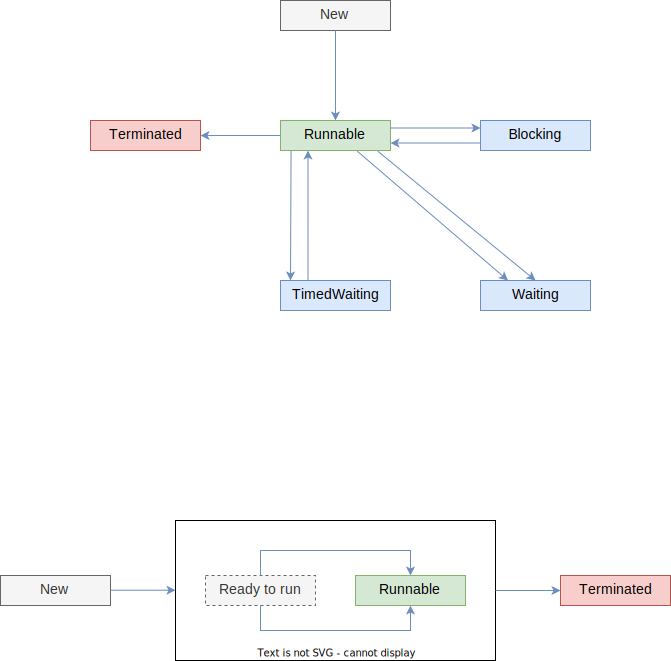

# Вопросы

- [ ] asd

# Состояния потоков

[Документация](https://docs.oracle.com/javase/7/docs/api/java/lang/Thread.State.html)

# Черновик

* Какие состояния потоков бывают?

Поток можно усыпить, вывав Thread.sleep(1_000). Поток может усыпить только сам себя. 

Из текущего потока T1 мы можем послать другому потоку T2 команду interrupt. 

* Если T2 в это время спит, то он просыпается и возникает исключение InterruptedException (флаг сброса при этом обнуляется, т.е. Т2 не считается "прерванным"). Поэтому sleep оборачивается в try-catch, где мы можем решить, действительно ли прервать поток, или продолжить выполнение. Т.о., команду interrupt можно использовать не только для прерывания, но и для возобновления работы потока, т.к. сама по себе она его не прерывает
* Если же поток T2 не спал, то у него устанавливается статус interrupted, который мы можем проверить методом класса isInterrupted() или статическим методом Thread.interrupted()

And remember that when the InterruptedException is thrown, the interrupt status is cleared.

Из текущего потока Т1 можно подождать другой поток Т2 командой Т2.join() или join(1_000). Она тоже оборачивается в try-catch, где мы можем ловить InterruptedException, на случай если какой-нибудь третий поток Т3 прервет Т2. И тогда в Т1 мы об этом узнаем и не будем ждать вечно.