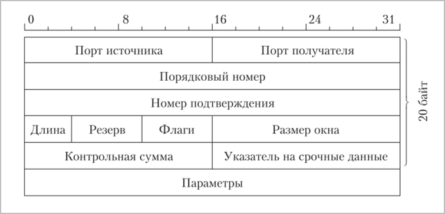
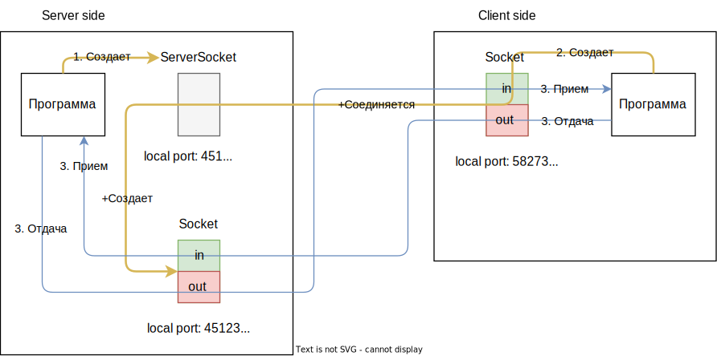

# Сокеты на пальцах

Чтобы обмениваться информацией, две программы должны установить соединение друг с другом. Получается двунаправленное соединение, т.е. каждая программа может отправлять данные и получать. Если представить это соединение в виде трубки, то можно сказать, что сокеты - это кончики этой трубки, в которые можно заливать и из них же выкачивать байты. Дополнительно можно представить, что эта трубка внутри разделена на две половины - одна половина используется для выкачивания, а другая - для залива байтов.

Формальное определение: сокет - это конечная точка (endpoint) двустороннего канала связи между двумя программами, работающими в сети. Еще более формальное: сокеты - это механизм межпроцессного взаимодействия (IPC), причем процессы могут быть как на одном компьютеры, так и на разных компьютерах локальной сети или интернет.

Говоря более практично, сокет - это программный объект, который скрывает от нас всю рутину по установке сетевого соединения, и позволяет нам соединиться с другим сокетом в другой программе, получить поток ввода и поток вывода, и путем записи\чтения этих потоков вести обмен с другой программой.

На уровне ОС сокет представляет собой область оперативной памяти. Возможны дополнительные детали, например, в Unix при этом еще создает файл для служебных целей, но в конечном итоге все равно сокет - это просто участок RAM. Когда мы что-то записываем в сокет из своей программы и данные приходят "партнеру", ОС буферизует их в памяти до тех пор, пока приложение-"партнер" их не прочитает. Есть два буфера - под пришедшие данные и под отправляемые.

ОС однозначно идентифицирует сокет по пяти вещам: ip и порт отправителя, ip и порт получателя, и протокол. IP адрес является частью IP-слоя пакета, а порт является частью TCP-слоя пакета. Т.о., каждый пакет содержит эти пять элементов и благодаря этому ОС понимает, кто и кому этот пакет прислал. Формат TCP-слоя пакета:



Порт - это просто цифра, которую операционная система закрепляет за программой при создании сокета. Как видно из картинки, на порт отводится 16 бит, значит общее количество портов 2^16=65536

> Может ли одна программа резервировать несколько портов?
>
> Может. Это просто значит, что программа открывает несколько соединений. Именно поэтому такие вещи положено освобождать после окончания использования, чтобы одна программа не зарезервировала себе все порты.

> Может ли один порт использоваться несколькими программами одновременно?
>
> Может, для этого используется мультиплексирование. Но это отдельная тема.

В джаве есть типы для "серверного" сокета и "обычного" ("клиентского") сокета. Принцип работы такой:



1. Создаем серверный сокет, представленный классом java.net.ServerSocket и ждем, когда кто-нибудь присоединится.

   Для серверного сокета нужно указать только порт, который мы хотим, чтобы он слушал. IP адрес не нужен, потому что серверный сокет очевидно всегда работает на том же компьютере, на котором его создали. 

2. Создаем клиентский сокет, представленный классом java.net.Socket

   Ему нужно указать IP адрес, на котором работает серверный сокет, и порт, который серверный сокет слушает. При создании клиентского сокета, ОС автоматически выдает ему порт и далее идет установка соединения с серверным сокетом. Успешное создание клиентского сокета означает успешное соединение с серверным сокетом.

   При этом, когда серверный сокет принял соединение, он создает обычный сокет и возвращает его нам, чтобы мы могли работать с этим конкретным присоединившимся клиентом. Это естественно, потому что к серверу могут присоединяться несколько клиентов и нам нужно их различать. Поэтому каждый раз, когда кто-то присоединяется, серверный сокет и создает обычный и возвращает его нам.

   В общем-то именно это и отражено на картинке, если присмотреться: Программа *создает* Socket. Socket *соединяется с* ServerSocket. ServerSocket *создает* Socket.

3. После установки соединения мы можем получить на объектах Socket потоки ввода\вывода и начать обмениваться данными. "Выход" одной программы является "входом" другой. Для отправки данных мы пишем в OutputStream (out - потому что эти данные "выходят" из нашей программы), а для получения данных - читаем InputStream (in - потому что эти данные "входят" в нашу программу).

   У серверного сокета нет методов получения потоков, потому что он по своей сути предназначен только для ожидания соединения и создания обычных сокетов, а не для непосредственно обмена данными.

Простой пример клиента и сервера, в котором сервер выводит в консоль то, что присылает клиент (для того, чтобы послать "null" серверу и закрыть соединение, в клиенте нажимаем Ctrl + C, причем эта комбинация не работает в идейной консоли, лучше использовать виндовую консоль, +проблемы с передачей кириллицы):

Серверный сокет:

```java
package johny.dotsville;

import java.io.IOException;
import java.net.ServerSocket;
import java.net.Socket;
import java.io.InputStream;
import java.io.InputStreamReader;
import java.io.BufferedReader;

public class Server {
    public static void main(String[] args) throws IOException {
        ServerSocket serverSocket = new ServerSocket(45123);
        int localPort = serverSocket.getLocalPort();
        System.out.println("server port: " + localPort); // 45123
        // serverSocket.getPort();  // Нет такого свойства
        // serverSocket.getInputStream();  // И нет таких методов
        // serverSocket.getOutputStream();
        Socket clientSocket;
        System.out.println("Ожидаем соединения.");
        while (true) {
            clientSocket = serverSocket.accept();
            handle(clientSocket);
        }
    }

    private static void handle(Socket socket) {
        System.out.println("Соединение установлено.");
        try {
            int port = socket.getPort();
            int localPort = socket.getLocalPort();
            System.out.println("client port: " + port + ", local port: " + localPort);

            InputStream stream = socket.getInputStream();
            InputStreamReader reader = new InputStreamReader(stream, "UTF-8");
            BufferedReader buffer = new BufferedReader(reader);

            String line;
            while ((line = buffer.readLine()) != null) {
                System.out.println("Получены данные: " + line);
            }
            buffer.close();  // Закрываем в обратном порядке
            reader.close();
            socket.close();
        } catch (Exception ex) {
            System.out.println("Соединение нарушено и будет закрыто.");
        }
        System.out.println("Соединение закрыто.");
    }
}
// Сокет создан на порте 45123, ожидаем соединения.
// Соединение установлено.
// client port: 52453, local port: 45123
```

Клиентский сокет:

```java
package johny.dotsville;

import java.io.IOException;
import java.net.Socket;
import java.io.OutputStream;
import java.io.InputStreamReader;
import java.io.BufferedReader;

public class Client {

    public static void main(String[] args) throws IOException {
	    Socket socket = new Socket("localhost", 45123);
        System.out.println("Соединение установлено. Можно отправлять данные.");
        OutputStream output = socket.getOutputStream();

        int port = socket.getPort();
        int localPort = socket.getLocalPort();
        System.out.println("server port: " + port + ", local port: " + localPort);

        InputStreamReader input = new InputStreamReader(System.in);
        BufferedReader keyboard = new BufferedReader(input);
        String message;
        while ((message = keyboard.readLine()) != null) {
            message += "\n";
            try {
                output.write(message.getBytes());
                System.out.println("Отправили строку.");
            } catch (Exception ex) {
                System.out.println("Ошибка соединения.");
                break;
            }
        }
        keyboard.close();  // Закрываем в обратном порядке
        input.close();
        socket.close();
        System.out.println("Соединение закрыто.");
    }
}
// Соединение установлено. Можно отправлять данные.
// server port: 45123, local port: 52453
```

Этот пример может обрабатывать запросы нескольких клиентов, но последовательно. Если запустить в консоли два клиента, то запросы второго мы увидим только когда отправим Ctrl + C от первого клиента.

## Дополнительно

После установления соединения можно запустить в консоли windows команду `netstat -ano` и там будет видно наш сокет 45123 и сокет, который к нему присоединен.

Некоторые интересные утверждения, которые встретились в процессе изучения темы:

* windows сокет - это область в оперативной памяти
* unix сокет - это тоже область оперативной памяти +файл на диске, который нужен для каких-то вспомогательных целей, а собственно данные пишутся в оперативную память
* ??? Если серверному сокету задать ip 127.0.0.0, то он будет принимать соединения только с локального же компьютера. А чтобы принимал с любых, надо задать четыре нуля 0.0.0.0
* Только один процесс на компьютере может слушать конкретный порт. На деле с помощью мультиплексирования можно обойти это ограничение, но это другая тема.

Вопросы:

* Номера портов как-то строго закреплены за конкретными участками памяти или мб назначаются динамически?

# Черновик

IP - передача "от компа к компу"

TCP - передача "от программы к программе" в том смысле, что он может восстановить порядок пакетов, т.к. они могут прийти в разном порядке.

Сокет - адрес + порт.

Сокет условно можно разделить на серверный и клиентский. Серверный сокет принимает подключения. 

Порт - просто число, которое программа резервирует у ОС и когда приходит пакет, в котором указан определенный порт, ОС понимает, какому приложению этот пакет предназначен.

80 порт - стандартный порт, на котором работают веб-сервера

У сокета есть поток ввода и поток вывода. Записывая в поток вывода байты, мы отправляем их в сокет, с которым соединен наш.

```java
public void simpleSocket() throws IOException {
    Socket socket = new Socket("localhost", 8080);

    InputStream is = socket.getInputStream();
    OutputStream os = socket.getOutputStream();

    String command = "GET / HTTP/1.1\r\nHost:java-course.ru\r\n\r\n";
    os.write(command.getBytes());
    os.flush();

    int c = 0;
    while ( (c = is.read()) != -1) {
        System.out.print((char)c);
    }

    socket.close();
}
```

# Взаимодействие сокетов

Вот пример использования сокетов и тредов для создания демонстрации простого обмена между "клиентом" и "сервером" с помощью сокетов. Насколько я понял, это общий принцип работы всех веб серверов: один поток ждет соединений, а когда соединение происходит, он создает отдельный поток для обработки этого соединения.

DDoS атаки базируются на том, что серверу посылают много таких соединений, а у него есть настройка, сколько одновременно соединений он поддерживает. И получается, что из-за высокой частоты поступления фейковых запросов реальные клиенты испытывают сложности с подключением.

Сервер:

```java
package johny.dotsville;

import java.io.*;
import java.net.ServerSocket;
import java.net.Socket;
import java.time.LocalDateTime;

public class Server {
    public static void main(String[] args) throws IOException {
        // Максимальное количество соединений, которые должен принять сокет (по дефолту 50)
        ServerSocket server = new ServerSocket(25225, 500);
        System.out.println("Сервер: сервер запущен");
        while (true) {
            Socket client = server.accept();
            new SimpleServer(client).start();
        }
    }
}

class SimpleServer extends Thread {
    private Socket client;

    public SimpleServer(Socket client) {
        this.client = client;
    }

    @Override
    public void run() {
        handleRequest();
    }

    private void handleRequest() {
        try {
            InputStream cis = client.getInputStream();
            OutputStream cos = client.getOutputStream();

            BufferedWriter bwriter = new BufferedWriter(new OutputStreamWriter(cos));
            BufferedReader breader = new BufferedReader(new InputStreamReader(cis));

            String data = breader.readLine();
            System.out.println("Сервер: сервер получил запрос: " + data + ". Время: " + LocalDateTime.now());
            Thread.sleep(2000);

            bwriter.write("Это результат обработки запроса " + data);
            bwriter.newLine();
            bwriter.flush();

            breader.close();
            bwriter.close();

            client.close();
        } catch (Exception ex) {
            ex.printStackTrace(System.out);
        }
    }
}
```

Клиент:

```java
package johny.dotsville;

import java.io.*;
import java.net.Socket;
import java.time.LocalDateTime;

public class Client {
    public static void main(String[] args) {
        for (int i = 0; i < 2000; i++) {
            new SimpleClient(i).start();
        }
    }
}

class SimpleClient extends Thread {
    private int requestId;

    public SimpleClient(int requestId) {
        this.requestId = requestId;
    }

    @Override
    public void run() {
        sendRequest();
    }

    private void sendRequest() {
        try {
            System.out.println("Клиент: начинаем оформлять запрос #" + this.requestId + ": " + LocalDateTime.now());
            Socket server = new Socket("127.0.0.1", 25225);

            InputStream sis = server.getInputStream();
            OutputStream sos = server.getOutputStream();

            BufferedReader breader = new BufferedReader(new InputStreamReader(sis));
            BufferedWriter bwriter = new BufferedWriter(new OutputStreamWriter(sos));

            String requestId = Integer.toString(this.requestId);
            System.out.println("Клиент: запрос " + requestId + " отправлен на сервер");
            bwriter.write(requestId);
            bwriter.newLine();
            bwriter.flush();

            String response = breader.readLine();
            System.out.println("Клиент: получен ответ от сервера: " + response);

            breader.close();
            bwriter.close();

            server.close();
            System.out.println("Клиент: запрос #" + this.requestId + " обработан: " + LocalDateTime.now());
        } catch (IOException ex) {
            ex.printStackTrace(System.out);
        }
    }
}
```

a