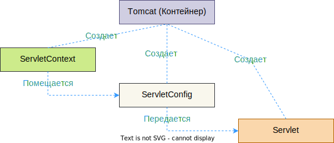

# Сервлеты, контейнеры сервлетов, фильтры

## Сервлеты

*Сервлет* (Http-сервлет в данном случае), если опустить детали и оставить самую суть, - это объект, в который мы можем поместить логику обработки Http-запроса. Сервлеты работают под управлением *контейнера сервлетов* и когда приходит запрос, контейнер по url понимает, какой сервлет нужно вызвать для его обработки.

## Контейнер сервлетов

Это программа, которая управляет жизненным циклом сервлетов: создает их, вызывает их методы, создает потоки для обработки поступающих запросов и много чего еще (например, из Http-запроса создает программные объекты запроса и ответа, передает их сервлету; читает конфиг приложения и по нему создает объект контекста). Одним словом, контейнер сервлетов формирует среду, необходимую для работы сервлетов.

Одним из самых популярных контейнеров сервлетов является Tomcat. Контейнер сервлетов и веб-сервер - разные вещи. Запрос, в общих чертах, проходит такой путь:

```
Клиент > Веб-сервер > Контейнер сервлетов > Сервлет > Контейнер сервлетов > Веб сервер > Клиент
```

Т.е. идет от клиента до сервлета и обратно. Контейнер берет на себя заботу о преобразовании этого запроса в объекты удобного вида, чтобы нам было комфортно с ними работать в сервлетах.

> Немного дополнительной информации: есть так называемая Java EE (которая в данный момент переименована в Jakarta EE). Это "спецификация серверной платформы" - набор API, которым должна обладать гипотетическая реализация, чтобы построить супер-пупер-крутое-и-сложное веб-приложение. В эту спецификацию входят много других спецификаций, например, транзакции, валидация, хранение и остальные непонятные технологии (см. википедию). Примером конкретной реализации Java EE является Glassfish - это *сервер приложений* (application server). Т.е. предполагается, что сервер приложений реализует все спецификации.
>
> Среди этой кучи спецификаций, составляющих сервер приложений, есть *спецификация сервлетов* - компонентов, предназначенных для обработки http-запросов. Так вот *контейнером сервлетов* называется программа, которая реализует только спецификацию сервлетов.

## Фильтры

Фильтры - это компоненты, которые предназначены для обработки запроса *до того*, как запрос попадет в сервлет. Также они могут обрабатывать ответ от сервлета до того, как этот ответ уйдет клиенту. Фильтры можно объединять в цепочку и таким образом конфигурировать набор действий, который поможет выполнить дополнительные вещи, вроде аутентификации, логирования и чего угодно. Нет фильтров только "до" или только "после" - запрос проходит каждый фильтр дважды - на пути "туда" и на пути "обратно". А будет ли он что-либо делать с объектом запроса или объектом ответа - уже зависит от программиста.

Фильтры тоже управляются контейнером сервлетов.

# Архитектура вкратце

## Сервлеты

### Общая картина

В общих чертах, если отбросить детали, картина такова: у нас может быть много сервлетов, вместе формирующих "приложение". У каждого из них могут быть свои *собственные* "параметры", которые не доступны другим сервлетам, а также *общие* "параметры", которые наоборот - доступны всем сервлетам, относящимся к одному приложению. "Собственные" называются *конфиг*, а "общие" - *контекст*.

И конфиг, и контекст являются объектами, которые создает контейнер сервлетов. Контекст создается при старте приложения сразу, а конфиг создается при создании сервлета. В зависимости от настроек контейнера, сервлеты тоже могут создаваться либо сразу при старте приложения, либо при первом реальном обращении к сервлету. В любом случае, контейнер помещает ссылку на контекст в конфиг и когда отдает конфиг сервлету, то таким образом сервлет получает доступ к контексту.

Конфиг по своей природе неизменяемый и служит только для начальной инициализации сервлета. А вот контекст изменяться может.



На картинке ниже синим - интерфейсы, красным - абстрактные классы:


### ServletConfig

Конфиг представлен интерфейсом [ServletConfig](https://docs.oracle.com/javaee/7/api/javax/servlet/ServletConfig.html). Когда контейнер создает сервлет, он:

* Сперва считывает параметры из xml или аннотаций и формирует объект конфига
* Создает объект сервлета с помощью конструктора
* Передает сервлету его конфиг через параметризованную версию метода `.init(ServletConfig)`

Изменить этот конфиг или как-то "перечитать" обновленные значения параметров нельзя - для этого нужно перезапускать сервлет целиком. Но ServletConfig и не предназначен для хранения каких-то часто изменяющихся значений. Это именно что-то конфигурационное плюс-минус стабильное.

### ServletContext

Контекст представлен интерфейсом `ServletContext` существует *один на все приложение*, т.е. все сервлеты получают один и тот же `ServletContext` (так что его можно воспринимать как некий ApplicationContext). Контекст *не потокобезопасный*.

Параметры контекста можно задать только через xml, через аннотации - нельзя. Сервлеты, относящиеся к разным приложениям, не видят контекст другого приложения.

Контейнер сервлетов создает ServletContext при запуске приложения. Затем при создании сервлета контейнер создает ServletConfig и помещает в него ссылку на ServletContext. Ну а дальше контейнер передает сервлету ServletConfig через метод init и таким образом ServletContext становится доступен сервлету.

TODO: Мб нарисовать это картинкой

TODO: Мб поискать в исходниках tomcat где он создает ServletContext? Когда с остальным разберусь. Просто ради интереса.

TODO: другие методы тоже выписать .getAttribute("database")

TODO: Про потокобезопасность атрибутов контекста и сессии еще предстоит выяснить, но позже, в специализированных конспектах.

TODO: все методы просмотреть, разобрать назначение и самые полезные сюда вписать


В основе лежит интерфейс [Servlet](https://docs.oracle.com/javaee/7/api/javax/servlet/Servlet.html). В нем 

Есть [абстрактный класс](https://docs.oracle.com/javaee/7/api/javax/servlet/http/HttpServlet.html) `HttpServlet`, реализующий интерфейсы `Servlet` и `ServletConfig`. У него есть метод `service(ServletRequest req, ServletResponse res)`, доставшийся от Servlet'а, как видно с двумя параметрами - под [запрос](https://docs.oracle.com/javaee/7/api/javax/servlet/ServletRequest.html) и под [ответ](https://docs.oracle.com/javaee/7/api/javax/servlet/ServletResponse.html). Кроме того у HttpServlet есть свои методы doPost, doGet, doDelete, doPut, в общем, по имени основных типов запросов. У метода service есть дефолтная реализация, которая на основании типа запроса вызывает соответствующий метод. Если запрос get - тогда вызывает метод doGet, если post - тогда doPost. Мы можем переопределить эти doN методы, чтобы на каждый тип запроса реагировать отдельно. На какие-нибудь новые модные запросы вроде Patch метода может не быть. Тогда можно переопределить сам метод service, вызвать дефолтную реализацию, а дальше подписать уже недостающие остатки.

Контейнер сервлетов получает запрос, создает объекты под запрос и ответ и передает эти объекты в метод сервлета. Там мы из объекта запроса читаем информацию, что-то вычисляем и записываем ответ в объект ответа. Контейнер преобразует объект ответа в Http-ответ, передает его веб-серверу, а он уже передает обратно клиенту.

Где-то в этой цепочке присутствует создание нового потока для обработки запроса, создание самого объекта сервлета, передача туда объектов запроса и ответа и т.д. Но концептуально это все не важно. Важно только то, что запрос в удобном виде в итоге попадает в метод нужного сервлета.

TODO: ??? Потом возможно догуглить до полного прояснения ситуации и расписать точно, как это еще и технически работает:

TODO: Про интерфейсы объектов запроса и ответа HttlServletRequest и HttpServletResponse

Впрочем, несмотря на не важность конкретики технических деталей, важно понимать вот что:

* Каждый запрос клиента выполняется в отдельном треде. Тред или создается новый или берется из пула.
* Несмотря на много тредов, существует только один объект сервлета.
* У каждого запроса свои объекты запроса и ответа.
* Объекты сервлетов могут создаваться как при запуске контейнера, так и при первом обращении. Зависит от настроек самого контейнера.

### Жизненный цикл сервлета

Примерно таков:

* Сервлет еще не существует
* Сервлет находится в процессе инициализации (выполняется сначала конструктор, а потом метод `.init`)
* Сервлет инициализирован (initialized)
* Сервлет находится в процессе уничтожения (выполняется метод `.destroy`)

После выполнения конструктора объект еще не является сервлетом, потому что пока не получил объекты `ServletConfig` и `ServletContext`. Их он получает в процессе выполнения метода `.init`. В конструкторах рекомендуется ничего не писать, а всю начальную настройку, если она нужна, делать именно в init.


### Метод .init

TODO: Мб нарисовать это картинкой тоже

Этот метод изначально определен в интерфейсе `jakarta.servlet.Servlet` и выглядит так:

```java
public void init(ServletConfig config) throws ServletException;
```

Далее у нас есть абстрактный класс GenericServlet, который выглядит так:

```java
@Override
public void init(ServletConfig config) throws ServletException {
    this.config = config;
    this.init();
}

public void init() throws ServletException {
    // Здесь действительно ничего нет, метод без кода
}
```

Т.е. он добавляет еще один метод init без параметров и вызывает его в параметризованном после установки конфига. Сделано это для удобства - мы можем переопределить метод init() и таким образом дополнить исходный init(ServletConfig) своими собственными установками. Контейнер сервлетов вызывает init(ServletConfig), а стало быть и наш init() тоже выполнится.

Далее В HttpServlet (наследник GenericServlet'а) дела обстоят вот так:

```java
@Override
public void init(ServletConfig config) throws ServletException {
    super.init(config);  // <-- Использует реализацию родителя
    legacyHeadHandling = Boolean.parseBoolean(config.getInitParameter(LEGACY_DO_HEAD));
}

// init() нету вообще
```

Наши собственные рукописные сервлеты как правило являются наследниками именно HttpServlet, а значит через  переопределение init() мы получаем возможность *дополнить исходную* инициализацию своим кодом (по схеме выше) и не бояться нарушить ее.


TODO: ??? Сделать норм примеры на то, что можно получить из объекта запроса и ответа.

TODO: Приделать второй сервлет и через контекст обменяться данными. Более детально посмотреть как контекст и конфиг связаны - как будто ссылка на контекст кладется в конфиг и т.о. сервлет получает контекст. При этом к контексту можно обратиться через метод самого сервлета. Посмотреть, как это устроено - возможно обертка, внутри которой обращение к конфигу, а оттуда к контексту.

TODO: Еще бы про JSP сам сделать. Какую-нибудь простую страницу и вообще понять место JSP во всей этой схеме.

## Listener'ы

Обычно фреймворкоподобные программы предоставляют нам *систему событий*, чтобы мы могли в нужные моменты "вклиниться" в работу фреймворка и что-то сделать. Например, было бы полезно создать соединение с БД и положить его в ServletContext, чтобы все сервлеты приложения могли обращаться к БД.

Вопрос в том, *где* и *в какой момент* мы можем создать этот объект соединения, ведь мы не управляем контейнером. И вот для таких целей в спецификации сервлетов определены интерфейсы *слухачей*, на все случаи жизни. Мы пишем слухача, отдаем его контейнеру и он в нужный момент вызывает метод слухача, передавая туда интересующие нас данные.

В данном случае нам нужен слухач с интерфейсом `ServletContextListener`. У него метод `contextInitialized(ServletContextEvent event)`. Когда ServletContext прошел инициализацию, контейнер вызывает этот метод и передает туда контекст. Так что если мы, например, разместим в конфиге строку соединения, то сможем в методе слухача прочитать ее из контекста, создать объект соединения и тут же положить его в контекст. Соответственно, после этого все сервлеты смогут брать соединения из контекста.

Конкретный пример будет дальше. Вот список интерфейсов слухачей из спецификации:

```
AsyncListener
HttpSessionActivationListener
HttpSessionAttributeListener
HttpSessionBindingListener
HttpSessionIdListener
HttpSessionListener
ReadListener
ServletContextAttributeListener
ServletContextListener
ServletRequestAttributeListener
ServletRequestListener
WebListener
WriteListener
```

## Фильтры

С фильтрами связаны интерфейсы, Filter и HttpFilter. Основные методы init, doFilter(ServletRequest, ServletResponce, FilterChain), destroy. Еще есть интерфейс FilterChain - он нужен для организации фильтров в цепочку. Поскольку фильтры самостоятельные сущности и не знают ничего о других фильтрах, кто-то должен управлять порядком их вызова. Вот для этого FilterChain и нужно.

TODO: написать получше про методы

Цепочка всегда заканчивается сервлетом или JSP. TODO: Выяснить, сервлет прямо как-то вставляется в цепочку или это образное выражение и сервлет идет отдельно.

TODO: Написать про Filter и HttpFilter, показать отличия

# Tomcat

## Установка

Для установки Tomcat нужно просто [скачать zip-архив](https://tomcat.apache.org/) и распаковать его в удобное место. Например, [девятая версия](https://tomcat.apache.org/download-90.cgi).

## Запуск и остановка

Для запуска\остановки открываем консоль, переходим в `tomcat/bin` и вызываем `startup` \ `shutdown`.

После успешного запуска на `localhost:8080/` должна быть страница приветствия.

## Деплой приложения

Чтобы развернуть приложение, достаточно скомпилировать его в .war-архив и положить этот архив в папку `tomcat\webapps`. Останавливать томкэт не надо - он автоматически видит изменения. После этого приложение становится доступно по адресу

```
localhost:8080/appname
```

Т.е. если файл приложения называется servlet-1.war, то оно будет доступно по адресу `localhost:8080/servlet-1`

## Логи tomcat

Если вдруг что-то пошло не так, логи можно посмотреть в папке `tomcat\logs`, файлы называются catalina.2022-05-18.txt по дате логирования.

# Зависимости

Используем maven проект. Для компиляции нам понадобится зависимость, содержащая классы сервлетов. Но поскольку мы будем деплоить на Tomcat, который в своем составе имеет эту зависимость, то скоуп поставим provided:

```xml
<dependency>
      <groupId>jakarta.platform</groupId>
      <artifactId>jakarta.jakartaee-api</artifactId>
      <version>8.0.0</version>
      <scope>provided</scope>
</dependency>
```

Можно использовать старую зависимость:

```xml
<dependency>
    <groupId>javax</groupId>
    <artifactId>javaee-api</artifactId>
    <version>7.0</version>
    <scope>provided</scope>
</dependency>
```

Чтобы развернуть программу на Tomcat, мы должны упаковать ее в war. Для этого в pom рядом с описанием проекта добавим вид упаковки war с помощью тега <packaging>:

```xml
<groupId>johny.dotsville</groupId>
<artifactId>my-servlet</artifactId>
<version>1</version>
<packaging>war</packaging>
```

и подключим плагин, который собственно и занимается упаковкой (если уже есть другой плагин для упаковки, надо его убрать):

```xml
<plugin>
    <groupId>org.apache.maven.plugins</groupId>
    <artifactId>maven-war-plugin</artifactId>
    <version>3.3.2</version>
    <configuration>
    	<failOnMissingWebXml>false</failOnMissingWebXml>
        <outputDirectory>C:/tmp</outputDirectory>  <!-- Если хотим в какое-то свое место класть архив -->
    </configuration>
</plugin>
```

# Простой сервлет

## Класс сервлета

Создадим вот такой класс сервлета (создание и настройку логгера смотри в отдельном мануале):

```java
import javax.servlet.ServletException;
import javax.servlet.annotation.WebServlet;
import javax.servlet.http.HttpServlet;
import javax.servlet.http.HttpServletRequest;
import javax.servlet.http.HttpServletResponse;
import java.io.IOException;

import org.apache.logging.log4j.Logger;
import org.apache.logging.log4j.LogManager;

// name должен быть уникален среди других сервлетов программы
@WebServlet(
    name = "bar",
    urlPatterns = { "/bar" },
    initParams = {
            @WebInitParam(name = "developer", value = "JohNy Dotsville", description = "hello"),
            @WebInitParam(name = "email", value = "come.as@you.are", description = "world")
    }
)
public class BarServlet extends HttpServlet {
    private static final Logger logger = LogManager.getLogger();
    private String message;
    
    @Override
    protected void doGet(HttpServletRequest req, HttpServletResponse resp)
            throws ServletException, IOException {
        logger.info("Работает сервлет BarServlet");
        logger.info("Выполняем метод doGet");
        resp.getWriter().println(String.format("Developer: %s (%s)\nLocation: %s, %s\n%s",
                // Персональные параметры сервлета
                getServletConfig().getInitParameter("developer"),
                getServletConfig().getInitParameter("email"),
                // Глобальные параметры приложения
                getServletContext().getInitParameter("country"),
                getServletContext().getInitParameter("city"),
                // Демонстрируем, что наше дополнение к инициализации работает
                message));
    }
    
    @Override
    public void init() {
        // Расширяем базовую инициализацию чем-то своим
        message = "This message set inside init() method of servlet";
    }
}
```

Собственно все. Благодаря аннотации `@WebServlet` томкэт сможет обнаружить наш сервлет и использовать его для обработки GET-запросов, приходящих по адресу `localhost:8080/my-servlet/bar`:

* my-servlet - потому что мы упаковали программу в war-архив именно с таким именем
* bar - потому что это указано в параметре urlPatterns аннотации @WebServlet

Мы можем создать много подобных сервлетов в одной программе, по сервлету на каждый url например и все они будут нормально работать под управлением контейнера сервлетов. В получившейся программе не нужен метод main, потому что программа сама по себе ничего не делает, она просто описывает сервлеты.

TODO: Про writer в ответе бы еще почитать.

## Конфиг через xml

Настраивать сервлеты можно через xml. Для этого:

* Если это maven-проект, то в директории main создаем директорию `webapp\WEB-INF`
* Кладем туда файл `web.xml`

```xml
<?xml version="1.0" encoding="UTF-8"?>
<web-app xmlns="http://xmlns.jcp.org/xml/ns/javaee"
         xmlns:xsi="http://www.w3.org/2001/XMLSchema-instance"
         xsi:schemaLocation="http://xmlns.jcp.org/xml/ns/javaee
                      http://xmlns.jcp.org/xml/ns/javaee/web-app_4_0.xsd"
         version="4.0">

    <servlet>
        <servlet-name>bar</servlet-name>
        <servlet-class>johny.dotsville.BarServlet</servlet-class>
        <init-param>
            <param-name>developer</param-name>
            <param-value>JohNy Dotsville</param-value>
            <description>Имя разработчика, ответственного за сервлет</description>
        </init-param>
        <init-param>
            <param-name>email</param-name>
            <param-value>come.as@you.are</param-value>
            <description>Почта разработчика, ответственного за сервлет</description>
        </init-param>
    </servlet>

    <servlet-mapping>
        <servlet-name>bar</servlet-name>
        <url-pattern>/bar</url-pattern>
    </servlet-mapping>

    <context-param>
        <param-name>country</param-name>
        <param-value>Russia</param-value>
        <description>Страна, в которой разработано приложение</description>
    </context-param>
    <context-param>
        <param-name>city</param-name>
        <param-value>Moscow</param-value>
        <description>Город, где расположен головной офис компании</description>
    </context-param>

</web-app>
```

Из плюсов такого подхода:

* Параметры находятся вне кода, поэтому можно просто открыть .war, поменять значение в xml файле, томкэт сам перезагрузит сервлет и новые значения окажутся в программе. В случае аннотаций так не получится.

Замечания:

* Можно смешивать конфиги через аннотации и xml (но по ощущениям лучше этого не делать, а писать все в xml). Например, чтобы вынести параметры сервлета в xml для гибкого изменения, мы можем сделать так:
  * Полноценно описываем сервлет в xml тегом servlet, указывая имя и класс, а также параметры
  * В аннотациях тоже указываем имя (должно совпадать с xml'ным) и url.
  * Получается, что в коде наглядно видно имя сервлета и url, а параметры лежат в xml и их можно легко менять после деплоя без необходимости перекомпилировать класс сервлета
  * Недостаток - необходимость два раза указывать одинаковое имя в разных местах
* Для context-параметров не существует способа задания через аннотации, только xml

# Простой слухач

## Класс слухача

Просто реализуем нужный интерфейс. Для сценария, описанного выше в теории, когда хотим положить объект соединения с БД в контекст, нам нужен интерфейс ServletContextListener:

```java
@WebListener  // Чтобы контейнер увидел слухача, используем аннотацию или xml-конфиг
public class MyServletContextListener implements ServletContextListener {
    @Override
    public void contextInitialized(ServletContextEvent event) {
        // Из события извлекаем контекст
        ServletContext context = event.getServletContext();
        // Получаем строку соединения из параметра
        String connectionString = context.getInitParameter("connection-string");
        // Создаем объект соединения
        DbDummy dbDummy = new DbDummy(connectionString);
        // И кладем это соединение в контекст
        context.setAttribute("database", dbDummy);
    }

    @Override
    public void contextDestroyed(ServletContextEvent event) {
        // Тут можно было бы например закрыть соединение или сделать что-то еще при необходимости
    }
}
```

Класс, имитирующий БД:

```java
public class DbDummy {
    private static final List<String> data = new ArrayList<>(List.of("tom", "huck", "sid", "mary"));
    private final String connectionString;

    public DbDummy(String connectionString) {
        this.connectionString = connectionString;
    }

    public List<String> getData() {
        if (connectionString.isEmpty()) {
            throw new RuntimeException("Database connection failed: connection string is undefined");
        }
        return data;
    }
}
```

## xml конфиг

Вносим параметр контекста со строкой соединения и регистрируем слухача (если вдруг не использовали аннотацию @WebListener):

```xml
...
    <context-param>
        <param-name>connection-string</param-name>
        <param-value>localhost:41337//databasedummy</param-value>
        <description>Представим, что это и правда строка соединения</description>
    </context-param>
...
	<listener>
        <listener-class>
            johny.dotsville.MyServletContextListener
        </listener-class>
    </listener>

</web-app>
```

## Использование в сервлете

В сервлете бесхитростно достаем нужный объект и пользуемся:

```java
public class BarServlet extends HttpServlet {
    ...
    @Override
    protected void doGet(HttpServletRequest req, HttpServletResponse resp)
            throws ServletException, IOException {
        // Извлекаем объект соединения, приводя его к нужному типу
        DbDummy db = (DbDummy) getServletContext().getAttribute("database");
        // ??? PROFIT! Пользуемся
        String result = String.join(", ", db.getData());

        resp.getWriter().println(String.format("Data: %s", result));
    }
    ...
}
```

# Простой фильтр

## Класс фильтра

Просто поместим в запрос сообщение, которое потом сможет прочитать сервлет:

```java
public class GreetHttpFilter extends HttpFilter {
    
    @Override
    protected void doFilter(HttpServletRequest req, HttpServletResponse res, FilterChain chain)
            throws IOException, ServletException {
        String fname = getClass().getSimpleName();  // GreetHttpFilter
        getServletContext().log(String.format("%s in action.", fname));

        req.setAttribute("greet-message", getFilterConfig().getInitParameter("message"));

        chain.doFilter(req, res);
    }
}
```

## Конфиг через xml

Необходимо:

* Каждый фильтр описать тегом `filter`. Назначение внутренних тегов очевидно. Если надо несколько параметров, просто используем несколько раз тег init-param.
* Для каждого фильтра с помощью тега `filter-mapping` задать, на что фильтр должен реагировать:
  * Через тег `filter-name` указываем имя фильтра, для которого пишется правило.
  * Через тег `url-pattern` задаем паттерн, при котором будет срабатывать фильтр. Либо через тег `servlet-name` *явно* указываем имя сервлета, на который должен срабатывать фильтр. Если фильтр должен срабатывать на несколько паттернов или сервлетов, то просто несколько раз используем соответствующий тег.

```xml
...
    <filter>
        <filter-name>greet</filter-name>
        <filter-class>johny.dotsville.filters.GreetHttpFilter</filter-class>
        <init-param>
            <param-name>message</param-name>
            <param-value>Hello! This is greet filter from xml!</param-value>
        </init-param>
    </filter>

    <filter-mapping>
        <filter-name>greet</filter-name>
        <!--<url-pattern>/*</url-pattern>-->
        <!--<url-pattern>/some/*</url-pattern>-->
        <servlet-name>bar</servlet-name>
        <servlet-name>foo</servlet-name>
    </filter-mapping>
...
</web-app>
```

## Через аннотации

```java
@WebFilter(
    filterName = "greet",
    urlPatterns = { "/*" },
    initParams = {
        @WebInitParam(name = "message", value = "Hello! This is greet filter!")
    })
public class GreetHttpFilter extends HttpFilter {
    ...
}
```

Проблема аннотаций в том, что с их помощью невозможно задать последовательность выполнения фильтров, потому что она определяется исключельно тем, в каком порядке идут теги `filter-mapping` в xml. Соответственно, придется все равно смешивать xml и аннотации, причем не самым очевидным образом, а поэтому лучше в случае фильтров все целиком делать в xml.

## Последовательность фильтров

Фильтры собираются в цепочку. Итоговая последовательность определяется так:

* Сначала обрабатываются фильтры, у которых задан url-pattern
  * Они собираются в последовательность так, в какой очереди идут в xml
* Потом обрабатываются фильтры, у которых задан servlet-name
  * Они тоже собираются в последовательность так, в какой очереди идут в xml
* Оба фрагмента цепочки соединяются вместе

Допустим, у нас такие фильтры (взято из книги Head First Servlets and JSP):

```xml
<filter-mapping>
    <filter-name>Filter1</filter-name>
    <url-pattern>/Recipes/*</url-pattern>
</filter-mapping>

<filter-mapping>
    <filter-name>Filter2</filter-name>
    <servlet-name>/Recipes/HopsList.do</servlet-name>
</filter-mapping>

<filter-mapping>
    <filter-name>Filter3</filter-name>
    <url-pattern>/Recipes/Add/*</url-pattern>
</filter-mapping>

<filter-mapping>
    <filter-name>Filter4</filter-name>
    <servlet-name>/Recipes/Modify/ModRecipes.do</servlet-name>
</filter-mapping>

<filter-mapping>
    <filter-name>Filter5</filter-name>
    <url-pattern>/*</url-pattern>
</filter-mapping>
```

Задача - понять, какая последовательность фильтров применится к каждому url:

```
/Recipes/HopsReport.do
/Recipes/HopsList.do
/Recipes/Modify/ModRecipes.do
/HopsList.do
/Recipes/Add/AddRecipes.do
```

Решение:

* Смотрим на url-pattern и servlet-name и осознаем, какие фильтры в принципе должны примениться к url
* По очередности описания фильтров в xml определяем последовательность применения фильтров

```
/Recipes/HopsReport.do
Сначала смотрим по url-pattern, подходит к паттерну f1 /Recipes/* и f5 /*
Значит фильтры 1, 5 подходят.
Поскольку в xml они идут в очередности 1, 5, то значит их порядок 1, 5
По servlet-name совпадений нет
> Значит итоговый порядок всех фильтров для этого url будет 1, 5

/Recipes/HopsList.do
Подходит к паттерну f1 /Recipes/* и f5 /* => 1, 5
Подходит под f2, потому что в нем сервлет вообще указан явно /Recipes/HopsList.do => 2
> Итого 1, 5, 2

/Recipes/Modify/ModRecipes.do
Подходит к паттерну f1 /Recipes/* и f5 /* => 1, 5
Сервлет явно указан в f4 /Recipes/Modify/ModRecipes.do => 4
> Итого 1, 5, 4

/HopsList.do
Подходит только под паттерн f5 /* => 5
Под сервлет /Recipes/HopsList.do не подходит, потому что не начинается с /Recipes
> Итого 5

/Recipes/Add/AddRecipes.do
Подходит под паттерн f1 /Recipes/* и f3 /Recipes/Add/* и f5 /* => 1, 3, 5
> Итого 1, 3, 5
```


# Некоторые термины

Не разбирал, но возможно полезно, просто оставлю тут список:

```
Deployment Descriptor (web.xml file)
```


# TODO

Когда читал про фильтры, там было что-то про dispatcher. Потом почитать, что это такое применительно к сервлетной теме.

```
You can have from 0 to 4 <dispatcher> elements.
é A REQUEST value activates the filter for client
requests. If no <dispatcher> element is present,
REQUEST is the default.
é An INCLUDE value activates the filter for request
dispatching from an include() call.
é A FORWARD value activates the filter for request
dispatching from a forward() call.
é An ERROR value activates the filter for resources
called by the error handler.
```

