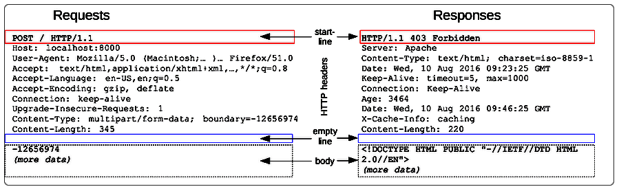

Что хотелось бы выяснить:

* Что такое Http-запрос в своей сущности?

  Это просто сложная строка или как?

* Почему адрес хоста находится в заголовках, а не в первой строке запроса?

* Что такое сериализация и как она выполняется?

* Что происходит с Http-запросом, когда он попадает в Tomcat?

  Из него просто извлекаются данные вроде типа запроса, параметров, тела, все это упаковывается в более удобный ответ и передается сервлету, или как?

* Что такое куки?

* Чем Https отличается от простого Http?

# Http

[История](https://developer.mozilla.org/ru/docs/Web/HTTP/Basics_of_HTTP/Evolution_of_HTTP) знает 4 версии протокола Http:

* 0.9 - Примерно 1990 год. Во времена ее использования собственно версии вообще не было, а 0.9 придумал уже потом, после выхода других версий, просто чтобы различать.
* 1.0 - 1996 год.
* 1.1 - 1999 год.
* 2.0 - 2015 год.

Кроме технических улучшений и оптимизаций, в версии 2.0 сам запрос перестал быть обычным текстом и приобрел двоичную форму. Так что теперь его просто так не почитать. Но по сути вот так примерно выглядит формат Http:

Итого 4 ключевых элемента:

* "Первая строка" - глагол, url и версия протокола

* Заголовки - дополнительная информация, помогающая обработать запрос.

  Например, Content-Length позволяет понять длину тела. Content-Type - собственно говоря, что в этом теле находится, например, json или xml или еще что-то.

  Host - интересный заголовок, содержит адрес и порт хоста, которому предназначен запрос. Вообще Http - это протокол прикладного уровня. Это значит, что когда отправляется Http-запрос, соединение уже установлено. Стало быть, хост и порт уже известны. Как так, зачем же тогда такой заголовок? Дело в том, что на одном хосте (понятие хост = сервер) могут располагаться несколько виртуальных хостов. Виртуализация может быть name-based и IP-based (отдельная тема). Вот для этого заголовок host и нужен. Запрос отправляется на сервер, где его принимает программа ("веб-сервер") и при использовании name-based виртуализации, по хосту из заголовка можно понять, какой именно программе дальше отослать запрос.

  Заголовок Host должен быть только один, иначе обычно возвращается код 400 (Bad Request). Если порт не указан, то для Http используется порт 80 по умолчанию, а для Https - 403.

* Пустая строка - служит признаком того, что после нее начинается тело (если тип запроса предполагает его наличие. Например, у GET нет тела, а у POST - есть)

* Тело - данные произвольной длины

