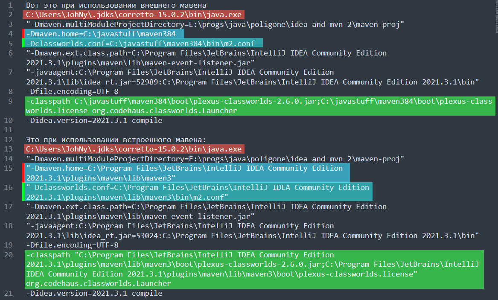

# Сочетания клавиш idea

## Автогенерация

* `Alt + Ins` - (или ПКМ > Generate в месте, куда надо вставить) меню для создания конструкторов, геттеров\сеттеров, автореализации toString() и прочего. Можно выбрать, для каких полей создавать, в общем, довольно наглядно и очень удобно.
* `sout` - набираем этот макрос для автонаписания System.out.println();
* `psvm` - макрос для автореализации метода public static void main(String[] args)


## Вид и форматирование кода

* `Alt + /` - закомментить\раскомментить блок кода
* `Ctrl + Shift + Up\Down` - поменять строки местами
* `Ctrl + Shift + +\-` - развернуть\свернуть все блоки кода
* `Ctrl + +\-` - развернуть\свернуть текущий блок кода


## Перемещение по коду

* `F2` - переход на следующую ошибку
* `Ctrl + ЛКМ имя класса\метода` - перейти к реализации класса\метода

# Настройки

## Подключение jar

*File > Project Structure > Libraries > + > Java*

Потом предложит выбрать проект, к которому надо подсоединить архив и в итоге он появляется в разделе External Libraries.

# Идея, Maven, JDK, JAVA_HOME

Почти каждая строчка этого раздела является критичной. Важно прочитать от А до Я и тогда вопросов не останется.

Внешний мавен - я буду называть так мавен, скачанный с сайта apache и распакованный в какую-нибудь директорию. Встроенный\идейный мавен - так я буду называть мавен, который "встроен" в идею.

Есть несколько базовых вещей, о которых стоит помнить:

* Идея не пользуется переменной окружения JAVA_HOME. Она ориентируется на свою опцию, определяющую какой JDK использовать.
* Следовательно, независимо от того, какой мавен вы используете в идее - внешний или встроенный, нужно отталкиваться от JDK, выставленного в идее.
* JAVA_HOME имеет значение только в том случае, если мавен используется вне идеи, т.е. просто через консоль.

Важно помнить о следующих вещах при экспериментах:

* При изменении значения JAVA_HOME требуется перезапускать консоль
* После успешной компиляции мавен не будет перекомпилировать проект, если исходный код не изменился. Поэтому после успешной компиляции и следующего изменения каких-то настроек мавена нужно внести в код изменения, чтобы он отработал.

Итак, поехали.

## Внешний или встроенный мавен?

Чтобы задать в идее, какой мавен она должна использовать, заходим сюда:

```
File > Settings > Build, Execution, Deployment > Build Tools > Maven, пункт Maven Home Path
```

Здесь выбираем: встроенный (Bundled Maven 3) или задаем путь до корневой папки внешнего мавена.

## Какую JDK использует идея?

Во-первых, посмотрим какие вообще JDK видит идея. Для этого заходим в:

```
File > Project Structure > Platform Settings > SDK
```

Здесь можно добавить новую JDK - либо скачать автоматически, либо указать путь до уже скачанной.

А чтобы непосредственно выбрать, какую JDK должна использовать идея, переходим в:

```
File > Project Structure > Project Settings > Project, Пункт SDK
```

Это и есть "идейная JAVA_HOME". Идея использует именно тот JDK, который указан здесь, и ей неважно, что именно стоит в JAVA_HOME. Причем это касается обоих мавенов - и внешнего, и идейного.

## Связь версии JDK в .pom и "JAVA_HOME"

Я буду писать "JAVA_HOME" в кавычках, имея ввиду как нормальную переменную окружения JAVA_HOME, так и идейную настройку JDK. В зависимости от контекста должно быть понятно, о какой именно идет речь.

Начнем с того, что оба мавена - и внешний, и встроенный, честно читают .pom файл проекта, здесь никаких хитростей нет.

Есть два способа задать версию JDK в pom файле:

1. ```xml
    <properties>
       <project.build.sourceEncoding>UTF-8</project.build.sourceEncoding>
       <maven.compiler.source>1.8</maven.compiler.source>
       <maven.compiler.target>1.8</maven.compiler.target>
     </properties>
   ```

2. ```xml
   <build>
     <pluginManagement>
       <plugins>
         <plugin>
           <artifactId>maven-compiler-plugin</artifactId>
           <version>3.8.0</version>
           <configuration>
             <source>11</source>
             <target>11</target>
           </configuration>
         </plugin>
       </plugins>
     </pluginManagement>
   </build>
   ```

Второй способ надежнее, потому что в первом я не нашел как поставить что-то кроме 1.8. А вот во втором работает и 1.8, и 11, и 17, и все что хочешь.

Но задать версию в pom файле - это не все, что нужно сделать. Версия "JAVA_HOME" должна быть не меньше, чем указанная в pom, иначе не будет компилироваться.

## Language Level

Есть еще такое понятие как language level. Это когда открываешь идею, пишешь например var, а она говорит `Cannot resolve symbol 'var' Set language level to 10 - Local variable type interface`. При этом, если в pom стоит например 11 и "JAVA_HOME" тоже 11, то компилироваться через мавен будет нормально. То есть это именно ошибка в редакторе кода.

Уровень языка задается тут:

```
File > Project Structure > Project Settings > Modules, пункт Language Level
```

Но это настройка только для редактора кода. Если при этом в pom и "JAVA_HOME" будет стоять версия 1.8, то в редакторе ошибки не будет, а мавен не скомпилирует.

## Отличия внешнего и встроенного мавена

Вот скриншот фактической команды сборки, которую генерирует идея при использовании внешнего и встроенного мавенов:



* Видно, что в обоих случаях используется "идейная" JDK. Т.е. не важно, что стоит в виндовой JAVA_HOME - идея использует JDK согласно своей настройке, как я писал выше.
* Мавен честно используется либо встроенный, либо внешний.
* classpath разный

Видно, что используются разные файлы настроек m2.conf. Но в обоих одно и то же:

```
main is org.apache.maven.cli.MavenCli from plexus.core

set maven.conf default ${maven.home}/conf

[plexus.core]
load       ${maven.conf}/logging
optionally ${maven.home}/lib/ext/*.jar
load       ${maven.home}/lib/*.jar
```

С виду ничего серьезного, так что вероятно без каких-то серьезных правок внешнего мавена нет никакой разницы, какой мавен, внешний или внутренний, использовать в идее.

