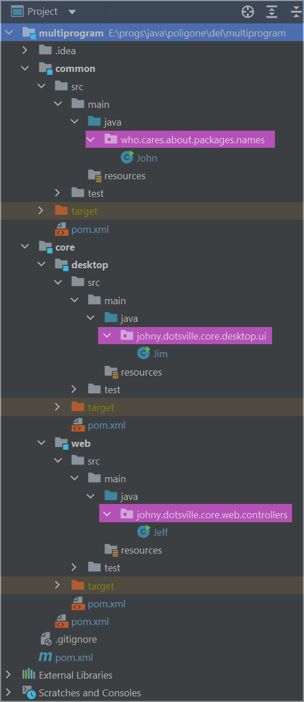

mvn dependency:tree    https://www.tutorialworks.com/maven-find-transitive-dependencies/

# Что такое Maven

Мэвин - это технология для билда проекта и управления зависимостями. В основе лежит идея "объектной модели проекта" (Project Object Model, POM). Управление проектом происходит в декларативном стиле, т.е. мы указываем, что хотим получить, а не что надо сделать.

# Установка

Заключается в простом скачивании бинарников и помещение пути до них в Path. Понадобится также и указать JAVA_HOME

* Качаем [отсюда](https://maven.apache.org/download.cgi) Binary zip archive из раздела Files

* Копируем папку из этого архива куда-нибудь поближе, в корень С например

* Добавляем в *Path* путь до `/bin` из этой папки

  *Пуск > Параметры > Система > О программе > Дополнительные параметры система > кнопка "Переменные среды"*

  В списке *"Системные переменные"* выбираем *Path*, жмем *"Изменить"*, добавляем путь

* Добавляем переменную *JAVA_HOME*

  Если используем идею, а не отдельные JDK, то заходим в идее в *File > Project Structure > Platform Settings | SDKs*, смотрим там путь в поле JDK home path (например *C:\Users\JohNy\.jdks\corretto-11.0.16.1*) и берем его для JAVA_HOME

# Локальный репозиторий

Находится в `C:\Users\JohNy\.m2` Сюда скачиваются все библиотеки. В случае каких-то проблем можно удалить все, чтобы мавен перезакачал.

# Создание проекта

Создать папку с проектом можно по шаблонам (архетипам), которые предоставляет мэвин. Список мэвин-архетипов можно посмотреть тут https://maven.apache.org/archetypes/index.html

Например, базовый проект создается так (все параметры пишутся в одну строку):

```
mvn
archetype:generate
-DarchetypeGroupId=org.apache.maven.archetypes
-DarchetypeArtifactId=maven-archetype-simple
-DarchetypeVersion=1.4
-DgroupId=home.johnydotsville
-DartifactId=hello-maven-1
-Dversion=7.7.7
```

Три пункта: groupId, artifactId и version указываются как для самого архетипа, так и для собственного приложения.

```
mvn archetype:generate -DarchetypeGroupId=org.apache.maven.archetypes -DarchetypeArtifactId=maven-archetype-simple -DarchetypeVersion=1.4 -DgroupId=com.samplegroup -DartifactId=some-demo -Dversion=7.7.7
```

## Настройка в Idea

Если вдруг открытый в Idea maven-проект не распознается именно как maven-проект (нет панели maven справа), нужно щелкнуть ПКМ по pom.xml в дереве проекта и выбрать пункт *Add as Maven project*.

# Структура проекта

Каждый архетип формирует свою структуру каталогов. Для сравнения можно посмотреть структуру [archetype-simple](https://maven.apache.org/archetypes/maven-archetype-simple/), [archetype-quickstart](https://maven.apache.org/archetypes/maven-archetype-quickstart/) и [archetype-j2eesimple](https://maven.apache.org/archetypes/maven-archetype-j2ee-simple/)

Описанная выше команда создаст такую структуру simple-проекта:

```
|-- hello-maven-1
    |-- pom.xml
    `-- src
        |-- main
        |   `-- java
        |       `-- home
        |           `-- johnydotsville
        |               `-- App.java
        |-- site
        |   `-- site.xml
        `-- test
            `-- java
                `-- home
        |           `-- johnydotsville
                        `-- AppTest.java
```


# Компиляция

Для компиляции нужно зайти в корень проекта (папка, где лежит pom.xml, на примере выше это hello-maven-1) и набрать команду:

```
mvn compiler:compile
```

При компиляции могут возникнуть такие ошибки (upd при использовании simple архетипа ошибки не было, а только в quickstart):

```
[ERROR] Source option 5 is no longer supported. Use 7 or later.
[ERROR] Target option 5 is no longer supported. Use 7 or later.
```

Фиксятся добавлением в pom раздела properties:

```
<properties>
    <maven.compiler.source>1.7</maven.compiler.source>
    <maven.compiler.target>1.7</maven.compiler.target>
</properties>
```

Есть еще команда

```
mvn package
```

Пока не читал особо, что она значит. Вроде компиляция с упаковкой в .jar

# Упаковка

## Имя без версии

Если мавен версии 3, можно явно указать конечное имя файла с помощью тега *finalName*:

```xml
<build>
    <finalName>webclient-demo</finalName>
    <plugins>
        <plugin>
            <groupId>org.springframework.boot</groupId>
...
```

Если версия мавена старая, то делается отдельным плагином:

```xml
<build>
    <plugins>
        <plugin>
            <groupId>org.apache.maven.plugins</groupId>
            <artifactId>maven-jar-plugin</artifactId>
            <version>2.3.2</version>
            <configuration>
                <finalName>webclient-demo</finalName>
            </configuration>
        </plugin>
        <plugin>
            <groupId>org.springframework.boot</groupId>
...
```


# Запуск

Команда запуска тоже запускается из корня проекта

```
mvn exec:java -Dexec.mainClass="home.johny.App"
```

# Зависимости

Определяются в .pom в разделе `dependencyManagement`, а непосредственно подключаются в отдельном разделе `dependencies`:

```xml
<project ...>
  ...
  <properties>
      <log4jversion>2.17.2</log4jversion>
  </properties>
  ...
  <dependencyManagment>
      <dependencies>
          <dependency>
              <groupId>org.apache.logging.log4j</groupId>
              <artifactId>log4j-core</artifactId>
              <version>${log4jversion}</version>  <!-- Используем свойство вместо цифры -->
              <scope>compile</scope>
          </dependency>
          <dependency>
              <groupId>org.apache.logging.log4j</groupId>
              <artifactId>log4j-api</artifactId>
              <version>${log4jversion}</version>  <!-- Используем свойство вместо цифры -->
              <scope>compile</scope>
          </dependency>
      </dependencies>
  </dependencyManagment>
  ...
  <dependencies>
	  <dependency>
          <groupId>org.apache.logging.log4j</groupId>
          <artifactId>log4j-core</artifactId>
      </dependency>
      <dependency>
          <groupId>org.apache.logging.log4j</groupId>
          <artifactId>log4j-api</artifactId>
      </dependency>
  </dependencies>
  ...
```

Тег dependencyManagement позволяет просто *заявить*, что в проекте используются такие-то зависимости с такими-то версиями, а непосредственно *подключать* (читай, "скачать и поместить в classpath") их *нужно* в теге dependencies. Использование комбинации этих тегов является хорошей практикой. Особенно хорошо это работает в мультимодульных проектах, т.к. в теге dependencies уже не нужно указывать версии и скоп (они берутся из dependencyManagement'а) и т.о. обеспечивается согласованность версий во всех подмодулях. Если же все-таки нужна особенная версия, ее можно указать непосредственно в dependencies и она перекроет общую.

После добавления зависимости и компиляции проекта, зависимости скачиваются в локальный репозиторий, который по умолчанию находится в директории `C:\Users\%username%\.m2` В папке *conf* мавена есть файл *settings.xml*. Там много чего можно задать, в частности расположение локального репозитория (тег *localRepository*).

В POM можно объявить свойство в разделе *Properties*, задать ему значение и использовать его по имени. Бывает удобно таким образом объявить, например, версию зависимости и использовать свойство в нескольких местах, вместо того чтобы везде писать конкретную цифру, т.к. бывает что зависимость делится на три части и версия во всех трех частях должна быть одинаковая.

## Виды зависимостей

Зависимости делятся на две общие группы:

* Прямые (direct) - это зависимости, которые мы явно указываем в разделе dependencies

* Транзитивные, "косвенные" (transitive) - это "зависимости зависимостей". Поскольку каждая используемая нами библиотека обычно и сама использует какие-то библиотеки, то получается что и наша программа тоже зависит от этих библиотек.

  Но зависеть может по-разному. Например, мы используем логгер. Разработчики логгера должны тестировать свой продукт и для этого они пользуются каким-нибудь непопулярным фреймворком Noname. Получается, что раз логгер зависит от Noname, то и мы зависим от Noname? Но мы же не пользуемся Noname, да и собственно логгеру Noname нужен только на время выполнения тестов, а при непосредственно работе - нет.

  Т.о., мы бы не хотели зависеть от Noname, чтобы дерево зависимостей не разрасталось. Поэтому существует механизм scope, который позволяет в таких случаях явно указать, когда именно нужна зависимость, чтобы не тащить ее тогда, когда она фактически не нужна.

## Classpath

Перед более детальным объяснением scope нужно вспомнить про *classpath*. Это параметр, в котором мы должны указать путь до классов, чтобы компилятор или виртуальная машина могли их найти. Что это за классы? Это пользовательские классы. К ним относятся наши собственные классы и классы сторонних библиотек. В общем все, что не относится к собственным классам джавы, о расположении которых она и сама знает.

Ключ classpath есть как у программы javac, так и у программы java. Т.е. получается, условно, два classpath - времени компиляции и времени выполнения. Причем они могут быть разными и это вполне естественно. Потому что если мы используем библиотеку A, которой нужна библиотека B, то для *компиляции нашей программы* нам нужно указать в classpath только путь до библиотеки А, т.к. мы используем ее классы напрямую. Но нам не нужно указывать путь до B, т.к. наш код непосредственно ее не трогает. А вот во *время выполнения нашей программы* мы должны указать в classpath путь и до А, и до B, т.к. когда библиотека А начнет работать, ей конечно же понадобятся классы библиотеки B.

> Еще есть "тестовый" (test) classpath вдобавок в двум вышеперечисленным. Он относится к запуску юнит-тестов. Он не нужен ни при компиляции, ни при выполнении.

Итого получается 3 classpath'а:

* complie
* test
* runtime

## Scope

Предисловие: как-то это невероятно сложно оказалось понять до конца. Повсюду копипаста с почти одним и тем же объяснением, которое не понятное. Поэтому я не могу гарантировать, что все написанное ниже правильно до конца.

Вкратце, скоп нужен для двух основных вещей:

* Чтобы не тянуть лишние (реально не нужные нашей программе) транзитивные зависимости
* Чтобы не засорять classpath зависимостями, которые на определенном шаге не нужны, и таким образом не замедлять поиск классов

Скопов 6, из которых основных 4:

* compile
* provided
* runtime
* test

Как я писал выше, есть "разные classpath'ы", в которых требуется указывать пути до зависимостей. Вот первое назначение scope как раз к этому и относится - добавить зависимость в нужный момент (в нужную *фазу*) в нужный classpath. compile означает, что мавен добавит зависимость в classpath при компиляции, тесте и запуске. У мавена есть запускатор и плагины для запуска. 

Второе назначение scope - ограничить "подтягивание" транзитивных зависимостей в программу. Грубо говоря: я пишу библиотеку, для тестов использую Noname фреймворк и объявляю ему скоп test у себя в pom. Это значит, что если кто-то подключит мою библиотеку, он не получит в довесок еще и этот Noname фреймворк, т.е. мавен поймет по этому значению скопа, что Noname нужен был моей библиотеке только для тестов, а для работы не нужен. Значит и пользователю моей библиотеки он не нужен. А вот если бы я написал скоп compile вместо test для Noname, тогда бы и пользователь моей библиотеки стал бы зависимым от Noname, потому что это бы означало, что он нужен моей библиотеке для работы, а значит если кто-то хочет пользоваться моей библиотекой, значит ему понадобится все, что нужно ей. Поэтому еще говорят, что test - это не транзитивный скоп, а compile - транзитивный, т.к. в первом случае test-зависимость косвенно не переносится на пользователя, а во втором - переносится. За остальные скопы говорить сложно, я не понимаю описание.

Резюмируя вышесказанное:

| scope    | в какой classpath добавляется? | как подтягивает транзитивные зависимости?                    |
| -------- | ------------------------------ | ------------------------------------------------------------ |
| compile  | compile, test, runtime         | compile as compile, runtime > runtime, test > x, provided > x |
| provided | compe, test                    | compile > provided, runtime > provided, test > x, provided > x |
| runtime  | test, runtime                  | compile > runtime, runtime > runtime, test > x, provided > x |
| test     | test                           | compile > test, runtime > test, test > x, provided > x       |

Третий столбец означает следующее: я пишу библиотеку, у меня есть зависимость Important, я даю ей скоп compile. Вася подключает мою библиотеку, дает ей скоп runtime и при этом для Васи моя зависимость Important получает скоп не compile, а runtime. Т.е. каждый скоп предполагает либо обрезку каких-то транзитивных зависимостей, либо их подтягивание с возможным изменением скопа. Как видно, все скопы предполагают игнорирование test- и provided- транзитивных зависимостей, а подтягивание только compile- и runtime-зависимостей. При этом compile тянет их без изменения, а provided, runtime и test превращают их в себя.

Короче говоря, тема невероятно мутная. Ну просто очень много каких-то недомолвок. Самое главное, что как-то проверить это, я не знаю как. Хорошо видно влияние некоторых скопов только при упаковке в исполнимый jar. В некоторых случаях зависимости включаются в итоговый артефакт, в некоторых - нет. Так что конечный вывод я могу сделать только исходя из умозрительных нужд:

* compile - ставим когда напрямую пользуемся классами библиотеки
* provided - когда пользуемся классами библиотеки + предполагаем, что эту библиотеку предоставит "запускатор" нашей программы. Типичный случай - когда пишем веб-приложение, которое будет крутиться на веб-сервере и соответственно у него эта библиотека есть
* runtime - не используем вообще этот скоп
* test - используем для библиотек, которые используются только в юнит-тестах

# Отладка

При запуске maven-проекта из консоли, можно через IDEA подключиться к процессу для отладки.

В maven уже есть дебаггер. Для его запуска надо вместо mvn набирать mvnDebug, например:

```java
mvnDebug exec:java -Dexec.mainClass="com.company.App"
```

При этом появится сообщение, что отладка запустилась на порте 8000.

В IDEA выполним немного настроек. Рядом с молотком есть пункт *AddConfiguration*:

1. Add Configuration  > Add new > Remote JVM Debug
2. Ввести имя, Host по умолчанию localhost, port поставить 8000

Дальше как обычная отладка - нажать жука и дебажить. Для повторной отладки нужно снова будет запустить ее через консоль.


# Подпроекты

Мавен позволяет вкладывать проекты друг в друга. Вложенность не ограничена, т.е. в проект мы можем вложить несколько проектов, а в каждый из них - еще несколько.

Пусть у нас будет такая вложенность проектов:

```xml
multiprogram
|---common
|---core
    |---web
    |---desktop
```

По задумке модули web и desktop используют некий общий функционал, размещенный в модуле common.

В идее мавен модули добавляются через File > New > Module. Нужно будет задать имя модуля и выбрать его родителя. Иерархия выглядит примерно так, папки модулей легко отличить по голубому квадрату:



Скрин максимально длинный для большей информативности. Вот pom файлы модулей (объяснения в конце):

multiprogram pom :

```xml
<groupId>johny.dotsville</groupId>
<artifactId>jd-multiprogram</artifactId>
<version>1.0-SNAPSHOT</version>

<packaging>pom</packaging>
<name>Multiprogram root</name>
<description>How to create maven multi-module project</description>

<modules>
    <module>common</module>
    <module>core</module>
</modules>

<properties>
    <maven.compiler.source>11</maven.compiler.source>
    <maven.compiler.target>11</maven.compiler.target>
</properties>
```

common pom:

```xml
<parent>
    <artifactId>jd-multiprogram</artifactId>
    <groupId>johny.dotsville</groupId>
    <version>1.0-SNAPSHOT</version>
</parent>
<modelVersion>4.0.0</modelVersion>

<artifactId>jd-common</artifactId>
<packaging>jar</packaging>
<name>Common</name>
<description>Functional used by other modules</description>

<properties>
    <maven.compiler.source>11</maven.compiler.source>
    <maven.compiler.target>11</maven.compiler.target>
</properties>
```

core pom:

```xml
<parent>
    <artifactId>jd-multiprogram</artifactId>
    <groupId>johny.dotsville</groupId>
    <version>1.0-SNAPSHOT</version>
</parent>
<modelVersion>4.0.0</modelVersion>

<artifactId>jd-core</artifactId>
<packaging>pom</packaging>
<name>Core</name>
<description>Application busyness-logic</description>

<modules>
    <module>web</module>
    <module>desktop</module>
</modules>

<properties>
    <maven.compiler.source>11</maven.compiler.source>
    <maven.compiler.target>11</maven.compiler.target>
</properties>
```

web pom:

```xml
<parent>
    <artifactId>jd-core</artifactId>
    <groupId>johny.dotsville</groupId>
    <version>1.0-SNAPSHOT</version>
</parent>
<modelVersion>4.0.0</modelVersion>

<artifactId>jd-web</artifactId>
<packaging>jar</packaging>
<name>Core web</name>
<description>Web-specific part of core</description>

<dependencies>
    <dependency>
        <groupId>johny.dotsville</groupId>
        <artifactId>jd-common</artifactId>
        <version>1.0-SNAPSHOT</version>
    </dependency>
</dependencies>

<properties>
    <maven.compiler.source>11</maven.compiler.source>
    <maven.compiler.target>11</maven.compiler.target>
</properties>
```

desktop pom:

```xml
<parent>
    <artifactId>jd-core</artifactId>
    <groupId>johny.dotsville</groupId>
    <version>1.0-SNAPSHOT</version>
</parent>
<modelVersion>4.0.0</modelVersion>

<artifactId>jd-desktop</artifactId>
<packaging>jar</packaging>
<name>Core desktop</name>
<description>Desktop-specific part of core</description>

<dependencies>
    <dependency>
        <groupId>johny.dotsville</groupId>
        <artifactId>jd-common</artifactId>
        <version>1.0-SNAPSHOT</version>
    </dependency>
</dependencies>

<properties>
    <maven.compiler.source>11</maven.compiler.source>
    <maven.compiler.target>11</maven.compiler.target>
</properties>
```

Из важных вещей есть следующее:

* В "родителях" указываются вложенные модули (тег module), а у "детей" указывается родитель (тег parent).

  > Очень важно: при перечислении вложенных модулей в разделе modules нужно указывать имя *папки*, в которой лежит модуль, а не имя артефакта.

* В родителях нет никакого кода, поэтому отсутствует папка src. Они нужны исключительно для агрегации подмодулей и поэтому у родителя в pom указан тип packaging = pom, а у детей jar или war.

* У детей такой же groupId, как у родителя, поэтому groupId в детях не указывается.

* Именование пакетов\модулей\артефактов следует таким принципам:
  * Имя артефакта (artifactId) не связано с именем папки модуля. Поэтому у всех артефактов из примера есть префикс *jd-* в имени, хотя папки этого префикса не имеют. Сделано исключительно для демонстрации, что папки и имена не связаны, но вообще лучше называть нормально.
  * Тег name задает человекочитаемое имя артефакта и используется, например, идеей в разделе мавена вместо имен артефактов исключительно для красоты.
  * Пакеты можно называть как угодно, их имена никак не связаны с именами артефактов и модулей. Видно на примере пакета из модуля common на скрине. Но конечно для удобства лучше их называть по groupId + имя модуля, как показано на скрине в случае модулей web и desktop.
  
* Чтобы один модуль мог использовать другой модуль, важно выполнить clean + install корневого модуля, чтобы все модули попали в локальный репозиторий. И не забывать указывать версии. И вызвать *File > Invalidate Caches*, если вдруг идея не видит пакеты из подключенных модулей.

  После инсталляции в локальном репозитории родительские модули будут выглядеть просто как папки с pom-файлами.

* Легенды гласят, что можно использовать разные компиляторы для модулей. Но с этим я не разбирался еще.


# Терминология

► **POM** 

Project Obect Model - Объектная Модель Проекта. pom.xml - это основной файл конфигурации мэвин-проекта, которые содержит всю информацию, необходимую для сборки (build) проекта. Директория, в которой он лежит, является корнем проекта. В этом файле содержится список зависимостей, а также информация о проекте (его название, версия и groupId, пока хз что это такое) и другие настройки.

► **Artifact (Артефакт)**

В документации написано "An artifact is something that is either produced or used by a project. Examples of artifacts produced by Maven for a project include: JARs, source and binary distributions, WARs." "Нечто, что получается из проекта или используется проектом". Пока буду думать об артефакте как о .net-сборке. Потом думаю прояснится.

► **Phase, Goal (фаза, цель)**

мэвин разбивает процесс сборки проекта на "фазы", например вот такая цепочка:

```
validate > compile > test > package > verify > install > deploy (это все фазы)
```

А каждая фаза, в свою очередь, может состоять из нескольких "целей". Цели выполняют конкретные действия, в то время как фазы являются скорее логическими блоками для группировки целей. Вся эта схема образует Build Lifecycle. Есть несколько готовых BL'ов: default, clean, site. Из чего они состоят, можно посмотреть на офф сайте мэвина.


# Вопросы

## Как надежно настроить компиляцию из одной версии в другую?

И зачем вообще это нужно? Имеются ввиду опции компилятора:

```xml
<project>
    [...]
    <properties>
        <maven.compiler.source>1.8</maven.compiler.source>
        <maven.compiler.target>1.8</maven.compiler.target>
    </properties>
    [...]
</project>
```

```xml
<project>
    [...]
    <build>
        [...]
        <plugins>
            <plugin>
                <groupId>org.apache.maven.plugins</groupId>
                <artifactId>maven-compiler-plugin</artifactId>
                <version>3.10.1</version>
                <configuration>
                    <source>1.8</source>
                    <target>1.8</target>
                </configuration>
            </plugin>
        </plugins>
        [...]
    </build>
    [...]
</project>
```

Вот тут же и написано https://maven.apache.org/plugins/maven-compiler-plugin/examples/set-compiler-source-and-target.html что надежность хромает.

И в чем вообще прикол? Я могу что ли писать на java 17, а компилировать так, чтобы работало на java 8 или что?


# Мини заметки

* SNAPSHOT в версии означает, что эта версия в разработке. Т.е. есть например версия 1.1.0, то сразу понятно, что она доработана. А если 1.1.0-SNAPSHOT, то значит она еще в разработке.
* В папке мавена conf есть файл settings.xml. Там много чего можно задать, в частности расположение локального репозитория (тег *localRepository*). По умолчанию он находится в папке пользователя, в скрытой директории .m2
* Репозитории бывают:
  * Локальный
  * Корпоративный
  * Центральный

# Черновик

# Модульность, подпроекты

Пара интересных вещей:

* В родительском поме могут быть перечислены модули, но при этом в этих модулях может не быть указан это родитель. И наоборот - в родительском поме могут быть не указаны некоторые модули, но в этих модулях может быть указан этот родитель.
* Если мы указываем зависимости в родительском поме, это не значит, что их не надо указывать в подмодулях. Надо. Можно не указывать в подмодуле версию, тогда она унаследуется от родителя. А можно указать, тогда она переопределится в подмодуле.

# Сборка

## Сборка, фазы сборки

> Мавен базируется на концепции "жизненного цикла процесса сборки" (build lifecycle), который состоит из фаз (phases).

Сборка (build) - это процесс получения артефакта из исходного кода. "Артефакт" - это файл, например jar или war, он может быть запускаемой программой, библиотекой, плюс включать в себя разные дополнительные файлы (манифест, настройки и т.д.). Одним словом, конечный результат сборки может быть какой-то комплексной вещью и поэтому его называют не просто "программа", а отдельным термином "артефакт".

Процесс сборки разделяется на несколько этапов - в терминах мавена "фазы". Например, фаза компиляции, фаза запуска юнит-тестов, фаза упаковки скомпилированных файлов в какой-то определенный формат (например, в jar или war файл), фаза инсталляции (артефакт будет установлен в локальный репозиторий), фаза деплоя и т.д. Т.е. разных фаз довольно много. Все они представляют собой какие-то подзадачи, выполняемые в рамках сборки.

Комбинируя фазы, процесс сборки можно организовать по-разному. В мавене есть три готовых "шаблона" процесса сборки. Один из них называется *clean*, состоит из трех фаз: pre-clean, clean, post-clean. Как понятно из названия, предназначен для удаления результатов предыдущих запусков процесса сборки.

Другой шаблон называется *default* и состоит из следующих фаз (многие пропущены, выписаны некоторые просто для демонстрации): validate, compile, test, package, verify, install, deploy. Выполняются они последовательно. Можно выбрать одну фазу, и тогда выполнятся в том числе все, которые были до нее. Например, если вызвать package, то выполнятся validate, compile, test, package.

Можно запускать несколько фаз подряд, например:

```
mvn clean package
```

Некоторые фазы не принято запускать отдельно, например, pre-clean и прочие с подобные префиксами. Потому что они как правило содержат промежуточные результаты, бесполезные сами по себе, в отрыве от законченной фазы. Одним словом, сборка проекта организуется в весьма четкий процесс.

## Плагины, задачи и фазы

Сами фазы являются абстрактными шагами. Фактическая же реализация фаз содержится в *задачах плагинов*. Плагины содержат *задачи* (*goals*). Каждая задача может быть привязана к фазе и когда выполняется фаза, то выполняется и задача. Но можно выполнять задачу и отдельно. Если к фазе не привязано ни одной задачи, то фаза не выполняется (фаза ведь абстрактное понятие, а значит если к ней не привязано конкретных действий, то и выполнять нечего). К одной фазе можно привязать несколько задач, и выполняться они будут в том порядке, в каком указаны в POM.

??? Может быть надо scope указать для копирования файлов в артефакт?

??? Похоже дело было в том, что я добавил плагин в конец, а до этого шел maven-jar-plugin и мб он перетирал


