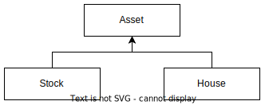

# Приведение ссылок, upcasting и downcasting

Ссылка - это "трафарет", который дает доступ к элементам, которые есть в типе ссылки. Ссылки можно трансформировать между типами потомка и родителя.

## Upcasting

Приведение "вверх", от частного к общему, от типа потомка к типу родителя. Как запомнить: иерархия наследования обычно изображается сверху вниз, где сверху - базовый класс, а снизу - потомок:



Соответственно, *up*-casting это движение вверх, т.е. от потомка к родителю.

Апкастинг проводится автоматически, неявно, для этого достаточно просто положить объект потомка в ссылку родителя:

```c#
Asset ass = new House() { 
    Name = "Castle",   // Свойство доступно через ссылку типа Asset
    Cost = 25_000_000  // Свойство не доступно, но присутствует
};
```

При этом через ссылку ass теперь будут доступны только те элементы, которые есть у типа Asset. Элементы типа House будут присутствовать в самом объекте, но через ссылку ass доступны не будут, потому что их нет в типе Asset:

```c#
Console.WriteLine(ass.Name);  // Ok
Console.WriteLine(ass.Cost);  // Ошибка!
```

## Downcasting

Приведение "вниз", от общего к частному, от родителя к потомку, проводится только явно и только в том случае, если по приводимой ссылке лежит объект правильного типа:

```c#
Asset ass = new House() { Name = "Castle", Cost = 25_000_000 };
House house = (House)ass;  // <-- Downcasting

Console.WriteLine(house.Name);  // Через ссылку "полного" типа оба свойства доступны
Console.WriteLine(house.Cost);
```

Поскольку в переменной Asset может лежать и другой потомок, например, типа Stock, то в этом случае в процессе выполнения программы мы получим исключение `System.InvalidCastException`:

```c#
Asset ass = new Stock() { Name = "Shares", SharesOwned = 1_000 };
House house = (House)ass; // Исключение: 'Unable to cast object of type 'MainAss.Inheritance.Stock' to type 'MainAss.Inheritance.House'.'
```

## Оператор as

Этот оператор выполняет даункаст и если не удается, возвращает null:

```c#
Asset assStock = new Stock() { Name = "Shares", SharesOwned = 1_000 };
Asset assHouse = new House() { Name = "Castle", Cost = 25_000_000 };

House house = assHouse as House;  // Ok
Console.WriteLine(house.Cost);  // 25_000_000

House house = assStock as House;  // null
Console.WriteLine(house.Cost);  // System.NullReferenceException
```

## Оператор is

Этот оператор проверяет, относится ли ссылка к указанному типу, и возвращает bool:

```c#
Asset ass = new House() { Name = "Castle", Cost = 25_000_000 };
if (ass is House)
{
    House h = (House)ass;  // Делаем даункаст, уже не боясь неправильного типа в ссылке
    Console.WriteLine(h.Cost);
} else if (ass is Stock) {
    Stock s = (Stock)ass;
    Console.WriteLine(s.SharesOwned);
}
```

Оператор позволяет ввести временную переменную, чтобы немного сократить код:

```c#
Asset ass = new House() { Name = "Castle", Cost = 25_000_000 };
if (ass is House h)  // Если ass относится к типу House, сделать даункаст и положить объект в h
{
    Console.WriteLine(h.Cost);
} else if (ass is Stock s) {
    Console.WriteLine(s.SharesOwned);
}
```

Полезно, т.к. тут же в условии при удачном преобразовании можно воспользоваться объектом:

```c#
if (ass is Stock s && s.SharesOwned > 500) {
    Console.WriteLine("Rich");
}
```

> По сути этот код после компиляции превращается во что-то такое:
>
> ```c#
> Asset ass = new House() { Name = "Castle", Cost = 25_000_000 };
> House h;
> Stock s;
> if (ass is House)
> {
>      h = (House)ass;
>      Console.WriteLine(h.Cost);
> } else (ass is Stock) {
>      s = (Stock)ass;
>      Console.WriteLine(s.SharesOwned);
> }
> ```
>
> Но несмотря на то, что h и s объявлены вне условных блоков, использовать их за пределами блоков не получится. Будет ошибка "use of unassigned local variable", которая говорит о том, что переменная видна, но не инициализирована.
