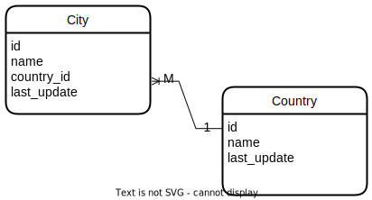

# Как надо думать

Когда хотим замапить связь, думать всегда начинаем со стороны БД. 

В БД любая связь существует *только между двумя* таблицами и при этом одна из них является *владельцем связи*, т.е. имеет ссылку на другую таблицу. Все связи в БД являются *однонаправленными*, поскольку вторая таблица попросту не может иметь ссылку на первую.

Здесь таблица city - владелец связи, т.к. у нее есть столбец country_id:



# 1М и М1

## Голые java классы

### Однонаправленная связь

```java
public class City {
    private Country country;  // Есть ссылка на страну
}
```

```java
public class Country {
    // Нет ссылок на города, поэтому "однонаправленная"
}
```

### Двунаправленная связь

```java
public class City {
    private Country country;  // Есть ссылка на страну
}
```

```java
public class Country {
    // И есть ссылки на города, поэтому "двунаправленная"
	private Set<City> cities = new HashSet<>();
}
```

## Мапим

Тип связи всегда можно определить логически на основе таблиц БД. Проще начинать мапинг с владельца связи, в данном случае с City, потому что во владельце всегда можно применить аннотацию @JoinColumn, указав в ней столбец связи. Тогда для противоположной таблицы сразу понятно что надо использовать mappedBy.

### Однонаправленная

```java
@Table(name = "city")
public class City {
    @ManyToOne
    @JoinColumn(name = "country_id")
    private Country country;
}
```

```java
@Table(name = "country")
public class Country {

}
```

Когда пишем классы, думаем все равно относительно БД:

* В таблице city может быть много городов, у которых одна и та же страна
* Значит между city - country связь М1 => используем аннотацию @ManyToOne
* Таблица city в БД является владельцем связи
* Значит, у нее есть поле с id страны, по которому можно вытащить объект страны
* => указываем этот *столбец таблицы БД* в аннотации @JoinColumn

### Двунаправленная

```java
@Table(name = "city")
public class City {
    @ManyToOne
    @JoinColumn(name = "country_id", nullable = false)  // <-- nullable = false
    private Country country;
}
```

Через параметр nullable обозначили, что поле country обязательно должно быть заполнено. Тут надо понимать, что это ограничение работает именно на программной стороне, а не на стороне БД и они взаимно не связаны.

Например, если в БД стоит ограничение not null на это поле, а в программе - не стоит, то программа попытается сохранить город с пустым полем country и мы получим ошибку от СУБД. А если в БД такого ограничения нет, а в программе - есть, то уже программа не позволит нам сохранить город с незаполненной страной, хотя в БД это будет вполне законно.

```java
@Table(name = "country")
public class Country {
    @OneToMany(mappedBy = "country")
    private Set<City> cities = new HashSet<>();
}
```

Начинаем думать аналогично как в однонаправленной, а когда мапим класс Country, думаем так:

* С одной страной может быть связано много городов
* Значит, между country - city связь 1М => используем аннотацию @OneToMany
* В таблице БД country нет столбца, который бы указывал на город
* Значит, мы не можем пользоваться @JoinColumn'ом и указать столбец, по которому надо связаться с парной таблицей
* => нужно использовать параметр mappedBy аннотации @OneToMany и указать в нем *поле класса* парной таблицы, которое содержит мэппинг

Двунаправленную связь М1 можно тоже делать через промежуточную таблицу в случае, если в столбце со ссылкой нежелателен null. Например, если мы проектируем аукцион, то у Лота будет ссылка на Владельца. Но пока Лот не купили, он будет лежать в БД с null'ом в этой ссылке. Если же мы сделаем через промежуточную таблицу, то null не будет, поскольку поле Владельца уйдет из таблицы Лота в эту промежуточную таблицу.

# ММ

## Голые java классы

При мэпинге ММ все делается так же как и в М1, потому что ММ в БД всегда делается через промежуточную сущность, а это по сути М1 + М1.


```java
public class Film {
    private Set<FilmCategory> filmCategory = new HashSet<>();
}
```

```java
public class Category {
    private Set<FilmCategory> filmCategory = new HashSet<>();
}
```

```java
public class FilmCategory {
    private Film film;
    private Category category;
}
```

## Мапим

Начинаем думать с владельца связи, FilmCategory, потому что так проще:

```java
@Table(name = "film_category")
public class FilmCategory {
    @ManyToOne
    @JoinColumn(name = "film_id", insertable = false, updatable = false)
    private Film film;

    @ManyToOne
    @JoinColumn(name = "category_id", insertable = false, updatable = false)
    private Category category;

    @EmbeddedId
    private Id id = new Id();

    private FilmCategory() { }

    public FilmCategory(Film film, Category category) {
        // Связи в классах мы должны сделать руками, как будто никакого хранения нет
        this.film = film;
        this.category = category;

        this.id.categoryId = category.getId();
        this.id.filmId = film.getId();

        film.getFilmCategory().add(this);
        category.getFilmCategory().add(this);
    }

    @Embeddable
    public static class Id implements Serializable {
        @Column(name = "film_id")
        private Long filmId;

        @Column(name = "category_id")
        private Long categoryId;
    }
}
```

```java
@Table(name = "film")
public class Film {
    @OneToMany(mappedBy = "film")
    private Set<FilmCategory> filmCategory = new HashSet<>();
}
```

```java
@Table(name = "category")
public class Category {
    @OneToMany(mappedBy = "category")
    private Set<FilmCategory> filmCategory = new HashSet<>();
}
```

В классах нужно обязательно реализовать hashCode, equals, настроить тип выборки и прочее. Здесь приведена только суть, относящаяся непосредственно к пониманию мэпинга.

Во владельце связи разве что следует обратить внимание на оформление составного PK, для которого объявляется отдельный вложенный класс и создается объект. Геттеры\сеттеры в нем можно не делать, потому что внешний класс видит поля вложенного и так. И еще в конструкторе нужно руками связывать все объекты, потому что хибер за это не отвечает.

Пример использования:

```java
Category adventure = new Category();
adventure.setName("Приключения");

Category horror = new Category();
horror.setName("Ужасы");

Category zombie = new Category();
zombie.setName("Зомби");

Film rotld = new Film();
rotld.setTitle("Возвращение живых мертвецов");
rotld.setLength(95);
rotld.setReleaseYear(1984);

Film ij = new Film();
ij.setTitle("Индиана Джонс и ковчег судьбы");
ij.setLength(103);
ij.setReleaseYear(1987);

manager.getTransaction().begin();
manager.persist(adventure);
manager.persist(horror);
manager.persist(zombie);
manager.persist(rotld);
manager.persist(ij);

FilmCategory fcRotldHorror = new FilmCategory(horror, rotld);
FilmCategory fcRotldZombie = new FilmCategory(zombie, rotld);
FilmCategory fcIjAdventure = new FilmCategory(adventure, ij);

manager.persist(fcRotldHorror);
manager.persist(fcRotldZombie);
manager.persist(fcIjAdventure);
manager.getTransaction().commit();
```

```java
private void getFilmWithCategories3Entiry(long filmId) {
    Film film = manager.find(Film.class, filmId);
    System.out.println(String.format("Фильм %s относится к этим категориям:", film));
    for (FilmCategory fc : film.getFilmCategory()) {
        System.out.println(fc.getCategory().getName());
    }
}
```

## ММ без третьего класса

На стороне БД связь ММ *всегда* реализуется через третью таблицу, но при мапинге при желании можно использовать всего два класса, хотя вариант реализации через три класса считается предпочтительнее. Например, если связующая таблица содержит какие-нибудь дополнительные поля (например, есть таблица Users и Roles, и в связующей таблице можно хранить информацию о том, кто назначил пользователю ту или иную роль), то вариант через три класса нагляднее и проще для развития.

Но для галочки приведу пример мапинга ММ через два класса. Здесь, опять же, можно сделать как двунаправленную, так и однонаправленную связь, смотря как нам надо. Пусть можно будет получить все жанры, к которым относится фильм, и все фильмы какого-то жанра, т.е. связь двунаправленная.

Основное "мясо" соединения можно описать в любом из двух классов. Тогда во втором классе все будет просто. Сделаем мясо в классе фильма:

```java
@Entity
@Table(name = "film_s")
public class Film extends AbstractEntity {
    @ManyToMany(cascade = CascadeType.PERSIST, fetch = FetchType.LAZY)
    @JoinTable(name = "film_category",
            joinColumns = @JoinColumn(name = "film_id"),
            inverseJoinColumns = @JoinColumn(name = "category_id"))
    private Set<Category> categories = new HashSet<>();

```

```java
@Entity
@Table(name = "category")
public class Category extends AbstractEntity {
	@ManyToMany(mappedBy = "categories", fetch = FetchType.LAZY, cascade = CascadeType.PERSIST)
    private Set<Film> films = new HashSet<>();
```

* @JoinTable:
  * name - указываем имя *таблицы* (именно таблицы, а не класса), которая является в БД промежуточной и связывает фильмы и категории.
  * joinColumns - поскольку мы описываем "мясо" в классе Film, мы должны указать в joinColumns поле связующей таблицы, которое указывает на таблицу Film. Это поле film_id (т.е. этот film_id не из таблицы film, а именно из таблицы film_category, т.е. из промежуточной)
  * inverseJoinColumns - здесь указываем столбец связующей таблицы, который указывает на "противоположную" таблицу. Поскольку мясо мы пишем в классе Film, то противоположная таблица - это очевидно category. А в промежуточной таблице film_category на таблицу category указывает поле category_id.

# Замечания

* Для хибера есть разница, какой интерфейс коллекции использовать для хранения связанных сущностей. Но это отдельная тема. Пока я использовал только Set, поэтому важно у сущностей реализовывать методы хэша и равенства.

  Без этого косяки могут вылезти на ровном месте. Например, я использовал в примерах HashSet для хранения коллекций и из-за кривой лобковой реализации у меня список городов в стране не заполнялся и я далеко не сразу понял, в чем дело.

  Ну и соответственно, если пользоваться лобком, то только для геттеров и сеттеров. Лучше не полагаться на его реализацию хэша и равенства.

* Что характерно, параметр mappedBy есть у @OneToMany и у @OneToOne, но его нет у @ManyToOne. Все потому что таблица со "многими" физически всегда является владельцем связи, т.е. содержит ссылку на таблицу с "одним". А таблица с "одним" никакой ссылки на "многих" не имеет по своей природе. Как следствие, "один" класс не имеет личной возможности как-то получить своих "многих", поэтому мы и указываем, через какое поле класса "многих" установлена связь на уровне БД.