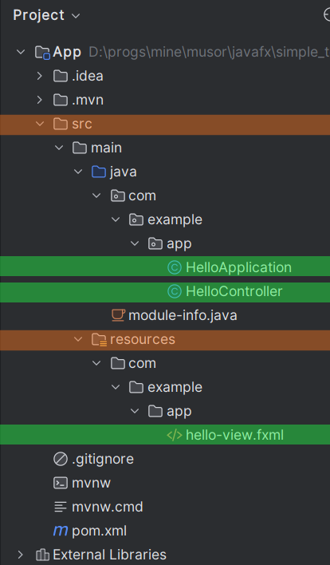
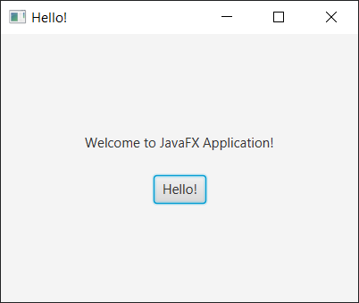

# Создание нового проекта

В идее при создании нового проекта выбираем тип JavaFX и в общем-то все. Идея предложит выбрать дополнительные зависимости, например, для стилизации. Можно их не выбирать.

# Структура приложения

Структура нового проекта выглядит примерно так:



Основные компоненты:

* Главный класс приложения - `HelloApplication`
* Файл с разметкой для главного окна - `hello-view.fxml`
* Контроллер (файл с логикой) для главного окна - `HelloController`

# FXML и контроллеры

## FXML

FXML - это язык разметки, использующийся для описания интерфейса. По умолчанию файлы с разметкой кладутся в папку ресурсов, потому что оттуда их удобно загружать. Пример разметки:

```xml
<?xml version="1.0" encoding="UTF-8"?>

<?import javafx.geometry.Insets?>
<?import javafx.scene.control.Label?>
<?import javafx.scene.layout.VBox?>

<?import javafx.scene.control.Button?>
<VBox alignment="CENTER" 
      spacing="20.0" 
      xmlns:fx="http://javafx.com/fxml"
      fx:controller="com.example.app.HelloController">
    <padding>
        <Insets bottom="20.0" left="20.0" right="20.0" top="20.0"/>
    </padding>

    <Label fx:id="welcomeText"/>
    <Button text="Hello!" onAction="#onHelloButtonClick"/>
</VBox>
```

Здесь объявлен корневой компонент VBox - контейнер, размещающий свои дочерние (вложенные) элементы по вертикали. У него несколько свойств:

* `aligment` задает выравнивание этого компонента в родительском элементе;
* `spacing` - задает расстояние между дочерними элементами внутри контейнера;
* `xmlns:fx` - подключает указанное пространство имен `http://javafx.com/fxml` под именем `fx`. Это пространство имен позволит нам использовать разные полезные свойства, в данном примере это будут `controller` и `id`;
* `fx:controller` - задает для текущего файла разметки контроллер. Контроллер - это класс, в котором мы можем написать логику работы для разметки. Например, обработчик щелчка по кнопке. Указывается полное имя, вместе с пакетом.

Внутри контейнера VBox находятся несколько вложенных элементов:

* `<padding>` - позволяет настроить отступы от границ контейнера до вложенных в него элементов.
* `<Label>` - текстовая метка. С помощью свойства `id` мы задали ей уникальное имя, по которому сможем найти ее в контроллере.
* `<Button>` - обычная кнопка. С помощью свойства `onAction` мы указываем метод контроллера, который надо вызвать при щелчке по кнопке. Формат `#имяМетодаКонтроллера`.

## Контроллер

Контроллер для вышеописанного файла разметки выглядит так:

```java
package com.example.app;

import javafx.fxml.FXML;
import javafx.scene.control.Label;

public class HelloController {
    @FXML
    private Label welcomeText;

    @FXML
    protected void onHelloButtonClick() {
        welcomeText.setText("Welcome to JavaFX Application!");
    }
}
```

Это обычный класс с некоторыми особенностями:

* Поля контроллера, отмеченные аннотацией `@FXML`, фреймворк попытается связать с элементами разметки. Он будет ориентироваться на имя и тип поля поля в контроллере и на id элементов в разметке. Например, у нас в разметке для метки задан `fx:id="welcomeText"` и поле в контроллере называется `welcomeText` и имеет тип `Label`. Поэтому фреймворк их успешно свяжет.
* Методы контроллера, отмеченные аннотацией `@FXML`, мы можем использовать в разметке в качестве обработчиков событий.

# Главный класс приложения

Главный класс приложения в данном примере называется `HelloApplication` и выглядит следующим образом:

```java
package com.example.app;

import javafx.application.Application;
import javafx.fxml.FXMLLoader;
import javafx.scene.Scene;
import javafx.stage.Stage;

import java.io.IOException;

public class HelloApplication extends Application {
    
    @Override
    public void start(Stage stage) throws IOException {
        FXMLLoader fxmlLoader = new FXMLLoader(HelloApplication.class.getResource("hello-view.fxml"));
        Scene scene = new Scene(fxmlLoader.load(), 320, 240);
        stage.setTitle("Hello!");
        stage.setScene(scene);
        stage.show();
    }

    public static void main(String[] args) {
        launch();
    }
}
```

Задача главного класса всегда минимальна: как правило, она сводится к загрузке разметки главного окна, созданию и показу главного окна. В методе `start` используется несколько типов, концепцию которых важно понимать:

* `Stage` - стейдж это окно. Фреймворк создает главное окно и передает его нам через метод start. Здесь мы задаем для этого окна заголовок и так называемую *сцену*, после чего уже можем показать окно.
* `Scene` - сцена это содержимое окна. При создании сцены мы указываем для нее разметку и размеры самой сцены. Разметка указывается не просто как файл, а как объект. Сама сцена - это контейнер, в котором может быть только один элемент. С помощью класса `FXMLLoader` мы на основе файла разметки создаем объект и потом этот объект передаем в сцену.

В итоге получаем приложение, которое выглядит примерно так:

