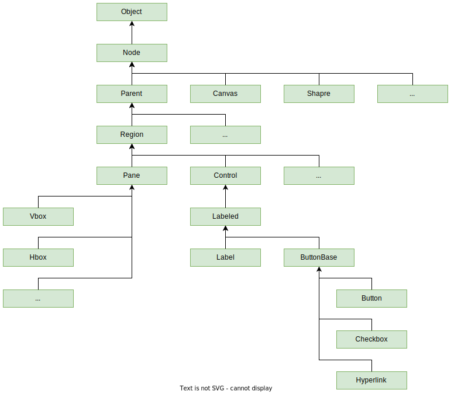

| Класс   | Doc                                                          |
| ------- | ------------------------------------------------------------ |
| Node    | [doc](https://docs.oracle.com/javase/8/javafx/api/javafx/scene/Node.html) |
| Parent  | [doc](https://docs.oracle.com/javase/8/javafx/api/javafx/scene/Parent.html) |
| Region  | [doc](https://docs.oracle.com/javase/8/javafx/api/javafx/scene/layout/Region.html) |
| Pane    | [doc](https://docs.oracle.com/javase/8/javafx/api/javafx/scene/layout/Pane.html) |
| Control | [doc](https://docs.oracle.com/javase/8/javafx/api/javafx/scene/control/Control.html) |
|         |                                                              |


# Окно

Окно представлено классом `Stage`. Содержимое окна - это класс `Scene`. Установка содержимого окна производится методом `setScene`. В основе сцены как правило лежит контейнер, в который уже добавляются другие контейнеры и элементы. Пример простого главного окна приложения:

```java
public class ClassRegistryApp extends Application {
    
    @Override
    public void start(Stage stage) throws IOException {
        VBox rootContainter = new VBox();
        rootContainter.getChildren().addAll(
            new Button("1"),
            new Button("2"),
            new Button("3")
        );

        var scene = new Scene(rootContainter, 320, 240);
        stage.setScene(scene);

        stage.show();
    }
    
    public static void main(String[] args) {
        launch();
    }

}
```

Фреймворк отдает нам ссылку на главное окно, а мы создаем сцену и привязываем ее к окну. VBox - это контейнер, располагающий свои элементы вертикально.


# Материал

Scene Graph - это древовидная структура данных, олицетворяющая все графические элементы, из которых состоит наше графическое приложение. Все элементы называются узлами (nodes). Узлы могут быть листьями (leaf node) или ветвями (branch node). Листья не имеют детей, а ветви - имеют. Первый узел дерева называется корнем (root) и не может иметь родителя.

Каждый класс графических элементов относится к одному из перечисленных типов узлов (TODO только ли к одному? или может быть сразу нескольких типов?).


A node instance can be added to a scene graph only once. Возможно когда FXMLLoader загружает fxml и создает объект, то этот объект как-то кэшируется например и при повторной попытке добавить его в дерево возникает ошибка.