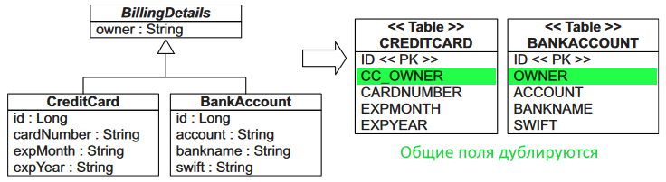

# Table per concrete class with implicit polymorphism

Название оставлено оригинальное на английском, чтобы проще гуглить.

"По таблице на потомка, с неявным полиморфизмом".

## Характеристика

Самый прямолинейный подход - это когда на каждый конкретный класс приходится одна таблица. У классов может быть какой-то родитель, содержащий общие поля, но этот родитель своей таблицы не имеет. Все "общие" поля дублируются в таблицах БД:



Как это выглядит:

* Сущностями являются только потомки. Они отмечаются аннотацией `@Entity`.
* Суперклассы нужны только для обозначения общих полей. По умолчанию поля родителя не являются хранимыми. Чтобы хибер учитывал их в хранении, класс родителя помечается аннотацией `@MappedSuperclass`.
* Id можно размещать по желанию либо в классах потомков, либо в базовом классе.
* Если в таблицах, связанных с потомками, какие-то общие поля называются по-разному, можно это подправить через переопределение атрибутов, `@AttribureOverride`. Ограничения этой аннотации:
  * Можно переопределить только @Column, а более серьезные вещи, вроде @GeneratedValue - нельзя.
  * Работает только на классах, отмеченных как @MappedSuperclass или @Embeddable. В других стратегиях наследования уже может не работать.

## Реализация

```java
@MappedSuperclass  // <-- Чтобы поля родителя стали хранимыми
@Getter @Setter
public abstract class BillingDetails {

    @Column(name = "owner")
    protected String holder;

}
```

```java
@Entity
@Table(name = "bankaccount")
public class BankAccount extends BillingDetails {

    @Id
    @Column(name = "id")
    @GeneratedValue(strategy = GenerationType.SEQUENCE, generator = "bankaccount_id_gen")
    @SequenceGenerator(name = "bankaccount_id_gen", sequenceName = "bankaccount_id_seq", allocationSize = 1)
    private int id;

    @Column(name = "account")
    private String account;

    @Column(name = "bankname")
    private String bankName;

    @Column(name = "swift")
    private String swift;

}
```

```java
@Entity
@Table(name = "creditcard")
@AttributeOverrides({  // <-- В таблице кредитных карт поле Владелец называется по-другому, поэтому переопределим
        @AttributeOverride(name = "holder", column = @Column(name = "cc_owner"))
})
public class CreditCard extends BillingDetails {

    @Id
    @Column(name = "id")
    @GeneratedValue(strategy = GenerationType.SEQUENCE, generator = "creditcard_id_gen")
    @SequenceGenerator(name = "creditcard_id_gen", sequenceName = "creditcard_id_seq", allocationSize = 1)
    private int id;

    @Column(name = "cardnumber")
    private String cardNumber;

    @Column(name = "expmonth")
    private String expMonth;

    @Column(name = "expyear")
    private String expYear;

}
```

## Проблемы с запросами

В книге *Java persistence with Hibernate - Christian Bauer, Gavin King, Gary Gregory (2016)* на стр.199 показан такой запрос `select bd from BillingDetails bd` для выбора из БД всех, в данном случае, кредитных карт и банковских счетов. Но у меня такой запрос не заработал, ошибка "Could not resolve root entity 'BillingDetails'".

```java
var query = em.createQuery("select bd from BillingDetails bd", BillingDetails.class);  // <-- Не работает!
var result = query.getResultList();

var query = em.createQuery("select cc from CreditCard cc", CreditCard.class);  // Ok
var query = em.createQuery("select ba from BankAccount ba", BankAccount.class);  // Ok
```

В интернете решения тоже не нашлось. Где-то писали, что это может работать, если Id находится в суперклассе, я попробовал - не помогло. Запросы на выборку подклассов работают нормально.

Хотя у меня запрос и не заработал, в книге написано что хибер генерирует вот такой код при запросе всех BillingDetails:

```sql
select ID, OWNER, ACCOUNT, BANKNAME, SWIFT from BANKACCOUNT
select ID, CC_OWNER, CARDNUMBER, EXPMONTH, EXPYEAR from CREDITCARD
```

Это является одним из недостатков: генерируется два запроса вместо одного.