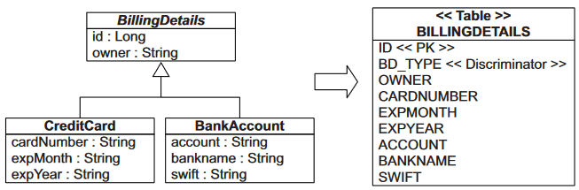

# Table per class hierarchy

## Характеристика



Особенность этого подхода в том, что данные для всех подклассов хранятся теперь в одной таблице. Из-за этого некоторые столбцы будут теперь хранить null, потому что например а банковского счета нет "номера карты" и т.д. Каждая строка имеет специальное поле, которое определяет, к какому именно BillingDetail эта строка относится.

По сути такой подход является денормализацией. Он дает хорошую производительность, но из-за возможных null больше подвержен нарушению целостности данных, потому что ограничения not null мы теперь не можем поставить в БД, а вынуждены проверять это программно.

Данные вытягиваются одним простым запросом:

```sql
select
    b1_0.id,
    b1_0.bd_type,
    b1_0.owner,
    b1_0.account,
    b1_0.bankname,
    b1_0.swift,
    b1_0.cardnumber,
    b1_0.expmonth,
    b1_0.expyear
from
    billingdetails b1_0
```


## Реализация

Технические особенности реализации:

* В БД для хранения данных для всех подклассов используется одна таблица.
  * Эта таблица имеет поле-"дискриминатор", содержащее маркер, по которому можно понять, к какому классу-потомку относится строка.
  * На общие для всех потомков поля можно наложить ограничение NOT NULL, а на специфические для потомков поля - нельзя.
* Базовый класс является сущностью @Entity и связан с таблицей.
  * Он не обязательно должен быть абстрактным.
  * Должна быть указана стратегия наследования `@Inheritance(strategy = InheritanceType.SINGLE_TABLE)`.
  * С помощью `@DiscriminatorColumn` указываем столбец, хранящий маркер класса, к которому относится запись. Сам этот столбец не обязательно должен быть строкой, может быть числом (и мб даже еще чем-то).

```java
@Entity
@Table(name = "billingdetails")  // <-- Базовый класс теперь имеет собственную таблицу.
@Inheritance(strategy = InheritanceType.SINGLE_TABLE)  // <-- Тип наследования.
@DiscriminatorColumn(name = "bd_type")  // <-- Поле, служащее маркером, к какому классу относится запись.
@Getter @Setter
public abstract class BillingDetails {  // <-- Абстрактность не обязательна, по желанию.

    @Id  // <-- Идентификатор находится в базовом классе.
    @Column(name = "id")
    @GeneratedValue(strategy = GenerationType.SEQUENCE, generator = "billingdetails_id_gen")
    @SequenceGenerator(name = "billingdetails_id_gen", sequenceName = "billingdetails_id_seq", allocationSize = 1)
    protected int id;

    @Column(name = "owner", nullable = false)  // <-- Общие поля могут быть ограничены как NOT NULL.
    protected String holder;

}
```

Классы-потомки:

* Являются сущностями @Entity, но больше не имеют собственных таблиц.
* Снабжаются аннотацией `@DiscriminatorValue("marker")`, которая помогает хиберу понять, экземпляр какого класса создавать для строки таблицы.
* Не могут накладывать на свои поля ограничение NOT NULL, потому что раз в одной строке хранятся данные нескольких разных типов, то некоторые столбцы неизбежно будут хранить null.

```java
@Entity  // <-- Являются сущностями.
// <-- Но к таблицам больше не привязаны.
@DiscriminatorValue("ba")  // <-- Указываем, какой маркер характерен для этого типа.
@Getter @Setter
public class BankAccount extends BillingDetails {

    @Column(name = "account")  // <-- Собственные поля не могут быть NOT NULL.
    private String account;

    @Column(name = "bankname")
    private String bankName;

    @Column(name = "swift")
    private String swift;

}
```

```java
@Entity
@DiscriminatorValue("kk")
@Getter @Setter
public class CreditCard extends BillingDetails {

    @Column(name = "cardnumber")
    private String cardNumber;

    @Column(name = "expmonth")
    private String expMonth;

    @Column(name = "expyear")
    private String expYear;

}
```

