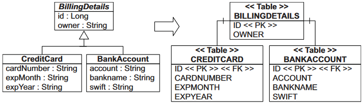

# Table per class with joins

"По таблице на все классы, с соединением". В оригинале называется "Table per *sub*class with joins", но я переименовал, потому что здесь таблица есть не только у подклассов, но и у родителя.

InheritanceType.JOINED

## Характеристика



Для этого подхода характерно:

* Все классы - и базовый, и потомки, имеют по собственной таблице.

* Генератор идентификатора общий. Сам идентификатор хранится в таблице базового класса, а в таблицах потомков есть поля со ссылкой на него. Они тоже являются первичными ключами, а заодно и внешними.

* При выборе всех BillingDetails хибер генерирует такой запрос:

  ```sql
  select
  	b1_0.id,
  	case 
  		when b1_1.id is not null then 1 
  		when b1_2.id is not null then 2 
  		when b1_0.id is not null then 0 
  	end,
  	b1_0.owner,
  	b1_2.account,
  	b1_2.bank_name,
  	b1_2.swift,
  	b1_1.card_number,
  	b1_1.exp_month,
  	b1_1.exp_year
  from
  	billing_details b1_0 left join 
  	credit_card b1_1 on b1_0.id = b1_1.id left join 
  	bank_account b1_2 on b1_0.id=b1_2.id
  ```

## Реализация

### SQL-сторона

```java
create table billing_details (
    id integer default nextval('billing_details_id_seq'::regclass),
	owner character varying(100) not null,
	---
	primary key(id)
);
```

```sql
create table credit_card (
    id integer,
	card_number character varying not null,
	exp_year character varying not null,
	exp_month character varying not null,
	---
	primary key(id)
);

alter table only billing_details
    add constraint credit_card_to_billing_details_fk foreign key (id) references billing_details(id) 
    on delete restrict;
```

```sql
create table bank_account (
    id integer,
	account character varying not null,
	bank_name character varying not null,
	swift character varying not null,
	---
	primary key(id)
);

alter table only bank_account
    add constraint bank_account_to_billing_details_fk foreign key (id) references billing_details(id) 
    on delete restrict;
```

### Java-сторона

```java
@Entity
@Table(name = "billing_details")
@Inheritance(strategy = InheritanceType.JOINED)  // <-- Указываем тип стратегии
@Getter @Setter
public abstract class BillingDetails {

    @Id
    @Column(name = "id")
    @GeneratedValue(strategy = GenerationType.SEQUENCE, generator = "billing_details_id_gen")
    @SequenceGenerator(name = "billing_details_id_gen", sequenceName = "billing_details_id_seq", 
                       allocationSize = 1)
    protected int id;

    @Column(name = "owner", nullable = false)
    protected String holder;

}
```

Классы-потомки:

* Не объявляют поле Id, оно наследуется от родителя.
* Должны указать поле своей таблицы, через которое можно соединиться с таблицей родителя.

```java
@Entity
@Table(name = "bank_account")
@PrimaryKeyJoinColumn(name = "id")  // <-- Через какое поле таблицы соединяться с таблицей родительского класса
@Getter @Setter
public class BankAccount extends BillingDetails {
    
    @Column(name = "account")
    private String account;

    @Column(name = "bank_name")
    private String bankName;

    @Column(name = "swift")
    private String swift;

}
```

```java
@Entity
@Table(name = "credit_card")
@PrimaryKeyJoinColumn(name = "id")  // <-- Через какое поле таблицы соединяться с таблицей родительского класса
@Getter @Setter
public class CreditCard extends BillingDetails {

    @Column(name = "card_number")
    private String cardNumber;

    @Column(name = "exp_month")
    private String expMonth;

    @Column(name = "exp_year")
    private String expYear;

}
```


