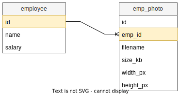
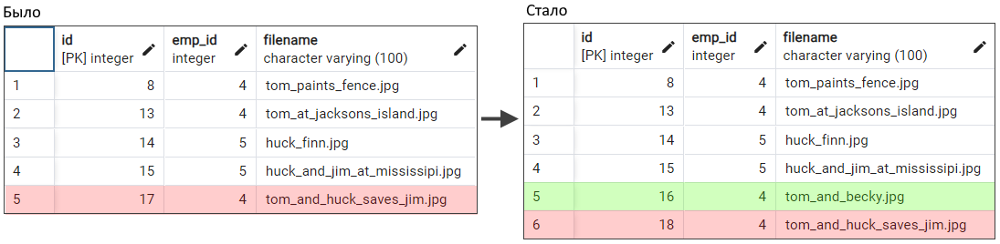

# Не-сущность Фотографии сотрудников

Пусть у нас есть таблица, хранящая фотографии сотрудников, `emp_photo`:



Для генерации id фотографии есть отдельный sequence. В программе не будем делать отдельную сущность `Фотография`, а посмотрим как можно сделать мапинг данных из этой таблицы на коллекцию внутри сущности Сотрудник.

# Мапинг Set, один столбец таблицы

Можно замапить на коллекцию какой-нибудь один столблец таблицы. Например, выберем коллекцию фотографий, но не все поля, а только название файла:

```java
@Entity
@Table(name = "employee")
@Getter @Setter
public class Employee {

    @Id
    @Column(name = "id")
    @GeneratedValue(strategy = GenerationType.IDENTITY)
    private long id;

    @Column(name = "name")
    private String name;

    @ElementCollection  // <-- Коллекция встраеваемых классов
    @CollectionTable(
        name = "emp_photo",  // <-- Имя таблицы, содержащей элементы для коллекции
        joinColumns = @JoinColumn(name = "emp_id"))  // <-- Имя в таблице-коллекции (Фотографии)
    @Column(name = "filename")  // <-- Имя колонки, из которой берем значения для коллекции
    private Set<String> photos = new HashSet<>();

}
```

Особенности:

* Добавляя строки в коллекцию и сохраняя объект Сотрудника, мы можем сохранять новые фотографии в БД, несмотря на то, что у нас замаплен всего один столбец. В этом случае в БД появится новая строка с заполненным полем filename, а остальные поля просто будут null. Если в БД стоит ограничение not null на эти столбцы, тогда сохранить конечно не удастся.

  ```java
  var emp = em.find(Employee.class, 4);
  
  emp.getPhotos().add("tom_and_huck_saves_jim.jpg");
  // emp.getPhotos().remove("tom_at_jacksons_island.jpg");
  
  em.getTransaction().begin();
  em.persist(emp);
  em.getTransaction().commit();
  ```

  В таблице emp_photo появится запись `(?, 4, 'tom_at_jacksons_island.jpg', null, null, null)`.

# Мапинг List, один столбец таблицы

Когда мы используем List в качестве хранилища, то должны указать хиберу столбец, по которому он будет ориентироваться при выстраивании порядка элементов:

```java
@ElementCollection
@CollectionTable(name = "emp_photo_2", joinColumns = @JoinColumn(name = "emp_id"))
@OrderColumn(name = "id")  // <-- Столбец, по которому строить порядок элементов
@Column(name = "filename")
private List<String> photos = new ArrayList<>();  // <-- List + ArrayList
```

Особенности с этим столбцом такие:

* Этот столбец не должен содержать повторяющиеся значения. Т.е. emp_id для этой роли не подходит.

* Хибер ведет нумерацию с нуля. Поэтому если среди значений столбца будут "пропуски", то в списке будут null-элементы. Например, у нас такие записи:

  ```
  (id, emp_id, filename)
  (8,  4, "tom_paints_fence.jpg")
  (12, 4, "tom_at_jacksons_island.jpg")
  (17, 4, "tom_and_huck_saves_jim.jpg")
  ```

  Тогда при выборе фотографий с emp_id 4 получится список из 18 элементов, где в индексах 0-7, 9-11, 13-16 будут null.

Особенности удаления и добавления элементов в коллекцию:

* При вставке и удалении элементов хибер делает пересчет значений для order-столбца и обновляет их напрямую, например минуя sequence. Это может привести к тому, что максимальный индекс станет больше текущего в sequence и уже при нормальном добавлении произойдет ошибка.

  Например, вставим новый элемент в свободный индекс 16. После этого элемент, лежавший под id 17 станет 18 и перевалит текущее значение sequence, что приведет потом к ошибке.

  

  К тому же хибер не просто обновляет значения, он занимается удалением, причем если надо будет удалить 10 записей для пересчета, он сделает 10 отдельных запросов. P.S. Не понятно, почему при вставке не задействуется sequence.

  ```
  select e1_0.id,e1_0.name from employee e1_0 where e1_0.id=?
  select p1_0.emp_id,p1_0.id,p1_0.filename from emp_photo_2 p1_0 where p1_0.emp_id=?
  delete from emp_photo_2 where emp_id=? and id=?
  insert into emp_photo_2 (emp_id, id, filename) values (?, ?, ?)
  insert into emp_photo_2 (emp_id, id, filename) values (?, ?, ?)
  ```

В общем, выглядит все это как дикая наркомания, от которой больше вреда, чем пользы.

# Мапинг Map, два столбца таблицы

```java
@ElementCollection
@CollectionTable(name = "emp_photo_2", joinColumns = @JoinColumn(name = "emp_id"))
@MapKeyColumn(name = "filename")  // <-- Поле со значением для Key
@Column(name = "description")  // <-- Поле со значением для Value
private Map<String, String> photos = new HashMap();
```

Пара замечаний:

* Если ключ является перечислением, используется `@MapKeyEnumerated`.
* Если ключ является `java.util.Date`, используется `@MapKeyTemporal`.

