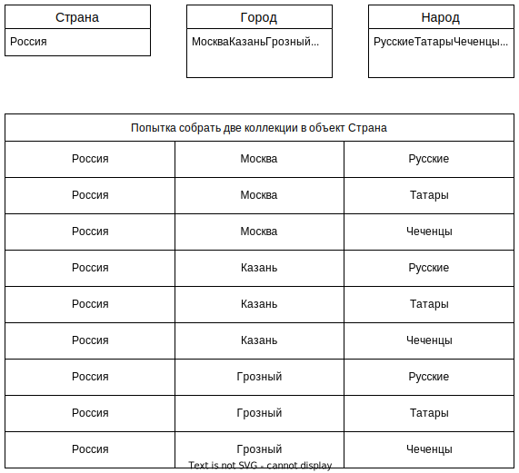

TODO: надоело на 401 странице учебника. Потом доделать.

# Виды соединений в JPA

* Неявное. Не указываем оператор соединения, а хибер сам понимает, что соединять за счет аннотаций мэппинга.
* Явное


# Неявное

Неявное соединение:

* Выполняется, когда мы выбираем данные из связанной таблицы, не указывая оператор соединения явно. Это возможно в случаях, когда эта связанная таблица замаплена на поле основной таблицы.
* Работает на любой "глубине", т.е. можно обращаться через связанную таблицу к другой связанной таблице и т.д.

Например, в классе City поле country замаплено на таблицу со странами:

```java
@ManyToOne(fetch = FetchType.EAGER)
@JoinColumn(name = "country_id", nullable = false)
private Country country;
```

Для выбора всех городов какой-либо страны можно написать такой запрос:

```sql
select c from City c where c.country.name = 'Russian Federation'
```

Здесь нет оператора соединения таблиц, но хибер за счет мэппинга сам понимает как провести соединение и генерирует такой sql:

```sql
select c1_0.city_id,c1_0.country_id,c1_0.last_update,c1_0.city
from city c1_0 
    join country c2_0 on c2_0.country_id=c1_0.country_id  -- Хибер сам понимает как сделать соединение
where c2_0.country='Russian Federation'
```

Если бы в Стране было бы поле "Материк", связанное с таблицей материков, то можно было бы написать `where c.country.mainland.name = 'Евразия'` и выбрать все города, находящиеся на этом материке. Хибер бы автоматически уже соединил бы три таблицы - Город, Страна, Материк.

# Явное

Явное соединение выполняется оператором `[inner|left|right] join`. В отличие от классического sql, здесь мы должны указать не класс второй таблицы, а поле первой таблицы, которое ссылается вторую таблицу.

## inner join

Например, выберем все активные аккаунты покупателей, которые совершали оплату более чем на 10 долларов:

```java
TypedQuery<Tuple> query = em.createQuery(
    "select c, p from Payment p join p.customer c " +
    "where c.active = 1 and p.amount > 10", Tuple.class);
var result = query.getResultList();
result.forEach(r -> {
    var c = (Customer)r.get(0);
    var p = (Payment)r.get(1);
    System.out.println(String.format("%s %s: %.2f", c.getFirstName(), c.getLastName(), p.getAmount()));
});
```

Здесь мы начали выборку с таблицы Payment, потому что в ней есть ссылка на таблицу Customer - в поле customer. Написать `from Customer c join ???Payment` не получилось бы, потому что в классе покупателя нет ссылки на класс покупок. Хотя если бы мы сделали такое поле и выполнили маппинг, тогда смогли бы начинать выборку и с покупателя тоже.

## left | right join

Выполняется абсолютно так же как и обычный join. Выберем активные аккаунты покупателей, которые вообще не проводили пока оплат:

```sql
select c, p from Payment p right join p.customer c where c.active = 1 and p is null
```

Хибер сгенерирует такой sql:

```sql
select куча_полей 
from payment p1_0 right join customer c1_0 on c1_0.customer_id=p1_0.customer_id
where c1_0.active=1 and p1_0.payment_id is null
```

## join fetch

Проблема N+1 это когда для выборки данных совершается несколько запросов, в то время как эти же данные можно было достать одним запросом. Например, есть таблица Платежи со ссылкой на таблицу Покупатель. Соединив их, можно сразу выбрать покупателя для каждого платежа (или та же история с Городами и Странами). Но ленивая стратегия выборки предполагает выборку покупателя только тогда, когда к нему идет обращение. Поэтому в результате вот такого кода:

```java
TypedQuery<Payment> query = em.createQuery("select p from Payment p join p.customer", Payment.class);
var result = query.getResultList();
result.forEach(p -> {
    System.out.println(String.format("%s %.2f", p.getCustomer().toString(), p.getAmount()));
});
```

Хибер генерирует вот такой sql:

```sql
-- Запрос на выборку из основной таблицы Payment
select p1_0.payment_id,p1_0.amount, ...,p1_0.staff_id 
from payment p1_0 join customer c1_0 on c1_0.customer_id=p1_0.customer_id

-- Дополнительный запрос при попытке вывести покупателя для каждого платежа
select c1_0.customer_id,c1_0.active, ... ,c1_0.store_id 
from customer c1_0 where c1_0.customer_id=?
Harold Martino 5,99
Harold Martino 5,99
Harold Martino 2,99
```

Поскольку мы в запросе не выбирали ничего, связанного с покупателем, то даже явное указание соединения не перебило ленивую выборку и мы получили проблему N+1. Чтобы явно указать хиберу, что надо выбирать и связанную сущность, к оператору соединения добавляется оператор `fetch`:

```sql
select p from Payment p join fetch p.customer
```

Теперь хибер выбирает обе сущности за один запрос, хотя как видно мы в самом запросе все так же не трогаем никакие поля покупателя:

```sql
select p1_0.payment_id,p1_0.amount,...,p1_0.staff_id 
from payment p1_0 join customer c1_0 on c1_0.customer_id=p1_0.customer_id
Harold Martino 5,99
Harold Martino 5,99
Harold Martino 2,99
```

# Правила

* Не выбирать для сущности более одной коллекции, потому что эти коллекции между собой будут образовывать Cartesian product (прямое произведение, или проще говоря "каждое с каждым"). Например, у нас есть таблицы Страна, Город, Народ и если мы захотим выбрать для каждой страны коллекцию ее городов и народов, то на уровне sql получится вот что:

  

* фыва

# Соединение нескольких сущностей

Задача "Выбрать все жанры, в которых снимался заданный актер":

```xml
select fc.category from johny.dotsville.domain.entities.FilmCategory fc
inner join fc.film f
inner join f.filmActor fa
where fa.id.actorId = :actorId
order by fc.category.name
```

```java
TypedQuery<Category> query = em.createQuery(
    "select fc.category from FilmCategory fc " +
    "inner join fc.film f " +
    "inner join f.filmActor fa " +
    "where fa.id.actorId = :actorId " +
    "order by fc.category.name", Category.class)
    .setParameter("actorId", 5);
var categories = query.getResultList();
```

Насколько сложный запрос удастся построить на JQPL зависит от того, какие поля мы создадим в сущностях и как их замапим на таблицы. Фрагменты классов для наглядности:

```java
public class FilmCategory {
    @ManyToOne(fetch = FetchType.LAZY)
    @JoinColumn(name = "category_id", insertable = false, updatable = false)
    private Category category;
    
    @ManyToOne(fetch = FetchType.LAZY)
    @JoinColumn(name = "film_id", insertable = false, updatable = false)
    private Film film;
...
public class Film {
    @OneToMany(fetch = FetchType.LAZY, mappedBy = "film")
    private Set<FilmActor> filmActor = new HashSet<>();
...
public class FilmActor {
    @EmbeddedId
    private Id id = new Id();
    ...
    @Setter @Getter
    public static class Id implements Serializable {
        @Column(name = "actor_id")
        private long actorId;
```

