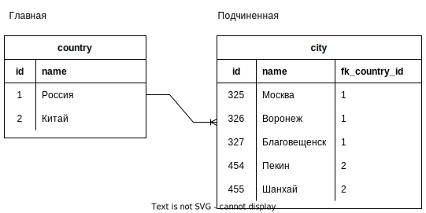
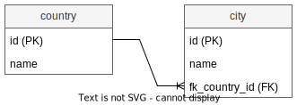
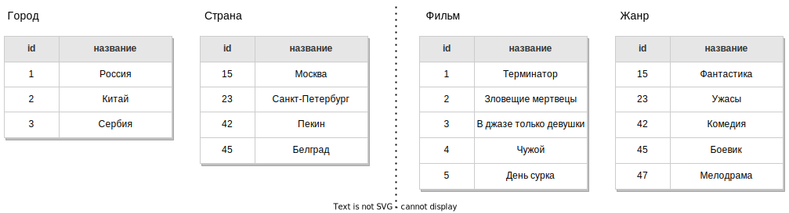
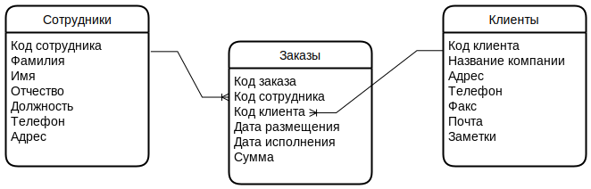

# Главная и подчиненная таблицы

Связь в БД непосредственно связывает две таблицы. Когда две таблицы A и B связаны косвенно через третью C, то мы говорим о связях между парами A + C и B + C.

Если в таблице A есть ссылка на B, то A является **подчиненной**, а B - **главной**. Т.е. главная таблица как бы независимая, самостоятельная, она ничего не знает о других таблицах. Например:



Главная таблица это country, потому что она ничего не знает о городах. А таблица city - подчиненная, потому что она ссылается на страны (через поле fk_country_id).

# Владелец связи

Таблица городов также является ***владельцем связи***, потому что у нее есть ссылка на таблицу стран.

# Как определить тип связи + 1M и M1

По сути, "Один-ко-Многим" и "Многие-к-Одному" это одно и то же, зависит от того, со стороны какой таблицы посмотреть.

Например, города и страны, правильный тип связи:

```
Страна : Город  - Один   : Многим
Город  : Страна - Многие : Одному
```



При размышлении о типе связи можно попасть в ловушку:

* "В одной стране есть много городов, значит Страна:Город это связь один-ко-многим" - вроде все верно, но:
* "Каждый город находится только в одной стране, значит Город:Страна это связь один-к-одному" - здесь неправильный ход мысли, и поэтому тип связи определен неверно.

В чем ошибка? Каждая конкретная строка города конечно связана только с одной строкой страны. Однако думать надо не "однобоко", со стороны только одной таблицы, а со стороны обеих таблиц, отвечая себе на вопросы:

* "Может ли строка этой таблицы быть связана с несколькими строками другой таблицы?"
* "Может ли строка другой таблицы быть связана с несколькими строками этой таблицы?"

Результатом станет понимание связи:

* Если ответ на оба вопроса "Да", значит это связь "Многие-ко-Многим". В этом случае нужно ввести промежуточную таблицу и свести связь ММ к двум связям М1.
* Если ответ на оба вопроса "Нет", значит это связь "Один-к-Одному". В этом случае возможно стоит объединить две таблицы в одну, если конечно деление на две таблицы не было сделано осознанно для каких-то целей.
* Если ответ на один вопрос "Да", а на другой - "Нет", значит это связь "Многие-к-Одному". Таблица, для которой ответ "Да" будет стороной "Один", а противоположная, соответственно, это "Многие".

Пример:



* Город и Страна:
  * Может один город быть связан с несколькими странами? Нет. Потому что каждый город находится только в одной стране. Например, Пекин находится в Китае и не может находиться где-то еще.
  * Может ли одна страна быть связана с несколькими городами? Да, потому что обычно в стране много городов.
  * Для Страны ответ "Да", значит это "Один", а соответственно Город - это "Многие". Получается связь Страна:Город это 1М, а Город:Страна это М1.
* Фильм и Жанр:
  * Может один фильм быть связан с несколькими жанрам? Да. Например, "Терминатор" это и фантастика, и боевик одновременно, а "В джазе только девушки" - это и комедия, и мелодрама.
  * Может жанр быть связан с несколькими фильмами? Да. Например, фантастика - это "Терминатор" и "Чужой", мелодрама - это "День сурка" и "В джазе только девушки".
  * Для обеих таблиц ответ "Да", значит это "Многие-ко-Многим".

# ММ

Связь *многие-ко-многим* (ММ) всегда организуется через промежуточную таблицу, в которой во всевозможных комбинациях расположены id связываемых таблиц.



Каждый сотрудник мог обслужить много клиентов, но и каждого клиента могли обслуживать много сотрудников. Нередко такую связь можно выразить через какую-нибудь значимую бизнес-сущность. В данном случае - заказы.

Здесь в паре Сотрудники-Заказы (1М, один сотрудник оформлял много заказов) таблица Сотрудники является главной, а Заказы подчиненной. В паре Клиенты-Заказы (1М, один клиент делал много заказов) аналогично, Клиенты - главная таблица, а Заказы - подчиненная.

Надо сказать, что промежуточная таблица может использоваться не только для реализации ММ, но и М1 в том случае, когда на стороне "многих" нежелателен null. Например, User может купить Item на аукционе, значит у Item должно быть поле для хранения покупателя. Но до тех пор, пока Item никто не купил, это поле будет null. К слову, хранения null в БД вообще желательно избегать, т.к. они понижают качество данных. Поэтому для избежания null можно ввести промежуточную таблицу, например Buyer, в которой запись с id Item и id User появляется только после покупки и т.о. мы избегаем null.

# 11

TODO Неплохой пример, кстати, будет на Страна и Столица.