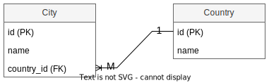

# Однонаправленная связь

## Между таблицами БД

В БД любая связь существует *только между двумя* таблицами. При этом одна из таблиц является *владельцем связи*, т.е. имеет ссылку на другую таблицу (внешний ключ). Например:



Здесь таблица `City` - владелец связи, т.к. у нее есть столбец `country_id`, указывающий на запись таблицы `Country`. Эта связь является *однонаправленной*, потому что от City к Country связь есть (по country_id), а от Country к City - нету, т.к. в Country нет никакого намека на то, какие города есть в стране.

Все связи в БД являются *однонаправленными*, поскольку нет технического способа во вторую таблицу поместить ссылку на первую.

## Между классами

В ООП однонаправленная связь может выглядеть вот так:

```java
public class City {
    public String name;
    // ВАЖНО ОСОЗНАТЬ: Это поле выражает связь City->Country
    public Country country;  // <-- В городе есть ссылка на страну, в которой он находится
}
```

```java
public class Country {
    public String name;
}
```

```java
var russia = new Country("Россия");

var moscow = new City("Москва");
moscow.country = russia;  // <-- Добавили в город ссылку на страну, получили однонаправленную связь
```

# Двунаправленная связь

## Между классами

Двунаправленная связь не может существовать между таблицами, но легко может быть между программными объектами:

```java
public class City {
    public String name;
    // ВАЖНО ОСОЗНАТЬ: Это поле выражает связь City->Country
    public Country country;  // <-- В городе есть ссылка на страну, в которой он находится
}
```

```java
public class Country {
    public String name;
    // ВАЖНО ОСОЗНАТЬ: Это поле выражает связь Country->City
    Set<City> cities = new HashSet();  // <-- В стране есть коллекция ее городов
}
```

```java
var russia = new Country("Россия");

var moscow = new City("Москва");
moscow.country = russia;  // <-- Пока связь однонаправленная, только Город -> Страна

russia.cities.add(moscow);  // <-- Связь стала двунаправленной, поскольку появилась еще связь Страна -> Город
```

# Мапинг

Здесь я просто логически объяснил что такое одно- и двунаправленная связь. Как это замапить, будет в отдельных конспектах. Хотя потом может быть я сюда выдерну просто синтаксис отдельного поля для примера.