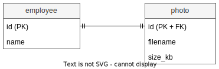
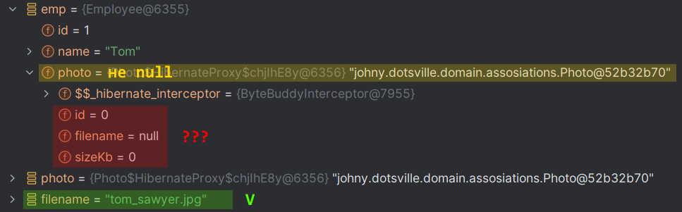
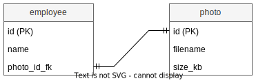
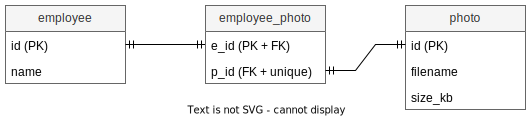

# Один-к-одному

Целесообразность такой связи пока здесь расписывать не буду. Или потом допишу, или вообще отдельной темой. Здесь пока только механика, как это сделать.

# Стратегии реализации 1-1

Есть несколько способов, которыми можно реализовать связь 1-1:

* Общий первичный ключ (используется довольно редко, наименее популярный).
* Колонка внешнего ключа (когда не предполагается, что на другом конце может быть null).
* Промежуточная таблица (когда на другом конце возможен null)

# Общий первичный ключ



## Идея

Идея этого подхода такова:

* У двух сущностей используется одинаковое значение для первичного ключа, что позволяет нам однозначно определить соответствие между ними. Получается что одна строка связана строго с одной строкой другой таблицы.
* Одна из связываемых сущностей (условно главная) имеет генератор для своего id, а вторая сущность (условно подчиненная) генератора не имеет и для своего id пользуется значением, которое сгенерировалось для главной сущности.
* Я назвал их условно главная и условно подчиненная потому, что технически любая может быть "главной" или "подчиненной" и как это распределить - дело вкуса.
* У подчиненной сущности id является не только первичным ключом PK, но еще и внешним ключом FK, потому что как правило при связи 1-1 вторая сущность не может существовать без первой. Поэтому любые действия с первой должны как-то влиять на вторую. Но возможно это условность и необязательно.

В данном примере у нас сущность Сотрудник обладает собственным генератором id, а Фотография разделяет этот id. В целом все работает примерно так:

* Создаем экземпляр Сотрудник.
* Создаем экземпляр Фотография.
* Сохраняем сотрудника, чтобы хибер положил в него id, сгенерированный на стороне БД.
* Присваиваем id сотрудника в id фотографии.
* Сохраняем фотографию.
* Вкладываем фотографию в сотрудника, чтобы установить связть на уровне программы, т.к. хибер за нас этого не сделает.

P.S. В учебнике написано, что подход с разделяемым первичным ключом используется довольно редко.

## Мапинги

На стороне Сотрудника мапим id и поле Фотография:

```java
@Entity
@Table(name = "employee", schema = "ast")
@Getter @Setter
public class Employee {

    @Id
    @Column(name = "emp_id")
    @GeneratedValue(strategy = GenerationType.SEQUENCE, generator = "employee_id_gen")
    @SequenceGenerator(name = "employee_id_gen", sequenceName = "ast.employee_id_seq", allocationSize = 1)
    private long id;

    @Column(name = "name")
    private String name;

    @OneToOne(fetch = FetchType.LAZY, optional = false)  // <-- Обозначаем тип связи
    @PrimaryKeyJoinColumn  // <-- Обозначаем стратегию реализации связи
    private Photo photo;

}
```

TODO: optional выяснить что такое, мб отсюда убрать и в другой конспект засунуть.

На стороне Фотографии мапим только собственные поля фотографии и опционально поле Сотрудник, если хотим двунаправленную связь:

```java
@Entity
@Table(name = "photo", schema = "ast")
@Getter @Setter
public class Photo {

    @Id
    @Column(name = "photo_id")
    private long id;

    @Column(name = "filename")
    private String filename;

    @Column(name = "size_kb")
    private int sizeKb;
  
//    Если хотим сделать двунаправленную связь
//    @OneToOne(mappedBy = "photo", fetch = FetchType.LAZY)
//    private Employee employee;

}
```

У @PrimaryKeyJoinColumn есть параметры, значение их в книге не разбирается. Я пробовал потыкать их, но не особо понял в чем различие. Чтобы не тормозить, пойду дальше, тут оставлю TODO. Попробовал даже id-поля у сущностей по-разному назвать, все равно работает нормально. Еще я видел, что эта аннотация используется не только в таком сценарии, так что может как раз в этом сценарии параметры трогать не надо.

## Как пользоваться

* Создание и сохранение сущностей:

  ```java
  // Создаем самостоятельную сущность.
  var emp = new Employee();
  emp.setName("Tom");
  
  // Создаем подчиненную сущность.
  var photo = new Photo();
  photo.setFilename("tom_sawyer.jpg");
  
  em.getTransaction().begin();
  // Сохраняем самостоятельную сущность, чтобы БД сгенерировала id для нее, а хибер положил значение в поле id.
  em.persist(emp);
  
  // Устанавливаем id также и для подчиненной сущности.
  photo.setId(emp.getId());
  // Сохраняем подчиненную сущность.
  em.persist(photo);
  em.getTransaction().commit();
  
  // Связываем обе сущности, чтобы в памяти они тоже были связаны.
  emp.setPhoto(photo);
  ```

* Загрузка:

  ```java
  var emp = em.find(Employee.class, 1);
  
  Photo photo = emp.getPhoto();  // photo не null, но поля не загрузились
  String filename = photo.getFilename();  // Поле загрузилось
  ```

  Здесь нюанс. При ленивой загрузке в emp поле photo как будто загрузилось (не null), но в объекте все поля как будто не загруженные. Значения в них появляются только когда начинаешь к ним обращаться. Например, вызвал getDescription() - получил реальное описание. А если в дебагере посмотреть, то в поле filename пусто.

  

  Если пользоваться жадной загрузкой, то значения есть. Беглый гуглеж вывел на понятия прокси, кэш первого и второго уровня. Это темы из третьего раздела книги скорее всего. Так что сейчас я пока упарываться не буду, просто пойду дальше. Потом же сюда стоит вернуться TODO и момент прояснить.

## SQL

Запросы для создания необходимых таблиц, последовательности и схемы для подхода "общий первичный колюч":

```sql
drop schema if exists ast cascade;  -- ast - [as]sociation [t]raining
create schema ast;
```

```sql
drop sequence if exists ast.employee_id_seq cascade;

create sequence ast.employee_id_seq
    start with 1 
    increment by 1 
    no minvalue 
    no maxvalue 
    cache 1;
```

```sql
create table ast.employee (
    emp_id integer default nextval('ast.employee_id_seq'::regclass),
	name character varying(100),
	---
	primary key(emp_id)
);
```

```sql
create table ast.photo (
    photo_id integer,
	filename character varying(100),
	size_kb integer,
	---
	primary key(photo_id)
);

alter table only ast.photo
    add constraint photo_to_employee_fk foreign key (photo_id) references ast.employee(emp_id) 
        on delete restrict;
```

# Колонка внешнего ключа



## Идея

* В одной таблице создаем колонку внешнего ключа и храним в ней id строки из другой таблицы.
* На колонку внешнего ключа ставим ограничения:
  * not null - предполагается все-таки, что null'ов быть не должно. Но вообще это опционально, зависит от сценария.
  * unique - логически обязательно, потому что у нас связь 11, значит в соседней таблице не может быть больше одной связанной строки.

## Мапинги

В сущности Сотрудник нужно указать с помощью аннотации `@JoinColumn` столбец, в котором хранится значение внешнего ключа:

```java
@Entity
@Table(name = "employee", schema = "ast")
@Getter @Setter
public class Employee {

    @Id
    @Column(name = "emp_id")
    @GeneratedValue(strategy = GenerationType.IDENTITY)
    private long id;

    @Column(name = "name")
    private String name;

    @OneToOne(fetch = FetchType.LAZY, cascade = CascadeType.PERSIST, optional = false)
    @JoinColumn(name = "photo_id_fk", unique = true)  // <-- Внешний ключ в текущей таблице
    private Photo photo;

}
```

Фотография:

```java
@Entity
@Table(name = "photo", schema = "ast")
@Getter @Setter
public class Photo {

    @Id
    @Column(name = "photo_id")
    @GeneratedValue(strategy = GenerationType.IDENTITY)
    private long id;

    @Column(name = "filename")
    private String filename;

    @Column(name = "size_kb")
    private int sizeKb;

//    Если хотим сделать двунаправленную связь
//    @OneToOne(mappedBy = "photo", fetch = FetchType.LAZY)
//    private Employee employee;

}
```

## Как пользоваться

Здесь особых тонкостей уже нет. Благодаря тому, что мы объявили каскадность, можно просто создать сущности, вложить вдруг в друга и сохранить, а хибер сам поймет последовательность сохранения:

```java
var emp = new Employee();
emp.setName("Joe");

var photo = new Photo();
photo.setFilename("joe_harper.png");
photo.setSizeKb(100);

emp.setPhoto(photo);

em.getTransaction().begin();
em.persist(emp);
em.getTransaction().commit();
```

С загрузкой такая же канитель как в shared PK.


# Промежуточная таблица

## Идея



* Создаем промежуточную таблицу, через которую связываем id сотрудника и id фотографии. Из особенностей реализации этой таблицы:

  * За id промежуточной таблицы берем любой из двух id. Мне кажется логичнее взять id сотрудника.

  * Второй id объявляем как unique.

  * Таким образом мы не сможем ни добавить одному сотруднику разные фотографии, ни разным сотрудникам одну и ту же фотографию.

    P.S. Изначально я сделал суррогатный ключ, а комбинацию e_id + p_id сделал unique, но такая реализация позволяет добавлять разные фотографии сотруднику, а одинаковые фотографии вешать разным сотрудникам. В общем, реализация из учебника хорошая.

  * Оба столбца делаем внешними ключами на соответствующие таблицы.

* При мапинге нам не потребуется делать отдельный класс для этой промежуточной таблицы.

## Мапинг

В классе сотрудника используем аннотацию `@JoinTable`. "Текущая" сущность для нее в данном случае это Employee, потому что она находится внутри нее, а "противположная" - Photo, потому что она расположена над полем с типом Photo. У аннотации три основных параметра:

* `name` - имя промежуточной таблицы в БД. Может потребоваться указать схему, если она не в дефолтной. Это делается через параметр `schema`.
* `joinColumns` - указываем столбец промежуточной таблицы, который ведет на текущую сущность. В данном случае это столбец e_id, указывающий на сущность сотрудника. Здесь можно задать массив столбцов, наверное на случай, когда соединение состоит из нескольких столбцов, хотя представить это сейчас трудно.
* `inverseJoinColumns` - указываем столбец промежуточной таблицы, который ведет на противоположную сущность. В данном случае это p_id, ведущий на фотографию.

```java
@Entity
@Table(name = "employee", schema = "ast")
@Getter @Setter
public class Employee {

    @Id
    @Column(name = "emp_id")
    @GeneratedValue(strategy = GenerationType.IDENTITY)
    private long id;

    @Column(name = "name")
    private String name;

    @OneToOne(fetch = FetchType.LAZY, cascade = CascadeType.PERSIST, optional = false)
    @JoinTable(name = "employee_photo", schema = "ast",  // <-- Используем промежуточную таблицу
            joinColumns = @JoinColumn(name = "e_id"),
            inverseJoinColumns = @JoinColumn(name = "p_id"))
    private Photo photo;

}
```

Класс фотографии:

```java
@Entity
@Table(name = "photo", schema = "ast")
@Getter @Setter
public class Photo {

    @Id
    @Column(name = "photo_id")
    @GeneratedValue(strategy = GenerationType.IDENTITY)
    private long id;

    @Column(name = "filename")
    private String filename;

    @Column(name = "size_kb")
    private int sizeKb;

//    Если нужна двунаправленная связь
//    @OneToOne(mappedBy = "photo", fetch = FetchType.LAZY)
//    private Employee employee;

}
```

## Как пользоваться

Каскадность у нас включена, поэтому правильно вложенные сущности сохранятся в нужном порядке сами:

```java
var emp = new Employee();
emp.setName("Huck");

var photo = new Photo();
photo.setFilename("huck_finn.jpg");

emp.setPhoto(photo);

em.getTransaction().begin();
em.persist(emp);
em.getTransaction().commit();
```

## SQL

```sql
drop sequence if exists ast.employee_photo_id_seq cascade;

create sequence ast.employee_photo_id_seq
    start with 1 
    increment by 1 
    no minvalue 
    no maxvalue 
    cache 1;
```

```sql
drop table if exists ast.employee_photo cascade;

create table ast.employee_photo (
    e_id integer,
    p_id integer not null unique,
    ---
    primary key(e_id)
);

alter table only ast.employee_photo
    add constraint employee_photo_to_employee_fk foreign key (e_id) references ast.employee(emp_id) 
        on delete restrict;
alter table only ast.employee_photo
    add constraint employee_photo_to_photo_fk foreign key (p_id) references ast.photo(photo_id) 
        on delete restrict;
```

```sql
create table ast.employee (
    emp_id integer default nextval('ast.employee_id_seq'::regclass),
    name character varying(100),
    ---
    primary key(emp_id)
);
```

```sql
create table ast.photo (
    photo_id integer default nextval('ast.photo_id_seq'::regclass),
    filename character varying(100),
    size_kb integer,
    ---
    primary key(photo_id)
);
```

