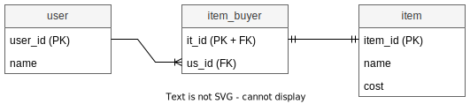

# M1 и 1M

TODO см стр 183 учебника на хитрый мапинг.

## @ManyToOne и @OneToMany

Как было уже сказано в конспекте с разъяснениями типов связей, М1 и 1М это по сути одно и то же. Для мапинга используются следующие аннотации:

* `@ManyToOne` и `@OneToMany` - после конспекта с разъяснениями типов связей не должно быть проблем с определением того, кто в связи "один", а кто "многий". Через эти аннотации задаются такие вещи как:
  * Тип выборки (жадная \ ленивая)
  * Обязательно ли должно быть значение в поле.
  * Для стороны "один" через параметр mappedBy задается поле стороны "многих", которое содержит мапинг.
  * Мб что-то еще.
* `@JoinColumn` - эту аннотацию мы применяем во владельце связи для указания столбца, хранящего внешний ключ.

На примере Город-Страна (сначала хотел расписать, но потом стер, потому что кажется чем больше писанины, тем сильнее размывается внимание. По примерам и так дб понятно что к чему):

```java
@Entity
@Table(name = "city", schema = "otmb")
@Getter @Setter
public class City {

    @Id
    @Column(name = "ct_id")
    @GeneratedValue(strategy = GenerationType.IDENTITY)
    private long id;

    @Column(name = "name")
    private String name;

    @ManyToOne(fetch = FetchType.EAGER)  // <-- Связь City->Country это M1, поэтому @ManyToOne
    @JoinColumn(name = "fk_country_id")  // <-- Город это владелец связи, ссылка на страну у него в колонке fk_country_id
    private Country country;

}
```

## Параметр mappedBy

Сама по себе страна не знает, с какими городами она связана, т.к. она не является владельцем связи. Поэтому через параметр mappedBy мы указываем поле класса города, которое содержит мапинг на страну. Тогда хибер сможет по значениям внешнего ключа понять, какие города относятся к стране.

```java
@Entity
@Table(name = "country", schema = "otmb")
@Getter @Setter
public class Country {

    @Id
    @Column(name = "cnt_id")
    @GeneratedValue(strategy = GenerationType.IDENTITY)
    private long id;

    @Column(name = "name")
    private String name;

    // <-- (Если нужна двунаправленная связь)
    @OneToMany( // <-- Связь Country->City это 1M, поэтому @OneToMany
        mappedBy = "country",  // <-- Указываем поле класса City, которое содержит мапинг на сущность Country
        fetch = FetchType.EAGER)  
    private Collection<City> cities = new ArrayList<>();

}
```

## SQL

Cхема:

```sql
drop schema if exists otmb cascade;
create schema otmb;
```

Последовательности:

```sql
drop sequence if exists otmb.city_id_seq cascade;

create sequence otmb.city_id_seq
    start with 1 
    increment by 1 
    no minvalue 
    no maxvalue 
    cache 1;
```

```sql
drop sequence if exists otmb.country_id_seq cascade;

create sequence otmb.country_id_seq
    start with 1 
    increment by 1 
    no minvalue 
    no maxvalue 
    cache 1;
```

Таблицы:

```sql
drop table if exists otmb.country cascade;

create table otmb.country (
    cnt_id integer default nextval('otmb.country_id_seq'::regclass),
	name character varying(100),
	---
	primary key(cnt_id)
);
```

```sql
drop table if exists otmb.city cascade;

create table otmb.city (
    ct_id integer default nextval('otmb.city_id_seq'::regclass),
	name character varying(100),
	fk_country_id integer,
	---
	primary key(ct_id)
);

alter table only otmb.city
    add constraint city_to_country_fk foreign key (fk_country_id) references otmb.country(cnt_id);
```

Данные:

```sql
insert into otmb.country (name) values 
('Россия'), 
('Китай');

insert into otmb.city (name, fk_country_id) values
('Москва', 1),
('Санкт-Петербург', 1),
('Пекин', 2)
```


# Через промежуточную таблицу

Гость покупает на аукционе Предмет. Предмет может купить только один гость, гость может купить много предметов.



## Мапинг

Параметры аннотации `@JoinTable` я уже расписывал в конспекте по связи 11, так что если не понятно - туда. Про ее использование конкретно в этом случае на стороне Item можно сказать следующее:

* У @ManyToOne нет параметра mappedBy.
  * Его нет чисто по логической причине: на стороне БД "многие" - это всегда владелец связи. Стало быть, когда в классе мы используем @ManyToOne, то в паре с ней идет и @JoinOlolo с указанием столбца внешнего ключа.
* Отсутствие mappedBy у @ManyToOne значит, что мапинг можно сделать только на стороне "многих", т.е. @JoinOlolo заполнять именно в классе Item.

```java
@Entity
@Table(name = "item", schema = "otmb")
@Getter @Setter
public class Item {

    @Id
    @GeneratedValue(strategy = GenerationType.IDENTITY)
    @Column(name = "item_id")
    private long id;

    @Column(name = "name")
    private String name;

    @Column(name = "cost")
    private int cost;

    @ManyToOne(fetch = FetchType.EAGER)
    @JoinTable(name = "item_buyer", schema = "otmb",
        joinColumns = @JoinColumn(name = "it_id"),
        inverseJoinColumns = @JoinColumn(name = "us_id", nullable = false))
    private User user;

}
```

Ну а @OneToMany по своей природе полагается на "противоположную" строну с помощью mappedBy:

```java
@Entity
@Table(name = "user", schema = "otmb")
@Getter @Setter
public class User {

    @Id
    @GeneratedValue(strategy = GenerationType.IDENTITY)
    @Column(name = "user_id")
    private long id;

    @Column(name = "name")
    private String name;

    @OneToMany(mappedBy = "user", fetch = FetchType.EAGER)
    private Set<Item> items = new HashSet<>();

}
```

## SQL

Схема:

```sql
drop schema if exists otmb cascade;
create schema otmb;
```

Сиквенсы:

```sql
drop sequence if exists otmb. user_id_seq cascade;

create sequence otmb.user_id_seq
    start with 1 
    increment by 1 
    no minvalue 
    no maxvalue 
    cache 1;
```

```sql
drop sequence if exists otmb.item_id_seq cascade;

create sequence otmb.item_id_seq
    start with 1 
    increment by 1 
    no minvalue 
    no maxvalue 
    cache 1;
```

Таблицы:

```sql
drop table if exists otmb.user cascade;

create table otmb.user (
    user_id integer default nextval('otmb.user_id_seq'::regclass),
	name character varying(100),
	---
	primary key(user_id)
);
```

```sql
drop table if exists otmb.item cascade;

create table otmb.item (
    item_id integer default nextval('otmb.item_id_seq'::regclass),
	name character varying(100),
	cost integer not null,
	---
	primary key(item_id)
);
```

```sql
drop table if exists otmb.item_buyer cascade;

create table otmb.item_buyer (
    it_id integer,
	us_id integer,
	---
	primary key(it_id)
);

alter table only otmb.item_buyer
    add constraint item_buyer_to_item_fk foreign key (it_id) references otmb.item(item_id) 
        on delete restrict;
		
alter table only otmb.item_buyer
    add constraint item_buyer_to_user_fk foreign key (us_id) references otmb.user(user_id) 
        on delete restrict;
```

Данные:

```sql
insert into otmb.user (name) values
('Tom'),
('Huck');

insert into otmb.item (name, cost) values
('Крючок для удочки', 10),
('Стеклянный шарик', 25),
('Первый весенний клещ', 50),
('Зуб Тома Сойера', 70),
('Дохлая кошка', 100);

insert into otmb.item_buyer (it_id, us_id) values
(1, 1), (2, 1), (4, 1),
(3, 2), (5, 2);
```


# TODO

- [ ] Есть на стр.183 учебника странный пример со странным мапингом и использованием List в качестве коллекции. Что-то там связано с read-only.
- [ ] Вообще поэкспериментировать потом получше со всеми этими сохранениями туда-сюда, каскадами.

