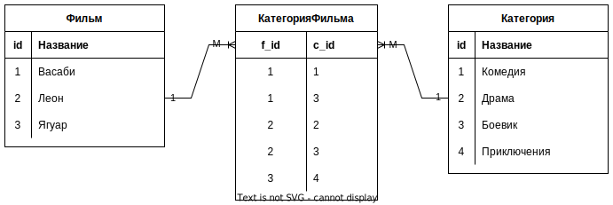

# ММ

## Голые java классы

При мэпинге ММ все делается так же как и в М1, потому что ММ в БД всегда делается через промежуточную сущность, а это по сути М1 + М1.



```java
public class Film {
    private Set<FilmCategory> filmCategory = new HashSet<>();
}
```

```java
public class Category {
    private Set<FilmCategory> filmCategory = new HashSet<>();
}
```

```java
public class FilmCategory {
    private Film film;
    private Category category;
}
```

## Мапим

Начинаем думать с владельца связи, FilmCategory, потому что так проще:

```java
@Table(name = "film_category")
public class FilmCategory {
    @ManyToOne
    @JoinColumn(name = "film_id", insertable = false, updatable = false)
    private Film film;

    @ManyToOne
    @JoinColumn(name = "category_id", insertable = false, updatable = false)
    private Category category;

    @EmbeddedId
    private Id id = new Id();

    private FilmCategory() { }

    public FilmCategory(Film film, Category category) {
        // Связи в классах мы должны сделать руками, как будто никакого хранения нет
        this.film = film;
        this.category = category;

        this.id.categoryId = category.getId();
        this.id.filmId = film.getId();

        film.getFilmCategory().add(this);
        category.getFilmCategory().add(this);
    }

    @Embeddable
    public static class Id implements Serializable {
        @Column(name = "film_id")
        private Long filmId;

        @Column(name = "category_id")
        private Long categoryId;
    }
}
```

```java
@Table(name = "film")
public class Film {
    @OneToMany(mappedBy = "film")
    private Set<FilmCategory> filmCategory = new HashSet<>();
}
```

```java
@Table(name = "category")
public class Category {
    @OneToMany(mappedBy = "category")
    private Set<FilmCategory> filmCategory = new HashSet<>();
}
```

В классах нужно обязательно реализовать hashCode, equals, настроить тип выборки и прочее. Здесь приведена только суть, относящаяся непосредственно к пониманию мэпинга.

Во владельце связи разве что следует обратить внимание на оформление составного PK, для которого объявляется отдельный вложенный класс и создается объект. Геттеры\сеттеры в нем можно не делать, потому что внешний класс видит поля вложенного и так. И еще в конструкторе нужно руками связывать все объекты, потому что хибер за это не отвечает.

Пример использования:

```java
Category adventure = new Category();
adventure.setName("Приключения");

Category horror = new Category();
horror.setName("Ужасы");

Category zombie = new Category();
zombie.setName("Зомби");

Film rotld = new Film();
rotld.setTitle("Возвращение живых мертвецов");
rotld.setLength(95);
rotld.setReleaseYear(1984);

Film ij = new Film();
ij.setTitle("Индиана Джонс и ковчег судьбы");
ij.setLength(103);
ij.setReleaseYear(1987);

manager.getTransaction().begin();
manager.persist(adventure);
manager.persist(horror);
manager.persist(zombie);
manager.persist(rotld);
manager.persist(ij);

FilmCategory fcRotldHorror = new FilmCategory(horror, rotld);
FilmCategory fcRotldZombie = new FilmCategory(zombie, rotld);
FilmCategory fcIjAdventure = new FilmCategory(adventure, ij);

manager.persist(fcRotldHorror);
manager.persist(fcRotldZombie);
manager.persist(fcIjAdventure);
manager.getTransaction().commit();
```

```java
private void getFilmWithCategories3Entiry(long filmId) {
    Film film = manager.find(Film.class, filmId);
    System.out.println(String.format("Фильм %s относится к этим категориям:", film));
    for (FilmCategory fc : film.getFilmCategory()) {
        System.out.println(fc.getCategory().getName());
    }
}
```

## ММ без третьего класса

На стороне БД связь ММ *всегда* реализуется через третью таблицу, но при мапинге при желании можно использовать всего два класса, хотя вариант реализации через три класса считается предпочтительнее. Например, если связующая таблица содержит какие-нибудь дополнительные поля (например, есть таблица Users и Roles, и в связующей таблице можно хранить информацию о том, кто назначил пользователю ту или иную роль), то вариант через три класса нагляднее и проще для развития.

Но для галочки приведу пример мапинга ММ через два класса. Здесь, опять же, можно сделать как двунаправленную, так и однонаправленную связь, смотря как нам надо. Пусть можно будет получить все жанры, к которым относится фильм, и все фильмы какого-то жанра, т.е. связь двунаправленная.

Основное "мясо" соединения можно описать в любом из двух классов. Тогда во втором классе все будет просто. Сделаем мясо в классе фильма:

```java
@Entity
@Table(name = "film_s")
public class Film extends AbstractEntity {
    @ManyToMany(cascade = CascadeType.PERSIST, fetch = FetchType.LAZY)
    @JoinTable(name = "film_category",
            joinColumns = @JoinColumn(name = "film_id"),
            inverseJoinColumns = @JoinColumn(name = "category_id"))
    private Set<Category> categories = new HashSet<>();

```

```java
@Entity
@Table(name = "category")
public class Category extends AbstractEntity {
	@ManyToMany(mappedBy = "categories", fetch = FetchType.LAZY, cascade = CascadeType.PERSIST)
    private Set<Film> films = new HashSet<>();
```

* @JoinTable:
  * name - указываем имя *таблицы* (именно таблицы, а не класса), которая является в БД промежуточной и связывает фильмы и категории.
  * joinColumns - поскольку мы описываем "мясо" в классе Film, мы должны указать в joinColumns поле связующей таблицы, которое указывает на таблицу Film. Это поле film_id (т.е. этот film_id не из таблицы film, а именно из таблицы film_category, т.е. из промежуточной)
  * inverseJoinColumns - здесь указываем столбец связующей таблицы, который указывает на "противоположную" таблицу. Поскольку мясо мы пишем в классе Film, то противоположная таблица - это очевидно category. А в промежуточной таблице film_category на таблицу category указывает поле category_id.

