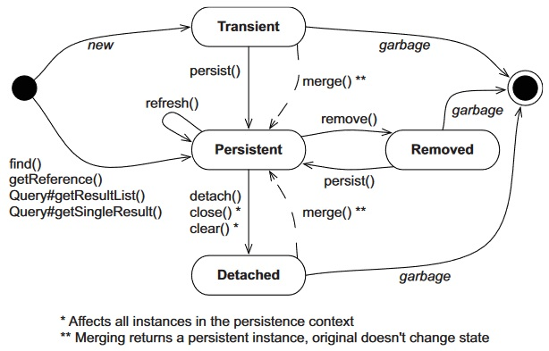

# Состояния сущности и переходы

Разные провайдеры могут в своей внутренней работе использовать разные состояния, о которых нам даже не известно.

JPA же предоставляет нам в пользование следующую схему состояний:

* `Transient` (или new, переводится как "временный") - это объекты, созданные через оператор new. Время их существования - как и у обычных объектов - пока на них существует ссылка. Любые изменения, внесенные в объект, откатить невозможно, потому что хибер за ними еще не наблюдает. 

* `Persistent` (или managed) - это объекты, сохраненные или извлеченные из БД. Они имеют идентификатор, и контекст отслеживает их состояние.

  Переход в Persistent происходит:

  * Когда мы передаем объект в метод `EntityManager.persist()`.
  * Когда мы сохраняем ссылку на объект A в объект B и сохраняем последний через `em.persist(B)`, при условии что включено каскадное сохранение.

* `Removed` - в это состояние сущность переходит после выполнения `em.remove()` или после удаление ее из замапленной коллекции (при активированной опции *orphan removal*). При завершении unit of work сущность удаляется из БД. В программе нам тоже нужно быть внимательными и никуда не передавать ссылку на удаленный объект, чтобы он не остался висеть в памяти.

* `Detached` ("отделенный", "обособленный") - это состояние, когда сущность "отделяется" от контекста, который ее загрузил. Например, если контекст закрылся или мы намеренно ее отсоединили, сущность остается как бы сама по себе и исчезает из памяти как обычный объект. В БД она конечно останется, но все изменения, внесенные после отделения, потеряются. Пока она не исчезла, ее можно опять ввести в контекст методом `em.merge(myEntity)`.