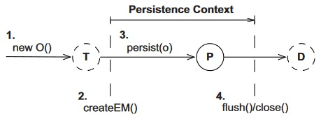
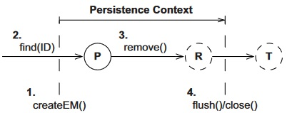

# Сохранение



```java
var country = new Country();
country.setName("Аргентина");

tx.begin();
manager.persist(country);  // <-- Переводим сущность в состояние Persistent
tx.commit();
```

Вызов метода persist можно назвать "сохранением" весьма условно, потому что то, что происходит при его выполнении, зависит от того, как организовано получение идентификатора. Например, если это IDENTITY стратегия, то строка немедленно вставляется в БД, а если стратегия SEQUENCE, то хибер просто запрашивает id у сиквенса из БД, а реальное сохранение строки происходит только при commit(). Предпочтительнее считается просто получать идентификатор (в конспектах по стратегиям генерации id об этом тоже упоминалось).

Рекомендации по сохранению сущностей:

* Желательно полностью инициализировать сущность перед вызовом persist(). Причины могут быть разные, например:

  * В БД на колонке стоит ограничение not null. В сущности стратегия генерации IDENTITY, т.е. запись должна сразу вставлять в БД. Мы не заполняем поле объекта, передаем его в persist() и получаем ошибку.

  * В БД ограничений на null нет, стратегия генерации не важно какая. Мы не заполняем поле, передаем объект в persist(), ошибок не получаем. Потом заполняем поле, вызываем commit() и получаем два запроса вместо одного:

    ```
    insert into otmb.country (name, cnt_id) values (?, ?)
    update otmb.country set name=? where cnt_id=?
    ```

  * Может быть есть еще и другие причины. Одним словом, лучше сначала полностью все заполнить, а потом уже сохранять.

# Извлечение

## .find(), снапшот

```java
var country = em.find(Country.class, 20);
```

Сначала хибер проверяет наличие сущности в памяти (кэш 1 уровня, подробнее в конспекте про кэши). Если ее там нет, то обращается к БД. Если ее нет и там, возвращает null.

Хибер полностью инициализирует сущность при загрузке, так что если контекст закрыть, то все поля будут заполнены. Но если у сущности есть поле-коллекция, загружаемая лениво, то коллекция конечно не заполнится, и после закрытия контекста попытка обойти эту коллекцию приведет к ошибке.

При загрузке хибер создает *снапшот* сущности. Это позволяет ему впоследствии определить, изменяли мы сущность или нет.

## .getReference(), ссылка на сущность

Есть еще один способ извлечь сущность:

```java
var country = em.getReference(Country.class, 20);
```

> Это отдельная тема книги и по ней, следовательно, будут отдельные разделы конспекта. Однако вскользь упомянуть про этот метод необходимо, потому что некоторые методы (например, remove) работают с сущностями, извлеченными таким образом, не так как с .find()-сущностями.

Если искомая сущность уже находится в памяти, то `.getReference()` возвращает на нее ссылку. Если ее в памяти нет, то хибер создает и возвращает так называемый *прокси*-объект сущности, не обращаясь к БД. Ключевая особенность здесь - именно этот возврат объекта без обращения к БД.

# Модификация, dirty-check, рефреш

## dirty-check

При коммите хибер проводит для всех сущностей в памяти *dirty-check* - проверку, изменилась ли сущность с момента загрузки. Если изменились, он использует update-запросы, чтобы отразить эти изменения в БД.

```java
tx.begin();
country.setName("Ямайка");  // <-- Контекст увидит изменение.
tx.commit();  // <-- И подготовит нужный SQL-запрос для отражения этого изменения в БД.
```

По умолчанию запросы обновления подготавливаются на старте приложения и содержат все поля. Т.е. в update-запрос "за компанию" попадут все поля сущности, даже если они не изменялись. Можно включить динамическую генерацию update-запросов аннотациями `@org.hibernate.annotations.DynamicInsert` и `@org.hibernate.annotations.DynamicUpdate`. Но как видно, это хибер-фича, не входящая в JPA.

## .refresh()

Если после извлечения мы изменим прямо в БД имя страны и повторно выберем сущность, то изменений этих не увидим, т.к. сущность уже находится в памяти и поэтому в БД хибер не полезет. Чтобы принудительно заставить хибер перечитать данные сущности из БД, используется метод `.refresh()`. При этом все изменения сущности, находящиеся в памяти, перезаписываются перечитанными из БД значениями. Если сущности в БД уже нет, хибер выбрасывает исключение `EntityNotFoundException`:

```java
var country = em.find(Country.class, 20);
String name = country.getName();  // Например, Аргентина.
// Меняем руками название страны в БД на Ямайка.
country = em.find(Country.class, 20);  // Повторно выбираем сущность.
name = country.getName();  // Осталась Аргентина.

try {
    em.refresh(country);
    name = country.getName();  // Вот теперь - Ямайка
} catch (EntityNotFoundException ex) {
    // Сущности уже нет в БД, неоткуда перечитывать данные.
}
```

Рефреш удобно использовать, чтобы сбросить все изменения, сделанные в памяти.

# Удаление

Процесс удаления выглядит примерно так:

* Методом `em.remove(entity)` переводим сущность в состояние *removed*. При этом из БД она еще не удаляется, а просто хибер для себя отмечает ее как подлежащую удалению.
  * Отменить удаление можно, если выполнить `em.persist(entity)` до коммита транзакции.
  * Если remove выполняется на сущности, которая получена методом .getReference(), то сперва выполняется select к БД, чтобы полностью инициализировать сущность, т.к. сущность может делать переходы состояний только если полностью инициализирована.
* После коммита транзакции строка удаляется из БД, а в программе сущность остается в состоянии *transient*.



```java
// <-- Сначала добавим страну, чтобы было что удалять
var japan = new Country();
japan.setName("Япония");

EntityManager lem = factory.createEntityManager();
lem.getTransaction().begin();
lem.persist(japan);
long id = japan.getId();
lem.getTransaction().commit();
lem.close();

// <-- Теперь извлекаем-удаляем
var country = em.find(Country.class, id);
boolean present = em.contains(country);  // true

EntityTransaction tx = em.getTransaction();
tx.begin();
em.remove(country);  // <-- Удаляем
// em.persist(country);  // <-- Отменяем удаление, если надо
present = em.contains(country);  // false
tx.commit();
```


# Дополнительные операции

## em.contains()

TODO: подробнее расписать про этот метод

## PersistenceUnitUtil

```
PersistenceUnitUtil util = factory.getPersistenceUnitUtil();
```

## Пересохранение

Для хибера есть настройка (задается в файле persistence.xml):

```xml
<property name="hibernate.use_identifier_rollback" value="true"/>
```

Она говорит хиберу сбрасывать или нет идентификатор сущности при ее удалении. Например:

```java
...
em.persist(entity);  // Пусть сущность получает id = 20
...
em.remove(entity);  // При true id станет 0, при false останется 20
...
em.persist(entity);  // При true будет новый id, напр. 21. При false сохранится под старым 20.
```

TODO: мутная тема. При разных комбинациях true \ false + момент пересохранения (внутри одной транзакции или разных) может работать или давать ошибку. Можно вернуться и доразобрать этот момент после проработки раздела про detached-состояние, т.к. одна из ошибок как раз "detached entity passed to persist".
