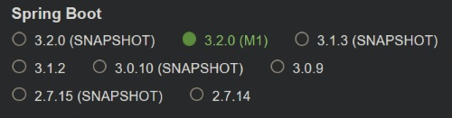
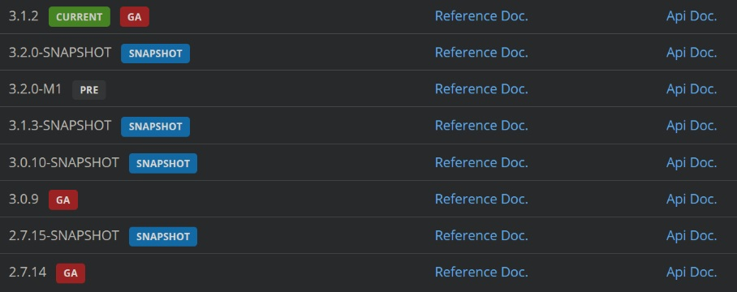
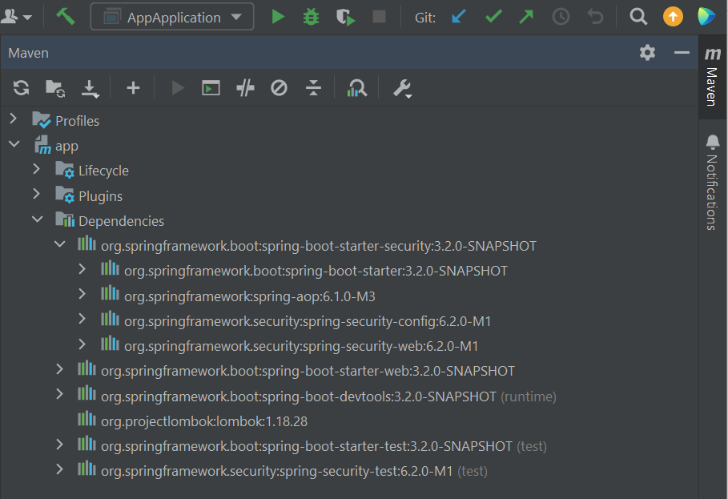

# Маркировка сборок Spring Boot

При генерации пустого проекта на https://start.spring.io/ мы можем выбрать разные версии Spring Boot, например:



Также на официальной странице проекта можно видеть [версии с похожей маркировкой](https://spring.io/projects/spring-boot#learn):



Маркировка означает следующее:

* GA - General Availability, это законченная стабильная версия, в которую уже не вносят изменения. В ней исправлены все ошибки, известные на момент ее выпуска.
* Current GA - это самая актуальная на данный момент GA.
* Pre - это последняя версия проекта, достигшая важной точки разработки (майлстоуна). Она еще не закончена, поэтому может содержать ошибки и выложена для того, чтобы просто можно было ее потыкать и посмотреть, что примерно будет в следующем релизе. Pre версия собирается единожды и не обновляется. Может выйти другая Pre версия на следующем майлстоуне.
* SNAPSHOT - ежедневный билд указанной версии. По сути это Pre, но только обновляющийся каждый день, поэтому может исправлять какие-то ошибки, но вносить новые.

Т.о. по скринам выше можно понять следующее:

* Самая новая стабильная версия - 3.1.2
* Самая новая версия, которая еще в разработке - 3.2.0

# Состав сборок и версии зависимостей

Рассмотрим, как узнать, какие зависимости (и их версии) входят в состав boot-сборок.

## Резюме

Пока с гитом непонятки, можно делать так: открывать градл в гите для нужного стартера, брать оттуда имя зависимости, переходить в документацию и в ней искать версию для этой зависимости.

## IDEA

Удобно, если есть готовый проект, который можно открыть. В разделе Dependencies можно раскрывать ветки и там будут указаны версии для всех зависимостей.



Видно, что spring-boot-starter-security состоит из четырех зависимостей:

* spring-boot-starter
* spring-aop
* spring-security-config
* spring-security-web

Можно раскрывать дальше и смотреть версии зависимостей зависимостей и т.д.

## Git

Переходим в [репозиторий](https://github.com/spring-projects/spring-boot/tree/main/spring-boot-project/spring-boot-starters) всех boot-проектов, ищем там нужный и открываем файл build.gradle. Например, вот этот файл для [spring-boot-starter-security](https://github.com/spring-projects/spring-boot/blob/main/spring-boot-project/spring-boot-starters/spring-boot-starter-security/build.gradle):

```groovy
dependencies {
	api(project(":spring-boot-project:spring-boot-starters:spring-boot-starter"))
	api("org.springframework:spring-aop")
	api("org.springframework.security:spring-security-config")
	api("org.springframework.security:spring-security-web")
}
```

Видим те же самые четыре зависимости, которые видели и в IDEA, но без версий.

Вот для [spring-boot-starter-web](https://github.com/spring-projects/spring-boot/blob/main/spring-boot-project/spring-boot-starters/spring-boot-starter-web/build.gradle):

```groovy
dependencies {
	api(project(":spring-boot-project:spring-boot-starters:spring-boot-starter"))
	api(project(":spring-boot-project:spring-boot-starters:spring-boot-starter-json"))
	api(project(":spring-boot-project:spring-boot-starters:spring-boot-starter-tomcat"))
	api("org.springframework:spring-web")
	api("org.springframework:spring-webmvc")
}
```

TODO: как определить версии по гиту, я не еще не нашел. Есть вот такой [градл файл](https://github.com/spring-projects/spring-boot/blob/3.1.x/spring-boot-project/spring-boot-dependencies/build.gradle) как бы всех зависимостей бута, но там не удается найти зависимости по именам, указанным выше. При том, что в документации они ищутся один в один.

## Документация

На главной странице спринга https://spring.io/ в меню выбираем Projects > Spring Boot. На открывшейся странице выбираем вкладку Learn, видим список актуальных версий. Жмем напротив нужной версии ссылку Reference Doc, на открывшейся странице листаем вниз и жмем ссылку Dependency Versions. Оказываемся в итоге на странице, где перечислены все зависимости (с версиями), входящие в выбранный [релиз Spring Boot](https://docs.spring.io/spring-boot/docs/current/reference/html/dependency-versions.html#appendix.dependency-versions).


