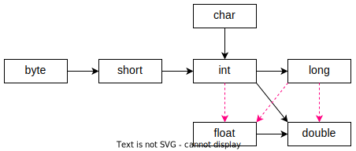

# Конвертация типов

Между примитивными типами возможны переходы. Некоторые ведут к потере точности (обозначены красными стрелками):



Конвертации с потерей точности должны быть описаны явно:

```java
double dnum = 7.77;
inum = (int) dnum;  // <-- Указываем целевой тип (int)
System.out.println(dnum);  // 7.77
System.out.println(inum);  // 7
```

Остальные происходят автоматически:

```java
int inum = 2_147_100_100;
float fnum = inum;
System.out.println(inum);  // 2_147100100
System.out.println(fnum);  // 2.1471002E9
```

