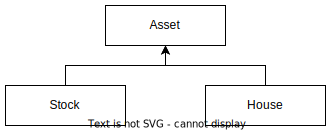

# Приведение ссылок, upcasting и downcasting

Ссылка - это "трафарет", который дает доступ к элементам, которые есть в ее типе. Ссылки можно трансформировать между типами потомка и родителя.

```java
public class Asset {
    public String name;

    public Asset(String name) {
        this.name = name;
    }
}
```

```java
class House extends Asset {
    public long cost;

    public House(String name, long cost) {
        super(name);
        this.cost = cost;
    }
}
```

```java
class Stock extends Asset {
    public long sharesOwned;

    public Stock(String name, long sharesOwned) {
        super(name);
        this.sharesOwned = sharesOwned;
    }
}
```

## Upcasting

Приведение "вверх", от частного к общему, от типа потомка к типу родителя. Как запомнить: иерархия наследования обычно изображается сверху вниз, где сверху - базовый класс, а снизу - потомок:



Соответственно, *up*-casting это движение вверх, т.е. от потомка к родителю.

Апкастинг проводится автоматически, неявно, для этого достаточно просто положить объект потомка в ссылку родителя:

```c#
Asset ass = new House(
    "Castle",  // Поле name доступно через ссылку типа Asset
    25_000_000);  // Поле cost не доступно, но присутствует
```

При этом через ссылку ass теперь будут доступны только те элементы, которые есть у типа Asset. Элементы типа House будут присутствовать в самом объекте, но через ссылку ass доступны не будут, потому что их нет в типе Asset:

```c#
ystem.out.println(ass.name);  // Ok
System.out.println(ass.cost);  // Ошибка!
```

## Downcasting

Приведение "вниз", от общего к частному, от родителя к потомку, проводится только явно и только в том случае, если по приводимой ссылке лежит объект правильного типа:

```c#
Asset ass = new House("Castle", 25_000_000);
House house = (House)ass;  // <-- Downcasting

System.out.println(house.name);  // Через ссылку "полного" типа оба свойства доступны
System.out.println(house.cost);
```

Поскольку в переменной Asset может лежать и другой потомок, например, типа Stock, то в этом случае в процессе выполнения программы мы получим исключение `java.lang.ClassCastException`:

```c#
Asset ass = new Stock("Shares", 1_000);
House house = (House)ass;  // Исключение: ClassCastException: class Stock cannot be cast to class House
```

## Оператор instanceof

Оператор `instanceof` пытается привести тип справа к типу слева и возвращает true \ false, если это возможно или нет.

```java
Asset ass = new Asset("Asset");
House house = new House("House", 5_000_000);

boolean assetIsHouse = ass instanceof House;  // false
boolean houseIsAsset = house instanceof Asset;  // true
```

Обычно после таких проверок мы выполняем приведение и кладем получившийся объект в переменную. На этот случай у instanceof есть удобный синтаксис с введением переменной, в которую кладется успешно приведенный объект:

```java
Asset ass = new House("House", 25_000_000);
if (ass instanceof House h  // Если ass относится к типу House, сделать даункаст и положить объект в h
       && h.cost > 20_000_000) {  // Переменной h можно сразу начинать пользоваться
    System.out.println(h.name);
    System.out.println(h.cost);
} else {
    System.out.println("Объект, лежащий в ass, не является экземпляром House.");
}
```

Применять синтаксис с введением переменной можно везде, где хватит фантазии:

```java
long cost = ass instanceof House h ? h.cost : 0;
```