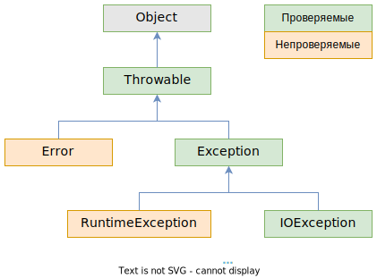

# Схема классов

Базовый класс всех исключений - это класс *Throwable*. Да, это именно класс, а не интерфейс. Причем класс обычный, не абстрактный.

От него идут две крупные ветки:

* *Error* - это исключения, связанные с внутренними ошибками виртуальной машины джавы и нехваткой ресурсов. Самостоятельно выбросить исключение из этой ветки невозможно. Примеры: *StackOverflowError* (при бесконечной рекурсии), *OutOfMemoryError* (недостаточно памяти для создания новых объектов). Соответственно, ловить такие исключения смысла нет.
* *Exception* - это исключения, которые можно выбросить самостоятельно. Концептуально тоже делятся на:
  * *IOException* - логически, это ошибки, не зависящие от программиста (попытка чтения несуществующего файла. Например, сначала проверили существование, а потом пользователь удалил файл. Попытка получить объект Class, когда передано неправильное имя класса и т.д.)
  * *RuntimeException* - это "ошибки программиста", т.е. ошибки, которые могут возникнуть из-за невнимательности при программировании (обращение по null-ссылке, попытка получить элемент массива с несуществующим индексом и т.д.)

# Проверяемые и непроверяемые исключения

Все исключения делятся на **проверяемые** и **непроверяемые**. Проверяемые значит что компилятор в местах потенциального возникновения исключения будет искать обработчик исключения, и если его нет, даст ошибку компиляции.

Непроверяемые - это наследники *Error* и *RuntimeException*. Проверяемые - это все остальные (по сути, *Throwable*, *Exception* и *IOException* с потомками).