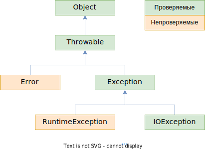

# Вопросы

- [ ] Какая связь между классами Throwable, Error, Exception, IOException, RuntimeException?
  - [ ] Что для компилятора означают проверяемые и непроверяемые (checked и unchecked) исключения? Какие из указанных выше исключений к какой категории относятся?
  - [ ] Что логически представляют собой исключения из ветки Error? Можно ли их выбросить самостоятельно? Аналогично расскажите про ветку Exception
  - [ ] Какой класс исключений из упомянутых подходит под определение "ошибки программиста"?
- [ ] Зачем к методу применять оператор throws?
  - [ ] Как он помогает "отсрочить" обработку проверяемых исключений?
  - [ ] Почему не стоит указывать в throws непроверяемые исключения? Объяснить с технической и логической точек зрения
- [ ] Объясните, как вы понимаете следующие правила
  - [ ] "Выбрасывать исключения надо как можно раньше, а обрабатывать как можно позже"
  - [ ] "Методы подкласса не должны выбрасывать более общее исключение, чем методы суперкласса"
- [ ] При объявлении своего исключения нужно два конструктора. Расскажите, что это за конструкторы? Какие параметры они принимают и что происходит у них внутри?
- [ ] Оператор catch
  - [ ] Что делает оператор catch вот в такой форме catch (FileNotFoundException | UnknownHostException ex) { ... ? Почему нельзя так поймать два исключения, если одно является потомком другого?
  - [ ] Почему в catch нужно располагать исключения в порядке, начиная с самого конкретного, а заканчивая самым общим?
- [ ] Для чего у исключений есть методы .initCause(ex) и .getCause()?
- [ ] Расскажите о работе try-catch-**finally** на следующих сценариях:
  - [ ] В try возникло исключение, его обработали в catch
  - [ ] В try возникло исключение, и в catch возникло еще исключение. Доработает ли программа до конца? Если нет, то в каком месте она остановится?
  - [ ] Что будет при исключении в try, если блока catch нет вообще, а есть только finally? А если исключение возникнет и в finally тоже?
    - [ ] Что такое suppressed (подавленные) исключения, которые можно получить из объекта исключения методом .getSuppressed? Как они образуются? Что нужно добавить в сценарий выше, чтобы поймать подавленное исключение?
  - [ ] Какая особенность есть у finally, когда дело касается оператора return? Если return есть и в блоке try, и в блоке finally и при этом не произошло исключений, то какой return сработает?
- [ ] Чем полезен паттерн, когда блок try-finally оборачивается в блок try-catch?
- [ ] Зачем нужен интерфейс AutoClosable с единственным методом .close? Как это связано с техникой "try с ресурсами"?
  - [ ] Как выглядел бы код, аналогичный по эффекту коду try с ресурсами?
  - [ ] В каком порядке выполняется код из .close, catch и finally, если в try с ресурсами возникает исключение? А если исключения не было?
  - [ ] Что если в .close возникает исключение? Как это связанно с suppressed-исключениями? Опишите на сценариях, когда в try есть исключение и когда его там нет


# Схема классов



Базовый класс всех исключений - это класс *Throwable*. Да, это именно класс, а не интерфейс. Причем класс обычный, не абстрактный.

От него идут две крупные ветки:

* *Error* - это исключения, связанные с внутренними ошибками виртуальной машины джавы и нехваткой ресурсов. Самостоятельно выбросить исключение из этой ветки невозможно. Примеры: *StackOverflowError* (при бесконечной рекурсии), *OutOfMemoryError* (недостаточно памяти для создания новых объектов). Соответственно, ловить такие исключения смысла нет.
* *Exception* - это исключения, которые можно выбросить самостоятельно. Концептуально тоже делятся на:
  * *IOException* - логически, это ошибки, не зависящие от программиста (попытка чтения несуществующего файла. Например, сначала проверили существование, а потом пользователь удалил файл. Попытка получить объект Class, когда передано неправильное имя класса и т.д.)
  * *RuntimeException* - это "ошибки программиста", т.е. ошибки, которые могут возникнуть из-за невнимательности при программировании (обращение по null-ссылке, попытка получить элемент массива с несуществующим индексом и т.д.)

# Проверяемые и непроверяемые исключения

Все исключения делятся на **проверяемые** и **непроверяемые**. Проверяемые значит что компилятор в местах потенциального возникновения исключения будет искать обработчик исключения, и если его нет, даст ошибку компиляции.

Непроверяемые - это наследники *Error* и *RuntimeException*. Проверяемые - это все остальные (по сути, *Throwable*, *Exception* и *IOException* с потомками).

# Создание и выброс исключений

## Создание своего исключения

Чтобы создать свое исключение, нужно добавить новый класс и унаследоваться от существующего класса исключения. "Проверяемость" исключения наследуется, т-е если унаследоваться от RuntimeException, то исключение будет непроверяемое. Если от Exception - то проверяемое.

При объявлении своего исключения делаем два конструктора:

```java
class MyRtException extends RuntimeException {   // Создали непроверяемое исключение
    
    public MyRtException() { }
    
    public MyRtException(String message) {
        super(message);
    }
    
}
```

## Оператор throw

Для выброса исключения используется оператор `throw`. Выбрасывать можно двумя способами:

```java
var exc = new MyRtException("Тестовая ошибка");
try {
    throw exc;  // Первый, через заранее созданный объект
}
catch (Exception ex) {
    System.out.println(ex.getMessage());
}
```

```java
try {
    throw new MyRtException("Палата №6");  // Второй, сразу же выбрасываем новый объект
}
catch (Exception ex) {
    System.out.println(ex.getMessage());
}
```

# Способы перехвата

* В Java действует то же правило, что и в C# - первыми надо ловить более специфичные исключения:

  ```java
  try {
      throw new MyRtExceptionB();
  }
  catch (Exception ex) {
      System.out.println("Поймал исключение типа Exception");
  }
  catch (MyRtExceptionB ex) {  // Ошибка, даже не скомпилится, т-к сюда попасть невозможно
      System.out.println("Поймал исключение типа MyRtExceptionB");
  }
  ```

  Дополнительная фишка - если компилятор видит попытку поймать вид исключения, который не может возникнуть, он тоже не компилирует:

  ```java
  try {
      throw new MyRtExceptionB();
  }
  catch (MyExceptionA ex) {  // Ошибка компиляции, такое исключение не может возникнуть
      System.out.println("Поймал исключение типа MyExceptionA");
  }
  catch (Exception ex) {
      System.out.println("Поймал исключение типа Exception");
  }
  ```

* Если для двух видов исключений требуется одинаковая обработка, можно совместить их в одном блоке *catch* (доступно с Java 7):

  ```java
  try {
      if (args[0].length() > args[1].length())
          throw new FileNotFoundException();
      else
          throw new UnknownHostException();
  }
  catch (FileNotFoundException | UnknownHostException ex) {
      System.out.println("Поймал исключение, а толку?");
  }
  ```

  Таким образом можно ловить исключения только в случае, когда одно не является потомком другого. Оба исключения из примера являются потомками *IOException*, поэтому все нормально. Но написать например `catch (Exception | UnknownHostException ex)` нельзя, была бы ошибка *Types in multi-catch must be disjoint: 'java.net.UnknownHostException' is a subclass of 'java.lang.Exception'*.

# Повторная генерация и цепочка исключений

Повторный выброс делается так:

```java
try {
    ...     
}
catch (Exception ex) {
    throw ex;
}
```

Цепочка формируется куда удобнее, чем в C#:

```java
try {
    try {
        throw new MyRtExceptionB("Что-то пошло не так");
    }
    catch (Exception ex) {
        MyRtExceptionB reason = new MyRtExceptionB("Демонстрация цепочек исключения");
        reason.initCause(ex);  // <-- В новое исключение добавляем исходную причину
        throw reason;
    }
}
catch (Exception ex) {
    Throwable cause = ex.getCause();  // <-- Получаем причину пойманного исключения
    System.out.println(cause.getMessage());
    System.out.println(ex.getMessage());
    ex.printStackTrace();
}

// Вывод
Что-то пошло не так
Демонстрация цепочек исключения
com.company.sampleprog.MyRtExceptionB: Демонстрация цепочек исключения
	at com.company.sampleprog.Main.main(Main.java:17)
Caused by: com.company.sampleprog.MyRtExceptionB: Что-то пошло не так
	at com.company.sampleprog.Main.main(Main.java:14)
```

# finally и поток выполнения

Блок finally выполняется всегда, что бы ни случилось.

* Сценарий "Нормальный": исключение ловится, обрабатывается и новых исключений не возникает:

  ```java
  try {
      System.out.println("Начали выполнять try");
      throw new Exception();
  }
  catch (Exception ex) {
      System.out.println("Зашли в catch");
  }
  finally {
      System.out.println("Зашли в finally");
  }
  System.out.println("Добрались до последней части программы");
  
  // Вывод
  Начали выполнять try
  Зашли в catch
  Зашли в finally
  Добрались до последней части программы
  ```
```
  
  После нормальной обработки исключения программа идет дальше своим ходом.
  
* Сценарий "Снова здарова": в catch опять возникает исключение, которое не ловится:

  ```java
  try {
      System.out.println("Начали выполнять try");
      throw new RuntimeException("test");
  }
  catch (Exception ex) {
      System.out.println("Зашли в catch");
      if (args.length < 20)
          throw new RuntimeException("test");
  }
  finally {
      System.out.println("Зашли в finally");
  }
  System.out.println("Добрались до последней части программы");
  
  // Вывод
  Начали выполнять try
  Зашли в catch
  Зашли в finally
```

  finally отработал, но программа отвалилась, до последней строчки не добрались.

* Сценарий "Друзья помогут": В catch опять возникает исключение, которое ловится в вызывающем коде:

  ```java
  try {
      try {
          System.out.println("Начали выполнять try");
          throw new RuntimeException("test");
      } catch (Exception ex) {
          System.out.println("Зашли в catch");
          if (args.length < 20)
              throw new RuntimeException("test");
      } finally {
          System.out.println("Зашли в finally");
      }
      System.out.println("Добрались до последней части программы");  // X
  } catch (Exception ex) {
      System.out.println("Попали во внешний catch");
  }
  finally {
      System.out.println("Попали во внешний finally");
  }
  System.out.println("Hello, exceptions!");
  
  // Вывод
  Начали выполнять try
  Зашли в catch
  Зашли в finally
  Попали во внешний catch
  Попали во внешний finally
  Hello, exceptions!
  ```

  До строчки *X* не добрались, но важно то, что сначала  выполнился внутренний finally и только потом попали во внешний catch.

* Сценарий "Поехавший": finally есть, а catch нету вообще:

  ```java
  try {
      if (args.length < 20)
          throw new RuntimeException("test");
  }
  finally {
      System.out.println("Зашли в finally");
  }
  System.out.println("До свидания");
  
  // Вывод
  Зашли в finally
  ```
  
  ```java
  try {
      try {
  	    throw new RuntimeException("test");
      } finally {
      	System.out.println("Зашли в finally");
      }
  }
  finally {
      System.out.println("Попали во внешний finally");
  }
  System.out.println("До свидания");
  
  // Вывод
  Зашли в finally
  Попали во внешний finally
  ```
  
    Все finally все равно выполняются, но до последней строчки не доходим, программа отваливается.

# finally и return

return в finally перебивает остальные return'ы. И поскольку finally выполняется всегда, то нужно осторожнее пользоваться в нем return'ом:

```java
public String methodA() {
    try {
        return "Думаешь, вернется это?";
    }
    finally {
        return "Ничего подобного! Вернется эта строчка.";
    }
    return "Вот это поворот!";  // Строго говоря, эта строчка недостижима, так что compile error
}

// Вывод
Ничего подобного!
```

# Оператор throws в заголовке метода

При объявлении метода можно указать список исключений, которые в нем могут возникнуть. Делается это оператором `throws`.

```java
class MyChecked extends Exception {  }  // Проверяемое
class MyUnchecked extends RuntimeException {  }  // Непроверяемое
```

```java
class Bar {
    
    // В конструкторах тоже можно указывать возможные исключения
    public Bar() throws IOException {

    }

    // через throws указываем потенциальные исключения, которые может выбросить метод
    public void methodA() throws MyChecked {
        throw new MyChecked();  // Ok, хотя нет обработчика, но есть throws
    }

    public void methodB() {
        throw new MyChecked();  // Ошибка компиляции, нет ни throws, ни обработчика
    }

    public void methodC() throws MyUnchecked {  // throws бесполезен для непроверяемых
        throw new MyUnchecked();
    }
    
}
```

```java
public class Main {
    public static void main(String[] args) {
        Bar bar = new Bar();  // Ошибка компиляции, т-к не ловим проверяемое IOException
        bar.methodA();  // Ошибка компиляции, т-к не обрабатываем проверяемое исключение
        bar.methodC();  // Ok, потому что компилятор не следит за непроверяемыми исключениями
    }
}
```

Ошибка тут будет только из-за *IOException* и *MyChecked*, потому что оно проверяемое (т-к наследуется от *Exception*). На *MyUnchecked* компилятор ругаться не будет, потому что оно непроверяемое (т-к наследуется от *RuntimeException*).

Отсюда вывод, что с *технической точки зрения* в throws имеет смысл указывать только исключения, относящиеся к проверяемым. В случае непроверяемых throws бесполезен и ни на что не влияет.

Оператор throws в основном нужен для того, чтобы помечать собственные методы, в которых может возникнуть *IOException* (или другое проверяемое исключение), но обработку хочется делегировать клиентскому коду.

Есть даже такое правило - "выбрасывать исключения надо как можно раньше, а обрабатывать как можно позже". Потому что методы-работяги должны работать и только сообщать о проблемах, а думать как эти проблемы решить должен высокоуровневый клиентский код.

Допустим, мы в методе хотим читать из файла с помощью объекта *FileWriter*:

```java
import java.io.FileWriter;
...
public void methodB() {
    FileWriter writer = new FileWriter("notes3.txt", false);  // Ошибка компиляции тут
}
...
.methodB();
```

Если написать так, то не скомпилируется (ошибка *Unhandled exception: java.io.IOException*), потому что мы не обрабатываем потенциальные IO-ошибки. Но если подписать throws:

```java
import java.io.FileWriter;
...
public void methodB() throws IOException {
    FileWriter writer = new FileWriter("notes3.txt", false);
}
...
.methodB();  // Ошибка компиляции теперь тут
```

То ошибка компиляции уйдет из непосредственно самого метода в место его вызова. Т-е мы таким образом делегируем обработку потенциального исключения клиентскому коду.

# Исключения и Барбара Лисков

> Название условное, т-к мне просто показалось, что тема близка к этому принципу.

Есть правило - потомок не должен выбрасывать более общие исключения, чем родитель. Иначе нельзя будет безопасно использовать объект потомка вместо родителя, потому что если клиентский код ориентирован на отлов исключения, которое были в родителе, он не среагирует на более общее исключение, выброшенное потомком.

Пример:

```java
class MyException extends RuntimeException { }
```

```java
class Parent {
    public void method() {
        throw new MyException();
    }
}
```

```java
class Child extends Parent {
    @Override
    public void method() {
        throw new RuntimeException();  // Потомок выбрасывает более общее исключение
    }
}
```

```java
public static void main(String[] args) {
    
    Parent a = new Child();  // <-- При таком раскладе не поймаем исключение
    try {
        a.method();  // Выбрасывается RuntimeException - более общее
    } catch (MyException ex) {  // А мы рассчитываем на MyException
        System.out.println("Поймали исключение MyException");
    }
    System.out.println("main() ends");
    
}
```
