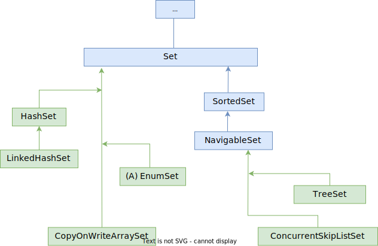
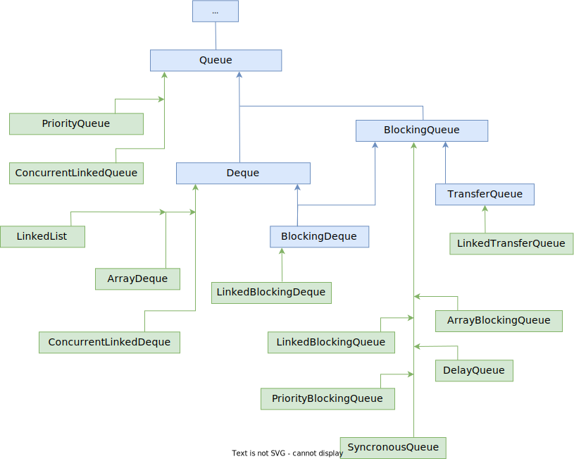

# Схема интерфейсов

https://docs.oracle.com/en/java/javase/12/docs/api/java.base/java/util/doc-files/coll-overview.html

# Реализации

Абстрактные классы не показаны, чтобы не загромождать схемы и чтобы было сразу видно, какой конкретный класс какой интерфейс реализует.

## List

## Set

## Queue

## Map

