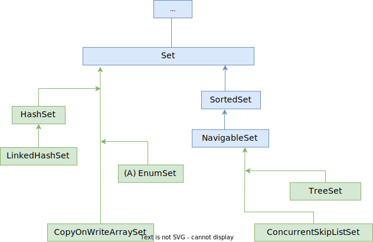

# Схема



# Концепция

Set - это "множество из математики", а множество не может содержать два одинаковых элемента. Следовательно, используй Set, если:

* Нужен набор *без повторяющихся элементов*. Если попробовать добавить повторяющийся элемент, он просто не добавится, исключений не возникнет.

При этом:

* Порядок элементов не важен? Используй HashSet.
* Хочешь, чтобы при итерации элементы шли в том порядке, в котором добавляешь? Используй LinkedHashSet.
* Хочешь, чтобы элементы были отсортированы и можно было делать всякое вроде "найти элементы больше такого-то"? Используй TreeSet.
* В HashSet и LinkedHashSet можно добавить null, в TreeSet - нельзя, будет исключение.

# Set реализован через Map

Все реализации Set основаны на одноименных реализациях Map - HashSet на HashMap, TreeSet на TreeMap, LinkedHashSet на LinkedHashMap. Это возможно за счет того, что запись словаря имеет два слота - один под ключ, и один под данные. Поэтому под капотом любого сета есть словарь, и добавляемый в Set элемент просто сохраняется как ключ, а в данные сохраняется пустой объект-болванка.

```java
public class HashSet<E>
    extends AbstractSet<E>
    implements Set<E>, Cloneable, java.io.Serializable
{
    ...
    transient HashMap<E,Object> map;  // Внутреннее поле под словарь
    ...
    private static final Object PRESENT = new Object();  // Заглушка для значения
    ...
    public HashSet() {
        map = new HashMap<>();  // Создавая множество, по сути создается словарь
    }
    ...
    public boolean add(E e) {
        return map.put(e, PRESENT)==null;  // Добавляя в множество, по сути добавляем в ключ словаря
    }
    ...
}
```


# Интерфейс Set

| Описание     | Ссылка                                                       |
| ------------ | ------------------------------------------------------------ |
| Документация | https://docs.oracle.com/javase/8/docs/api/java/util/Set.html |
| Исходный код | https://github.com/openjdk/jdk/blob/master/src/java.base/share/classes/java/util/Set.java |

```java
public interface Set<E>
	extends Collection<E> {
		// Ничего нового к методам Collection не добавляет
}
```

## Тонкости

* Нужно с осторожностью добавлять в Set изменяемые объекты. Т.к. на момент добавления элемент может быть уникальным, но если его изменить, он может перестать быть уникальным и тогда поведение Set может быть непредсказуемым: у измененного объекта меняется хэш и поэтому его уже не удастся найти в множестве, или если его хэш каким-то образом совпадет с другим объектом, тогда ответ на вопрос "есть ли такой элемент" может быть заведомо ложным

# Интерфейс SortedSet

| Описание     | Ссылка                                                       |
| ------------ | ------------------------------------------------------------ |
| Документация | https://docs.oracle.com/javase/8/docs/api/java/util/SortedSet.html |
| Исходный код | https://github.com/openjdk/jdk/blob/master/src/java.base/share/classes/java/util/SortedSet.java |

* Поддерживает порядок элементов *по возрастанию*. Добавляемый элемент должен реализовать интерфейс Comparable, чтобы можно было сравнить его с другими и найти ему место.

```java
public interface SortedSet<E>
	extends Set<E> {
        +.comparator();    +.headSet();
        +.first();         +.tailSet();
        +.last();          +.subSet();
}
```

В этом интерфейсе появляются новые методы именно за счет наличия порядка среди элементов:

* first\last - первый\последний элемент

* headSet\tailSet - вернуть подмножество, элементы в котором младше\старше указанного. Например:

  ```java
  [1, 2, 3, 4, 5, 6, 7, 8]
  headSet(4) = [1, 2, 3]  // Сам элемент не входит
  tailSet(4) = [4, 5, 6, 7, 8]  // Здесь, включая сам элемент
  ```

  P.S. У конкретной реализации, например, TreeSet, в headSet есть второй параметр - включать или нет сам элемент. Но в общем интерфейсе такого параметра нет. Поэтому в таких случаях стоит помнить, что конкретные реализации могут иметь что-то собственное.

* subSet - вернуть подмножество между двумя элементами. Например:

  ```java
  [1, 2, 3, 4, 5, 6, 7, 8]
  subSet(4, 6) = [4, 5]
  ```

  Аналогичная ситуация и здесь. У TreeSet есть настройки включения\исключения элементов.

# Интерфейс NavigableSet

| Описание     | Ссылка                                                       |
| ------------ | ------------------------------------------------------------ |
| Документация | https://docs.oracle.com/javase/8/docs/api/java/util/NavigableSet.html |
| Исходный код | https://github.com/openjdk/jdk/blob/master/src/java.base/share/classes/java/util/NavigableSet.java |

Это множество с более продвинутыми операциями поиска.

```java
public interface NavigableSet<E>
	extends SortedSet<E> {
        +.ceiling();    +.pollFirst();
        +.floor();      +.pollLast();
        +.higher();     +.descendingIterator();
        +.lower();      +.descendingSet();
}
```

Методы похожи на SortedSet, только более гибкие:

* ceiling\floor - вернуть *один* элемент, который больше\меньше (или равен) заданного. Если такого нет, возвращает null:

  ```java
  [10, 20, 32, 45, 56, 74]
  ceiling(6) = 10  // Т.к. первое число, больше 6, это 10
  floor(6) = null  // Т.к. меньше 6 нет элементов
  floor(15) = 10
  ```

* higher\lower - вернуть один элемент, который *строго* больше\меньше заданного. Если такого нет, возвращает null.

* descendingSet - возвращает то же множество, только элементы расположены по убыванию.

* pollFirst\pollLast - возвращает и удаляет младший\старший элемент.

В NavigableSet уже появляется возможность выставлять включение\исключение элемента при выборе подмножества.