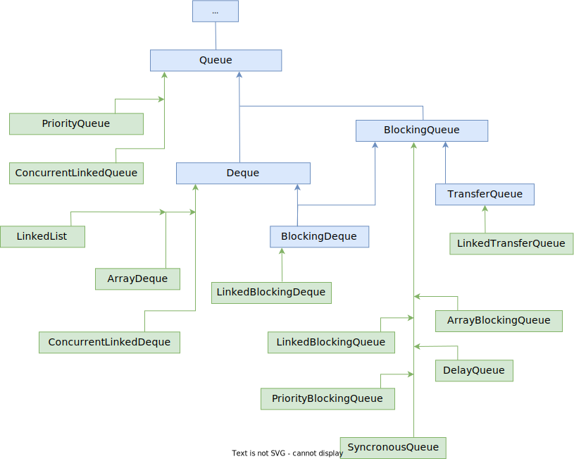

# Интерфейс Queue



```java
public interface Queue<E>
	extends Collection<E> {
        // Добавление в конец очереди
        +.add(E)
        +.offer(E);

        // Взять элемент из начала очереди (без удаления)
        +.element();    
        +.peek();
    
        // Взять элемент из начала очереди (с удалением)
        +.poll();
        +.remove();
}
```

```java
public interface Deque<E>
	extends Queue<E> {
        // Функционал стека
        +.push();  // Добавить в НАЧАЛО (addFirst(e); внутри)
        +.pop();   // Извлечь из НАЧАЛА (removeFirst(); внутри) с удалением
    
        // Функционал очереди
        +.offerFirst();  // Добавление
        +.offerLast();
        +.peekFirst();  // Извлечение
        +.peekLast();   // peek - без удаления, poll - с удалением
        +.pollFirst();  
        +.pollLast();
    
        +.getFirst();  // Остальное понятно из названий
        +.getLast();
        +.addFirst();
        +.addLast();
        +.removeFirst();
        +.removeLast();
        +.removeFirstOccurence();
        +.removeLastOccurence();
    
        +.descendingIterator();
}
```

#