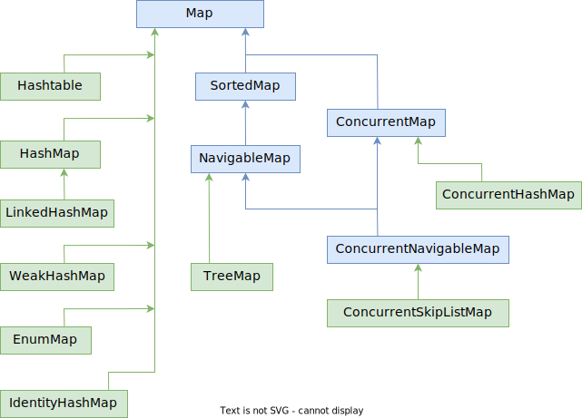

# Вопросы

- [ ] Зачем нужен интерфейс Entry, определенный внутри интерфейса Map?
  - [ ] Этот интерфейс содержит методы .getKey, .getValue, .setValue, а где находятся реализации этих методов? Как это связано с конкретными реализациями самого интерфейса Map?
- [ ] Расскажите про реализацию HashMap:
  - [ ] Какая структура данных лежит в ее основе?
  - [ ] От чего вычисляется хэш-код - от ключа или от значения?
  - [ ] Почему можно хранить null в качестве значения?
  - [ ] Почему можно хранить null в качестве ключа? Как считается хэш-функция от null в этой реализации и что будет, если добавить несколько элементов с ключом null?
  - [ ] Какой способ разрешения коллизий используется в этой реализации?
  - [ ] Почему операции добавления и удаления выполняются за константное время?
  - [ ] Почему не гарантируется сохранение порядка элементов в этой реализации?
  - [ ] Какую роль выполняют методы .equals и .hashCode при добавлении\удалении\поиске элемента?
- [ ] Какие отношения между классом LinkedHashMap и HashMap?
  - [ ] За счет чего LinkedHashMap позволяет сохранить порядок добавления элементов?
- [ ] Расскажите про реализацию TreeMap:
  - [ ] Что означает использование красно-черного дерева в TreeMap?
  - [ ] За какое время выполняются операции добавления и удаления? Почему?
  - [ ] Почему необходимо передать этой реализации при создании компаратор или чтобы хранимые элементы реализовывали интерфейс Comparable?
    - [ ] Как это связано с null в качестве ключа?

# Map

Map - это структура, хранящая пары "ключ - значение". Одному ключу может соответствовать строго одно значение.




## Интерфейс Map

Обзор методов (полный список [тут](https://docs.oracle.com/javase/8/docs/api/java/util/Map.html)):

```java
public interface Map<K, V> {
    // Наличие ключа \ значения
    containsKey(Object);
    containsValue(Object);
    
    // Получение ключей, значений и ключей+значений
    entrySet();  // ret Set<Map.Entry<K,V>>
    keySet();    // ret Set<K>
    values();    // ret Collection<V>
    
    // Сохранение и извлечение
    put(K key, V value);
    putIfAbsent(K key, V value);
    putAll(Map);
    
    get(Object key);
    getOrDefault(Object key, V defaultValue);
    
    // Удаление и замена
    remove(Object key);
    remove(Object key, Object value);
        
    replace(K key, V value);
    replace(K key, V oldValue, V newValue);
    
    // Размер
    isEmpty();
    size();
    
    // Прочее
    merge(...);  // ???    
}
```

### Интерфейс Entry

Внутри интерфейса Map еще объявлен внутренний интерфейс Entry, олицетворяющий элемент map'ы:

```java
interface Entry<K, V> {
    K getKey();
    V getValue();
    V setValue(V value);
    boolean equals(Object o);
    int hashCode();
    ...
}
```

Реализации этого интерфейса находятся внутри каждой реализаций Map'а. Например, внутри класса HashMap есть вот такой класс:

```java
static class Node<K,V> implements Map.Entry<K,V> {
    final int hash;
    final K key;
    V value;
    Node<K,V> next;
    ...
}
```

Внутри класса LinkedHashMap - вот такой:

```java
static class Entry<K,V> extends HashMap.Node<K,V> {
    Entry<K,V> before, after;
    ...
}
```

А внутри класса TreeMap - вот такой:

```java
static final class Entry<K,V> implements Map.Entry<K,V> {
    K key;
    V value;
    Entry<K,V> left;
    Entry<K,V> right;
    Entry<K,V> parent;
    ...
}
```


## Интерфейс SortedMap

Полное описание [тут](https://docs.oracle.com/javase/8/docs/api/java/util/SortedMap.html):

```java
public interface SortedMap<K,V> 
    extends Map<K,V> {
    ...
    +.firstKey();
    +.lastKey();
    
    +.headMap(K toKey);
    +.tailMap(K fromKey);
    
    +subMap(K fromKey, K toKey);
    ...
}
```


## Интерфейс NavigableMap

Полное описание [тут](https://docs.oracle.com/javase/8/docs/api/java/util/NavigableMap.html):

```java
public interface NavigableMap<K,V> 
    extends SortedMap<K,V> {
    ...
    +.ceilingEntry(K key);
    
    ...
}
```

# Представители обычные

## Hashtable

TODO: это легаси, поэтому разбирается в последнюю очередь

## HashMap

[Исходники](https://hg.openjdk.java.net/jdk8/jdk8/jdk/file/687fd7c7986d/src/share/classes/java/util/HashMap.java)

* Разрешен null в ключах и значениях

* Не гарантирует определенный порядок элементов и сохранение этого порядка с течением времени

* Добавление\удаление за константное время

* Не потокобезопасна

* В основе лежит хэш-таблица в виде вот такого массива:

  ```java
  transient Node<K,V>[] table;
  ```
  
* Для разрешения коллизий используется связный список. Каждый хранимый элемент в HashMap представлен вот таким классом (этот класс объявлен внутри класса HashMap):

  ```java
  static class Node<K,V> implements Map.Entry<K,V> {
      final int hash;
      final K key;
      V value;
      Node<K,V> next;
      ...
  }
  ```
  
  TODO: Как-нибудь при случае разобраться, почему порядок элементов не гарантируется, если тут есть ссылка на следующий элемент?

### Добавление элемента и про null в ключе

Вот код добавления элемента (видно, что хэш берется *от ключа*):

```java
public V put(K key, V value) {
    return putVal(hash(key), key, value, false, true);
}
```

А вот код функции hash:

```java
static final int hash(Object key) {
    int h;
    return (key == null) ? 0 : (h = key.hashCode()) ^ (h >>> 16);
}
```

Т.е. видно, что null в качестве ключа обрабатывается особым образом - хэш будет 0 и данные с ключом null всегда попадают в одно и то же место. Стало быть, можно сколько угодно раз добавлять элементы с ключом null и каждый новый элемент просто перезапишет старый.

> `>>>` беззнаковый сдвиг вправо, `^` xor

### Роль equals

Хэш-код используется для определения ячейки хэш-таблицы, а equals - для определения конкретного элемента внутри этой ячейки, если элементов там несколько. При извлечении по equals определяется, какой именно элемент надо вернуть. А при добавлении - понять, надо ли именно добавить новый элемент, либо перезаписать уже существующий.

## LinkedHashMap

Каждый элемент внутри LinkedHashMap представлен вот таким классом:

```java
static class Entry<K,V> extends HashMap.Node<K,V> {
    Entry<K,V> before, after;
    Entry(int hash, K key, V value, Node<K,V> next) {
        super(hash, key, value, next);
    }
}
...
transient LinkedHashMap.Entry<K,V> head;
...
transient LinkedHashMap.Entry<K,V> tail;
```

Т.е. стандартный узел дополняется еще ссылками на следующий и предыдущий элемент. Кроме того, есть ссылки на начало и конец списка. Таким образом, элементы попадают в хэш-таблицу как обычно, но просто еще имеют ссылки друг на друга.

## TreeMap

* Использует красно-черное дерево

  ```java
  private transient Entry<K,V> root;
  ```

* Поэтому для операций добавления, удаления, извлечения и contains дает сложность $log_{2} n$

* Порядок элементов - так называемый natural ordering, т.е. элементы или должны реализовывать интерфейс Comparable, или структуре при создании нужно передать Comparator, чтобы она знала, как сравнивать элементы

* null не допускается в качестве ключа. Но когда-то давно, до 7 джавы, допускалось добавлять null первым элементом, после чего уже ничего нельзя было добавить и ничего не работало, но теперь null запрещен

* Не синхронизирован

### null в ключе

TODO: На самом деле, можно добавить null в ключе. Детально сейчас нет времени разбираться, есть вещи поважнее, но я оставлю тут зацепку на будущее. Поведение получается странное, но ошибки нет, можно потом получше поэкспериментировать:

```java
private static void nullAsKeyInTreeMap() {
    Comparator<Integer> personComparator = (Integer i1, Integer i2) -> {
        if (i1 == null || i2 == null) {
            return 0;
        }
        return i1.compareTo(i2);
    };

    Map<Integer, Person> map = new TreeMap<Integer, Person>(personComparator);

    Person tom = new Person("Tom Sawyer", 14);
    Person huck = new Person("Huck Finn", 14);
    Person mary = new Person("Mary Sawyer", 17);

    map.put(5, tom);
    map.put(12, huck);
    map.put(null, mary);

    printMap(map);
}
// Вывод (Том пропал)
// Mary Sawyer 17
// Huck Finn 14

private static void printMap(Map<Integer, Person> map) {
    Set<Map.Entry<Integer, Person>> entries = map.entrySet();
    for (Map.Entry<Integer, Person> entry : entries) {
        System.out.println(entry.getValue());
    }
}
```


# Представители специфичные

## EnumMap

EnumMap не является абстрактным (в отличие от EnumSet). Используется, когда ключами нужно сделать элементы перечисления. Все операции работают как обычно:

```java
EnumMap<DaysOfWeek, String> days = new EnumMap<>(DaysOfWeek.class);
days.put(DaysOfWeek.Monday, "Понедельник");
days.put(DaysOfWeek.Tuesday, "Вторник");
days.put(DaysOfWeek.Wednesday, "Среда");
days.put(DaysOfWeek.Thursday, "Четверг");
days.put(DaysOfWeek.Friday, "Пятница");
days.put(DaysOfWeek.Saturday, "Суббота");
days.put(DaysOfWeek.Sunday, "Воскресенье");

System.out.println(days.get(DaysOfWeek.Friday));
```

## IdentityHashMap

В документации написано следующее:

> This class is \*not\* a general-purpose `Map` implementation!  While this class implements the `Map` interface, it intentionally violates `Map's` general contract, which mandates the use of the `equals` method when comparing objects.  This class is designed for use only in the rare cases wherein reference-equality semantics are required

Поэтому отложим его до поры до времени

## WeakHashMap

Мутная тема, связана с разными видами ссылок в джаве (strong, soft, weak, phantom https://habr.com/ru/post/169883/), явно не для каждодневного пользования

# Представители конкурентные

