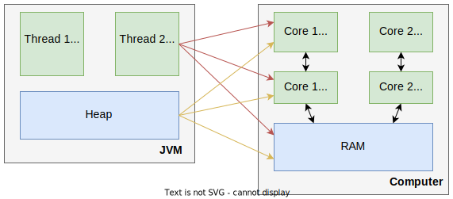

# Вопросы

- [ ] Как устроена модель памяти JVM и как она ложится на физическую память компьютера? 
  - [ ] Где в физической памяти может располагаться стек и куча? Например, может ли куча располагаться в регистрах процессора?
  - [ ] Сколько вообще может быть стеков и сколько куч? Как они распределяются между потоками?
  - [ ] Объекты и статические поля классов всегда хранятся в куче, локальные переменные методов и параметры методов - в стеке. Но что, если в них лежат объекты? Как тогда осуществляется хранение?
- [ ] В чем заключаются такие системные оптимизации как изменение порядка команд, кэширование данных и команд, отложенная запись?
  - [ ] Как они могут навредить однопоточной\многопоточной программе?
  - [ ] Как они влияют на команды чтения\записи? Как это связано с т.н. "пробитием кэша"?
- [ ] Расскажите про модификатор volatile
  - [ ] Зачем он нужен? Как он связан с т.н. "пробитием кэша?"
  - [ ] Почему его можно применить к полям класса, а к локальным переменным - нельзя? Как это связано со стеком, кучей и механикой организации параллельного кода?
  - [ ] Почему volatile не защищает от race condition? Будет ли *i++* атомарной операцией, если i является volatile?
- [ ] Расскажите про модификатор syncronized
  - [ ] Как synchronized концептуально связан с критической секцией?
  - [ ] Что такое intrinsic lock и как он связан с syncronized? Зачем нужен механизм reentrancy? Опишите ситуацию, демонстрирующую необходимость этого механизма
  - [ ] Будет ли разница, если применить модификатор synchronized к методу, или просто поместить весь код метода в syncronized-секцию? Лок какого объекта использует синхронизированный метод?
    - [ ] Может ли статический метод быть синхронизированным? Если да, что в таком случае служит замком?
  - [ ] Почему параллельно не могут выполняться несколько методов, объявленных как synchronized? Назвать конкретную причину (связана с intrinsic lock)
    - [ ] А если метод синхронизирован не целиком, а только его часть?
  - [ ] Когда захватывается и когда освобождается лок (только применительно к synchronized, а про методы вроде .wait() можно в данном случае не рассказывать)? Что будет с локом, если возникнет исключение и мы его поймаем \ не поймаем?
  - [ ] Почему нужно использовать один и тот же лок для блокировки одного и того же поля \ набора данных?
  - [ ] Почему лучше не вызывать несинхронизированные методы из synchronized-методов?
- [ ] Расскажите про концепцию happens-before гарантии
  - [ ] Как она связана с оптимизацией "перегруппировка команд"?
  - [ ] Для volatile: если есть четыре команды *a, b, c, d*, и в команде *c* используется волатилька, то какие ограничения по перегруппировке это накладывает на JVM?
  - [ ] Для synchronized: если есть команды *a, b, c, d, e, f* и команды *a, b* выполняются непосредственно перед synchronized-секцией, *e, f* - сразу после нее, команда *c* - в самом начале секции, команда *d* - в самом конце, то какие ограничения по перегруппировке это накладывает на JVM?
- [ ] Расскажите про концепцию visibility гарантии
  - [ ] Как она связана с пробитием кэша?
  - [ ] Для volatile: что такое full visibility эффект? Если у класса несколько полей *a, b, c, d* и c - это волатилька, то какой эффект на обычные поля окажет чтение\запись в таком порядке: a, b, c, d?
  - [ ] Для syncronized: если у класса несколько полей *a, b, c* и мы работаем с ними следующим образом: поле *a* помещаем в локальную переменную *v* до synchronized-секции, а внутри synchronized-секции считаем `v + b + c`, то почему мы можем получить неправильный результат? Почему стоит использовать общие данные только внутри synchronized-секции?
- [ ] Какая особенность есть у типов long и double и как volatile и syncronized при этом помогают?

# Модель памяти JVM

В общих чертах модель памяти JVM и ее связь с физической памятью компьютера выглядит так:



А описать ее можно следующими утверждениями:

* У каждого потока - свой стек
* Куча - общая
* Объекты *всегда* хранятся в куче
* Статические поля классов - тоже хранятся в куче
* Локальные переменные методов и параметры методов - хранятся в стеке. Если они при этом являются объектами, то в стеке хранится только *ссылка* (т.е. сама переменная), а ее *значение* (т.е. сам объект) - в куче

Это логическая модель памяти JVM. Физически же получается, что:

* Данные из стека\кучи могут лежать где угодно - в регистрах процессора, в кэше, в оперативке. Например, объект при создании попадает в оперативку, а потом при использовании для скорости копируется в кэш и лежит там непредсказуемое время
* Из-за этого объект, который лежит в куче и логически должен видим как единственный обоим тредам, в результате копируется в кэш каждого ядра (прим., если конечно треды выполняются на разных ядрах) и получается уже два независимых объекта. И когда пойдет синхронизация кэша и оперативки, одна копия обязательно затрет другую

# Опасные оптимизации

Процессор и сама JVM могут выполнять различные оптимизации, как например:

* Отложенная запись - когда команды записи данных выполняются не сразу же как возникли, а ставятся в очередь и потом выполняются разом
* Изменение порядка команд (reordering) - иногда с точки зрения процессора\JVM последовательность команд не критична и когда они видят, что можно выполнить оптимальнее, то могут выполнить команды программы не в том порядке, в котором мы их написали. Например, какие-нибудь последовательные команды присвоения
* Кэширование данных и команд - во время работы процессоры наполняют свой кэш данными и командами, чтобы не обращаться за ними в оперативку. А поскольку у каждого ядра собственный кэш, то если два потока используют общие данные, но выполняются на разных ядрах, то у каждого потока будет своя копия этих данных в кэше. Они будут менять\читать эти данные, каждый свою копию, и понятия не иметь о том, что делает с данными "сосед".

В многопоточных приложениях это может вызывать трудноуловимые ошибки. Грубый пример:

```java
public class TaskRunner {

    private static int number;
    private static boolean ready;

    private static class Reader extends Thread {

        @Override
        public void run() {
            while (!ready) {
                Thread.yield();
            }

            System.out.println(number);
        }
    }

    public static void main(String[] args) {
        new Reader().start();
        number = 42;
        ready = true;
    }
}
```

Если поменять местами присвоение значений в ready и number, параллельный поток может вывести нам 0 вместо 42. И прочие неожиданности. Поэтому в джаве есть специальные средства, чтобы таких проблем не было.

# Гарантии

В однопоточных программах упомянутые оптимизации проблем не вызывают (я надеюсь), иначе вряд ли бы вообще они применялись. А в многопоточных - вызывают. Поэтому для многопоточной работы придумали механизмы, которые позволяют эти оптимизации отключать\обходить их эффекты.

## happens-before гарантия

Представим что где-то хранятся данные и флаг их готовности и, опять же, "где-то" находятся методы их заполнения и использования (как именно эти фрагменты разнесены по классам и связаны, для понимания сути не критично. Например, это может быть три класса - "данные", "генератор" и "потребитель" или только два - не важно):

> Предупреждение, пример и объяснение я придумал сам, исходя из текущего уровня понимания, нет гарантий, что я прав

```java
...
    private int number;
    private boolean ready;  // <-- Здесь могла бы быть ваша реклама... volatile
... 
	public void compute() {
        ready = false;
        number = rand.nextInt(100) + 1;  // <-- Или эти две строчки могли бы
        ready = true;                    // <-- быть обернуты в syncronized
    }
...
    public void print() {
        if (!ready)
            return;
        sout(number);
    }
 ...
```

В однопоточной программе в методе compute в общем-то не важно, какая строчка выполнится первой `number = rand.nextInt(100) + 1` или `ready = true`, т.к. в любом случае анализ ready не может случиться до записи в number из-за линейной природы однопоточки. Поэтому JVM их вполне может переставить, если это будет выгодно для оптимизации (мб ей проще подряд записать две bool-переменных например. Хотя конечно в однопоточке смысла делать флаг готовности вообще нет)

Но для многопоточной именно существующий порядок критичен для правильной работы. Потому что если сначала установить флаг, а потом - значение, то может случиться, что поток А, выполняющий метод compute(), будет вытеснен сразу после установки флага в true, не успев заполнить данные. Тогда поток В, выполняющий метод print(), получит ready == true, хотя на самом деле это ошибка, ведь данные еще не готовы.

В многопоточных программах нельзя заранее назвать последовательность, в которой будет выполняться код. Мы запускаем два потока - один заполняет, другой читает, но не можем знать, кто из них пойдет на выполнение первым. Более того, мы не можем знать, в какой момент каждый из этих потоков будет вытеснен (т.е. на какой команде он прервется), чтобы дать поработать другому.

Поэтому о многопоточной программе нужно думать как о *последовательности событий* и понимать, что важно не то, *когда* именно выполнится какая-то команда, а то, *какую позицию* она займет среди других команд. По примеру выше, нам важно, чтобы ready = false произошло *до* присвоения нового значения, а присвоение нового значения произошло *до* ready = true. При этом нам становится не важно что в любой момент между этими операциями процесс может приостановиться, и какой-то другой процесс проверит значение ready.

Поэтому и придумали т.н. **"happens-before"** гарантию. Она записывается так:

```java
hb(x, y) // "x произошло до y"
hb(y, z)
=> hb(x, z)
```

Стандартная естественная логика - если *x* произошло до *y*, а *y* в свою очередь произошло до *z*, то значит и *x* произошло до *z*.

Для многопоточных программ hb означает уверенность в том, что, несмотря на оптимизации и вытеснение, общий ход событий будет корректным.

## visibility гарантия

Можно охарактеризовать так: несколько потоков при чтении\записи *общих данных* должны работать с актуальными данными, независимо от технических деталей. Обеспечивается волатильками и синхронизацией (приписал, чтобы между делом напомнить, почему геттеры и сеттеры делаются синхронными, хотя с первого взгляда не понятно, зачем это надо. А надо это как раз для адекватной видимости между потоками).

# volatile

Модификатор volatile применяется к полям класса (к локальным переменным - нет, исключительно к полям).

Волатильность (volatile - "изменчивый, непостоянный") - это про данные. Поскольку процессор\ядро работают каждый со своей кэш-памятью, а в оперативку пишут\читают от случая к случаю, то если два потока будут работать на разных ядрах, это может привести к таким проблемам:

* Для записи это значит, что новое значение D может осесть в кэше, и когда оно перенесется в оперативку - доподлинно не известно. Важно, что не сразу, а это проблема, потому что другой поток вероятно хотел бы прочитать это новое значение
* Для чтения это значит, что при попытке узнать значение D, оно будет взято из кэша, а не из оперативки. То есть если даже в первом случае получилось так, что новое значение все-таки попало в оперативку "оперативно", то это не важно, потому что чтение все равно произвелось из кэша

Так вот, применение к данным D модификатора volatile приводит к тому, что при записи D, новое значение гарантированно попадает в оперативку "оперативно", а при чтении берется из оперативки, а не из кэша. Это еще называют иногда "пробитие кэша". Как на самом деле на техническом уровне это реализовано - то ли кэш синхронизируется с оперативкой, то ли данные пишутся\читаются сразу из оперативки - не важно. Важно то, что проблема несогласованности именно из-за кэширования больше не возникает.

Однако проблему race condition волатильность сама по себе не решает. Модификатор volatile сам по себе не делает операции над волатильными переменными атомарными. Он лишь гарантирует, что при операции `i = 7` семерка самым скорым образом попадет в оперативку. Эта простая операция, которая по своей природе является атомарной. Но если операция более сложная, `i += 7`, то она уже не атомарная (прочитать старое значение - прибавить 7 - записать новое), а значит может прерваться на любом из этих трех шагов и возникнет race condition.

## volatile и гарантии happens-before и visibility

> В этой теме есть риск закопаться глубже, чем она того заслуживает. Поэтому я сделал только краткое описание. Но если вдруг будет ощущение, что чего-то не хватает, всегда можно начать раскопки [отсюда](https://jenkov.com/tutorials/java-concurrency/volatile.html)

У волатилек есть особенность по части видимости: они влияют не только на свою видимость, но и на видимость обычных полей. Например:

```java
...
    private int hours;
    private int years;
    private int months
    private volatile int days;
...
    public void update(int years, int months, int days, int hours){
        this.years  = years;   // Пробитие кэша "за компанию"
        this.months = months;  // Пробитие кэша "за компанию"
        this.days   = days;    // Пробитие кэша, потому что волатилька
        this.hours  = hours;  // <-- ??? Про это поле будет написано в выводах
    }
...    
    public int totalDays() {
        int total = this.days;
        total += months * 30;
        total += years * 365;
        return total;
    }
...
```

В целом, волатилька дает такие эффекты:

* Visibility: (метод update) при записи волатильки this.days, новые значения years и months тоже будут записаны в оперативку, хотя сами они не волатильные. Этот эффект называется full visibility.

  (метод totalDays) При чтении волатильки все остальные поля тоже будут перечитаны из оперативки и т.о. будут хранить свежие данные.

* Happens-before: Волатилька не дает перегруппировке команд откровенно сломать программу за счет того, что ограничивает возможности перегруппировки.

  Там довольно хитрый набор правил, вот одно из них: команды чтения\записи не могут при перегруппировке оказаться после записи волатильки, если в исходном коде написаны перед ней. Т.е. команды записи в this.years и this.months гарантированно будут happens-before записи в days, но при этом могут поменяться друг с другом местами, сначала this.month, потом this.years. "Все, что до волатильки - меняй как хочешь, но чтобы ничего из этого не попало за нее".

:question: TODO: А вот насчет поля hours есть серьезные вопросы. Раз оно идет после записи волатильки, то распространяется ли на нее эффект full visibility - будет ли this.hours записана в оперативку или рискует осесть в кэше? И может ли эта строчка после перестановки команд оказаться до волатильки? Если да, то сработает ли full visibility эффект?

Найти ответы оказалось трудно, так что эти вопросы остались без ответа. Но в целом среди уважаемых людей бытует мнение, что на все эти правила не стоит сильно полагаться именно из-за потенциальной путаницы и в "Concurrency на практике" явно написано, что волатильки стоит использовать только в случаях, когда эффект однозначно понятен. Итого, я бы выделил такие сценарии:

* Волатильные переменные удобны и часто используются в качестве флажка завершения, прерывания или статуса. Эффект понятен - команда чтения\записи волатильного флажка, во-первых, гарантированно пробьет кэш и, во-вторых, не будет некорректно перегруппирована с другими командами
* Записи в переменную не зависят от ее текущего значения, либо есть гарантия, что значения переменной обновляются только одним потоком. Эффект понятен - команда `i = 7` не зависит от текущего значения i, а `i++` - зависит, поэтому если два потока будут делать i++, неизбежно возникнет race condition. Если пишет только один поток, тогда проблемы rc нет, но есть проблема неактуальных данных: операция прибавления выполнилась, но новое значение не успело записаться и кто-то поэтому прочитал старое значение. Но если чтение таких "недообновленных" данных не cчитается за проблему, то волатилька сгодится. Если проблема - тогда уже нужна синхронизация

Волатильки снижают производительность, поскольку ограничивают оптимизации, поэтому использовать их стоит только когда их особенности действительно полезны для программы.

# syncronized, intrinsic lock

Синхронизация - это про код. Она нужна для обозначения границ критических секций. В этом случае только один поток может выполнять код КС.

## intrinsic lock

В джаве у *каждого объекта* есть так называемый `intrinsic lock` (альтернативное название - monitor lock), "внутренний замок\внутренняя блокировка" - некая внутренняя вспомогательная структура, которая используется для синхронизации.

> Я надеюсь, что intrinsic lock и monitor lock - это синонимы. Из [доки](https://docs.oracle.com/javase/tutorial/essential/concurrency/locksync.html) однозначно не понятно, так это или нет, да и нагуглить на верочку не удалось

Важно понимать, как именно работает блокировка с помощью intrinsic lock: у каждого объекта - один лок и если тред захватывает этот лок, то пока он его не освободит, никакой другой тред этот же лок захватить не сможет и при попытке захвата уйдет в блокировку. В примерах ниже важность этого момента объяснена на практике:

Модификатор syncronized применяется только к методам и блокам кода:

* В случае объявления **синхронизированных методов**, intrinsic lock (объекта this) используется неявно:

  ```java
  public class SynchronizedCounter {
      private int c = 0;
  
      public synchronized void increment() {  // <-- Неявно используется intrinsic lock от this
          c++;
      }
  
      public synchronized void decrement() {  // <-- Неявно используется intrinsic lock от this
          c--;
      }
  
      public synchronized int value() {  // <-- Неявно используется intrinsic lock от this
          return c;
      }
      
      public void doSome() {
          System.out.println("Несинхронизированный метод для примера");
      }
  }
  ```

  Допустим, тред А начинает выполнять метод increment. Этот метод синхронизированный, значит А захватывает лок объекта SynchronizedCounter. Допустим, этот метод не успел выполниться до конца, и некий тред В хочет выполнить метод value. Этот метод тоже синхронизированный, значит треду В нужно захватить лок. Но лок уже занят тредом А, так что тред В останавливается и будет ждать освобождения лока. Пусть тред С хочет выполнить метод doSome. Этот метод не синхронизированный, поэтому треду С не нужно захватывать лок, а значит он спокойно выполняет метод.

  Таким образом делаем вывод, что из всех *синхронизированных* методов объекта может выполняться только один за раз, в том смысле, что параллельно они выполняться не могут, т.к. используют для синхронизации *один и тот же лок*.

  ```java
  // Синхронизированный метод аналогичен такой конструкции:
  public void someMethod() {
      syncronized(this) {
          // Всё тело метода
      }
  }
  ```

* В случае **синхронизированных блоков**, мы синхронизируем не весь метод, а только какой-то его фрагмент (или несколько фрагментов) и должны явно указать объект, intrinsic lock которого нужно использовать:

  ```java
  public void addName(String name) {
      // Здесь может быть еще какой-то код
      synchronized(this) {  // <-- Текущий объект, как и любой объект, имеет собственный intrinsic lock
          lastName = name;
          nameCount++;
      }
      nameList.add(name);
  }
  ```

  Или вот так:

  ```java
  public class MsLunch {
      private long c1 = 0;
      private long c2 = 0;
      private Object lock1 = new Object();
      private Object lock2 = new Object();
  
      public void inc1() {
          // Здесь может быть еще какой-то код
          synchronized(lock1) {  // <-- Используем лок объекта lock1 для синхронизации
              c1++;
          }
      }
  
      public void inc2() {
          // Здесь может быть еще какой-то код
          synchronized(lock2) {  // <-- Используем лок другого объекта, lock2, для синхронизации
              c2++;
          }
      }
  }
  ```

  Этот пример примечателен тем, что здесь показано как для синхронизации используются разные объекты, в результате чего у нас получается два синхронизированных, но независимых друг от друга, блока. Если какой-то тред выполняет метод inc1(), то другой тред легко может выполнять inc2()

  Более интересная ситуация, если тред А выполняет метод inc1(), а тред В решит выполнить его же, то они вполне могут выполнять inc1() параллельно, но только до того момента, пока один из них не достигнет строчки 9. Тогда он возьмет себе лок и второй тред будет вынужден ждать освобождения лока, прежде чем продолжить.

В этих примерах замки всегда были внутри того же класса, где они используются: в качестве замка использовался либо сам текущий объект, либо его поля. Более интересный и практичный пример - в конспекте про состояния потоков, там разобрана задача продюсера\консюмера на методах wait(), notify() и для синхронизации использует лок объекта "хранилища"

## Синхронизированные static методы

Статический метод тоже может быть синхронизированным. Когда программа доходит до использования какого-то класса, то в память загружается объект (тип Class) этого класса. Этот объект и используется в качестве лока при вызове static syncronized методов:

```java
public class StaticSyncMethodDemo() {
    public static syncronized void someMethod() {
        ...
    }
}

// Аналог
public class StaticSyncMethodDemo() {
    public static void someMethod() {
        syncronized (StaticSyncMethodDemo.class) {
            ...
        }
    }
}
```

## Правила синхронизации

* Синхронизацию одних и тех же полей нужно организовывать через один и тот же лок. Если в одном месте для работы с полем `f` используется лок `a`, то и во всех остальных местах работы с f должен использоваться только лок a.

## Освобождение лока

Лок освобождается, когда:

* Весь код в методе или блоке успешно выполняется
* Мы вылетаем из метода\блока с исключением. И даже если исключение не поймано, все равно лок освобождается

## Механизм reentrancy

Поток, который взял замок, может взять его повторно. На замке есть счетчик. Замок считается свободным, если счетчик равен нулю. Когда поток приобретает замок, JVM регистрирует текущего владельца замка и если владелец запрашивает замок повторно, счетчик увеличивается. По мере освобождения замка, этот счетчик уменьшается. Так что в итоге замок освобождается, когда счетчик доходит до 0.

Это позволяет потоку, например, вызывать синхронизированный метод из другого синхронизированного метода. Без reentrant механизма это вызвало бы самоблокировку потока. 

Повторная входимость "наследуется", поэтому наследники могут спокойно вызывать синхронизированные методы родителей:

```java
// Суперкласс
public class Widget {
    
    public synchronized void doSomething() {
    ...
    }    
}

// Подкласс
public class LoggingWidget extends Widget {

    public synchronized void doSomething() {
        System.out.println(toString() + ": calling doSomething");
        super.doSomething();  // <-- Это норма за счет reentrancy-механизма
    }
}
```

## Смешение sync и не-sync кода

Из синхронизированного блока лучше не вызывать другие методы объекта, если они не синхронизированные. Потому что параллельно этот же метод может вызвать другой поток и результаты перемешаются.

## syncronized и гарантии happens-before и visibility

* Visibility: в момент входа в синхронизированный блок, все поля обновляются из оперативки. В момент выхода из синхронизированного блока, все поля записываются в оперативку.

  Исходя из этих правил и конкретной ситуации и следует поступать. Куцые примеры здесь только запутают, а хороший пример был бы большой и я его сейчас не могу даже придумать. Исходя из логики, можно сделать пару выводов: с общими данными нужно работать только в синхронизированном блоке. Во-первых, это гарантирует их перечитывание из оперативки, значит текущий поток получает свежее. Во-вторых, это гарантирует их запись в оперативку - значит остальные потоки получат свежее. В-третьих, разные потоки не затрут работу друг друга в случае записи, поскольку синхронизация не позволит им одновременно модифицировать одни и те же поля (если конечно синхронизация выполнена правильно)

* Happens-before: здесь правило, насколько я понял, такое - команды не могут перемешиваться на границах блока. Т.е. если какая-то команда стоит непосредственно перед\после блока синхронизации, то она после перегруппировки не может оказаться внутри\вне блока. Ну и наоборот - команда в самом начале\конце блока не может оказаться за его пределами.

# Некоторые тонкости

## long, double и многопоточность

Эти типы занимают 64 бита и операции их чтения\записи не являются атомарными, т.к. состоят из двух операций чтения\записи по 32 бита. Из-за этого в многопоточных программах могут быть проблемы. Чтобы их избежать, нужно объявлять поля этих типов волатильными. Либо использовать их только в синхронизированных блоках.