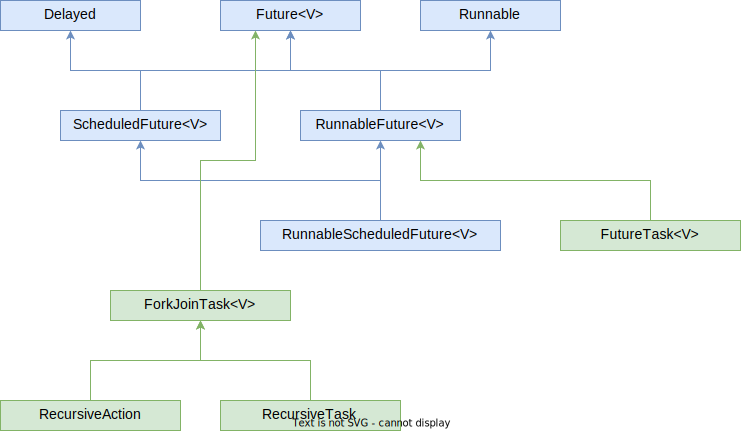

# Вопросы

- [ ] Как передать параметры в поток, используя конструктор класса и замыкания? В каких случаях лучше подходит каждый способ?
- [ ] Как получить результат из потока? Зачем нужен интерфейс Callable? В чем его отличие от интерфейса Runnable? Какой метод мы должны переопределить в первом и втором случае?
  - [ ] Объект какого типа возвращает метод .submit, когда мы отправляем Callable или Runnable на выполнение в пул?
- [ ] Что будет с текущим потоком, если мы захотим получить результат из Future-объекта и вызовем его метод .get?
  - [ ] TODO: Что будет, если мы попробуем отменить задачу через Future методом .cancel, если задача уже запущена? А если не запущена? Что будут показывать методы .isDone и .isCancelled?

# Схема интерфейсов



# Интерфейс Future

Когда мы отправляем Callable на обработку в пул ExecutorService, то в ответ получаем объект с интерфейсом [*Future*](https://docs.oracle.com/javase/7/docs/api/java/util/concurrent/Future.html), через который мы можем взаимодействовать с выполняемой задачей - например, опросить на результат, отменить:

```java
boolean cancel(boolean mayInterruptIfRunning)
V       get()
V       get(long timeout, TimeUnit unit)
boolean isCancelled()
boolean isDone()
```

## Получение результата .get, возможные исключения

Пока ожидаем результат, можем получить несколько видов исключений:

* Проверяемые
  * InterruptedException - если поток, *в котором* вызван метод future.get, прерывается, то get выбрасывает InterruptedException. Обычно в этом случае положено вызывать future.cancel, потому что раз текущий поток прерван, то результаты задачи ему уже не пригодятся.
  * ExecutionException - если задача выбросила в процессе своей работы исключение, то оно оборачивается в ExecutionException и метод get выбрасывает нам эту обертку. С помощью обертка.getCause() можем получить оригинальное исключение, которое выбросила задача.
  * TimeoutException - актуально для версии get с ожиданием, выбрасывается если задача выполняется дольше, чем указанное время ожидания.
* Непроверяемые
  * CancellationException - выбрасывается во всех случаях, если задача была отменена через future.cancel()

Вот пример нескольких попыток ожидания результата и отмены в случае, если не дождались. Теоретически, можно было бы просто сделать время ожидания побольше, но так демонстрируется, что можно повторно вызывать get и ждать раз за разом сколько нужно:

```java
Callable<String> callable1 = () -> {
    Thread.sleep(3000);
    return "Это сообщение и есть результат работы задачи";
};

ExecutorService exec = Executors.newSingleThreadExecutor();

int rewaitAttemptCount = 3;
int timeToWait = 1000;
Future<String> result = exec.submit(callable1);
while (rewaitAttemptCount > 0) {
    try {
        String message = result.get(timeToWait, TimeUnit.MILLISECONDS);
        System.out.println("Результат задачи: " + message);
        break;
    } catch (InterruptedException iex) {
        result.cancel(true);
    } catch (ExecutionException eex) {
        throw new RuntimeException(eex.getCause());
    } catch (TimeoutException tex) {
        rewaitAttemptCount--;
        System.out.println("Превышен интервал ожидания. Количество повторных ожиданий: " + rewaitAttemptCount);
    }
}

// Вывод:
Превышен интервал ожидания результата. Количество повторных ожиданий: 2
Превышен интервал ожидания результата. Количество повторных ожиданий: 1
Результат задачи: Это сообщение и есть результат работы задачи
```

## Отмена задачи .cancel

Принципы работы cancel:

* Если задача еще не стартовала, то она и не начнет выполнение.

* Если задача стартовала, то прервется, а future.get выбросит CancellationException.

* Внутри задачи мы можем через Thread.interrupted() проверять, была ли команда прерваться и обрабатывать сигнал прерывания. При этом, даже если мы как-то попытаемся схитрить, например зациклить, то задача все равно прервется:

  ```java
  boolean infinite = true;
  while (infinite == true) {
      if (Thread.interrupted()) {
          System.out.println("Флаг прерывания проверили и он сбросился, но зацикливания задачи не будет");
      }
  }
  ```

* После вызова cancel, метод get *всегда* выбрасывает CancellationException. Даже если написать что-то такое:

  ```java
  boolean flag = true;
  while (flag == true) {
      if (Thread.interrupted()) {
          throw new RuntimeException("Обработали вручную сигнал прерывания потока.");
      }
  }
  ```

  то все равно мы попадем в блок catch, ловящий CancellationException. Хотя теоретически можно было бы подумать, что должны попасть в ExecutionException, потому что мы выбросили исключение внутри задачи, но нет.

Задача еще даже не стартовала, как была отменена:

```java
Callable<String> callable = () -> {
    return "Это сообщение и есть результат работы задачи";
};

ScheduledExecutorService exec = Executors.newSingleThreadScheduledExecutor();

ScheduledFuture<String> result = exec.schedule(callable, 2000, TimeUnit.MILLISECONDS);
result.cancel(true);
try {
    String message = result.get();
} catch (CancellationException cex) {
    System.out.println("Задачу отменили методом future.cancel()");
} catch (Exception ex) {
    System.out.println("До других исключений в этом примере дела нет");
}

// Вывод:
Задачу отменили методом future.cancel()
```

## Проверка статуса, .isDone, .isCancelled

* isDone - это проверка на завершенность в любом виде. Нормальное завершение или исключение, или отмена - не важно, isDone дает true, если задача "уже все" и дает false, если задача еще "в процессе".
* isCancelled - дает true, только если задача была отменена методом future.cancel()

# Интерфейс ScheduledFuture

Наследник интерфейсов Future и Delayed. От Delayed получает метод:

```java
long getDelay(TimeUnit unit)
```

* getDelay - возвращает время, оставшееся до запуска.

Здесь и писать особо не о чем на самом деле, но пара примеров на всякий случай:

```java
Callable<String> callable = () -> "Это сообщение - результат работы callable.";
ScheduledExecutorService exec = Executors.newSingleThreadScheduledExecutor();
ScheduledFuture<String> result = exec.schedule(callable, 5000, TimeUnit.MILLISECONDS);
try { Thread.sleep(4000); } catch (Exception ex) { }

try {
    long timeBeforeRun = result.getDelay(TimeUnit.MILLISECONDS);
    System.out.println(timeBeforeNextRun);  // 984, из-за ожидания 4000 от исходной задержки осталось ~1 сек
    String message = result.get();
    System.out.println(message);
    timeBeforeRun = result.getDelay(TimeUnit.MILLISECONDS);
    System.out.println(timeBeforeNextRun);  // -14 отрицательное значит, что задача уже начала работу
} catch (InterruptedException iex) {

} catch (CancellationException cex) {

} catch (ExecutionException eex) {

}
```

Для повторяющихся задач:

```java
Runnable runnable = () -> { System.out.println("Это сообщение получается при работе runnable."); };
ScheduledExecutorService exec = Executors.newSingleThreadScheduledExecutor();
ScheduledFuture result = exec.scheduleAtFixedRate(runnable, 5000, 3000, TimeUnit.MILLISECONDS);

long timeBeforeRun = result.getDelay(TimeUnit.MILLISECONDS);
System.out.println(timeBeforeNextRun);  // 4999 потому что до первого запуска ~5 сек из-за нач. задержки 5000

try { Thread.sleep(5000); } catch (Exception ex) { }

timeBeforeRun = result.getDelay(TimeUnit.MILLISECONDS);
System.out.println(timeBeforeNextRun);  // -11 отрицательное значит, что задача уже начала работу

try { Thread.sleep(5000); } catch (Exception ex) { }

timeBeforeNextRun = result.getDelay(TimeUnit.MILLISECONDS);
System.out.println(timeBeforeNextRun);  // 977мс, т.к. до следующего запуска остается ~1 сек
// За последнее ожидание в 5 сек из строчки 13 задача успевает выполниться два раза. Выполнилась один раз,
// ждет три секунды. Выполнилась второй раз, ждет три секунды. И в это ожидание заканчивается ожидание из
// 13 строки и приходится оно на момент, когда до следующего запуска остается ~1 сек, поэтому 977.

// Вывод:
4999
-11
Это сообщение получается при работе runnable.
Это сообщение получается при работе runnable.
977
Это сообщение получается при работе runnable.
...
```


TODO: CompletableFuture

TODO: ScheduledFuture, FutureTask


TODO: Поэкспериментировать с отменой задачи: будут ли исключения, можно ли поймать факт отмены внутри задачи и т.д.

TODO: Про получение результата дописать, там просто так не получишь, надо в try заворачивать

TODO: CompletableFuture

TODO: ScheduledFuture, FutureTask

TODO: Вписать про возможные исключения, которые вообще существуют в многопоточном мире