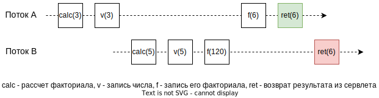
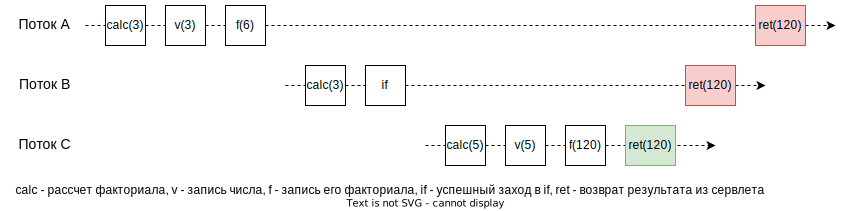
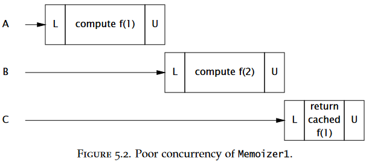
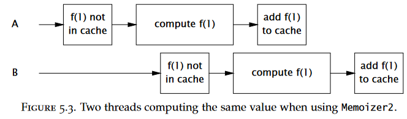
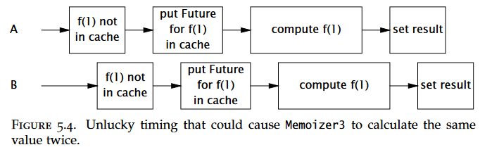

# Сокращения

ПБ - потокобезопасный.

# Болтовня

Потокобезопасность - это, по сути, о доступе к совместному состоянию, и особенно к совместному мутируемому состоянию (shared mutable state).

Состояние объекта - это данные объекта, хранящиеся в экземплярных полях или статических полях класса, и  любые другие данные, которые могут повлиять на его поведение.

Всякий раз, когда к состоянию обращаются более одного потока и какой-то, возможно, пишет в состояние, необходима синхронизация доступа к состоянию.

Три способа сделать класс потокобезопасным:

* Не использовать общее состояние
* Сделать общее состояние немутируемым
* При каждом доступе к общему состоянию использовать синхронизацию

Инкапсуляция, немутируемость и четкая формулировка инвариантов - помогают проектировать потокобезопасные классы. Инварианты - это условия, которые ограничивают состояние, чтобы его значения всегда были корректными.

Базовая практика - сделать код сначала правильным, а потом - быстрым.

Объекты без поддержки внутреннего состояния всегда являются потокобезопасными. 

Класс является потокобезопасным, если он ведет себя правильно во время доступа из нескольких потоков, независимо от их количества и того, как они планируются и перемешиваются планировщиком потоков, а также без дополнительных усилий по синхронизации со стороны вызывающего кода.

Потокобезопасные классы инкапсулируют всю необходимую синхронизацию и не требуют от клиента дополнительных усилий для этого.

Не удерживайте блокировку во время долгих вычислений и операций ввода-вывода (сеть, консоль)

Не все данные должны быть защищены замками, а только мутируемые и запрашиваемые несколькими потоками. 

Распространенная ошибка - думать, что синхронизация нужна только при записи в разделяемую переменную. А на самом деле она нужна везде, где есть доступ к переменной. И осуществляться синхронизация доступа к одной и той же переменной во всех местах должна с помощью одного и того же замка (и только одного, а не двух, трех, и т.д.)


# Состояние гонки

Состояние гонки - это проблема, которая возникает из-за того, что планировщик неудачно ставит разные потоки на выполнение так, что они негативно влияют на работу друг друга - например, перезаписывают результат работы друг друга, или начинают выполнять одну и ту же работу, или еще что-то. Одним словом,

> Состояние гонки - это когда из-за неудачного планирования потоков возникает проблема.

В основе ее возникновения лежит отсутствие *атомарности* нескольких логически связанных действий. Условно СГ бывает двух видов:

* "Прочитать-изменить-сохранить" (read-modify-write)
* "Проверить-потом действовать" (check-then-act)

## Read-modify-write

Базовый пример - операция инкремента, `count++`. Один оператор не означает одно действие. Она состоит из трех операций:

1. Считать исходное значение
2. Увеличить исходное значение на единицу
3. Записать результат вместо исходного значения

Если два потока будут выполнять инкремент на одной и той же переменной, то между ними возникнет состояние гонки, потому что в результате планировки любой из них может быть прерван на любом из этих действий и после возобновления работы он затрет результат работы другого:

```
cnt = 7;        r    +        r    +    w         w
Поток А    >    7    8    x                  >    8
Поток В                   >   7    8    8    x         

Итого cnt = 8, а должно быть 9. Получили "потерянное обновление".
x - поток прервался
> - поток начал работу \ возобновился
r - чтение
+ - увеличение
w - запись
```

Пример: сервлет вычисляет факториал числа и сохраняет количество обращений к себе. Вариант с проблемой гонки:

```java
@NotThreadSafe
public class UnsafeCountingFactorizer implements Servlet {
    
    private long count = 0;  // <-- Количество обращений
    
    public long getCount() { 
        return count; 
    }
    
    public void service(ServletRequest req, ServletResponse resp) {
        BigInteger i = extractFromRequest(req);
        BigInteger[] factors = factor(i);
        ++count;
        encodeIntoResponse(resp, factors);
    }
    
}
```

Вариант решения проблемы: используем типы, которые предоставляют ПБ версию нужной нам операции. В данном случае подходит Atomic:

```java
@ThreadSafe
public class CountingFactorizer implements Servlet {

    private final AtomicLong count = new AtomicLong(0);  // <-- Используем спец. тип
    
    public long getCount() { 
        return count.get(); 
    }
    
    public void service(ServletRequest req, ServletResponse resp) {
        BigInteger i = extractFromRequest(req);
        BigInteger[] factors = factor(i);
        count.incrementAndGet();  // <-- атомики позволяют делать такое атомарно
        encodeIntoResponse(resp, factors);
    }
    
}
```

P.S. Можно было бы еще конечно показать решение через использование syncronized, но у него низкая производительность, да и вроде оно достаточно очевидное, чтобы его писать (просто написать  `public syncronized void service`). Да и в более сложном примере будет, так что решил не повторяться.

## Check-then act

Сценарий, когда нужно выполнить некоторую проверку, а затем предпринимать действия на основе этой проверки. Базовый пример - ленивая инициализация:

```java
@NotThreadSafe
public class LazyInitRace {

    private ExpensiveObject instance = null;

    public ExpensiveObject getInstance() {
        if (instance == null)
            instance = new ExpensiveObject();
        return instance;
    }
    
}
```

Проблема заключается в том, что два потока при неудачной планировке могут увидеть null в instance и начать создавать объекты. В простом случае проблема будет лишь в том, что дважды выполнится одна и та же работа по созданию, которая может быть длительной, если объект сложный. Но в более хитрых сценариях ошибка может быть критичнее.

# Атомарность и составные действия

Атомарность в конкурентности означает, что зависящие друг от друга действия (называется *составное действие*) должны выполняться только вместе. При этом атомарность каждого действия по отдельности не означает, что и составное действие будет атомарным.

Разберем на таком примере: пусть вычисляющий факториал сервлет кэширует последний результат, чтобы быстро возвращать его в случае когда два клиента подряд запрашивают факториал для одного и того же числа.

## Решение 1, не рабочее

Пример плохой реализации, когда два действия, сами по себе атомарные, формируют составное действие, но не дают эффекта атомарности в целом:

```java
@NotThreadSafe
public class UnsafeCachingFactorizer implements Servlet {

    private final AtomicReference<BigInteger> lastNumber = new AtomicReference<BigInteger>();
    private final AtomicReference<BigInteger[]> lastFactors = new AtomicReference<BigInteger[]>();

    public void service(ServletRequest req, ServletResponse resp) {
        BigInteger i = extractFromRequest(req);
        if (i.equals(lastNumber.get()))
            encodeIntoResponse(resp, lastFactors.get());
        else {
            BigInteger[] factors = factor(i);
            lastNumber.set(i);
            lastFactors.set(factors);
            encodeIntoResponse(resp, factors);
        }
    }
    
}
```

Изъян решения в том, что сохранение последнего числа и сохранение факториала для него - технически разделены за счет двух команд сохранения в отдельные переменные. Атомарность сохранения в эти переменные роли не играет, потому что поток может прерваться в любой момент и мы получим например такие проблемы:

* Поток А рассчитал факториал для 3 (это 6), успел сохранить 3 в lastNumber, но сам факториал в lastFactors записать не успел и прервался. Поток В рассчитал факториал для 5, успел записать и 5, и 120, но не успел вернуть результат. Поток А вернулся к выполнению, сохранил 6 в lastFactors, перезаписав таким образом результат 120 от потока В, и вернул правильный результат. Поток В вернулся к выполнению и вернул для 5 факториал 6. Косяк.

  

* Поток А рассчитал факториал для 3 (это 6), успешно сохранил их в переменные и прервался. Поток В запросил факториал для 3, увидел, что в lastNumber лежит 3, успел зайти в ветку if, но прервался. Поток С рассчитал факториал для 5 (это 120), записал их в переменные и успешно вернул результат из сервлета. Поток В вернулся к выполнению и вернул для 3 значение 120. Поток А вернулся к выполнению и тоже вернул для 3 значение 120. Косяк.

  

## Решение 2, полная синхронизация

Самый простой способ избавиться от проблемы гонки - синхронизировать весь метод расчета. Он плох тем, что убивает параллельность - как только один поток начнет выполнять синхронный метод, то все другие потоки при попытке вызвать этот метод будут блокироваться. При таком подходе кэширование скорее замедлит расчеты, чем ускорит:

```java
@ThreadSafe
public class SynchronizedFactorizer implements Servlet {

    @GuardedBy("this") private BigInteger lastNumber;  // Отказались от атомиков, ибо они тут
    @GuardedBy("this") private BigInteger[] lastFactors;  // вообще никак не помогают

    public synchronized void service(ServletRequest req, ServletResponse resp) {
        BigInteger i = extractFromRequest(req);
        if (i.equals(lastNumber))
            encodeIntoResponse(resp, lastFactors);
        else {
            BigInteger[] factors = factor(i);
            lastNumber = i;
            lastFactors = factors;
            encodeIntoResponse(resp, factors);
        }
    }
    
}
```

## Решение 3, частичная синхронизация

Если уж пользоваться синхронизацией, то синхронизировать нужно стараться только те места, где это действительно необходимо, и оставлять без нее места, в которых процессы не мешают друг другу. В нашем примере такое "безопасное" место - это непосредственно расчет факториала:

```java
@ThreadSafe
public class CachedFactorizer implements Servlet {

    @GuardedBy("this") private BigInteger lastNumber;
    @GuardedBy("this") private BigInteger[] lastFactors;
    @GuardedBy("this") private long hits;  // Количество обращений к сервлету
    @GuardedBy("this") private long cacheHits;  // Коэффициент полезности кэша

    public synchronized long getHits() { 
        return hits; 
    }
    public synchronized double getCacheHitRatio() {
        return (double) cacheHits / (double) hits;
    }

    public void service(ServletRequest req, ServletResponse resp) {
        BigInteger i = extractFromRequest(req);
        BigInteger[] factors = null;
        synchronized (this) {
            ++hits;  // В качестве бонуса посчитаем и количество обращений к сервлету
            if (i.equals(lastNumber)) {
                ++cacheHits;
                factors = lastFactors.clone();
            }
        }
        if (factors == null) {
            factors = factor(i);  // Считать разные факториалы потоки могут не мешая друг другу
            synchronized (this) {
                lastNumber = i;
                lastFactors = factors.clone();
            }
        }
        encodeIntoResponse(resp, factors);
    }
    
}
```

Какие решения применены:

* Операция "проверить-потом действовать" сделана атомарной за счет того, что мы обернули проверку кэша ("проверить") и подготовку результата ("действовать") в синхронизированный блок (строки 21-25).

  Вместо того, чтобы сразу формировать ответ сервлета мы сделали клонирование потому, что формировать ответ сразу - дольше, чем клонировать небольшой массив. Соответственно, таким решением мы быстрее отпускаем замок и если вдруг во время формирования ответа поток прерывается, то другой поток без проблем забирает замок и начинает работу.

  Почему мы делаем клонирование, а не просто присваиваем ссылку? Потому что если поток не успеет полностью сформировать ответ и прервется, то к моменту возврата к работе там может быть уже совсем другой массив. Поэтому мы должны перед формированием ответа создать локальный для потока клон текущего массива. Этот клон никто уже не сможет изменить и поэтому его можно смело возвращать в качестве результата.

* Составное действие по сохранению в кэш значения и его факториала тоже сделано атомарным за счет помещения этих двух операций в один синхронизированный блок.

* На примере учета количества посещений и частоты попадания в кэш показано, что даже разнородные операции можно группировать в одном и том же синхронизированном блоке, если это приемлемо, чтобы избежать накладных расходов на получение \ освобождение замка.

* Методы получения количества посещений и коэффициента полезности кэша синхронизированы ради гарантий видимости (чтобы значение бралось из оперативки, а не из кэша процессора) и из-за того, что операции над long и double не атомарны ввиду того, что эти типы 64-битные, но операции над ними состоят из двух 32-битных частей.

## Неизменяемый объект, Решение 4

### Иммутабельность

Она же *иммутабельность* (как я не люблю это дурацкое слово). Объект можно считать неизменяемым, если:

* Его невозможно изменить после создания, т.е. как ни старайся, он остается в точности таким же, каким был после создания
* В конструкторе не ускользает this (см. раздел про публикацию и ускользание объекта)
* Все поля объявлены с модификатором `final`. Хотя final сам по себе не защищает полностью от изменения поля (например, если поле содержит список, то хотя само поле перезаписать не получится, заменив текущий список на другой, но ничто не мешает добавлять элементы в сам список), но по крайней мере явно показывает намерение, что это поле не должно изменяться.

Неизменяемый объект может внутри себя использовать изменяемые объекты. Главное чтобы эти объекты не были больше нигде доступны. Например:

```java
@Immutable
public final class ThreeStooges {
 
    private final Set<String> stooges = new HashSet<String>();
    
    public ThreeStooges() {
        stooges.add("Moe");
        stooges.add("Larry");
        stooges.add("Curly");
    }
    
    public boolean isStooge(String name) {
        return stooges.contains(name);
    }
    
}
```

Здесь используется изменяемое множество, но но создается внутри объекта ThreeStooges и наружу не торчит, а сам объект не содержит методов, которые могли бы изменить содержимое этого множества.

### Решение задачи

Решение задачи кэширования последнего результата факториала через неизменяемый объект:

```java
// Объект-хранитель числа и его факториала
@Immutable
class OneValueCache {

    private final BigInteger lastNumber;
    private final BigInteger[] lastFactors;

    public OneValueCache(BigInteger i, BigInteger[] factors) {
        lastNumber = i;
        lastFactors = Arrays.copyOf(factors, factors.length);
    }
    
    public BigInteger[] getFactors(BigInteger i) {
        if (lastNumber == null || !lastNumber.equals(i))
            return null;
        else
            return Arrays.copyOf(lastFactors, lastFactors.length);
    }
    
}
```

```java
// Этот сервлет - ПБ, даже без синхронизации
@ThreadSafe
public class VolatileCachedFactorizer implements Servlet {

    private volatile OneValueCache cache = new OneValueCache(null, null);
    
    public void service(ServletRequest req, ServletResponse resp) {
        BigInteger i = extractFromRequest(req);
        BigInteger[] factors = cache.getFactors(i);
        if (factors == null) {
            factors = factor(i);
            cache = new OneValueCache(i, factors);
        }
        encodeIntoResponse(resp, factors);
    }
    
}
```

Объединяя число и факториал в один объект, у нас пропадает необходимость синхронизировать их сохранение, т.к. сохранение заключается в замене одной ссылки - на целиковый объект, а не двух значений как раньше. При таком подходе "половинчатость" обновления кэша невозможна. Поэтому если поток рассчитает факториал, но не успеет заменить ссылку с результатом, то другой поток просто проанализирует старое значение.

Аналогично при анализе кэша, если поток А успеет зайти в объект кэша по имеющейся ссылке, но не успеет оттуда выйти, то если другой поток вдруг перезапишет в поле cache новый объект, то поток А при возобновлении продолжит работу внутри старого объекта кэша, т.к. уже успел в него зайти.

# Задача с полноценным кэшем

Предыдущие реализации кэшировали только последний результат. Сделаем кэширование всех уникальных результатов.

Пусть у нас будет интерфейс и тяжелая функция:

```java
public interface Computable<A, V> {
    V compute(A arg) throws InterruptedException;
}

public class ExpensiveFunction implements Computable<String, BigInteger> {
    public BigInteger compute(String arg) {
        // after deep thought...
        return new BigInteger(arg);
    }
}
```

Создадим обертку, в которую мы могли бы поместить эту тяжелую функцию, чтобы кэшировать в этой обертке результат:

## Решение 1, наивное

```java
public class Memoizer1<A, V> implements Computable<A, V> {
    
    @GuardedBy("this")
    private final Map<A, V> cache = new HashMap<A, V>();
    private final Computable<A, V> c;

    public Memoizer1(Computable<A, V> c) {
        this.c = c;
    }

    public synchronized V compute(A arg) throws InterruptedException {
        V result = cache.get(arg);
        if (result == null) {
            result = c.compute(arg);
            cache.put(arg, result);
        }
        return result;
    }
    
}
```

Проблема по сути одна: отсутствие масштабируемости. Только один поток за раз может выполнять вычисления. Если они долгие, то быстрее будет вообще ничего не кэшировать, а просто чтобы несколько потоков выполняли расчеты параллельно, пусть даже и для одного значения.



## Второй вариант

```java
public class Memoizer2<A, V> implements Computable<A, V> {

    private final Map<A, V> cache = new ConcurrentHashMap<A, V>();
    private final Computable<A, V> c;

    public Memoizer2(Computable<A, V> c) { 
        this.c = c; 
    }

    public V compute(A arg) throws InterruptedException {
        V result = cache.get(arg);
        if (result == null) {
            result = c.compute(arg);
            cache.put(arg, result);
        }
        return result;
    }
    
}
```

Улучшение:

* Теперь несколько потоков могут одновременно работать со словарем.

Недостаток в том, что:

* Несколько потоков могут начать вычисление для одного и того же значения, если первый начавший не успел положить результат в кэш до того, как это же понадобится кому-то еще. В итоге два и более потоков создадут несколько таких объектов и перезапишут работу друг друга. Кроме бесполезной работы, в некоторых случаях это может породить дополнительные проблемы: в более общем случае может быть требование вычислить значение только один раз. Это может быть даже не вычисление, а например создание какого-то объекта, который должен быть создан только один раз. А в итоге два и более потоков создадут несколько таких объектов.

TODO: Не понимаю, в чем отличие конкурентного словаря от обычного в данном случае? Ведь используется операция получения, а не например "добавления-если-отсутствует". Надо посмотреть исходники конкурентного словаря.



## Третий вариант

```java
public class Memoizer3<A, V> implements Computable<A, V> {

    private final Map<A, Future<V>> cache = new ConcurrentHashMap<A, Future<V>>();
    private final Computable<A, V> c;

    public Memoizer3(Computable<A, V> c) { 
        this.c = c; 
    }

    public V compute(final A arg) throws InterruptedException {
        Future<V> f = cache.get(arg);
        if (f == null) {
            Callable<V> eval = new Callable<V>() {
                public V call() throws InterruptedException {
                    return c.compute(arg);
                }
            };
            FutureTask<V> ft = new FutureTask<V>(eval);
            f = ft;
            cache.put(arg, ft);
            ft.run(); // call to c.compute happens here
        }
        try {
            return f.get();
        } catch (ExecutionException e) {
            throw launderThrowable(e.getCause());
        }
    }
    
}
```

Улучшение:

* Мы частично сокращаем временное окно, в течение которого несколько потоков могут начать вычисления для одного и того же значения, поскольку мы кладем в словарь не результат, а Future. Получается, что кэш заполняется еще до того, как начинается вычисление. Поэтому, если кому-то понадобится кэш для условной 7, то он из словаря достанет Future и попробует извлечь из него результат. Если результат готов, то поток получит его немедленно. Если не готов, то поток заблокируется и возобновится по готовности результата.

Недостаток:

* Все еще возможен запуск нескольких одинаковых вычислений, поскольку при помещении Future в кэш мы не проверяем, есть ли уже там Future для такого значения или нет. Это может быть, если поток А дошел например до строки `f = ft;` и прервался, а поток В тоже дошел туда, положил свой Future в кэш и потом поток А перезаписывает этот Future своим и снова получается, что параллельно выполняются вычисления для одного и того же значения.
* "Загрязнение" кэша. Если вычисление прервется или сломается, то в кэше останется "сломанный" Future, который будет мешаться, потому что поток, видя наличие Future, не будет создавать еще один, и при этом не сможет получить результат из сломанного Future.



## Четвертый вариант, четкий

```java
public class Memoizer<A, V> implements Computable<A, V> {

    private final ConcurrentMap<A, Future<V>> cache = new ConcurrentHashMap<A, Future<V>>();
    private final Computable<A, V> c;

    public Memoizer(Computable<A, V> c) { 
        this.c = c; 
    }

    public V compute(final A arg) throws InterruptedException {
        while (true) {
            Future<V> f = cache.get(arg);
            if (f == null) {
                Callable<V> eval = new Callable<V>() {
                    public V call() throws InterruptedException {
                        return c.compute(arg);
                    }
                };
                FutureTask<V> ft = new FutureTask<V>(eval);
                f = cache.putIfAbsent(arg, ft);
                if (f == null) { 
                    f = ft; 
                    ft.run(); 
                }
            }
            try {
                return f.get();
            } catch (CancellationException e) {
                cache.remove(arg, f);
            } catch (ExecutionException e) {
                throw launderThrowable(e.getCause());
            }
        }
    }
    
}
```

Не понял, зачем while. UPD. Понял - чтобы убрать загрязнение кэша.

Улучшение:

* Избавились от возможного двойного расчета для одного и того же входа. putIfAbsent, если нет такого, возвращает null, а если есть - то значение. Таким образом, даже если два потока посчитают, что в кэше пусто, и создадут два Future, то при непосредственной попытке положить свой Future в кэш, тот кто попытается сделать это вторым номером, просто получит Future того, кто успел его туда положить первым.

* Избавились от загрязнения кэша. Теперь при попытке получить результат из сломанного Future, поток с помощью обработки исключения уберет его из кэша, а за счет while проведет всю операцию заново, т.е. создаст новый Future, а после вычисления вернет результат и т.о. выйдет из while.


Применение кэша к сервлету, рассчитывающему факториал:

```java
@ThreadSafe
public class Factorizer implements Servlet {

    private final Computable<BigInteger, BigInteger[]> c = 
        new Computable<BigInteger, BigInteger[]>(){
            public BigInteger[] compute(BigInteger arg) {
                return factor(arg);
            }
        };

    private final Computable<BigInteger, BigInteger[]> cache = 
        new Memoizer<BigInteger, BigInteger[]>(c);

    public void service(ServletRequest req, ServletResponse resp) {
        try {
            BigInteger i = extractFromRequest(req);
            encodeIntoResponse(resp, cache.compute(i));
        } catch (InterruptedException e) {
            encodeError(resp, "factorization interrupted");
        }
    }
    
}
```

# Публикация и ускользание объекта

Publication and escape. *Опубликовать* объект - означает сделать его доступным за пределами области видимости, в которой он создается. Например, положить его в публичное поле, передать ссылку на него в другой класс, вернуть из не приватного метода.

*Ускользнувшим* объект считается, когда он стал доступен в момент, когда еще не должен быть доступен. Типичный пример - передача this из конструктора за пределы конструктора.

## this и конструктор

Передачу this в конструкторе за пределы конструктора категорически нельзя делать потому, что технически объект не считается готовым до того, как произойдет возврат из конструктора и использование такого объекта нежелательно (конкретных причин я не нашел, но везде это написано как аксиома - до возврата из конструктора объект использовать нельзя и точка). Даже если сделать передачу this в последней строчке конструктора, когда казалось бы все поля заполнены и все что нужно сделано, объект все равно не готов к публикации в этот момент.

Сама по себе передача this не является проблемой, если получивший эту ссылку код не будет использовать объект до завершения конструктора. Проблема в том, что в многопоточных программах наверняка нельзя на это положиться.

### Пример 1. Запуск потока прямо в конструкторе

Пример того, как делать не надо:

```java
final class ThreadStarter implements Runnable {
    
    public ThreadStarter() {
        Thread thread = new Thread(this);
        thread.start();
    }
 
    @Override public void run() {
        // ...
    }
    
}
```

Конкретно в этом примере ошибка именно в запуске потока из конструктора. Цель, наверное, в сокращении объема кода, чтобы при создании задачи сразу же ее и запускать. Переделать можно несколькими способами, но вот тот, который мне больше всего нравится:

```java
final class ThreadStarter implements Runnable {
    
    private ThreadStarter() {  // Закрываем конструктор от любителей потерять this
        
    }
    
    public void createAndStart() {
        ThreadStarter ts = new ThreadStarter();
        Thread thread = new Thread(ts);
        thread.start();
    }
 
    @Override public void run() {
        // ...
    }
    
}
```

Или еще один:

```java
final class ThreadStarter implements Runnable {
  
    public void startThread() {
        Thread thread = new Thread(this);
        thread.start();
    }
 
    @Override public void run() {
        // ...
    }
    
}
```

### Пример 2: Подписка на событие в конструкторе

Источник событий:

```java
static final class RadioStation extends Observable {
    ...
}
```

Плохая реализация подписчика, явная передача this:

```java
final class BadListenerExplicit implements Observer {

    private String personsName;
    
    BadListenerExplicit(String personsName, RadioStation station){
        this.personsName = personsName;
        station.addObserver(this);
    }
    
    @Override public void update(Observable station, Object data) {
        ...
    }

}
```

Плохая реализация подписчика 2, анонимный класс неявно получает this, чтобы вызвать метод doSomethingUseful:

```java
final class BadListenerImplicit {

    private String personsName;
    
    BadListenerImplicit(String personsName, RadioStation station){
        this.personsName = personsName;
        station.addObserver(
            new Observer(){
                @Override public void update(Observable observable, Object data) {
                    doSomethingUseful();
                }
            });
    }
    
    private void doSomethingUseful() {
        ...
    }
    
}
```

Хорошая реализация подписчика, в которой мы подписываем уже полностью готовый объект, конструктор которого сделал возврат:

```java
final class GoodListener implements Observer {

    private String personsName;
    
    private GoodListener(String personsName) {  // Закрываем конструктор
        this.personsName = personsName;
    }
    
    static GoodListener buildListener(String personsName, RadioStation station){
        GoodListener listener = new GoodListener(personsName);  // Объект полностью готов
        station.addObserver(listener);  // Можно спокойно подписываться
        return listener;
    }

    @Override public void update(Observable station, Object data) {
        ...
    }

}
```

## alien-методы

Термин "alien-метод" означает все методы, поведение которых класс не контролирует полностью.

Например, если объект класса А содержит в себе ссылку на объект класса В и в своих методах пользуется методами В, то все методы В для А являются alien.

Alien'ами являются также все не финальные и не приватные методы самого класса, потому что наследники могут такие методы переписать, а значит вы не имеете понятия, что там происходит.

Поэтому передача this в alien метод тоже является ускользанием и делать этого не надо.

# Ограничение потоком

Или в оригинале *Thread confinement*, раздел 3.3 в Concurrency on Practice (CoP). Суть идеи в том, что "если доступ к данным осуществляется только из одного потока, то синхронизация не нужна" (If data is only accessed from a single thread, no synchronization is needed).

TODO: честно говоря, до конца я не понял эту идею из-за куцых примеров, что в книге, что в интернете. Рассказывается, что например в Swing все GUI элементы используются только в одном потоке, который обрабатывает события от них.

До конца не понятно, под "ограничением потоком" имеется ввиду что данные в принципе только одному потоку доступны, или то что они периодически могут "менять владельца" и пока они у одного потока, другие не могут их трогать.

В общем, тема мутная, поэтому выложу примеры, которые нашел, и напишу, что именно в них не понятно. Потом когда-нибудь если удастся разобраться, то допилю.

## Ограничение стеком

Идея в том, что если объект доступен только через локальную переменную, то его использование - ПБ, поскольку локальные переменные лежат в стеке, а стек у каждого потока свой и никак не доступен другим потокам чисто механически. В CoP приведен вот такой пример:

```java
public int loadTheArk(Collection<Animal> candidates) {
    SortedSet<Animal> animals;
    int numPairs = 0;
    Animal candidate = null;
    // не дайте animals ускользнуть!
    animals = new TreeSet<Animal>(new SpeciesGenderComparator());
    animals.addAll(candidates);
    for (Animal a : animals) {
        if (candidate == null || !candidate.isPotentialMate(a))
            candidate = a;
        else {
            ark.load(new AnimalPair(candidate, a));
            ++numPairs;
            candidate = null;
        }
    }
    return numPairs;
}
```

Здесь говорится о переменных numPairs и animals, что они ограничены потоком, потому что находятся в локальных переменных и ссылка на animals не уходит за пределы метода.

Сначала я подумал, что фишка в том, что список животных перед обработкой копируется из исходной коллекции в локальную. И что речь, таким образом, идет об ограничении исходной коллекции. Может так оно и есть конечно, но из текста это не понятно однозначно. Мне кажется, что идет ограничение не коллекции, а ссылки на ее копию. К тому же, если исходная коллекция сама по себе не ПБ, то такое копирование все равно должно породить проблему, т.к. скорее всего .addAll внутри предполагает итерацию, а значит поток если прервется во время итерации, а в другом потоке произойдет структурная модификация коллекции, то у нас получится исключение при возобновлении потока.

На сайте https://web.mit.edu/6.005/www/fa15/classes/20-thread-safety/ вот такой пример:

```java
public class Factorial {

    private static void computeFact(final int n) {
        BigInteger result = new BigInteger("1");
        for (int i = 1; i <= n; ++i) {
            System.out.println("working on fact " + n);
            result = result.multiply(new BigInteger(String.valueOf(i)));
        }
        System.out.println("fact(" + n + ") = " + result);
    }

    public static void main(String[] args) {
        new Thread(new Runnable() { // create a thread using an
            public void run() {     // anonymous Runnable
                computeFact(99);
            }
        }).start();
        computeFact(100);
    }
    
}
```

Здесь вообще не понятно, при чем тут какое-то ограничение стеком, если вообще нет никакого состояния. Если только не считать за состояние локальные переменные метода.

## ThreadLocal

Привязать объект к потоку можно с помощью класса ThreadLocal. Это специальный класс с методами get и set, которые "привязывают" значение к текущему потоку. Как это работает, пример:

```java
class SomeClass {
    
    private static ThreadLocal<Connection> connectionHolder = new ThreadLocal<Connection>() {
        public Connection initialValue() {
            return DriverManager.getConnection(DB_URL);
        }
    };

    public static Connection getConnection() {
        return connectionHolder.get();
    }
    
}
```

Когда поток А вызывает метод getConnection в первый раз, то получает новый объект Connection. Когда он вызывает этот метод повторно, то получает тот же самый объект Connection. При первом вызове connectionHolder.get() срабатывает метод initialValue(), а при повторном вызове get() возвращается уже имеющееся значение. set это значение перезаписывает.

Когда поток В делает то же самое, то для него получается свой объект Connection. В итоге, сколько потоков будут запрашивать соединения, столько разных соединений и получится, а ThreadLocal позаботится о том, чтобы возвращать каждому потоку именно его соединение.

## Последовательное ограничение потоком

*Последовательное ограничение одним потоком*??? (STC, ПООП) TODO: поискать, где это реализовано

Реализации блокирующей очереди в java.util.concurrent содержат внутреннюю синхронизацию, чтобы безопасно публиковать объекты от производящего потока к потребляющему.

Для изменяемых объектов паттерн П-П и БО используют *последовательное ограничение одним потоком* для передачи владения объектом от поставщика к потребителю. Ограниченный потоком объект владеет эксклюзивно одним потоком, но это владение может быть передано через безопасную публикацию, при которой только один другой поток получит доступ к объекту, а опубликовавший поток не будет стучаться после передачи владения. Безопасная публикация гарантирует, что состояние объекта видно новому владельцу, и поскольку исходный владелец больше не будет трогать объект, то объект ограничен новым потоком. И он может его спокойно изменять, т.к. имеет эксклюзивный доступ.

Пулы объектов используют ПООП, чтобы "одолжить" потоку объект. Поскольку пулы используют внутреннюю синхронизацию для безопасной публикации объектов, а клиенты самостоятельно не публикуют объект и не используют его после возвращения в пул, то владение может быть безопасно передано из одного потока в другой.

# Паттерн monitor

```java
public class PrivateLock {

    private final Object myLock = new Object();
    @GuardedBy("myLock") Widget widget;

    void someMethod() {
        synchronized(myLock) {
            // Access or modify the state of widget
    }
        
}
```

Использование внутреннего объекта в качестве замка имеет преимущество перед использованием самого объекта, потому что этот замок никто извне не сможет никак достать. А иначе, теоретически, любой код смог бы взять замок на самом PrivateLock и тогда его методы бы не смогли выполниться.

# Задача отслеживания транспорта

## Решение 1, полная синхронизация и возврат копий

```java
@ThreadSafe
public class MonitorVehicleTracker {
    
    @GuardedBy("this")
    private final Map<String, MutablePoint> locations;

    public MonitorVehicleTracker(Map<String, MutablePoint> locations) {
        this.locations = deepCopy(locations);
    }
    
    public synchronized Map<String, MutablePoint> getLocations() {
        return deepCopy(locations);
    }
    
    public synchronized MutablePoint getLocation(String id) {
        MutablePoint loc = locations.get(id);
        return loc == null ? null : new MutablePoint(loc);
    }
    
    public synchronized void setLocation(String id, int x, int y) {
        MutablePoint loc = locations.get(id);
        if (loc == null)
            throw new IllegalArgumentException("No such ID: " + id);
        loc.x = x;
        loc.y = y;
    }
    
    private static Map<String, MutablePoint> deepCopy(Map<String, MutablePoint> m) {
        Map<String, MutablePoint> result = new HashMap<String, MutablePoint>();
        for (String id : m.keySet())
            result.put(id, new MutablePoint(m.get(id)));
        return Collections.unmodifiableMap(result);
    }
    
}
```

Класс, представляющий координаты транспортного средства:

```java
@NotThreadSafe
public class MutablePoint {
    
    public int x, y;

    public MutablePoint() { 
        x = 0; 
        y = 0; 
    }
    public MutablePoint(MutablePoint p) {
        this.x = p.x;
        this.y = p.y;
    }
    
}
```

Здесь потокобезопасность реализована "в лоб" - из класса возвращаются не сами ссылки, а их копии. Это касается и всего набора координат, и конкретной координаты.

Особенности такой реализации:

* Класс MutablePoint не потокобезопасный сам по себе, но благодаря тому как он используется в MonitorVehicleTracker, потокобезопасность по сути обеспечивается
* Возврат копии набора координат может быть как достоинством, так и недостатком:
  * Недостаток, если координат очень много. Тогда копирование может быть медленным.
  * Недостаток, если получателю требуется максимально актуальный набор координат. После окончания копирования другой поток может изменить значение какой-то координаты, но эти изменения в копии не будут видны.
  * Достоинство (дальнейшее я уже додумал сам, потому что из текста не однозначно), если получателю требуются координаты на какой-то момент. Допустим, на 15:30. Тогда если бы изменения отражались в "копии", то получатель увидел бы актуальные значения, хотя ему по сути требовались старые.

## Решение 2, делегирование ПБ

Делегирование потокобезопасности - это когда потокобезопасность нашего класса обеспечивается за счет классов, из которых мы его строим. На примере сервлета со счетчиком посещений - можно обернуть счетчик в sync-блок и тогда потокобезопасность лежит на плечах нашего класса. А можно сделать счетчик типа AtomicLong и тогда потокобезопасность "делегируется" классу AtomicLong.

Переделаем пример с трекером транспорта, используя делегирование потокобезопасности:

Во-первых, сделаем класс координат неизменяемым. Это позволит смело возвращать координату без необходимости создания копии:

```java
@Immutable
public class Point {

    public final int x, y;

    public Point(int x, int y) {
        this.x = x;
        this.y = y;
    }
    
}
```

Класс трекера перепишем вот так:

```java
@ThreadSafe
public class DelegatingVehicleTracker {

    private final ConcurrentMap<String, Point> locations;
    private final Map<String, Point> unmodifiableMap;

    public DelegatingVehicleTracker(Map<String, Point> points) {
        locations = new ConcurrentHashMap<String, Point>(points);
        unmodifiableMap = Collections.unmodifiableMap(locations);
    }
    
    public Map<String, Point> getLocations() {
        return unmodifiableMap;
    }

    public Point getLocation(String id) {
        return locations.get(id);
    }

    public void setLocation(String id, int x, int y) {
        if (locations.replace(id, new Point(x, y)) == null)
            throw new IllegalArgumentException("invalid vehicle name: " + id);
    }
    
}
```

Основная идея в том, что мы теперь организуем работу на основе потокобезопасной реализации мапы - ConcurrentMap. Мы создаем ее из мапы, которую нам передали в конструктор и с этого момента все операции над locations являются потокобезопасными.

С помощью метода Collections.unmodifiableMap мы создаем обертку над нашей потокобезопасной мапой. Особенность этой обертки в том, что через нее невозможно ни добавить в мапу новый элемент, ни изменить существующий, ни удалить, в общем никакие модифицирующие операции невозможны. Но при этом, если в "подлежащей" мапе происходят изменения, то они видны через обертку. Таким образом, клиент, вызвавший метод getLocations() будет видеть все изменения, которые мы делаем в locations.

## Решение 3, публикация изменяемого состояния

Напишем пример, в котором трекер транспорта публикует свое внутреннее состояние за счет возврата *изменяемых* объектов с координатами. TODO: я честно говоря не понял, какой смысл так делать. Какой смысл давать возможность менять координаты непосредственно в объекте, если это можно сделать через трекер?

Потокобезопасный класс координат:

```java
@ThreadSafe
public class SafePoint {

    @GuardedBy("this") 
    private int x, y;
    
    public SafePoint(SafePoint p) { 
        this(p.get()); 
    }
    private SafePoint(int[] a) { 
        this(a[0], a[1]); 
    }
    public SafePoint(int x, int y) {
        this.x = x;
        this.y = y;
    }

    public synchronized int[] get() {
        return new int[] { x, y };
    }
    public synchronized void set(int x, int y) {
        this.x = x;
        this.y = y;
    }
    
}
```

get синхронизированный, потому что после создания массива поток может успеть положить только x, потом другой поток меняет x, y и после возвращения к работе первый поток поставит y по сути уже от другой точки.

Класс трекера потокобезопасность делегирует коллекции:

```java
@ThreadSafe
public class PublishingVehicleTracker {

    private final Map<String, SafePoint> locations;
    private final Map<String, SafePoint> unmodifiableMap;

    public PublishingVehicleTracker(Map<String, SafePoint> locations) {
        this.locations = new ConcurrentHashMap<String, SafePoint>(locations);
        this.unmodifiableMap = Collections.unmodifiableMap(this.locations);
    }

    public Map<String, SafePoint> getLocations() {
        return unmodifiableMap;
    }

    public SafePoint getLocation(String id) {
        return locations.get(id);
    }

    public void setLocation(String id, int x, int y) {
        if (!locations.containsKey(id))
            throw new IllegalArgumentException("invalid vehicle name: " + id);
        locations.get(id).set(x, y);
    }
    
}
```


# Трэш

Ниже думаю скидывать вещи, на которые не было примеров и которые в данный момент кажутся просто пустыми словами, но возможно из-за недостаточной подготовки и может потом дело прояснится. Просто игнорировать их не хочется, потому что все-таки им отдельные подразделы были посвящены в книге.

# 3.5. Безопасная публикация

Пример небезопасной публикации:

```java
// Небезопасная публикация
public Holder holder;

public void initialize() {
    holder = new Holder(42);
}
```

Сам объект Holder:

```java
public class Holder {

    private int n;

    public Holder(int n) { 
        this.n = n; 
    }

    public void assertSanity() {
        if (n != n)
            throw new AssertionError("Эта инструкция является ложной.");
    }
    
}
```

TODO: Все возможные ошибки исходят из оптимизаций, вроде кэширования (наверное). Возможные косяки:

* Поток увидит в holder null
* Поток увидит в holder старое значение
* Поток увидит в holder нужное значение, но при этом беда может случиться с полем n. До выполнения написанного нами конструктора выполнится конструктор Object, который заполнит поля значениями по умолчанию и n будет = 0. И только потом выполнится конструктор класса Holder и n будет = 42. И где-то в этот момент вызов assertSanity может выбросить исключение, т.к. (наверное) получится условие 0 != 42. Представить как это работает мне довольно трудно, т.к. я не понимаю, во-первых, каким образом в holder может попасть объект, "нормальный" конструктор которого еще не выполнился, а, во-вторых, как n в условии n!=n может иметь разные значения.

Без более полного примера представить проблему трудно, но в целом согласен, что простое присвоение объекта в публичное поле это рискованно как минимум из-за кэширования.

## 3.5.1. Ненадлежащая публикация: хорошие объекты становятся плохими

Этот раздел по сути объединился с предыдущим.

## 3.5.2. Иммутабельные объекты и безопасность при инициализации

К немутируемым объектам можно безопасно обращаться, даже когда синхронизация не используется для публикации объектной ссылки, только если соблюдены три условия: состояние немутируемое, все поля финальные и конструирование надлежащее.

Немутируемые объекты могут безопасно использоваться потоками без дополнительной синхронизации, даже когда синхронизация для их публикации не используется.

Однако если финальные поля ссылаются на мутируемые объекты, то синхронизация по-прежнему необходима для доступа к состоянию этих объектов.

## 3.5.3. Приемы безопасной публикации

Примеров мало (нет), болтовни много

Объекты, которые не являются немутируемыми, должны быть безопасно опубликованы, что обычно влечет за собой синхронизацию, осуществляемую как публикующим, так и потребляющим потоками.

Безопасную публикацию объекта, при которой ссылка на него и его состояние видна всем потокам в одно и то же время, можно провести с помощью:

* инициализации объектной ссылки из статического инициализатора

  Имеется ввиду положить объект в static поле:

  ```java
  public static Holder holder = new Holder(42);
  ```

  Статические инициализаторы выполняются JVM-машиной во время инициализации класса, гарантируя дальнейшую безопасную публикацию инициализированных объектов

* сохранения ссылки на него в волатильном поле либо в AtomicReference;

* сохранения ссылки на него в финальном поле надлежаще сконструированного объекта;

* сохранения ссылки на него в поле, которое надлежаще защищается замком.

В целом как будто понятно, но примеры, примеры, Карл!

## 3.5.4. Фактически неизменяемые объекты

Это объекты, которые по своей природе изменяемые, но просто в программе они не будут изменяться. 

## 3.5.5. Изменяемые объекты

Это объекты, которые могут быть изменены после конструирования.

Требования к публикации объекта зависят от его изменяемости:

* Неизменяемые объекты могут быть опубликованы любым механизмом;
* фактически немутируемые объекты должны быть безопасно опубликованы;
* мутируемые объекты должны быть безопасно опубликованы и быть либо потокобезопасными, либо защищенными замком.

## 3.5.6. Безопасное совместное использование объектов

Всякий раз, когда вы приобретаете ссылку на объект, вы должны знать, что именно вам разрешено с ним делать. Когда вы публикуете объект, следует задокументировать то, как к нему можно обращаться. Наиболее полезные политики для применения и совместного использования объектов в конкурентной программе:

* Ограничение одним потоком. Объект, ограниченный одним потоком, принадлежит эксклюзивно владеющему потоку, который может его изменять.
* Совместный доступ только для чтения. Потоки могут обращаться к объекту, предназначенному только для чтения, конкурентно, без дополнительной синхронизации и возможности его изменять. Совместные объекты только для чтения включают немутируемые и фактически немутируемые объекты.
* Совместная потокобезопасность. Потокобезопасный объект выполняет синхронизацию внутренне, поэтому потоки могут свободно обращаться к нему через его публичный интерфейс без дополнительной синхронизации.
* Защищенность. С удержанием конкретного замка можно обращаться к объекту, инкапсулированному в другие потокобезопасные объекты, а также к опубликованному объекту, защищенному замком

# 4.1 Designing a thread-safe class

Проектирование потокобезопасного класса

Чтобы создать потокобезопасный класс, надо:

* Определить переменные, которые формируют состояние объекта
* Определить инварианты, которые ограничивают состояние правильными значениями
* Определить политику конкурентного доступа к состоянию. Т.е. какие средства (или комбинации средств) и как используются для обеспечения потокобезопасности (ограничение одним потоком, синхронизация, неизменяемость и т.д.)

Состояние точки - это значение (x, y). Состояние списка объектов - это совокупность состояний всех элементов списка.

```java
@ThreadSafe
public final class Counter {
    
    @GuardedBy("this") private long value = 0;
    
    public synchronized long getValue() {
        return value;
    }
    
    public synchronized long increment() {
        if (value == Long.MAX_VALUE)
            throw new IllegalStateException("переполнение счетчика");
        return ++value;
    }
    
}
```


## 4.1.1 Gathering syncronization requirements

Сбор требований к синхронизации

Потокобезопасность - это про соблюдение инвариантов объекта при конкурентном доступе.

> Многие классы имеют инварианты, идентифицирующие состояния как допустимые (valid) или недопустимые (invalid). Поле value в Counter имеет тип long. Состояние пространства типа long находится в диапазоне от Long.MIN_VALUE до Long.MAX_VALUE, но Counter ограничивает value
> только положительными значениями.

Не показано, как оно ограничивает. Либо предполагается, что это просто логическое ограничение, а не явно запрограммированное, либо они не удосужились в примере это показать.

> Постусловия в операциях могут идентифицировать переход из состояния в состояние (state transitions) как недопустимый. Если текущее состояние объекта Counter равно 17, то единственным допустимым следующим состоянием должно быть 18.

При этом не показаны примеры, как организовать это постусловие.

## 4.1.2 State-dependent operations

Операции, зависимые от состояния

Инварианты класса и постусловия методов ограничивают состояние класса правильными значениями и обеспечивают корректные переходы из одного состояния в другое. Некоторые классы также содержат предусловия, основанные на состоянии. Например, чтобы удалить элемент из очереди, нужно чтобы она была не пустая. Операции, зависящие от такого предусловия, называются *зависимыми от состояния*.

В однопоточной программе, если такая операция не может быть выполнена, она просто и не выполняется. А в многопоточной она приобретает возможность подождать, пока в результате действий других потоков предусловие станет истинным и тогда операция сможет выполниться.

Низкоуровневые средства для этого - wait и notify (глава 14 с примерами). Но бывает удобнее использовать готовые классы синхронизации, вроде BlockingQueue и Semaphore (глава 5).

## 4.1.3 State ownership

При определении, какие переменные формируют состояние объекта, мы принимаем во внимание только те данные, которыми объект владеет.

Владеет он обычно теми, которые инкапсулирует. Бывает "разделенное владение" (split ownership), например в случае с коллекциями, когда объектами, хранящимися в коллекции, владеет клиентский код. P.S. Правда мне например не понятно, как так. Ведь обычно ссылка на объект добавляется в коллекцию, а из "клиентского кода", который это объект создал и передал, она исчезает по завершению метода. Либо я что-то не допонял. В пример (без кода) приводится ServletContext (можно кстати посмотреть его устройство).

# 4.2 Instance confinement

Ограничение инстансом

Это когда непотокобезопасный объект А аккуратно используется внутри другого объекта, который не допускает утечку А за свои пределы:

```java
@ThreadSafe
public class PersonSet {

    @GuardedBy("this") private final Set<Person> mySet = new HashSet<Person>();

    public synchronized void addPerson(Person p) {
        mySet.add(p);
    }
    
    public synchronized boolean containsPerson(Person p) {
        return mySet.contains(p);
    }
    
}
```

Если Person не потокобезопасный, то конечно при работе с ним требуется дополнительная синхронизация. Как по мне, то ничего особенного. Главное просто при получении персона не править его в этом же объекте, а создать копию и заменить нужные поля. UPD. Создать копию! А что если в процессе создания копии поток прервется, а другой поток частично заменит поля в персоне? Тогда копия получится кривая.

Ну или взять у этого персона замок перед правкой. Или сделать Person неизменяемым.

## 4.4 Adding functionality to existing thread-safe classes

Добавление функциональности к существующим потокобезопасным классам.

Говорится о том, что лучшее решение - пользоваться готовыми классами. Если у готовых не полная функциональность, которая нужна, то можно модифицировать их исходники, если это возможно. Если невозможно - унаследоваться. Но при этом существует две проблемы:

* Если исходный класс модифицируется, то наследник может молча сломаться
* Не всегда исходный класс написан так, что от него удобно наследоваться

В любом случае, по делу ничего особо не сказано. Приведен пример "список с функцией "добавить, если отсутствует"":

```java
@ThreadSafe
public class BetterVector<E> extends Vector<E> {

    public synchronized boolean putIfAbsent(E x) {
        boolean absent = !contains(x);
        if (absent)
            add(x);
        return absent;
    }
    
}
```

## 4.4.1 Client-side locking

Блокировка на стороне клиента

Вместо изменений исходников и расширения классов есть третий подход - писать свои классы, которые внутри пользуются готовыми. Например, можно использовать синхронизированную обертку над ArrayList. В этом случае расширять сам ArrayList было бы бессмысленно, потому что он не ПБ и об обертках ничего не знает.

Некорректный пример:

```java
@NotThreadSafe
public class ListHelper<E> {
    
    public List<E> list = Collections.synchronizedList(new ArrayList<E>());
    ...
    public synchronized boolean putIfAbsent(E x) {
        boolean absent = !list.contains(x);
        if (absent)
            list.add(x);
        return absent;
    }
    
}
```

Некорректный он потому, что используется замок на ListHelper, а нужно на самом листе:

```java
@ThreadSafe
public class ListHelper<E> {

    public List<E> list = Collections.synchronizedList(new ArrayList<E>());
    ...
    public boolean putIfAbsent(E x) {
        synchronized (list) {  // <-- Теперь правильно
            boolean absent = !list.contains(x);
            if (absent)
                list.add(x);
            return absent;
        }
    }
    
}
```

P.S. Но это, имхо, потому что list публичный. Если был бы приватный, то подошел бы замок и на самом ListHelper наверное. Не понятно вообще, зачем делать публичным сам лист. Учитывая, что показан только огрызок класса, вдвойне не понятно как вообще этим классом предполагается пользоваться.

UPD. Кажется понял. Смысл в том, что публичный лист избавляет нас от необходимости писать в ListHelper все оставшиеся методы листа. Т.е. мы дописали только один специфический метод, который нам был нужен и отсутствовал у оригинального листа, а остальными, "классическими", клиент сможет пользоваться, обращаясь напрямую к листу за счет того, что он в публичном поле.

## 4.4.2 Composition

Есть менее хрупкая альтернатива для добавления атомарной операции к существующему классу - композиция.

```java
@ThreadSafe
public class ImprovedList<T> implements List<T> {

    private final List<T> list;

    public ImprovedList(List<T> list) { 
        this.list = list; 
    }

    public synchronized boolean putIfAbsent(T x) {
        boolean contains = list.contains(x);
        if (contains)
            list.add(x);
        return !contains;
    }

    public synchronized void clear() { 
        list.clear(); 
    }
    // ... similarly delegate other List methods
}
```


