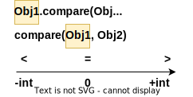

# Вопросы

- [ ] Для чего объекту нужно реализовывать интерфейс Comparable? Как это связано с natural ordering?
  - [ ] Какой метод должен реализовать Comparable-класс?
  - [ ] Можно ли добавить в TreeSet \ TreeMap объект, не реализующий Comparable? Почему?
  - [ ] Что означает, когда метод `tom.compareTo(sid)` возвращает -1, 0, 1?
  - [ ] Каким образом должны быть согласованны методы .compareTo и equals?
  - [ ] Можно ли в comparable-объекте создать несколько правил сравнения?
- [ ] Зачем нужен интерфейс Comparator?
  - [ ] Какой метод должен реализовать Comparator-класс?
  - [ ] Как этот интерфейс помогает реализовать вариативность правил сравнения? Объяснить на примере TreeSet и TreeMap
  - [ ] Что означает, когда метод personComparator.compare(tom, sid) возвращает -1, 0, 1?
  - [ ] Кроме объявления отдельного класса, компаратор можно создать через лямбду и вот так: `Comparator.comparing(Person::getAge)`. Объяснить оба синтаксиса

# Natural ordering

У простых вещей, вроде чисел, букв, строк есть *естественный порядок* (natural ordering):

```
12 34 56 78 91
a b c d e f g h i
Abby Luka
```

Т.е. очевидно понятно, что за чем следует.

Порядок важен в тех случаях, когда требуется сортировка элементов, например, в коллекциях на основе дерева, вроде TreeMap, т.к. дерево подразумевает, что новый элемент при добавлении сравнивается со старыми и исходя из этого принимается решение, куда его поместить.

# Comparable

У сложных объектов, например

```java
@Getter @Setter
public class Person implements Comparable<Person> {
    private String name;
    private int age;
}
```

По умолчанию нет естественного порядка, потому что не понятно по какому полю сравнивать двух людей. Так что если объект не реализует интерфейс Comparable и мы попробуем поместить его, например, в TreeSet, то получим ошибку "class x cannot be cast to class java.lang.Comparable".

Поэтому для таких объектов нужно реализовать интерфейс Comparable, и тогда появится возможность использовать их в местах, где важен порядок элементов:

```java
@Getter @Setter
public class Person implements Comparable<Person> {
    private String name;
    private int age;

    @Override
    public int compareTo(Person otherPerson) {
        return Integer.compare(this.age, otherPerson.age);
    }
    // -1: если this-человек "меньше" other-человека
    //  0: если люди равны
    //  1: если this-человек "больше" other-человека
}
```

Таким образом мы задаем *базовое* правило, по которому можно определить порядок объектов. Но в каких-то моментах может пригодиться сортировка не по возрасту, а по имени или как-то еще. Для таких случаев существуют специальные объекты - компараторы.

## -1 0 1 правило



* Думаем всегда относительно "первого" объекта
* Любое отрицательное число означает, что он "меньше", любое положительное означает "больше":
  * Если первый меньше второго, возвращается отрицательное число
  * Если первый равен второму, возвращается ноль
  * Если первый больше второго, возвращается положительное число

```java
"A".compareToIgnoreCase("B");  // -1, т.к. числовой код А меньше кода В, значит A < B, поэтому -1
Integer.compare(100, 50);  // 1, т.к. "первый" объект (100) больше "второго" (50)
```


## Comparable и equals

Они должны быть согласованы, т.е. если `p1.compareTo(p2) == 0`, то и `p1.equals(p2) == true`

# Comparator

Компаратор - это объект, специализирующийся на сравнении двух объектов. Он должен реализовать одноименный интерфейс Comparator:

```java
public class PersonNameComparator implements Comparator<Person> {
    @Override
    public int compare(Person p1, Person p2) {
        return p1.getName().compareToIgnoreCase(p2.getName());
    }
}
// -1: если p1 "меньше" p2
//  0: если игроки равны
//  1: если p1 "больше" p2
```

Если нужно несколько правил сравнения двух людей, можно на каждое правило создать компаратор и взаимозаменять их, когда нужно.

Например, компаратор можно передать в TreeSet при создании объекта множества:

```java
Set<Person> players = new TreeSet<>(new PersonNameComparator());
```

И теперь при добавлении игроков множество будет использовать переданный компаратор, а не пользоваться методом .compareTo() объекта Person и игроки таким образом будут сортироваться по имени, а не по возрасту

## Другой синтаксис

Компаратор можно создать не только через отдельный класс, но и:

* Через лямбду

  ```java
  Comparator<Person> personNameComparator = (Person p1, Person p2) ->
                  p1.getName().compareToIgnoreCase(p2.getName());
  ```

* Через специальный метод интерфейса Comparator

  ```java
  Comparator<Person> personAgeComparator = Comparator.comparing(Person::getAge);
  ```

