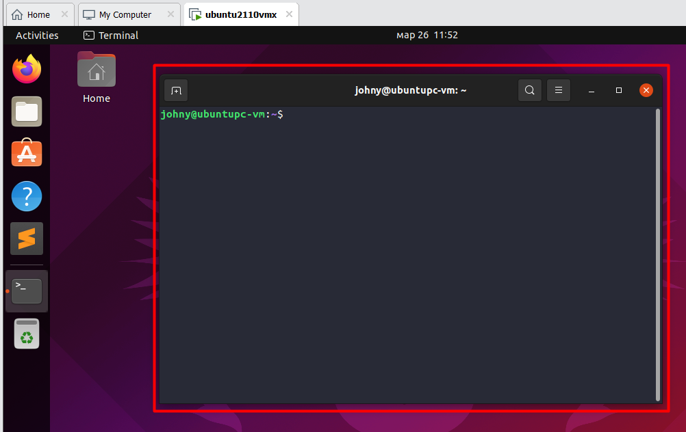

- [ ] В чем разница между терминалом и командной оболочкой? Что делает команда source?

Оказалось, что в большинстве "статей" очень трудно найти внятное объяснение что к чему. В итоге остановился вот на этих источниках:

```
http://www.linfo.org/terminal_window.html
http://www.linfo.org/command_line.html
http://www.linfo.org/shell.html
http://www.linfo.org/console.html
```

Из того, что удалось понять (вроде бы удалось, на деле мог понять упрощенно или неправильно, но на данный момент меня сформированная модель понимания устраивает):

Командная оболочка > Командная строка > Консоль > Терминал

► *Командная оболочка (shell)* - это программа, которая интерпретирует вводимые пользователем команды и запускает программы. Пример - bash. Вводить команды пользователь может в консоль\терминал - об этом как раз дальше. В оболочку пользователь попадает после того как залогинился. Оболочка по сути - это средство взаимодействия пользователя с операционной системой.

► *Командная строка* - это собственно область экрана\окна, куда мы вводим команды. Начинается сразу справа от *приглашения командной строки* (command prompt), которое автоматически выводится в начале каждой строки (по умолчанию там можно видеть, например, текущую директорию).


► *Консоль* - это "честный" текстовый полноэкранный режим, когда ничего кроме ввода текста на черном фоне сделать нельзя, никаких окон, ничего, только текст.


На деле таких консолей не одна, а несколько. На скрине tty6, а есть tty5 и вроде как их вообще 63. Все они являются *виртуальными  консолями*, на них можно залогиниться под разными пользователями. Т.к. в бородатые времена консолью назывались пачки оборудования (например, монитор + клавиатура), с помощью которых несколько людей могли работать с одной системой одновременно, то и здесь отражен этот принцип. Мы сидим за компьютером с одним монитором и клавиатурой - это наша "консоль" (в древнем значении), но можем использовать несколько виртуальных консолей, как будто эти люди сто лет назад подходят к компьютеру и каждый пользуется отдельной консолью.

► *Терминал* (если точнее, *окно терминала*) - это графическое окно (среди прочих окон GUI), внутри которого мы вводим текст. Так сказать, "окно с консолью внутри". Пример - gnome-terminal, konsole.




Минутка задротства.

Вот здесь https://qna.habr.com/q/273105

Все, что написано выше, конечно хорошо, лучше чем ничего, но вопросы остаются. Сейчас уже нет сил разбираться, поэтому оставлю наметки для будущих исследований.

Чел пишет по ссылке выше, что консоль - это прямой доступ к системе, а терминал - удаленный. В том плане, что раз терминал работает через X Window, значит доступ удаленный. Потому что у нее как известно, клиент-серверная архитектура, хоть даже если все это работает на одном компьютере, не подключенном к сети вообще.

Отсюда вопрос - вероятно в бородатые времена консоль была суть нечто, подключенное напрямую к компу, а терминал - суть нечто, имеющее доступ к компу по сети. И возможно это перетекло и на современные аналогии.

Это первое. Второе - если пользователь после логина попадает в шелл, то в случае с текстовым интерфейсом все вроде ясно - шелл один. Но когда мы логинимся через графический интерфейс, то ведь мы тоже должны попадать в шелл, ведь GUI сути не меняет концептуально - это просто способ не печатать команды руками, а щелкать мышкой. Вот, а если потом мы переключаемся между виртуальными консолями - это что? "Подшелл" что ли какой-то? Или если запускаем несколько терминальных окон, то в каждом из них мы попадаем под текущим пользователем. Можем ли мы его сменить? В каждом окне тоже подшелл отдельный или что?

