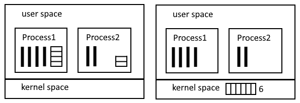
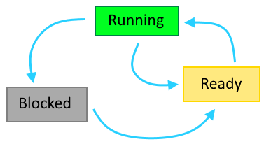

# Процессы и потоки

Процесс - это абстракция запущенной программы. Каждую программу ОС запускает в виде отдельного процесса, даже если это одна и та же программа. Каждый процесс имеет свое собственное адресное пространство - персональную область памяти, выделенную ему операционной системой в US. Эта область не доступна другим процессам.

Классически процесс представляется в виде "контейнера" для потоков и содержит как минимум один поток.

> - [ ] В Linux потоки и процесс представляют собой по сути одно и то же. Что это значит?

То есть работу выполняет именно поток. Процесс без потока не имеет смысла.

У ОС есть таблица процессов - массив структур, в которых перечислена разная информация, относящаяся к процессу и его работе. Например, ID, приоритет, состояние процесса и другая. Используя ее, ОС может остановить процесс, а потом возобновить и продолжить работу с того же места, как будто он и не прерывался.

Аналогичная таблица существует и для потоков. У каждого потока тоже есть ID, состояние и прочее.

> - [ ] Поскольку именно потоки выполняют работу, то логично предположить, что значения, помещенные в процессе работы в регистры CPU, а также счетчик команд, хранятся именно для потока, а не для процесса. Так ли это?

> - [ ] Есть ли у потока свое Адресное Пространство внутри АП процесса?
>
>   Думаю это зависит от технической реализации потоков, т.к. вроде бы в линуксе потоки - это полноценные процессы, просто объединенные одним PPID, соответственно, у них у каждого свое личное АП

# Создание и завершение процессов

Создаться процесс может только по "приглашению" уже работающего процесса, который посылает ОС соответствующий системный вызов. В разных ОС это реализовано по-разному. Допустим, в Unix есть процесс `init()` - инициализации операционной системы. Он создает все другие нужные для функционирования ОС процессы с помощью системного вызова `fork()`. Последовательность можно загуглить отдельно, но для примера предположим, он создает несколько процессов терминалов, функционал которых - ожидать ввода логина и пароля пользователя. Когда эти данные получены, процесс терминала создает процесс логина, который проверяет корректность данных. Если все в порядке, процесс логина создает процесс шелла, куда пользователь может уже вводить команды. Процесс шелла создает процессы под эти команды. То есть всегда идет эта цепочка - уже созданный процесс может вызвать создание другого процесса.

Завершиться процесс может по нескольким причинам:

* Естественные - процесс просто выполнил все свои команды и завершился. Завершение означает уничтожение процесса.
* Принудительные - если другой процесс посылает команду завершения указанного процесса (kill в Unix).
* Ошибка - ошибки внутри процесса могут обрабатываться по-разному. Один из вариантов - завершение.

# Связь между процессами

> - [ ] Как родительские и дочерние процессы связаны? В чем заключается эта связь?

Например в Unix есть понятие *иерархии процессов*. То есть порожденный процесс всегда будет связан с родительским и например сигнал с клавиатуры, полученный родительским процессом, провалится и во все дочерние, что бы это ни значило. В Win там по-другому. Есть какой-то токен, который вроде можно передать другому процессу, что правда это значит, я не знаю.

Но у Unix и Win есть общая характеристика - при уничтожении родительского процесса, дочерние не завершаются.

> - [ ] Если выйти из процесса терминала в Unix, будут ли все запущенные пользовательские процессы продолжать выполняться ?

# Способы реализация потоков

Потоки можно реализовать тремя способами - в KS, в US, и гибридно. Технически это будет влиять на то, где будет располагаться таблица потоков - в адресном пространстве ядра или в адресном пространстве процесса.

> - [ ] У каждого способа есть достоинства и недостатки. В частности, связанные с обработкой системных вызовов. В чем они заключаются?

Как процессы, так и потоки работают по очереди, между ними постоянно происходит переключение. Как оно происходит - зависит от реализации. Вообще, переключение между процессами происходит по таймеру. Когда ядро выбрало процесс, которому передать контроль над CPU, оно сперва устанавливает CPU-таймер, чтобы определить квант времени, положенный процессу, и только потом отдает процессу управление. Когда таймер щелкает, управление снова возвращается ядру.

В случае с потоками дело обстоит иначе (если они реализованы в US. Если же в KS, то вероятно их тоже перелючает ядро). Так вот, если потоки реализованы в US, то к переключению между ними ядро отношения не имеет, потому что оно даже ничего про них не знает. Эта задача ложится на сам процесс, содержащий эти потоки, и на какую-нибудь пользовательскую библиотеку.

> - [ ] Какой способ реализации потоков используется в Linux и Windows?

# Состояние процесса

Для потоков состояния такие же + дополнительное "завершен"

1. Running - процесс выполняется прямо сейчас, ему выделено процессорное время
2. Ready - процесс готов к выполнению, у него есть все необходимое для выполнения, он никого не ожидает, так что готов выполняться, как только ему дадут процессор
3. Blocked - процесс не может выполняться, потому что чего-то ожидает. Например, IO операции или завершения другого процесса

Объяснение именно такой диаграммы состояний: между Running и Ready процессы переходят потому что у них заканчивается квант процессорного времени. То есть процесс бы и не прерывался, но надо дать поработать другим. Из blocked нельзя сразу перейти в running, потому что у процессов есть приоритеты и заблокированный процесс может иметь низкий приоритет, а значит не может выполняться вперед процесса с высоким приоритетом. Поэтому если blocked процесс вдруг становится готов к выполнению, то переходит именно в ready ко всем остальным готовым, а дальше уже планировщик выбирает из них более приоритетный и выделяет ему процессорное время.

> - [ ] Как процесс выйдет из blocked? Ведь кто-то должен ему сообщить о том, что операция, которую он ждет, завершена. Как это организовано?

У каждого потока собственный стек.

# Стандартизация процессов

Работа процессов в некотором роде стандартизирована. Есть понятие POSIX-совместимая ОС. В C есть пакет `<pthread.h>`

> - [ ] Значит ли это, что каждая такая ОС должно предоставлять примерно похожий функционал по работе с потоками? Не ограничивает ли это разработчиков в возможности реализовывать какой-то уникальный функционал по организации работы потоков?

# IPC

Interprocess Communitcation - межпроцессное взаимодействие.

IPC поднимает три вопроса:

* Как организовать обмен данными между процессами
* Как организовать одновременный доступ к одним и тем же данными
* Организация правильной последовательности процессов, которые зависят друг от друга

Процессы могут шарить часть своего адресного пространства, чтобы обмениваться информацией с другими процессами.

