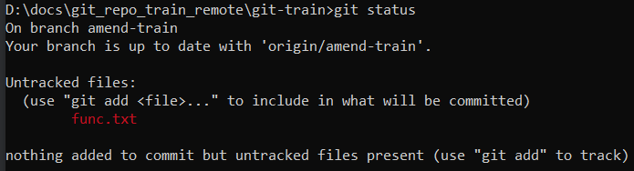
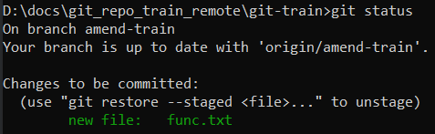

# Особенности гита

* Гит представляет себе историю изменения файлов как последовательность снапшотов. Т.е. каждый коммит является по сути целиковым снимком всего репозитория. Если какие-то файлы не изменились с прошлого коммита, то вместо непосредственно файла в снапшот помещается ссылка на файл.

  Эта модель отличается от других систем контроля версий, которые хранят именно изменения, произошедшие в файлах ("дельты").

* Репозиторий гит полностью автономен. Как только мы клонируем себе репозиторий, нам больше не нужна удаленная (remote) версия. Мы можем коммитить в свою локальную копию, а потом по необходимости отправлять изменения в удаленный репозиторий, или вытягивать из него изменения.

# Логические области

## Git directory

Эта директория является "базой данных" гита, в которой он хранит все свои объекты. Она называется `.git` и создается в папке, в которой мы запускаем команду `git init`.

## Working tree

Или "рабочий каталог" - это папка с файлами проекта, для которого мы используем версионирование. Например, типичная структура java-проекта, использующего мавен:

```java
C:\
  progs\  // <-- Working tree, директория, которая находится под надзором гита.
     .git\  // <-- Git directory, БД гита.
     .idea\
     src\
     target\
     HELP.md
     mvnw
     mvnw.cmd
     pom.xml
```

## Staging area (Index)

Staging area, он же Stage, он же Index - это файл в БД гита, которых хранит информацию, что именно отправится в следующий коммит. Для упрощения восприятия можно считать, что stage это папка, в которую мы должны отправить файлы, чтобы они попали в коммит. Причем в коммит они попадают в том виде, который был на момент отправки в стейдж. На примере:

* Создаем в WT пустой файл.
* Добавляем его в стейдж. Т.е. в стейдже файл оказывается в пустом виде.
* Добавляем в файл какой-нибудь текст.
* Коммитим.
* Коммитится пустой файл. Хотя в момент коммита в файле был какой-то текст, но этот текст не был помещен в стейдж и поэтому не попал в коммит.

Графически:


## Stash

TODO


# Состояния файлов

* `Untracked` - это все файлы в рабочей директории, которые не находятся под надзором гита.
* `Unmodified` - файлы под надзором гита, в которых не было изменений с момента последнего коммита.
* `Modified` - в файлах есть незакоммиченные изменения.
* `Committed` - файлы сохранены в репозиторий.
* `Staged` - файлы подготовлены к коммиту. В коммит они попадут именно в том виде, какой был на момент помещения в стейдж. Если после этого файлы снова изменить и не добавить в стейдж еще раз, то эти новые изменения не попадут в коммит (на примере показано в разделе про стейдж).

Графически схема переходов выглядит так:


P.S. Я бы еще добавил стрелку от Staged до Modified в случае внесения изменений в файл после помещения его в стейдж. Может быть технически такая стрелка и не очень корректна, зато на практике есть такой момент.

TODO: перерисовать картинку в drawio

## Как посмотреть состояние

* Полноформатный вывод:

  ```
  git status
  ```

* Краткоформатный вывод:

  ```
  git status -s
  git status --short
  ```

### Полноформатный вывод

* Нет неотслеживаемых файлов, нет изменений в отслеживаемых файлах:

  

* В рабочей директории есть файл func.txt, не находящийся под надзором гита:

  

  Такое получается когда мы помещаем в рабочую директорию новый файл.

* Файл func.txt помещен в стейдж и теперь под надзором гита, но еще не закоммичен:

  

  Такое получается, когда мы командой `git add func.txt` заставляем гит отслеживать новый файл.

* Файл func.txt помещен в стейдж, но после этого файл модифицировали. Если повторно не положить его в стейдж, но последние изменения в коммит не попадут:

  

* Отслеживаемый файл модифицирован:

  

### Краткоформатный вывод


Расшифровка букв:

* `A` - added, новый файл, который гит отслеживает.
* `M` - modified, измененный файл.
* `?` - неотслеживаемый гитом файл.

Маркер состоит из двух столбиков:

* Левый - состояние стейджа.
* Правый - состояние рабочей директории.

На скрине вроде бы расписаны все возможные комбинации, но тем не менее дополнительные комментарии:

* `_M` - слева ничего, справа М. В рабочей директории есть модифицированный файл, эти изменения не помещены в стейдж.
* `M_` - слева М, справа ничего. Значит, что изменения этого файла помещены в стейдж и после этого файл не трогали.
* `MM` - слева М и справа тоже М. Значит, что файл изменили, положили в стейдж, а потом снова изменили и эти изменения в стейдж не положили.