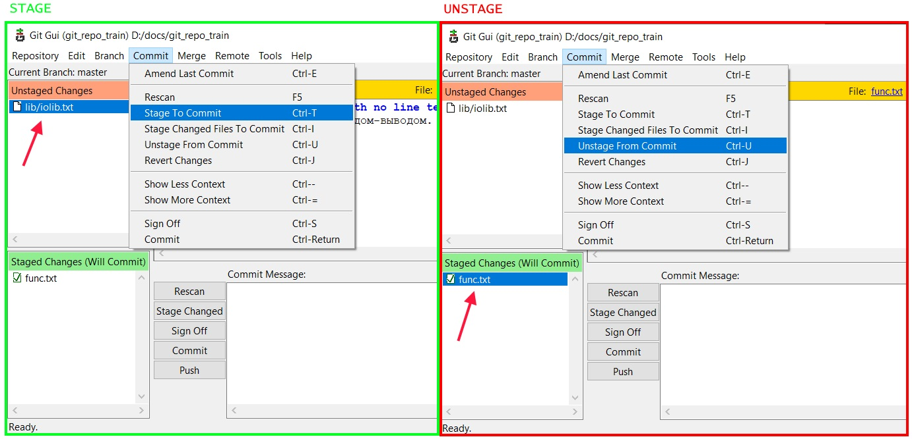

# Работа с изменениями в файлах

## Добавить \ удалить файл в стейдж

### Через консоль

Добавление в стейдж делается командой `git add`, а удаление - `git restore`.

* Добавить один конкретный файл:

  ```
  git add src/main/java/johny/dotsville/App.java
  ```

* Добавить все файлы, которые есть в рабочей директории и ее подпапках:

  ```
  git add .
  ```

* Удалить конкретный файл \ директорию из стейджа:

  ```
  git restore --staged some/file.c
  git restore --staged some/  ; Удалить из стейджа всю директорию some/
  ```
  
* Удалить всё из стейджа, и файлы, и директории:

  ```
  git restore .
  ```

### Через GUI

* Добавление. Выбираем файл в секции `Unstaged changes`, далее в главном меню `Commit > Stage to Commit`

* Удаление. Выбираем файл в секции `Staged changes`, далее в главном меню `Commit > Unstage from Commit`



## Откатить изменения в файле

> Касается измений, которые еще не закоммичены, а просто набраны в файле. Для отката закоммиченных изменений используется команда `git reset`

* Если файл не в стейдже, можно сразу откатить все изменения, внесенные после ласт коммита:

  ```
  git restore some/file.c
  ```

* Если файл в стейдже:

  ```
  git restore --staged some/file.c  ; Сначала удаляем файл из стейджа.
  git restore some/file.c           ; Потом уже откатываем изменения.
  ```

## Откатить изменения во всех файлах

TODO: вернуться сюда после повторения веток. Если нужно отменить все незакоммиченные изменения во *всех* файлах:

```
git reset --hard
```

Внимание! Команда сбрасывает рабочую директорию до состояния последнего коммита. Какого именно - надо еще уточнить будет. Скорее всего, до последнего коммита текущей ветки. При этом, если создать какие-то файлы и добавить их в гит, то после такого ресета они удалятся, так что нужно внимательнее быть.