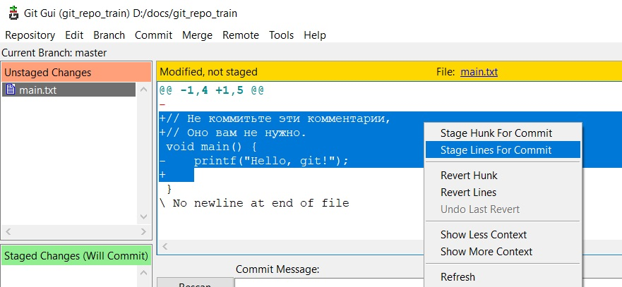
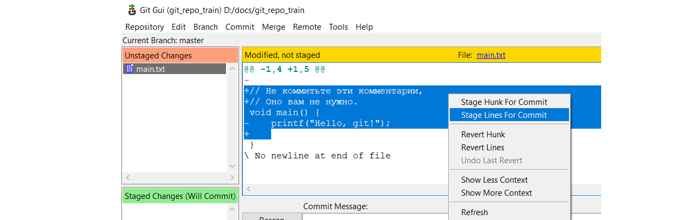

# Коммиты

## Обычный коммит

* С коротким сообщением:

  ```
  git commit -m "Если сообщение короткое, можно ввести его через ключ -m"
  ```

* С длинным сообщением (откроется vi для ввода текста сообщения):

  ```
  git commit
  ```

  Краткая справка: когда vi откроется, нажимаем `i` (раскладка должна быть английская, иначе не поймет), чтобы перейти в режим ввода текста. Вводим текст сообщения к коммиту, можно многострочный, через Enter как в обычном блокноте. Когда ввели все, что хотели, нажимаем `Esc`, чтобы перейти в режим команд, набираем `:wq` (write-and-quit), жмем `Enter`, и происходит коммит.

## Частичный коммит

Пользуемся для этого графическим интерфейсом. Выделяем фрагмент, который хотим закоммитить (нужно выделять как добавленные строки, так и удаленные), *ПКМ > Stage Lines For Commit*



Та же картинка, но шириной 1280:



## Прибавить код к последнему коммиту

```
... // Сначала добавляем изменения в стейдж
git commit --amend --no-edit  // Если не хотим менять сообщение у коммита
git commit --amend -m "Если хотим изменить сообщение и оно короткое"
git commit --amend  // Если сообщение сложное и хотим ввести его через vi
```

Применять эту команду нужно исключительно к локальным коммитам

## Изменить сообщение к последнему коммиту

```
// НЕ добавляем никаких файлов в стейдж!
git commit --amend -m "Новое сообщение заменит старое"
git commit --amend  // Если хотим редактировать сообщение в vi
```

Применять эту команду нужно исключительно к локальным коммитам

## Объединить коммиты

Делается через интерактивный rebase, см. раздел про ребейз

## Откатиться на указанный коммит с удалением изменений

Все, что было *после* указанного коммита - исчезнет (cb42b1650 - начальная часть id коммита):

```
git reset cb42b1650 --hard
```


