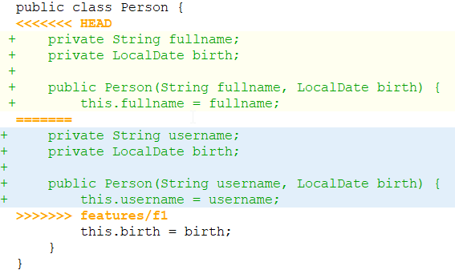
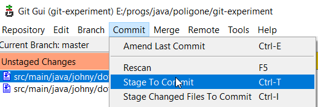

# Merge-слияние

## Простое слияние

```
git checkout master   // Сначала переключаемся на ветку, -В- которую хотим влить изменения
git merge feature/f1  // Указываем ветку, -ИЗ- которой берем код
```

## Слияние с конфликтом

Если есть конфликты, то в git gui и прочих графических клиентах конфликтные места в файлах выглядят примерно так:



А в самом файле с исходниками вот так (маркеры реально добавляются в исходники, т.е. это не просто визуальная хрень):

```java
public class Person {
<<<<<<< HEAD
    private String fullname;
    private LocalDate birth;

    public Person(String fullname, LocalDate birth) {
        this.fullname = fullname;
=======
    private String username;
    private LocalDate birth;

    public Person(String username, LocalDate birth) {
        this.username = username;
>>>>>>> features/f1
        this.birth = birth;
    }
}
```

Между маркером `<<<<<<< HEAD` и `=======` видим проблемный участок так, как он выглядит в ветке *В* которую мы вливаем. А между маркером `=======` и `>>>>>>> features/f1` то, как он выглядит в ветке *ИЗ* которой забираем код.

При конфликте команда `git status` показывает конфликтующие файлы и подсказки с актуальными командами:

```
On branch master
You have unmerged paths.
  (fix conflicts and run "git commit")
  (use "git merge --abort" to abort the merge)

Unmerged paths:
  (use "git add <file>..." to mark resolution)
        both modified:   src/main/java/johny/dotsville/App.java
        both modified:   src/main/java/johny/dotsville/Person.java

no changes added to commit (use "git add" and/or "git commit -a")
```

Для устранения конфликта необходимо:

* Открыть конфликтный файл в любом редакторе, например, в своей IDE, найти проблемные места

* Решить, какой код в итоге нам нужен, и разместить его между маркерами `<<<<<<< HEAD` и `>>>>>>> features/f1`

* Удалить маркеры вручную (просто стереть эти строки с `<<<<<` и `>>>>>`)

* Таким же образом обработать все конфликтные файлы

* Добавить обработанные файлы в стейдж

  Если через консоль, то командой `git add`, а если через git gui, то через меню:

  

* Сделать коммит - это будет *коммит слияния* (т.н. "merge-commit"), и у него будет два родителя

  Можно коммитить либо через консоль, либо через git gui, там есть окно для ввода комментария к коммиту.

## Прекратить слияние при конфликте

Если все пошло совсем не по плану и решить конфликт не удается, можно вызвать `git status` и увидеть там подсказку, что остановить слияние и вернуть текущую ветку в состояние до слияния можно вот такой командой:

```
git merge --abort
```


