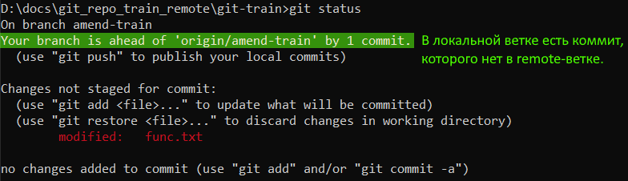

# Краткий формат

```
git status -s
git status --short
```

## Как выглядит вывод

Как выглядит вывод в консоли:


Маркер состояния включает два столбика:

* Левый - состояние индекса (стейджа).
* Правый - состояние рабочей директории.

Маркер индекса идет впереди, потому что файлы попадают в коммит именно в том виде, в каком они в индексе. Поэтому индекс считается приоритетнее, соответственно и его маркер находится впереди.

## Значения маркеров

Расшифровка букв:

* `??` - неотслеживаемый гитом файл.
* `A` - added, новый файл, который мы добавили в индекс, но еще ни разу не закоммитили и поэтому пока его нет в базе гита.
* `M` - modified, измененный файл.
* `U` - unmerged, файл в состоянии конфликта слияния.
* `D` - deleted, удаленный файл.
* `C` - copied, скопированный файл.
* `R` - renamed, переименованный файл.

## Как читать маркеры

Одинарный маркер вроде бы читается очевидно.

Двойные маркеры на самом деле тоже читать не так уж сложно. Два маркера по сути означает, что файл добавили в индекс, а потом опять с ним что-то сделали в рабочей директории и эти новые изменения, соответственно, в индексе отсутствуют.

Например:

* `MM` - файл модифицировали и добавили в индекс. Стало быть эти модификации находятся в индексе (первая М). Потом еще раз модифицировали и в индекс пока еще не добавляли, стало быть эти модификации пока остались только в рабочей директории (вторая М). Под модификациями понимается добавление \ удаление текста внутри файлов, т.е. модификация содержимого файла.
* `MD` - файл модифицировали, добавили в индекс, а потом удалили из рабочего каталога. Получается, что в индексе он есть (первая М), а в рабочем каталоге его уже нет (вторая  D).

Это наиболее очевидные примеры. Наверняка бывают и более хитрые. Но общий принцип одинаковый. 

# Полный формат

```
git status
```

В полном формате все в общем-то даже понятнее, чем в кратком, потому что тут слова без сокращений и подсказки довольно подробные.

## Как выглядит вывод

Нет неотслеживаемых файлов, нет изменений в отслеживаемых файлах:


---

 В рабочей директории есть файл func.txt, не находящийся под надзором гита:


Такое получается когда мы помещаем в рабочую директорию новый файл.

---

Файл func.txt помещен в стейдж и теперь под надзором гита, но еще не закоммичен:


Такое получается, когда мы командой `git add` заставляем гит отслеживать новый файл.

---

Отслеживаемый файл модифицирован:



---

Новый файл func.txt помещен в стейдж, но после этого файл модифицировали. Если повторно не положить его в стейдж, то последние изменения в коммит не попадут:


