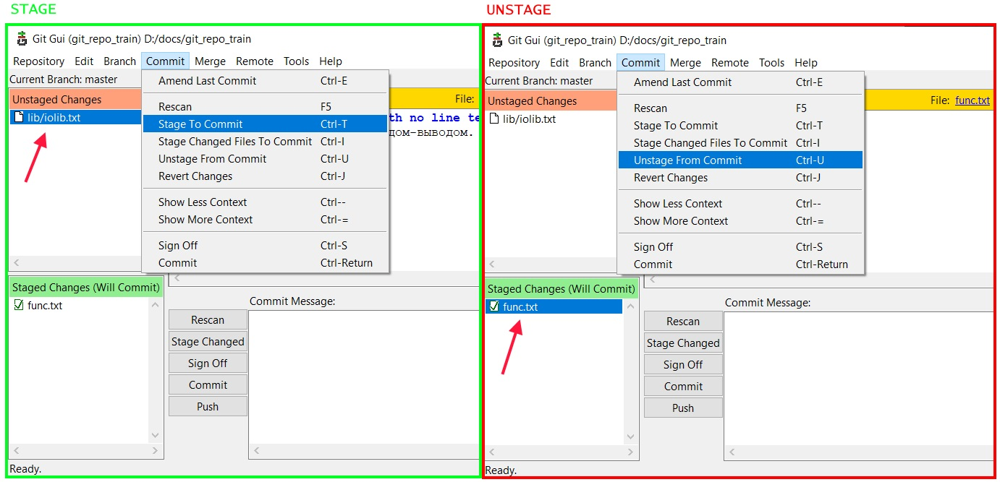

# Предисловие

По сути все добавления \ удаления являются движением файла между рабочей директорией, индексом, последним коммитом и обратно. Команда git add двигает файл в одном направлении, а git restore - в другом.

# Добавить в индекс

```
git add
```

Когда мы добавляем файл в индекс, мы добавляем его в том состоянии, в котором он сейчас находится в рабочей директории. Фактически, когда мы выполняем git add, мы просто заменяем хранящийся в индексе файл на его текущую версию из рабочей директории (ну а если его в индексе не было, например это вообще новый файл, тогда он просто там появляется).

Когда мы модифицируем файл в рабочке и хотим сохранить эти изменения, то это тоже подразумевает банальный перенос новой версии файла из рабочки в индекс.

## Один файл

Добавить один конкретный файл:

```
git add foobar/Person.ts
```

## Все файлы

Добавить все файлы, которые есть в рабочей директории и ее подпапках:

```
git add .
```

## Директорию

Можно воспринимать директории так же как и файлы - команды работают аналогично:

```
git add foobar/services
```

# Удалить из индекса

```
git restore --staged
```

Короткого ключа нет, только полный. Команда удаляет файл из индекса, если он еще не закоммичен. А если закоммичен, то в индексе файл примет такой же вид, какой был в последнем коммите.

Чтобы лучше ориентироваться в механике команды restore, см конспект про движение файла.

## Один файл

Удалить конкретный файл из индекса:

```
git restore --staged foobar/Person.ts
```

## Все файлы

Удалить всё из индекса - и файлы, и директории:

```
git restore --staged .
```

## Директорию

Можно воспринимать директории так же как и файлы - команды работают аналогично:

```
git restore --staged foobar
```

# Через GUI

* Добавление. Выбираем файл в секции `Unstaged changes`, далее в главном меню `Commit > Stage to Commit`

* Удаление. Выбираем файл в секции `Staged changes`, далее в главном меню `Commit > Unstage from Commit`



