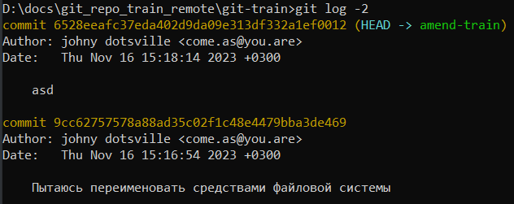
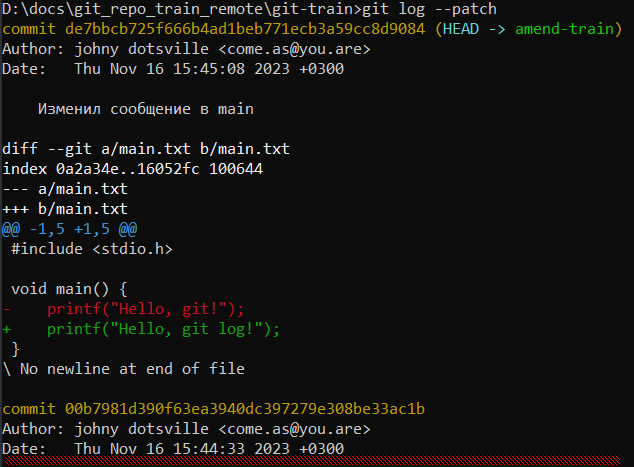
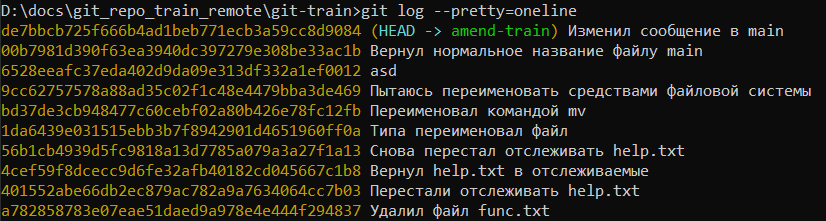

# История коммитов

## Вся история

```
git log
```

Выглядит примерно так:



## Несколько последних коммитов

```
git log -2
```

Указываем нужное количество цифрой.

## История с показом изменений

С помощью флага `-p` (или `--patch`) можно посмотреть, какие именно изменения ввел каждый коммит:

```
git log -p
```

Если история не влезает на экран, можно листать пробелом большие куски или стрелками вверх \ вниз построчно. Для выхода из просмотра нажать кнопку `q`. Выглядит примерно так:



## Прочие флаги

* `--stat` - показать для каждого коммита статистику - сколько строк в каждом файле добавлено \ удалено, сколько самих файлов добавлено \ удалено.


# Форматирование вывода

## Встроенные паттерны

Вывод истории можно форматировать с помощью флага `--pretty`:

```
git log --pretty=oneline
```

Здесь `oneline` - один из встроенных паттернов. Доступные паттерны:

* `oneline`
* `short`
* `full`
* `fuller`

Кроме дефолтного реально заслуживает внимания как будто бы только oneline. Выглядит вот так:



## Собственный паттерн

Пишется с помощью паттерна `format`, в кавычках, все символы кроме ключей воспринимаются буквально. Например:

```
git log --pretty=format:"[%h] %an : %s"
```

```
[de7bbcb] johny dotsville : Изменил сообщение в main
[00b7981] johny dotsville : Вернул нормальное название файлу main
```

Возможные ключи:

| Опция | Описание                                        |
| ----- | ----------------------------------------------- |
| `%H`  | Полный хэш коммита                              |
| `%h`  | Краткий хэш коммита (первые 7 символов)         |
| `%T`  | Tree hash                                       |
| `%t`  | Abbreviated tree hash                           |
| `%P`  | Parent hashes                                   |
| `%p`  | Abbreviated parent hashes                       |
| `%an` | Author name                                     |
| `%ae` | Author email                                    |
| `%ad` | Author date (format respects the --date=option) |
| `%ar` | Author date, relative                           |
| `%cn` | Committer name                                  |
| `%ce` | Committer email                                 |
| `%cd` | Committer date                                  |
| `%cr` | Committer date, relative                        |
| `%s`  | Сообщение коммита                               |

# ASCII-дерево истории коммитов

Учебник стр.44, TODO: посмотреть отдельно


# Ограничение истории

Если нужна не вся история, то можно ее фильтровать. TODO: стр.44