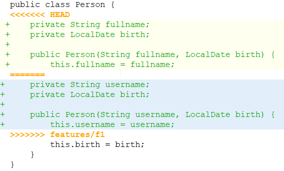
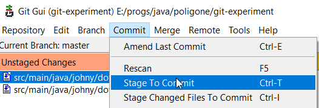

# Конфликты при слиянии

Если есть конфликты, то в git gui и прочих графических клиентах конфликтные места в файлах выглядят примерно так:



А в самом файле с исходниками вот так (маркеры реально добавляются в исходники, т.е. это не просто визуальная хрень):

```java
public class Person {
<<<<<<< HEAD
    private String fullname;
    private LocalDate birth;

    public Person(String fullname, LocalDate birth) {
        this.fullname = fullname;
=======
    private String username;
    private LocalDate birth;

    public Person(String username, LocalDate birth) {
        this.username = username;
>>>>>>> features/f1
        this.birth = birth;
    }
}
```

Если представить, что мы вливаем фичеветку в мастер, то:

* Межу маркером `<<<<<<< HEAD` и `=======` видим проблемный участок так, как он выглядит в мастере (т.е. в ветке *В* которую мы вливаем). Это как бы "оригинал".
* Между маркером `=======` и `>>>>>>> features/f1` то, как он выглядит в фичеветке (т.е. в ветке *ИЗ* которой забираем код). Это то, что мы пытаемся влить.

# Как устранять конфликты

Для устранения конфликта необходимо:

* Открыть конфликтный файл в любом редакторе, например, в своей IDE и найти проблемные места.

* Решить, какой код в итоге нам нужен, и удалить лишний вместе с маркерами.

  * Можно править код как угодно, здесь мы можем написать все что хотим и написанное станет истиной в последней инстанции.

* Сохранить файл.

* Таким же образом обработать все конфликтные файлы.

* Добавить обработанные файлы в стейдж.

  Если через консоль, то командой `git add`. Можно сначала обработать все файлы, потом разом добавить их через `git add .`, а можно обрабатывать и добавлять по одному. Если пользоваться git gui, то это можно сделать через меню:

  

* Когда все конфликты решены, делаем коммит - это будет *коммит слияния* (т.н. "merge-commit"), и у него будет два родителя.

  Можно коммитить либо через консоль, либо через git gui, там есть окно для ввода комментария к коммиту.

# Подсказки гита при конфликте

При конфликте команда `git status` показывает конфликтующие файлы и подсказки с актуальными командами:

```
On branch master
You have unmerged paths.
  (fix conflicts and run "git commit")
  (use "git merge --abort" to abort the merge)

Unmerged paths:
  (use "git add <file>..." to mark resolution)
        both modified:   src/main/java/johny/dotsville/App.java
        both modified:   src/main/java/johny/dotsville/Person.java

no changes added to commit (use "git add" and/or "git commit -a")
```

# Отмена слияния при конфликте

Если все пошло совсем не по плану, решить конфликты не удается и хочется отменить слияние, то выполняем:

```
git merge --abort
```

Ветка вернется в состояние до слияния. Эту команду можно увидеть в подсказках, если во время слияния набрать `git status`.
